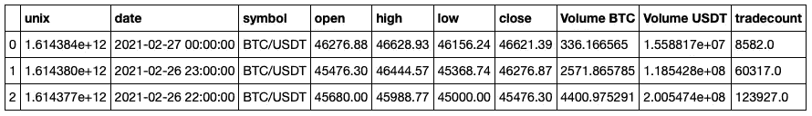
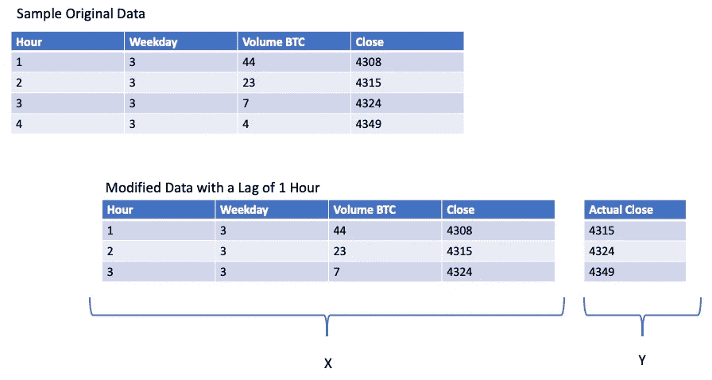
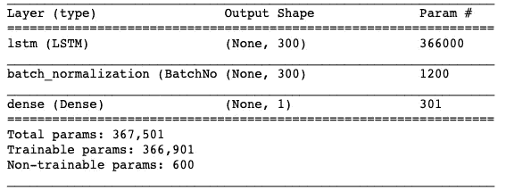
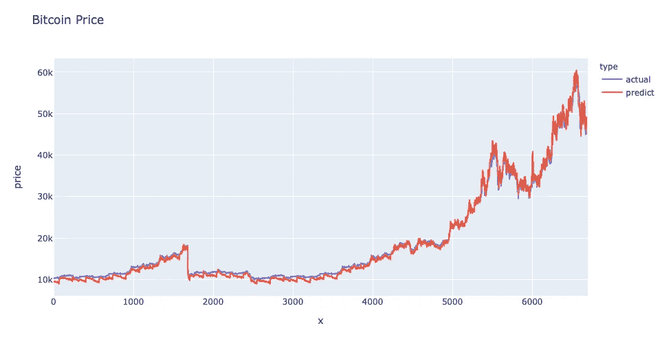

# 利用 LSTM 时间序列预测比特币价格

> 原文：<https://pub.towardsai.net/time-series-prediction-of-bitcoin-price-using-lstms-b8a6455d8143?source=collection_archive---------1----------------------->

## [密码学](https://towardsai.net/p/category/cryptography)，[深度学习](https://towardsai.net/p/category/machine-learning/deep-learning)

## 预测比特币价格的简单模型。


照片由[克里斯·利维拉尼](https://unsplash.com/@chrisliverani?utm_source=unsplash&utm_medium=referral&utm_content=creditCopyText)在 [Unsplash](https://unsplash.com/s/photos/data-science?utm_source=unsplash&utm_medium=referral&utm_content=creditCopyText) 上拍摄

作为一名职业数据科学家和一名业余密码交易员，我一直对创建一个可以帮助我预测比特币价格的深度学习模型非常感兴趣。本文是基于我为创建这样一个模型所做的实验。

我的 Git 项目的链接在这里:[https://github.com/msaleem18/Bitcoin-Price-Prediction-LSTM](https://github.com/msaleem18/Bitcoin-Price-Prediction-LSTM)

## LSTM 的

长短期记忆，或更普遍的说法是 LSTM 氏症，是一种递归神经网络，帮助模型学习数据集中的长期序列。因为我在这里的重点更多的是它们的用法，如果你有兴趣知道更多关于什么是 LSTM 和它们如何工作的细节，你可以看看这篇很棒的文章来深入解释这一切。

## 资料组

对于这个项目，我使用了币安 BTC/USDT 的小时价格数据集，可以在这里找到:[http://www.cryptodatadownload.com/data/binance/](http://www.cryptodatadownload.com/data/binance/)

我将数据导入到我的本地驱动器，并使用 pandas 以 CSV 格式读取。

```
*#READ DATA FROM FILE STORED IN YOUR LOCAL DDRIVE (DOWNLOAD CSV FILE SHARED IN THE PROJECT)*
df = pd.read_csv("//Users//saad//Desktop//Bitcoin LSTM//bitcoin_hourly.csv")print(df.dtypes)print("**\n***** DF ***")
df_copy = df.copy()df_copy.head(3)
```



币安 BTC/USDT 数据集

## 预处理

币安提供的数据集需要清理，原因如下:

1.  自 2017 年以来，他们一直在收集数据，自那以来，数据集中一些字段的格式发生了变化。
2.  数据集中的“日期”字段非常无用，我们需要创建自己的字段。
3.  这样我们可以添加一些额外的字段来帮助我们建模。

对于这个模型，我创建了字段来跟踪一天中的小时和工作日。

```
*#CLEAN DATA - SPECIFICALLY CLEAN TIMESTAMP*

**def** change_timestamp (ts):
    digit_count = len(str(ts))
    **if** digit_count == 12:
        **return** (datetime.datetime.utcfromtimestamp(ts)).strftime('%Y-%m-**%d** %H:%M:%S')
    **else**:
        **return** (datetime.datetime.utcfromtimestamp(ts/1000)).strftime('%Y-%m-**%d** %H:%M:%S')

df_copy['unix_count'] = df.unix.apply(**lambda** x: len(str(x))) df_copy['dt_correct'] = df.unix.apply(**lambda** x: change_timestamp(x))df_copy['dt'] = pd.to_datetime(df_copy.dt_correct.values)df_copy['hour'] = df_copy.dt.apply(**lambda** x: x.hour)df_copy['week_day'] = df_copy.dt.apply(**lambda** x: x.weekday())df_copy.sort_values(by=['unix'],ascending=[**True**],inplace=**True**) 
```

## 正常化

标准化对于 LSTM 建模非常重要。自诞生以来，比特币的价格变化很大，最近几个月从近 0 美元涨到 57000 美元的历史高点；对模特来说不太好的东西。较高的数字将最终获得更多的权重，并将导致模型出现偏差。

为了避免这种偏斜，我们必须将数据标准化。在 sklearn 库中有很多可用的规范化方法，但是，我决定使用 MinMax 标量。我尝试了一些其他的方法，比如稳健标量，但是我的模型用最小最大标量表现最好，所以我最终决定用它。

还有一点需要注意的是，最佳实践是只标准化您的训练数据，然后使用相同的方法标准化您的测试数据。然而，由于比特币的价格最近比往年上涨了很多，这就导致了标量方法的问题。由于我们正在进行时间序列预测，并且数据是按升序排序的，因此为训练数据集选取了早期的较低价格，而新的较高价格仅在测试数据集中可用。对于这个项目，我采取了捷径，以避免过多的编码，我将整个数据集标准化，并在标准化步骤后仅将其分为训练和测试。最佳实践是使用窗口缩放，如这里的[所解释的](https://www.datacamp.com/community/tutorials/lstm-python-stock-market)。

```
*#SPLIT DATA INTO TEST AND TRAIN*
np.random.seed(7)

X = df_work[['hour','week_day','Volume BTC','close']]
Y = df_work[['close']]
*#X_train, X_test, y_train, y_test = train_test_split(X, Y, test_size=0.3, shuffle = False)*

*#NORMALIZATION*
f_transformer = preprocessing.MinMaxScaler((-1,1))
f_transformer = f_transformer.fit(X)

cnt_transformer = preprocessing.MinMaxScaler((-1,1))
cnt_transformer = cnt_transformer.fit(Y)

X_train, X_test, y_train, y_test = train_test_split(X, Y, test_size=0.2, shuffle = **False**)

X_train_trans = f_transformer.transform(X_train)
X_test_trans = f_transformer.transform(X_test)

y_train_trans = cnt_transformer.transform(y_train)
y_test_trans = cnt_transformer.transform(y_test)

print("*** SHAPES")
print("X_train: **%s**, **%s**" % (X_train.shape[0],X_train.shape[1]))
print("X_test: **%s**, **%s**" % (X_test.shape[0],X_test.shape[1]))
print("y_train: **%s**, **%s**" % (y_train.shape[0],y_train.shape[1]))
print("y_test: **%s**, **%s**" % (y_test.shape[0],y_test.shape[1]))

print("**\n***** MIN MAX")

print("TRAIN COST: **%d**, **%d**" % (X_train.close.min(), X_train.close.max()))
print("TEST COST: **%d**, **%d**" % (X_test.close.min(), X_test.close.max()))
print("TRAIN VOL: **%d**, **%d**" % (X_train['Volume BTC'].min(), X_train['Volume BTC'].max()))
print("TEST VOL: **%d**, **%d**" % (X_test['Volume BTC'].min(), X_test['Volume BTC'].max()))

print("**\n***** MIN MAX PARAMETER")
print(f_transformer.data_min_)
print(f_transformer.data_max_)
print(cnt_transformer.data_min_)
print(cnt_transformer.data_max_)
```

## 滞后数据集

一旦我们有了干净的和标准化的数据，我们需要为 LSTM 时间序列预测创建一个滞后数据集。我说的滞后数据集是什么意思？

基本上，LSTM 时间序列预测的工作原理是回顾 x 小时的数据，并尝试预测 x+1 小时的价格。下图试图解释这个概念。



为时序预测创建 1 小时滞后数据集

对于我们的时间序列预测，我们将使用 24 小时的滞后。

```
*#CREATE LAGGING DATASET FOR TIMESERIES*
**def** create_dataset(X, y, time_steps=1):
    Xs, ys = [], []
    **for** i **in** range(len(X) - time_steps):
        v = X[i:(i + time_steps)]
        Xs.append(v)
        ys.append(y[i + time_steps])
    **return** np.array(Xs), np.array(ys)

time_steps = 24*# reshape to [samples, time_steps, n_features]*
X_train_f, y_train_f = create_dataset(X_train_trans, y_train_trans, time_steps)X_test_f, y_test_f = create_dataset(X_test_trans, y_test_trans, time_steps)

print("*** SHAPES")
print(X_train_f.shape, y_train_f.shape)
print(X_test_f.shape, y_test_f.shape)
```

## 系统模型化

现在到了激动人心的部分——创建真正的 LSTM 模型。至少对我来说，这变得非常简单快捷。我最终在我的架构中使用了 Keras 的双向 LSTM 和批处理规范化层。

我试验了许多其他复杂的架构，例如:

*   具有不同激活功能的 LSTM(tanh vs relu)
*   堆叠的 LSTM 层(2 层和 3 层 LSTM 层)
*   CNN + LSTM 模式

然而，我的模型仅使用单个 LSTM 层时表现最佳(我的均方误差在该架构中是最低的)。

```
model = keras.Sequential()model.add(keras.Input(shape=((X_train_f.shape[1], X_train_f.shape[2]))))*model.add(layers.Bidirectional(layers.LSTM(300, activation = 'tanh', return_sequences=False)))*model.add(layers.BatchNormalization())model.add(keras.layers.Dense(units=1))model.compile(loss='mean_squared_error', optimizer='adam')model.summary()
```



LSTM 建筑模型

## 预言；预测；预告

如下图所示，双向 LSTM 模型似乎运行得相当好，并且非常紧密地跟踪实际 BTC 价格



比特币价格预测

## 结论

尽管这个模型表现得很好，我仍然认为还有很大的改进空间。加密市场非常不稳定，这个模型没有使用任何来自当前新闻或趋势的信息。一个重要的改进是使用自然语言处理(NLP)并将新闻数据输入到这个模型中。

在接下来的几周，我将在我的交易中使用这个模型，看看它的表现如何。你可以在我的 Git 页面上找到完整的项目:[https://github.com/msaleem18/Bitcoin-Price-Prediction-LSTM](https://github.com/msaleem18/Bitcoin-Price-Prediction-LSTM)