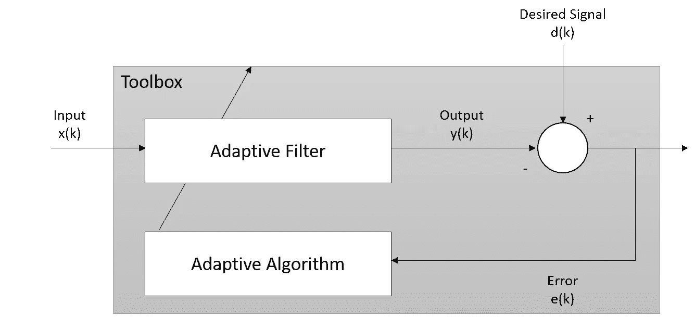
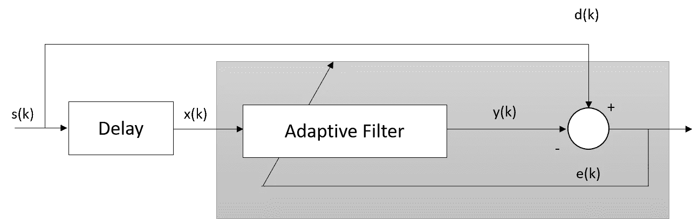
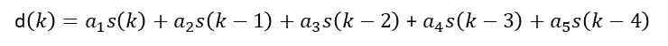
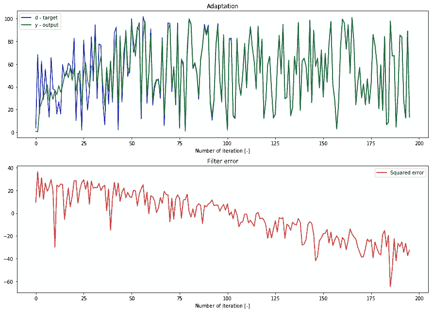
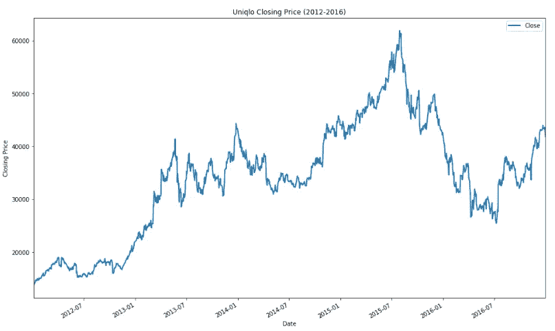
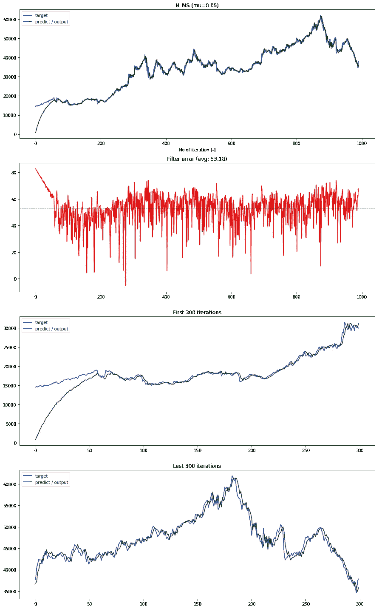
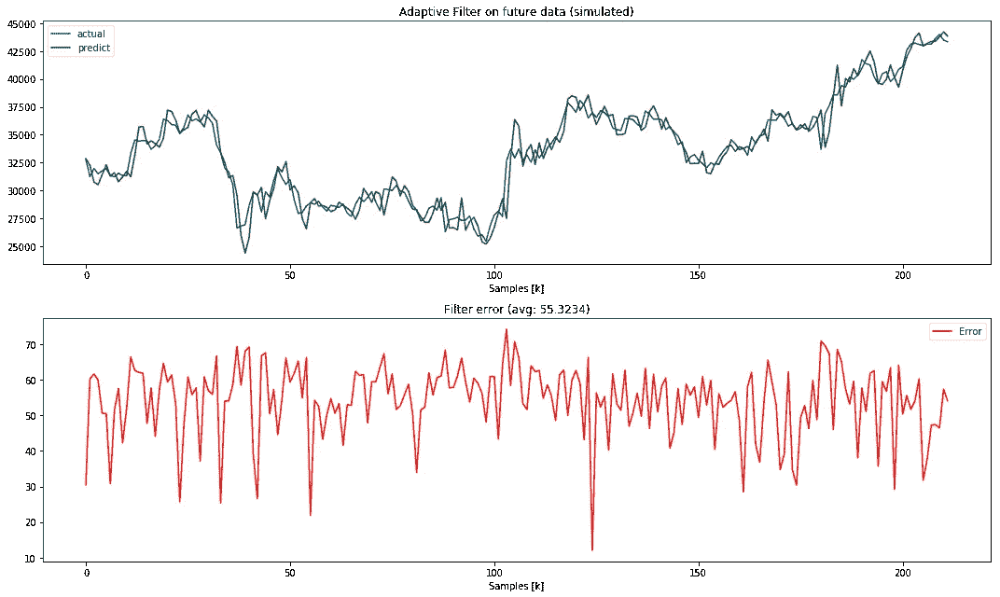

# 采用自适应滤波的时间序列预测

> 原文：<https://pub.towardsai.net/time-series-prediction-using-adaptive-filtering-491a43d8fa93?source=collection_archive---------2----------------------->

## [机器学习](https://towardsai.net/p/category/machine-learning)

## Python 中使用自适应滤波预测未来时间序列值

# 什么是自适应滤波？

自适应滤波是一种计算设备，它试图模拟两个信号之间的关系，这两个信号的系数随着使滤波器收敛到最佳状态的目标而变化。优化标准是成本函数，最常见的是自适应滤波器的输出和期望信号之间的误差的均方值。当滤波器调整其系数时，均方误差(MSE)将收敛到其最小值。下图演示了简单的自适应滤波器。

简单的自适应滤波器工具箱

自适应滤波器将尝试使滤波器输出 *y(k)* 与期望信号 *d(k)* 相匹配。自适应滤波器还将利用误差 *e(k)* 进行学习，并调整系数。于是，它适应了新的环境，输入 *x(k)* 。

这为我们带来了自适应滤波的主要特性，即它具有**实时调整响应的能力，以提高其性能**(听起来像是自学，有人知道吗？).自适应算法通过两种方法实现；梯度法和最小二乘法(LMS，RLS 算法)。

# 这是为了什么？

如果您学习过任何数字信号和处理课程，您会看到自适应滤波器的大部分应用是识别未知通信信道、消除噪声或干扰，或者预测周期信号的未来值。

# 那么我们如何在商业环境中使用它呢？

基于数字用例的最后一个例子，我们可以应用这个概念来预测实时设置中的未来值，例如；股价预测。然而，使用这种方法预测未来需要几个*关键假设；数据要么是稳定的，要么是随时间缓慢变化的，以及周期性的超时*。

接受这些假设，自适应滤波器必须根据过去的输入值预测期望输出的未来值。因此，我们需要构建输入信号的延迟，并将其馈入自适应滤波器系统。

使用自适应滤波器预测未来值

如前所述，自适应滤波器用于识别和理解未知系统，我们可以用它来识别和预测时间序列行为。

# Python 实现

Python 中有一个名为 ***padasip*** 的库，你可以用它来实现自适应滤波。在下面的[链接](https://pypi.org/project/padasip/)处检查库。

## 简单的实现示例

在对时间序列数据使用自适应滤波器之前，让我们看一个简单的例子。假设我们有以下等式:

然后，我们可以准备输入、目标并运行过滤器(在本例中使用 LMS)。关于滤波算法的其他来源，请访问[这里](https://matousc89.github.io/padasip/sources/filters.html)。

在我们运行`f.run(d, x)`之后，我们将得到预测(y)、误差(e)和每次迭代的权重(w)。我们可以看到，在前几次迭代中，滤波器无法准确预测目标值，但随着迭代次数的增加，滤波器开始适应并预测接近目标值的值。

实际值和预测值之间的比较(上图)，每次迭代的误差(下图)

## 对股票价格数据使用 NLMS 的实现

现在让我们试着预测优衣库的收盘价(从 2012 年到 2016 年)。

给定时间序列数据(优衣库的收盘价)

我们将开始使用前 1000 个数据点构建过滤器，每个预测迭代有 5 个滞后数据点。已经测试了`mu`的三个值，具有最佳 mu(最小误差)的样本代码如下所示。

部分代码

NLMS 滤波结果以及第一次和最后 300 次迭代的可视化

我们可以看到过滤器如何需要几次(大约 60 次)迭代来调整权重以适应数据。在此阶段，我们还将获得过滤器以供进一步使用。下面的代码片段展示了我们如何在生产环境中使用它们。

从代码中，我们获得上一步的最佳过滤器，并使用它来预测新的数据点(第 18 行)。在预测完成后，我们使用适应滤波器的方法来调整权重(第 20 行)。输出和错误如下所示。

模拟实时数据的自适应滤波结果

## 尾注

在这个例子中，我演示了如何对时间序列数据使用自适应滤波器来预测未来值。对于自适应滤波器，有许多滤波器和算法可供尝试。对于您遇到的特定问题，可能需要查看和选择适当的过滤器类型。希望本文向您介绍了自适应滤波器及其在现实世界中的基本实现。

你可以在我的 Github 上查看完整的笔记本和样本数据集(或者点击[这里](https://nbviewer.jupyter.org/github/netsatsawat/Adaptive-Filter-NLMS-Introduction/blob/master/code/NLMS%20Adaptive%20filter%20Tutorial.ipynb)直接查看笔记本)，也可以随时在 LinkedIn 上与我联系。

 [## netsatsawat/自适应滤波器 NLMS-简介

### 此时您不能执行该操作。您已使用另一个标签页或窗口登录。您已在另一个选项卡中注销，或者…

github.com](https://github.com/netsatsawat/Adaptive-Filter-NLMS-Introduction)  [## 沙特瓦特·纳塔卡·恩基特库尔- AVP，渣打银行-暹罗商业银行| LinkedIn 高级数据科学家

### 我是一名数据爱好者，利用技术和业务知识来推动和传递对…

www.linkedin.com](https://www.linkedin.com/in/satsawat/)