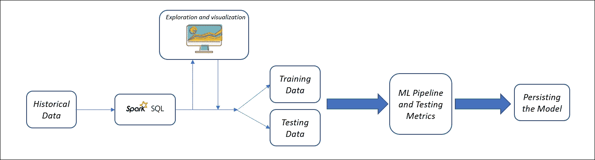
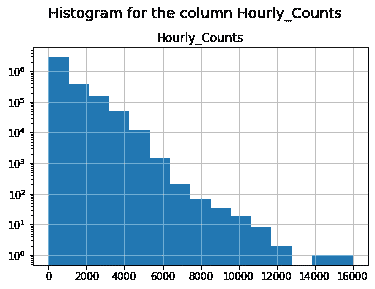

# 基于 Spark 的时间序列预测

> 原文：<https://pub.towardsai.net/time-series-prediction-using-spark-8ee7fbe878e6?source=collection_archive---------1----------------------->

## [机器学习](https://towardsai.net/p/category/machine-learning)

## 使用 Spark 预测下一小时的行人流量

图片来源[阿帕奇星火基金会](https://spark.apache.org/)

## ***目标简介***

如今，在高科技或智能城市中，可以通过在特定位置部署传感器来监控行人数量，这些传感器可以每小时(根据本博客使用的数据)或根据需要计算行人数量。从帖子本身的标题可以理解，这里我们将尝试根据前一小时的数据来预测下一小时特定位置的行人数量或*行人流量*。这种技术也被称为 ***一步时序预测*** ，我们用之前的值预测下一个值。因此，这是一个时间序列回归类型的问题，因为要预测的数据是连续的。使用这些预测，我们可以选择流量最大的位置，然后某些公司可以使用这些位置来营销他们的产品，音乐和娱乐行业的表演者可以确保他们被最多的人听到，等等。

上述陈述明确了目标，但同时也为个人可能想到的一些基本问题提供了空间。让我们首先回答这些问题:

## **哪些工具将用于执行时间序列预测？**

根据这篇博客，使用的工具将是 [Apache Spark](https://spark.apache.org/) 。使用的编程语言是 Python。**可以去我的**[**github**](https://github.com/akashgoyal2110/pedestrian-traffic-prediction/tree/main)**页面获取完整代码。**

## 在这个博客中会使用什么类型的数据？

这个博客中会用到两个数据集

*   行人计数数据

*   传感器信息数据

> 不幸的是，由于版权问题，实际使用的数据无法上传，但同时我已经分享了数据的结构，因此任何类似结构的数据或可以转换成类似结构的数据都可以使用。

既然我们已经解决了基本问题和目标，让我们开始实现它。

# 用于实现目标的流程

## 步伐

1.  数据加载
2.  数据探索
3.  特征提取和转换
4.  模型建立和持续

# 数据加载

要加载数据，首先我们需要创建要读取的数据的模式。如下图。

`[StructType](https://spark.apache.org/docs/1.1.1/api/python/pyspark.sql.StructType-class.html)`函数可用于定义结构，而`[StructField](https://spark.apache.org/docs/1.1.1/api/python/pyspark.sql.StructField-class.html)`函数可用于添加具有相应数据类型的每个属性。

一旦创建了模式，我们就可以使用 spark 的`spark.read.format('csv')`函数轻松地加载数据，因为源数据是以逗号分隔的格式，而且`schema()`函数可以用来提供模式(上面创建的)作为读取数据的参数。可以使用其他选项，例如指定时间戳格式等。看看下面的代码。

如果你想看看结果数据结构，以确保数据显示正确的模式，可以使用`printSchema()`函数进行检查。请参见下面的代码和输出。

# 数据探索

现在，我们需要探索数据，以了解某些趋势/模式，这将有助于选择用于构建机器学习模型的特征。

由于数据已加载到 spark 数据帧中，而 spark 数据帧不太容易直接绘图，因此，所需数据已转换为 Python 的 pandas 数据帧进行绘图。

我们将首先使用下面的代码绘制一个直方图来查看`Hourly_Counts`列的分布。

小时计数列的直方图

这就是直方图的外观，显然直方图会根据数据的分布而变化。请注意，对于该图，比例已更改为对数比例，以便以更好的方式可视化。

在将所需的数据转换成 pandas dataframe 后，可以创建许多其他可视化。**请参考** [**代码**](https://github.com/akashgoyal2110/pedestrian-traffic-preidiction) **查看还可以创建哪些可视化**。

# **特征提取和变换**

我们必须使用名为`lag()`的窗口函数从`Hourly_Counts`列创建`Previous_Hour_Counts`列。我们在`Hourly_Counts`列上创建了一个 lag，在`Sensord_ID`列上进行分区，并在`Date_Time`列上进行排序，以确保在创建 lag 时一个传感器的计数值不会传递给另一个传感器。`Hourly_Counts`列的每个单元格值都将上移一行，该列将被命名为`Previous_Hour_Counts`。下面是代码和一个动画示例，展示了`Previous_Hour_Counts`列中的数据的外观。

请确保删除`Previous_Hour_Counts`为`NULL`的行，因为这些行将无法参与预测。

为了提高效率，我们还需要删除不需要的数据。我们可以只过滤 2016 年到 2018 年之间的数据，并且只过滤上午 9 点到晚上 11 点之间的时间，这是有意义的，因为在此之前，一般认为行人数量会很低，因为晚上 11 点到早上 8 点之间的时间对于很多人来说是“不合理的”。

## 着眼于选择功能

**ID:** 该列是每一行的唯一标识符，因此从预测的角度来看并不重要，因此不需要用于预测。

**年、月、日、时:**根据探索，这些列将被证明对预测非常有帮助(请查看 [github](https://github.com/akashgoyal2110/pedestrian-traffic-prediction/tree/main) 页面获取代码)。它们看起来非常重要，因为它们显示了可以通过机器学习算法学习的模式，因此为预测提供了一些帮助。

**Sensor_ID:** 该功能也将提供大量信息，因为有些传感器/位置可能总是接收到高行人计数，而有些传感器/位置可能接收到低计数。因此，此功能可以显示模式。

**Hourly_Counts:** 该列用于训练回归模型。

**Previous_Hour_Counts:** 从可视化结果中可以看出，Hourly_Counts 列是从历史值预测下一个值的一个非常好的特性，因此我们可以使用它作为预测的一个特性。

需要删除列“Date_Time”、“MonthNum”、“DayofWeek”、“Mdate”、“Sensor_Name”，因为它们不会给模型增加太多值，或者已经添加了它们的分类对应项。

我们需要将某些列的数据类型转换成我们需要的数据类型， **Time** 到 **StringType()** ， **Previous_Hour_Counts** 到 **IntegerType()** ， **Hourly_Counts** 到 **IntegerType()** ， **Sensor_ID** 到 **StringType()** 。

使用下面的代码可以将列名`Hourly_Counts`更改为`target`(这是可选的)。

接下来，我们需要使用[字符串索引](https://spark.apache.org/docs/latest/ml-features.html#stringindexer)技术对字符串/分类列进行编码，以标记索引。现在[一键编码](https://spark.apache.org/docs/latest/ml-features.html#onehotencoder)技术可以用于这些索引值(来自 StringIndexer ),这样模型就可以使用这些索引值作为特征。使用一次性编码，这些值以这种方式编码，因为它们的序数值没有任何重要性，可能会对模型产生负面影响。为了使用上面创建的特征，我们需要使用[矢量组合器](https://spark.apache.org/docs/latest/ml-features.html#vectorassembler)将它们组合成矢量，以便它们能被模型使用。让我们为这些过程创建阶段/步骤，以便能够在稍后的模型构建阶段使用它们。

# 模型建立和持续

在这一部分中，我们将使用训练数据创建机器学习模型，然后使用测试数据计算该模型的指标以进行模型评估。我们将使用一个基本的[决策树](https://spark.apache.org/docs/1.5.2/ml-decision-tree.html)模型。现在让我们创建模型构建阶段。对于其他型号，请查看[代码](https://github.com/akashgoyal2110/pedestrian-traffic-preidiction)。

现在使用 Spark 的 [ML 管道](https://spark.apache.org/docs/latest/ml-pipeline.html) API，我们可以使用这些阶段来创建一个管道。使用管道 API 的主要优点之一是它使代码更易于管理和阅读。

下一步是将数据分为训练和测试，然后使用训练数据来构建模型，并获得对测试数据的预测。

现在可以计算指标来评估模型，在这篇文章中使用了 RMSE 和 R 平方值。根据您的选择和使用案例，可以使用更多的指标。

为了保存/持久化模型，我们可以使用下面的代码。

使用上面的代码是因为这个模型是一个管道模型，首先我们需要提取模型，然后保存它，`stages[-1]`帮助我们获得模型对象，然后可以使用`save()`函数保存它。我们也可以不用`stages[-1]`直接使用`save()`功能保存管道模型。

**不要错过接下来的** [**下一篇**](/predicting-and-visualizing-streaming-data-through-python-2670003bc809) **文章，这是这篇文章的续篇，在这篇文章中，你可以将模型实际应用于流数据，并将其可视化。**

**请看一下**[**github**](https://github.com/akashgoyal2110/pedestrian-traffic-prediction/tree/main)**页面关于我在 python 笔记本中做过的更多事情，不得不在帖子中简短扼要。**

非常感谢你花时间阅读这篇文章，如果你想讨论与这篇文章相关的任何事情，请留下评论，我会尽力帮助你。