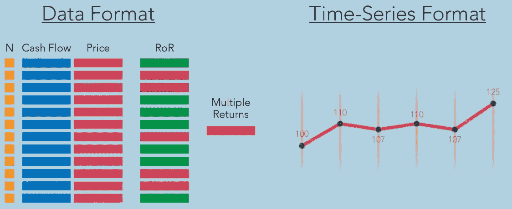
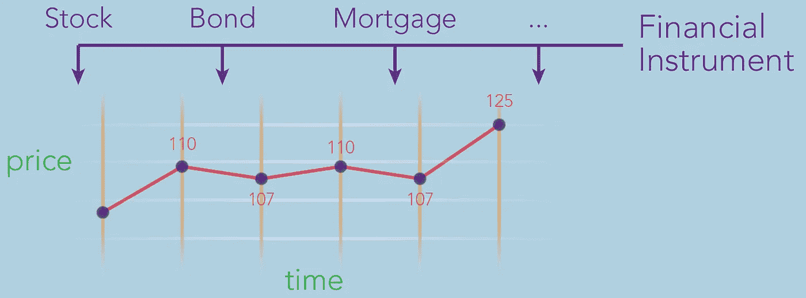
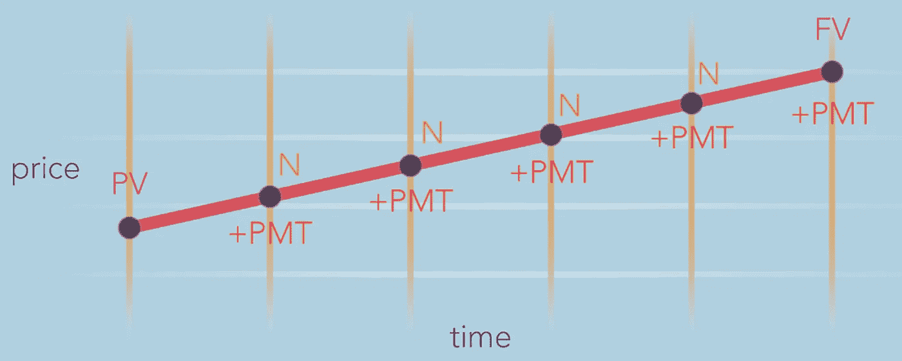
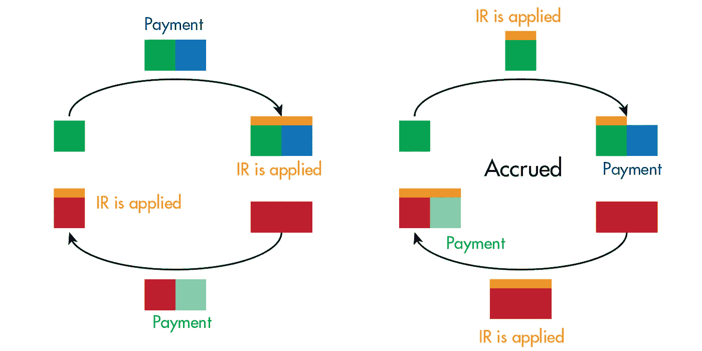
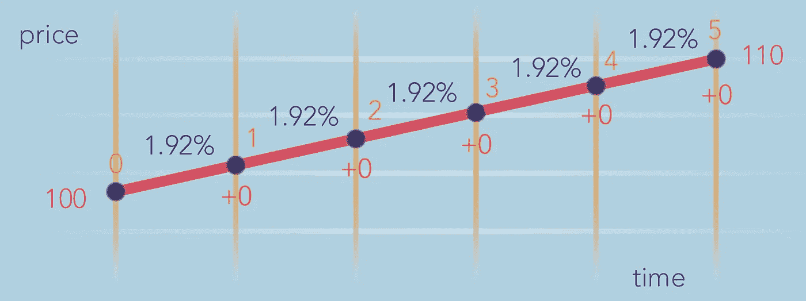

# 金钱的时间价值很容易解释

> 原文：<https://pub.towardsai.net/time-value-of-money-easily-explained-52d751695f9f?source=collection_archive---------3----------------------->

## [财务，](https://towardsai.net/p/category/data-analysis)数据分析，[编程](https://towardsai.net/p/category/programming)

## TVM 的一个概念性解释，我们为什么要用它？全部代码可在我的 Github repo 获得[。](https://github.com/arditoibryan/Projects/tree/master/20200905_TVM)

## 普通定义

货币的时间价值是“货币在未来比现在更有价值的想法”。这是商学院教授的内容，然而，就我的理解而言，问题是学生们无法将 TVM 的思想与他们需要分析的原始数据联系起来，因此，无法正确理解其实际用途。

这是因为在金融中收集的原始数据属于不同的金融工具，并且它不总是具有相同数量的变量和参数，没有被标准化。

## 为什么要用价格和时间来绘制数据？

为了正确解释我的定义，我将不得不假设 TVM 工具适用于某种数据。在金融领域，每当我们在数学空间中概念化一种金融工具，如股票、抵押贷款、固定收益证券(同样适用于衍生产品)时，我们可以用两个维度来表示它:

*   价格
*   时间

等式中嵌入了大量其他参数(现金流量、n 个周期而不仅仅是时间、利率、单一 RoR……)，但这两个是所有金融工具共有的基本维度。如果我们要包括更多的数据，甚至所有的数据，我们将会有一个非常混乱的多维图形:OVERKILL。



剔除不必要的数据，以达到时间序列的格式

此外，金融工具不规范。例如，期权(一种衍生品)不像债券那样有现金流。我们怎么能在同一个数学空间里绘制它们呢？

很简单，通过绘制唯一的基本数据:

*   我可以在同一个数学领域里绘制不同的金融工具
*   我将从该金融工具中获得一个压缩在这两个维度中的时间序列

## **货币的时间价值**



所有金融工具的标准化

* ****你不能简单地用笛卡尔平面来绘制你想要的一切。**你必须具体说明为什么对不同的仪器使用相同的图表。否则，你怎么能在同一个镜头下看到债券和股票呢？



## 什么是 TVM:我的定义

**TVM** 是一种工具，它允许我们在时间序列中(包括其时间框架之外)找到任何缺失的信息，一次一条信息。

# 复利与贴现

在下图中，我能够用复利(顶部，绿色)和贴现(底部，红色)以及一个附加变量(本质上是一个布尔值)来表示 TVM:付款可以发生在一个时期的开始或结束。



除此之外，资产还在增值。在底部贴现，资产价值下降。

通过比较普通支付和应计支付，我们可以看到，当支付时，ent 是应计的，当复利时资产赚得更少，当贴现时债务更重。

# Python 代码

现在，TVM 是 5 个不同公式的集合，允许您在给定必要参数的情况下隔离不同的输出。通过选择一个参数作为输出，所有剩余的参数都成为输入。

*   周期数
*   利率
*   支付
*   现值
*   未来价值

我将使用以下工具来访问 **tvm** 算法:

```
!pip install numpy-financial
```

例如，按照下面的图片，我想知道在 5 个不同的时期，我从 100 到 110 的利率。我需要的输出是利率，剩下的参数是

```
import numpy_financialN = 5
I_R = None #data Iwant to find out
PMT = 0
PV = 100
FV = -110
```

我现在可以用下面的代码找到每一期的利率:

```
I_R = numpy_financial.rate(nper=N, pmt=PMT, pv=PV, fv=FV)
0.019244876491478942
```



资产价格每次复利的利率

虽然我已经有了数据，并且不需要其他参数，但为了方便起见，我还是包含了这段代码。

```
numpy_financial.fv(rate=I_R, nper=N, pmt=PMT, pv=PV)
-109.97578609664411numpy_financial.nper(rate=I_R, pmt=PMT, pv=PV, fv=FV)
array(5.0115759)numpy_financial.pv(rate=I_R, nper=N, pmt=PMT, fv=FV)
100.02201748604425
```