# Tinder + AI:完美的配对？

> 原文：<https://pub.towardsai.net/tinder-ai-a-perfect-matchmaking-b0a7b916e271?source=collection_archive---------0----------------------->

## [人工智能](https://towardsai.net/p/category/artificial-intelligence)、[观点](https://towardsai.net/p/category/opinion)、[技术](https://towardsai.net/p/category/technology)

## 描述一个由 Tinder 使用的渐进式推荐系统，让你得到一个完美的匹配！

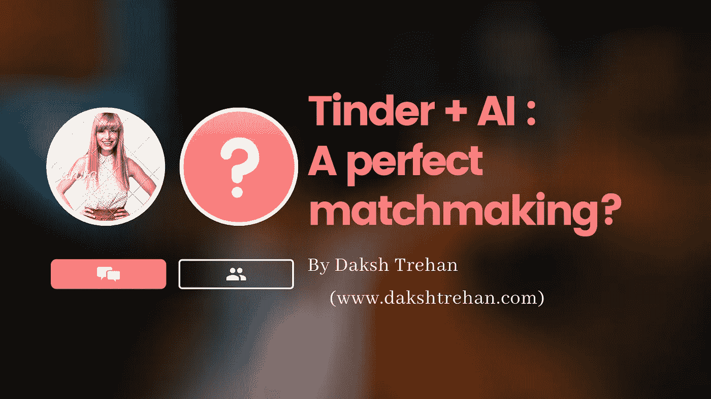

> ***《百无聊赖在屋里，百无聊赖在屋里》，*** *官方火绒主题曲！*

*内容表:-*

1.  *什么是火绒？*
2.  它是如何影响约会世界的？
3.  *用户对 Tinder 有哪些期待？*
4.  *可能的火绒推荐系统*
5.  *其他交友 app 是如何计算“ELO”分数的？*
6.  *开发 Tinder 的 ML 模型*
7.  *Tinder 是一个优秀的红娘吗？*

# 什么是火绒？

Tinder 是一款手机交友 app，可以帮你在当地寻找单身。“如果你喜欢她就向右滑动，如果你不喜欢她就向左滑动”是该公司成功的关键，这种模式被许多同时代的人复制。

Tinder 最初于 2012 年在孵化器 **Hatch Labs** 中作为基于位置的约会应用推出，并加入了由 **IAC 和 Xtreme Labs** 组成的合资公司，现在它是美国最受欢迎的约会应用之一，每天约有 17 亿次点击 。Tinder 采用了免费增值的商业模式来赚取收入。

# 它是如何影响约会世界的？

在不到 8 年的时间里，它从一个基于位置的约会应用程序发展成为一个全球约会应用程序，覆盖 190 多个国家。与对手相比，Tinder 的动机不是娱乐，而是帮助你获得爱情生活。

火绒用户隔离，[简单发短信](https://simpletexting.com/dating-app-survey/)

Tinder 有 5700 万用户，这并没有使它成为使用最多的约会应用之一。然而，Tinder 有一点特别之处，让它感觉像是在线约会时代的典型应用。至少在西方世界——无论你去哪里，火绒似乎总是无休止地在看不见的地方嗡嗡作响。它游戏化的风格，易于访问的完美，以及它合法的直白可能是澄清其失控成就的最佳方法的一部分。

*   Tinder 的用户每周约会 100 万次，自从 Tinder 推出以来，已经有超过 200 亿次的约会。
*   活跃的 Tinder 用户平均每天登录**四次。**
*   **95%的 Tinder 用户会在一周之内遇到他们的伴侣，谁能想到约会会这么容易？**
*   2017 年经历了**更多在网上而非网下相遇的情侣。**

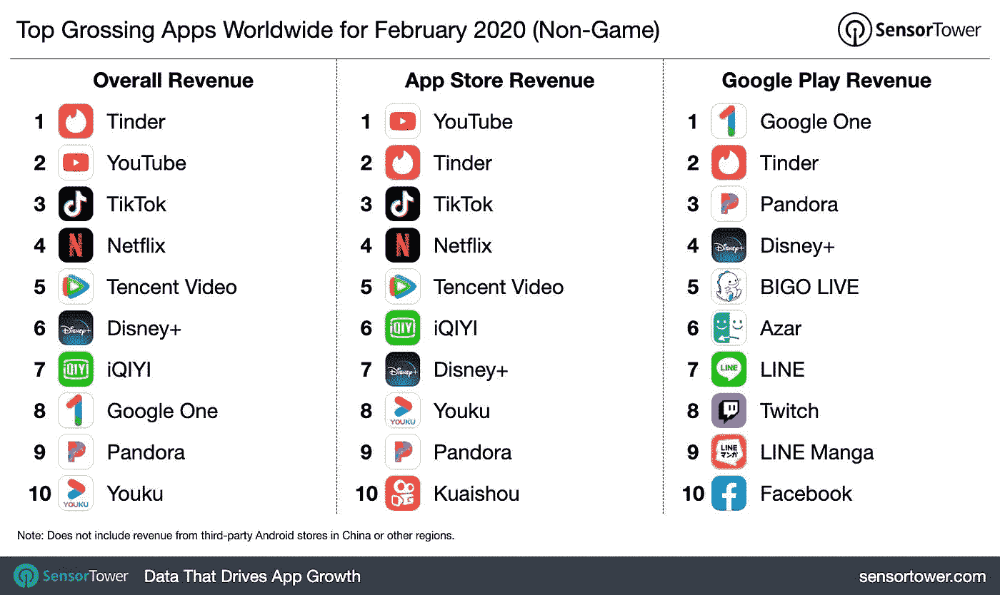

Tinder 是 2020 年 2 月票房最高的应用， [SensorTower](https://sensortower.com/blog/top-grossing-apps-worldwide-for-february-2020)

谈到数字，Tinder 估计价值**100 亿美元**，其 2019 年的收入为**11.5 亿美元**；【Match Group(母公司)总收入**20.5 亿美元**的 56% 。2015 年至 2019 年间，Tinder 的收入以 123%的 **CAGR 大幅增长。**

Tinder 已经超越网飞，成为 2019 年全球票房最高的非游戏应用。根据 Sensor Tower 的说法，截至 2020 年 2 月，它一直保持着这一壮举。数字定为 7740 万美元，其中 42%来自美国，7%来自英国，5%来自德国。

截至 2020 年 3 月底，Match Group 市值**186 亿美元**

# 用户对 Tinder 有哪些期待？

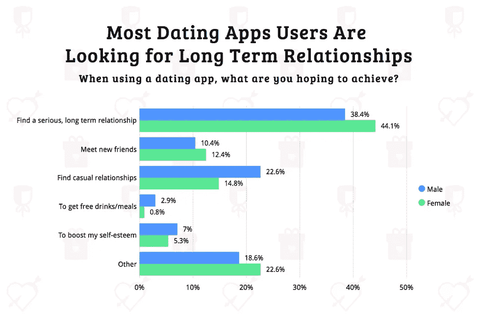

你想要什么?[简单发短信](https://simpletexting.com/dating-app-survey/)

根据简单短信调查，寻找一段严肃的、长期的关系是网民们最优先的选择。一小部分男性和女性表示他们正在寻找朋友，而其他人则使用该应用程序来提升他们的自尊。

# 可能的 Tinder 推荐系统

Tinder 的算法没有得到证实的工作流程，这些驱动此类平台的算法是专有的，该公司对泄露其执行的私人细节最不感兴趣，但基于该公司发布的数据和书呆子发现的踪迹。我下定了随之而来的决心。

你的火绒火柴很大程度上依赖于你的数据，根据你的个人资料计算出一个“ *ELO* ”分数，这个分数或多或少地定义了你火柴的质量和数量，从暗示一个甜爹到一个瘸子，它决定你的命运。你的等级提升是基于你的右击次数，以及右击次数。那个人右拳挥得越多，他对你的右拳挥得越多，对你的分数就意味着越多。

Tinder 然后会推荐分数相同的人，假设观点相似的人会处于大致相同的兼容性级别。

你的受欢迎程度在很大程度上取决于:

## 轮廓质量

这是决定 ELO 分数的最重要的因素。有时这是无法克服的，会削弱你的比赛。但这取决于你的简历、照片和你选择的设置。

[来源](https://gph.is/g/ZyNyen4)

当你发布一些照片时，这些图像会通过他们的机器学习服务器传递，这些服务器可以很容易地定义你的偏好和选择。

操作中的计算机视觉

使用几种对象检测技术，它可以观察你的兴趣，例如，如果你把你骑在自行车上享受大自然的照片放在显示屏上，算法会告诉你喜欢自行车和大自然，现在，你的个人资料会激增到与你有共同之处的女孩。

类似地，当你放上简历时，表情会被传送到 NLP 系统，它可以检测你的第一印象，也可以发现你的特质。

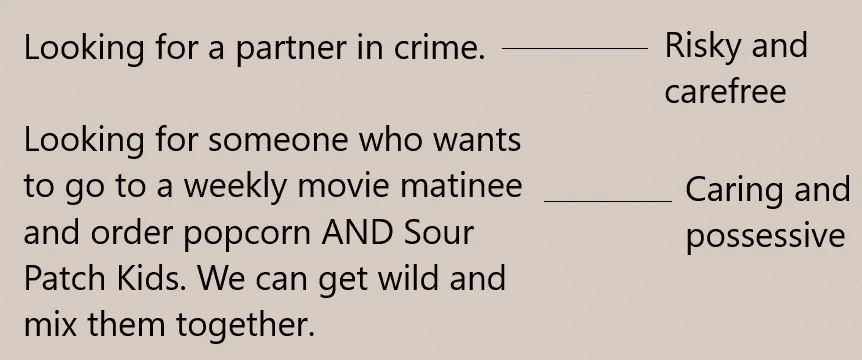

运行中的 NLP

除此之外，你的微调设置也有助于提升你的个人资料。你选择的距离越大，你就越处于探索状态，你选择的距离越小，你想要的关系就越严肃和安全。

Tinder 还会记录你的**左右滑动比率**，如果你的档案比率高，你的档案将被提升到更多异性，反之亦然。

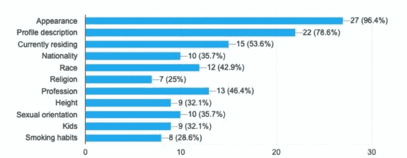

影响剖面质量的特征

## 应用程序使用

> Tinder 知道人类很快就会过时，所以他们试图尽快利用这一点。

Tinder 当然想赚很多钱，但在他们的应用上花费大量时间也非常有助于他们的意图。

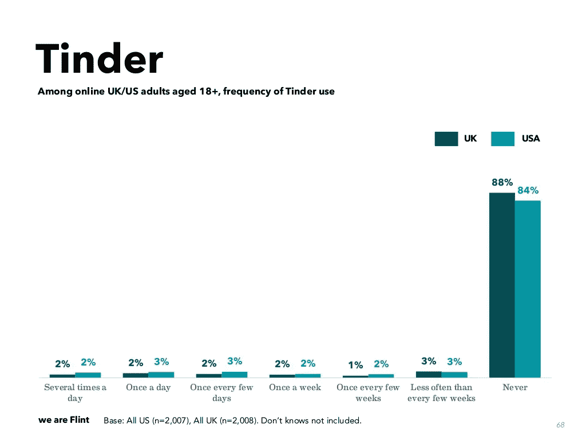

频率用法，[我们是火石](https://weareflint.co.uk/main-findings-social-media-demographics-uk-usa-2018)

算法推广那些 **app 活跃度高**的简介，毕竟用户数量越多，其资本增长越多。

Tinder 热爱它的用户，永远不想失去它的粉丝群，因此，它经常增加活跃的个人资料，更明显的个人资料意味着更多的匹配，这使得用户不太倾向于尝试对手。

当用户的应用使用频率较低时，他们会降低他/她获得匹配的可能性，因为由于频率较低，他们很可能不会回复他们的匹配。

与相反的情况相比，应用程序上的男性太多了。Tinder 优先考虑**有可能为他们服务的活跃女性和活跃男性**。

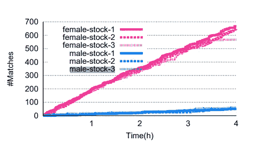

比赛数量:男性对女性，[来源](https://arxiv.org/abs/1607.01952)

## 刷卡活动

影响“*ELO”*得分的另一个因素是刷卡活动，Tinder 会跟踪你向左或向右刷卡的频率。

如果你向右滑动，你太宽容了，可能会发送垃圾邮件，如果是这种情况，tinder 会再次降低你找到匹配的可能性，或者用技术术语来说，它会 **ShadowBan** 你。因为更多的刷卡意味着更少的信息，这意味着对应用程序的信任更少，没有一个首席执行官希望如此。

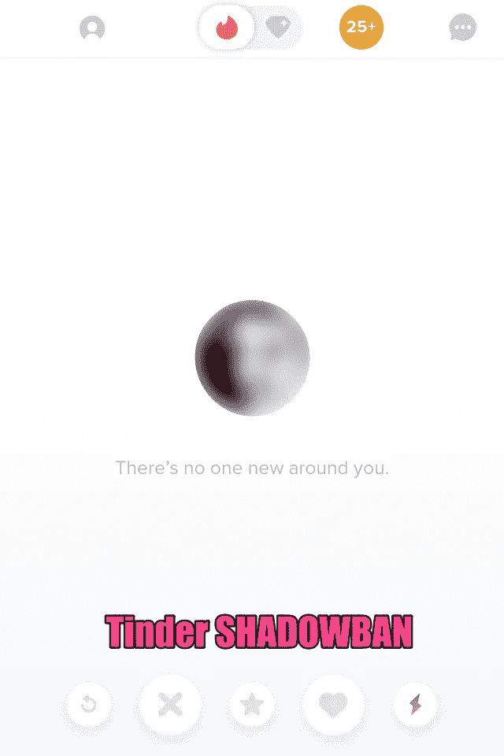

影班，[来源](https://cdn.datingxp.co/wp-content/uploads/2020/07/Tinder-shadowban.png)

但是，如果你很少向右滑动，这意味着你太挑剔了，由于男女比例高，这也不符合算法。

在 Tinder 中，你每天只能进行 *100 次*的右刷，以确保你真的看了一眼个人资料，而不是简单地向每个人发送垃圾邮件来堆积任意的匹配。

为了不断获得晋升，你需要找到一个平衡点，最大限度地利用等式的这一部分。

## 消息传递活动

> 在数字化时代，隐私仅仅是一个词。

Tinder 还会跟踪你的信息活动，它会跟踪你发送了多少条信息或发起了多少次对话，它会跟踪那次对话的情绪，它会跟踪你们进行对话的持续时间，甚至不管你们是否分享了联系号码。

如果你的互动成功率很高，该算法将通过提升你的个人资料和获得更多匹配来奖励你。

但是如果你继续让女士们挂机，它会通过降低你个人资料的“*”分数来惩罚你。*

*对于一个个性化的推荐，算法会关注对话和对话的情绪。根据你所拥有的情感和特质，如果你和你的伴侣有一个很棒的信息传递活动，它会推荐给你更多与前一个人分享一些共同特质的个人资料。*

*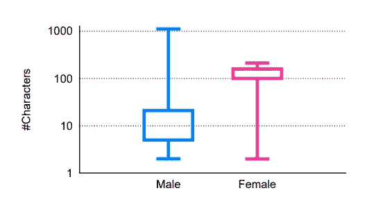*

*火绒消息长度:男 vs 女，[来源](https://arxiv.org/abs/1607.01952)*

*男性传递信息的能量似乎与他们的发音不协调，正常的音符在明显不浪漫的 12 个字符处倾斜。一般来说，女士们发来的短信一般会在 122 个字符左右。*

*该算法将跟踪情绪，并确保您的消息是积极的，但不会太多，此外，它还会关注每条收到的消息发送的消息。*

## *结合在一起*

*所以当你安装并注册这个应用程序时，它会询问你的数据，比如种族、人种、教育程度、身高、公司等等。*

*首先，除了你输入的数据之外，这个应用程序对你了解不多。该应用程序将与你合作，作为一个“ ***初学者的运气*** ”因为它仍然没有将你分类为坏用户或好用户，它将激增你的个人资料以查看你的活动，它将跟踪你到底为什么样的人而茁壮成长？*

*如果你主要是以硕士教育水平参加亚洲赛事，它会试着向你显示具有相同资格的个人资料。*

*当你继续使用该应用程序时，它会逐渐试图更好地理解你，现在它不仅会跟踪你的刷卡活动，还会跟踪你的附属 Spotify，Instagram 的账户活动，为你提供个性化的广告体验。*

*结合你过去的活动和社交媒体互动，它将尝试计算你的“ *ELO* ”分数，它将检查用户是否正在积极使用该应用程序，如果没有，它将屏蔽它，接下来它将跟踪刷卡频率，如果也很高，它将进入下一步计算用户信息频率， 如果满足所有标准，那么“ *ELO* 得分将会很高，用户的个人资料将会显示为相同的“ *ELO* 得分的个人资料，如果用户的消息活动对任何物种、种族或个人犯罪构成威胁，用户将会被影子封禁。*

*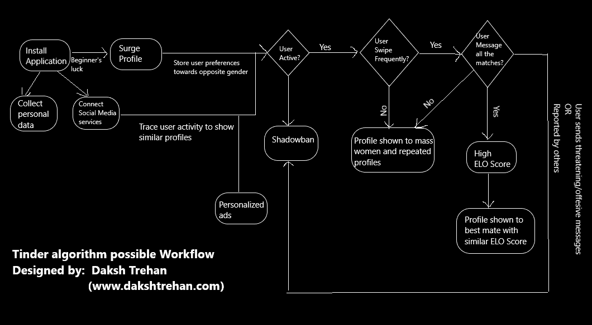*

*Tinder 工作流程，由 Daksh Trehan 设计，版权所有*

# *其他约会应用程序是如何计算“ELO”分数的？*

*像 OkCupid 或 eHarmony 这样的流行约会应用程序声称使用一种特殊类型的 ML 技术来预测你的口味，并为你提供最合适的匹配。预计这些将使用盖尔-沙普利算法，该算法是由两位经济学家在 1962 年开发的，他们想证明任何人群都可以筛选出稳定的婚姻。*

*   *在第一次迭代中，每个没有订婚的男人向他选择的女人求婚，然后女人被期望对她最喜欢的对象回答“*也许*”，对其他人回答“*不*”。然后，她与迄今为止她最喜欢的求婚者订婚，那个求婚者也同样临时与她订婚。*
*   *在下一轮中，每个未订婚的男人向最适合他的女人求婚，然后每个女人回答“*也许*”，如果她目前没有订婚或者更喜欢他而不是她已经订婚的伴侣。*
*   *这个过程一直重复，直到每个人都参与进来。*

*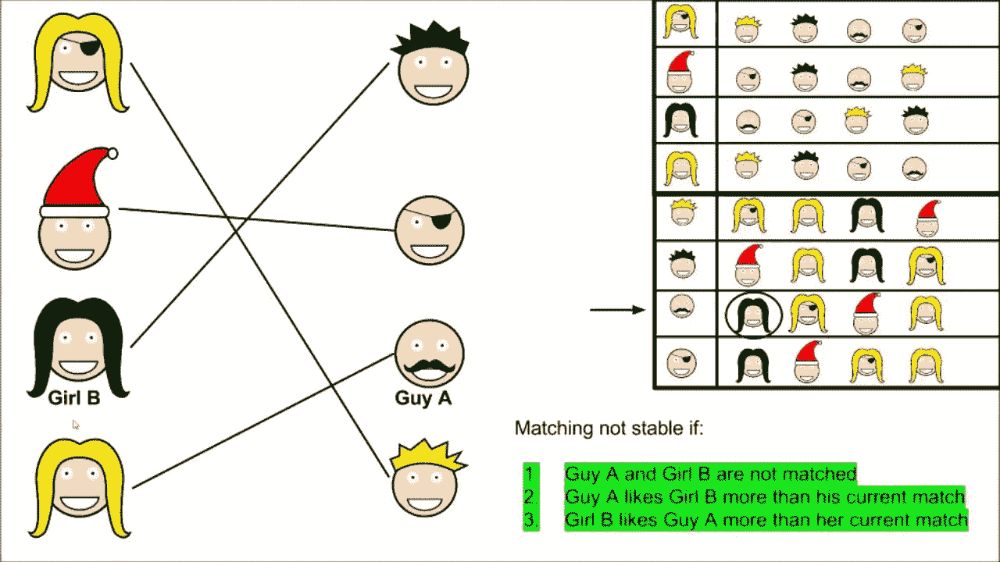*

*[盖尔·沙普利算法](https://www.youtube.com/watch?v=Dm7OQr53xKY)*

*这种算法保证及时为所有参与者产生稳定的婚姻。*

# *开发 Tinder 的 ML 模型*

**

***步骤 1。数据标注和清洗:**通过 500 到 1000 个简介，每个简介有 4-5 张照片，将它们分类为“喜欢”、“不喜欢”或“中性”。*

***第二步。神经网络:**使用迁移学习训练现有的神经网络，根据已经分类的图像向右或向左滑动。*

***第三步。算法:**编写一个函数，根据上述网络得出的每张图像的得分总和，对一个配置文件进行评分。*

# *Tinder 是一个优秀的红娘吗？*

*你输入一些信息，Tinder 会收集更多关于你的信息，然后你会在网上出现多个匹配。*

*但最令人吃惊的是，没有人透露他们相遇后发生了什么？他们勾搭上了，他们有了孩子，他们吵架了，他们过着完美的爱情生活，还是他们互相鬼混？*

*Tinder 从未因其推荐系统而受到奖励/惩罚，因此实际上它永远无法通过其经验使其更加鲁棒来改进，它的算法可能会改变使其更加鲁棒，但由于它永远无法获得真实的人类反馈，因此它永远无法在相同的算法负责下得到实际改进。*

*其次，我不相信 Tinder 是可信的，它需要大量数据，它尽可能地跟踪你，了解你，我不赞成人工智能在几年内统治我们。*

> ***情人节可能来也可能去，但是，你的数据会永远放在网上。***

***如果你喜欢这篇文章，请考虑订阅我的简讯:** [**达克什·特雷汉每周简讯**](https://mailchi.mp/b535943b5fff/daksh-trehan-weekly-newsletter) **。***

# *结论*

*希望这篇文章已经告诉你 Tinder 是如何使用人工智能的，以及它的推荐工作流程是如何为你找到一个有爱的伴侣的。*

*一如既往，非常感谢您的阅读，如果您觉得这篇文章有用，请分享！*

# *参考资料:*

*[1] [Tinder 收入和使用统计(2020)](https://www.businessofapps.com/data/tinder-statistics/#4)*

*[2] [艾背后的火绒](https://spotle.ai/feeddetails/AI-Behind-Tinder/5645)*

*Tinder 的算法——它是如何决定谁可以看到你的个人资料的。*

*[4] [稳定的婚姻问题](https://en.wikipedia.org/wiki/Stable_marriage_problem#Applications)*

*请随意连接:*

> **LinkedIn ~*[*https://www.linkedin.com/in/dakshtrehan/*](https://www.linkedin.com/in/dakshtrehan/)*
> 
> **insta gram ~*[*https://www.instagram.com/_daksh_trehan_/*](https://www.instagram.com/_daksh_trehan_/)*
> 
> **Github ~*[*https://github.com/dakshtrehan*](https://github.com/dakshtrehan)*

*关注更多机器学习/深度学习博客。*

> **中等~*[*https://medium.com/@dakshtrehan*](https://medium.com/@dakshtrehan)*

## *想了解更多？*

*[利用深度学习检测新冠肺炎](https://towardsdatascience.com/detecting-covid-19-using-deep-learning-262956b6f981)*

*无法逃脱的人工智能算法:抖音*

*[使用机器学习的卡通化内部指南](https://medium.com/towards-artificial-intelligence/an-insiders-guide-to-cartoonization-using-machine-learning-ce3648adfe8)*

*你为什么要为乔治·弗洛伊德的谋杀和德里的骚乱负责？*

*[强化强化学习背后的科学](https://medium.com/towards-artificial-intelligence/reinforcing-the-science-behind-reinforcement-learning-d2643ca39b51)*

*[解码生成性对抗网络背后的科学](https://medium.com/towards-artificial-intelligence/decoding-science-behind-generative-adversarial-networks-4d188a67d863)*

*[理解 LSTM 和 GRU](https://medium.com/towards-artificial-intelligence/understanding-lstms-and-gru-s-b69749acaa35)*

*[用于假人的递归神经网络](https://medium.com/towards-artificial-intelligence/recurrent-neural-networks-for-dummies-8d2c4c725fbe)*

*[虚拟卷积神经网络](https://medium.com/towards-artificial-intelligence/convolutional-neural-networks-for-dummies-afd7166cd9e)*

*[深入钻研深度学习](https://medium.com/towards-artificial-intelligence/diving-deep-into-deep-learning-f34497c18f11)*

*[为什么选择随机森林而不是决策树](https://medium.com/towards-artificial-intelligence/why-choose-random-forest-and-not-decision-trees-a28278daa5d)*

*[聚类:是什么？什么时候用？](https://medium.com/@dakshtrehan/clustering-what-it-is-when-to-use-it-a612bbe95881)*

*[与 k 个最近的邻居一起开始您的 ML 之旅](https://medium.com/@dakshtrehan/start-off-your-ml-journey-with-k-nearest-neighbors-f72a122f428)*

*[朴素贝叶斯解释道](https://medium.com/swlh/things-you-never-knew-about-naive-bayes-eb84b6ee039a)*

*[激活功能说明](https://medium.com/analytics-vidhya/activation-functions-explained-8690ea7bdec9)*

*[参数优化说明](https://towardsdatascience.com/parameters-optimization-explained-876561853de0)*

*[梯度下降解释](https://towardsdatascience.com/gradient-descent-explained-9b953fc0d2c)*

*[逻辑回归解释](https://towardsdatascience.com/logistic-regression-explained-ef1d816ea85a)*

*[线性回归解释](https://medium.com/towards-artificial-intelligence/linear-regression-explained-f5cc85ae2c5c)*

*[确定最适合您的 ML 模型](https://medium.com/datadriveninvestor/determining-perfect-fit-for-your-ml-model-339459eef670)*

> **欢呼**