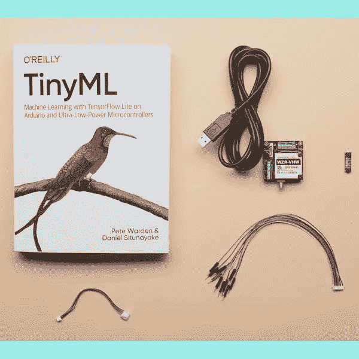
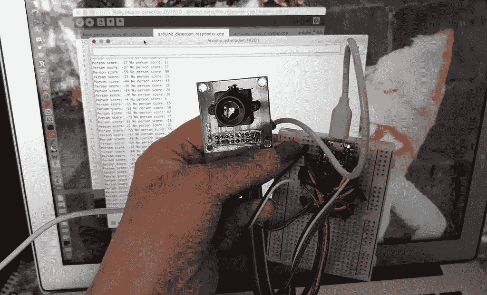
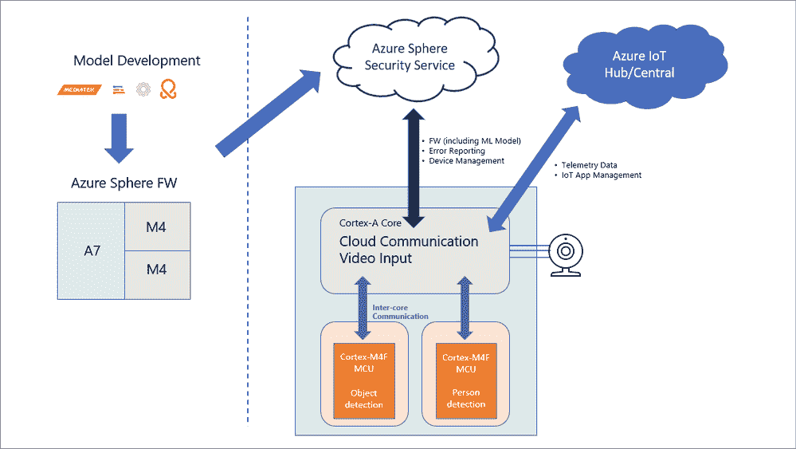
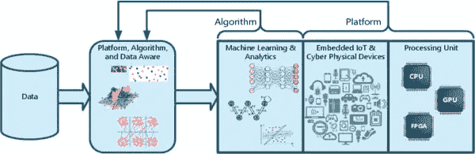
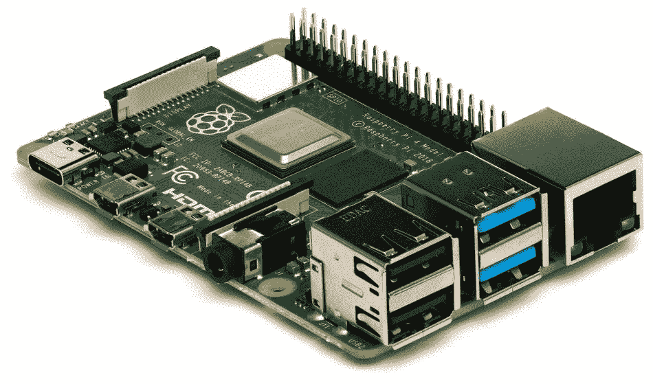

# TinyML:理解边缘机器学习的快速指南。

> 原文：<https://pub.towardsai.net/tinyml-machine-learning-at-the-edge-understanding-1e3c68d9ad32?source=collection_archive---------0----------------------->

来源:我在哈佛大学的最新专业培训

## 简要介绍开源框架

机器学习正在改变世界，因为它让计算机从数据中学习，发现趋势，并预测将会发生什么。

它使系统变得自给自足、精确和可靠。用户需要快速、响应迅速且可靠的高质量移动体验。然而，这些体验需要在边缘和云中进行大量处理。

此外，尽管带宽、存储和处理能力有限，物联网终端必须能够自主运行。这些限制提高了在边缘计算机器学习模型的必要性。

本周，在完成了一个非常有趣的哈佛大学认证系列“TinyML 基础知识”之后，我有机会刷新并加深了对 TinyML 的理解。

资料来源:哈佛大学和 EdX

它专注于机器学习和嵌入式系统(如智能手机)的基础知识，以及 TinyML 的“语言”，由哈佛大学的 Vijay Janapa Reddi 和谷歌首席人工智能倡导者 Laurence Moroney 教授。

如果你想了解 TinyML 和机器学习、深度学习、嵌入式系统以及智能手机等微型设备的基础知识，这个 TinyML 证书系列就是为你准备的。

该工具还可以让你看到流行 TinyML 应用程序背后的代码，比如小工具和手机，并将代码发送到你的物理 TinyML 设备。

我强烈建议你开始学习 TinyML，因为它是深度学习发展最快的领域之一，并且变得越来越容易被每个人接受。

了解机器学习、深度学习以及嵌入式设备和系统(如智能手机和其他微型设备)的基础知识，将有助于你了解这个快速变化的领域，以及它如何帮助智能手机变得更加实惠。

这篇文章将解释 TinyML，在边缘部署 ML 的问题，以及 TinyML 如何应对这些挑战。但是，首先，请允许我选择背景…

来源: [Flickr](https://www.google.com/url?sa=i&url=https%3A%2F%2Fwww.flickr.com%2Fphotos%2Fadafruit%2F49561376268&psig=AOvVaw1MJOtOiEIdNkYz6Ho42Nwm&ust=1666529742465000&source=images&cd=vfe&ved=0CA8Q3YkBahcKEwiQv7ic8fP6AhUAAAAAHQAAAAAQBA)

# 介绍

让我们开始谈论 AIoT(人工智能的东西)，更准确地说，关于 TinyML。

一段时间以来，在涉及连接对象的不同项目中，要求不再仅仅是低消耗、不同方式的连接能力和减小的尺寸。此外，因为有如此多不同种类的应用程序，连接的对象现在需要来自它们的处理单元所做的决策的智能。

传统物联网架构分为感知层、雾/边缘计算层和云层。然而，有限的连接和计算延迟意味着设备需要智能。

尽管 5G 连接即将到来，可以消除其中一些问题，但这种需求已经存在于许多涉及连接对象的应用和项目中。

# TinyML 是什么？

将 ML 集成到小型设备中并不是什么新鲜事。现在许多手机都内置了这种人工智能(AI)系统。例如，它可以用来识别音乐或找到使用相机的方法，如夜视。然而，将人工智能融入更小的设备仍然存在挑战。这就是我们所说的 TinyML 的用武之地。

简而言之，TinyML 将机器学习解决方案用于小块硬件，并针对特定功能训练它们，而不必将训练数据用于外部处理，例如在云中。这样，就可以在设备上本地更新 ML 模型。例如，您可以训练智能扬声器对新的激活词做出响应，或者改变 ML 传感器本身的工业过程。此外，它是在边缘执行的实时训练，而不是在云中或运行 ML 系统的大型服务器上。

在更严格的定义中，我们可以说 TinyML 是一个框架，它将一些传统的机器学习技术与工具相结合，以优化和兼容 32 位微控制器。

请注意，TinyML 与其他框架和库之间的主要区别在于，TinyML 与需要较少计算能力的处理器一起工作(例如，较少的内存和时钟)。

are:‍技术的一些关键优势

*   **‍数据**安全性由于无需将信息传输到外部环境，数据隐私更有保障。 **‍**
*   **节能:**信息传输需要大型服务器基础设施。当没有数据传输时，节省了能量和资源，从而降低了成本。 **‍**
*   **无连接依赖:**如果设备依赖互联网工作，出现故障，将无法向服务器发送数据。您尝试使用语音助手，但它没有响应，因为它已断开互联网连接。
*   ‍延迟 **:** 传输数据需要时间，并且经常导致*延迟*。当不涉及这个过程时，结果是即时的。

TinyML 使用与 ML 相同的架构和方法，但在更小的设备上能够执行不同的功能，从回答音频命令到通过化学相互作用执行操作。

来源:Arduino Nano BLE 和 OV7670 相机上的人物检测 [TinyML](https://www.flickr.com/photos/37996583811@N01/51312513490) (机器学习)模型

# 为什么 TinyML 在今天如此重要？

我从 2020 年开始写关于 TinyML 的文章，你可以阅读我发表的一篇非常详细的文章，名为“**tiny ml 是什么，为什么它很重要？**(查看文章末尾的链接)可以给你更多关于这项技术的技术细节，根据 **ABI 研究**的预测，到 2030 年，大约 25 亿台设备可能会通过 TinyML 技术进入市场。

此外，咨询公司 The Silent Intelligence 的一项调查强化了之前的预测:在未来五年内，TinyML 的经济价值可能超过 700 亿美元。

这些数字不容忽视，许多公司正在投入资金制造可以使用 TinyML 的芯片。此外，ML 领域的专业人员已经聚集在一起，以找出在这个领域的最佳实践，这可能会增长很快。

想象一下，这个设备已经被教会告诉森林中空气的温度和质量。这种装置对于风险评估和火灾原理的识别可能是必不可少的。

这一运动为物联网设备(如电视、汽车、咖啡机、手表和其他设备)中的应用程序提供了一系列可能性，使其具有目前仅限于计算机和智能手机的智能功能。

TinyML 的先驱之一是谷歌的皮特·沃顿(Pete Warden)，根据他的说法，我们将在几乎所有东西中看到语音界面。在斯坦福德的一次演讲中，他说，一旦你可以以低成本创造出良好的语音界面，你就可以在任何消费品上使用它们，取代任何设备上的按钮，特别是如果你考虑将音频和视频结合起来。

来源:微软技术社区

# 机器学习在边缘面临哪些挑战？

边缘计算将资源放在离数据产生地最近的地方。这是最简单的解释方式。

这可以在田间、工厂车间、零售店或家中进行。

在边缘处理数据有几个原因，但这些原因本身并不构成挑战。相反，当你在边缘部署机器学习模型时，挑战就出现了。

尽管在 edge ML 上运行设备、机器和本地网络非常有用，但仍有几个障碍需要解决…

*   **端点及其本地边缘环境具有有限的处理能力和内存来执行机器学习程序**。另一方面，严重的资源消耗是部署和操作模型最广泛使用的方法之一。因此，他们在云中的表现仍然优于在边缘环境中的表现…
*   **有限的带宽和连接问题**:目前大多数机器学习推理方法仍然假设良好且一致的互联网连接。因此，虽然边缘机器学习使这变得不那么重要，但现实还没有跟上。
*   **混合技术很常见也很难**:混合机器学习技术在大多数情况下都是需要的。由于边缘处理能力有限，一些数据经常被传输到云中用于模型创建、验证和实验。一些数据在分发到适当的边缘位置进行部署之前，必须在云中进行处理。尽管这种混合环境很普遍，但也很难处理。
*   **难以在指定位置部署模型:**能够快速轻松地将众多模型部署到大量边缘设备。位置经常需要高度定制的模型来满足用例。这种形式的专门化可能会导致部署管理挑战，这可能会对所需的可见性和结果产生连锁反应…

来源:[工程师如何使用 TinyML 构建更智能的边缘设备](https://www.engineering.com/story/how-engineers-are-using-tinyml-to-build-smarter-edge-devices)

# TinyML:一个面向边缘计算的开源 ML 框架

TinyML 是一个开源框架，运行在嵌入式设备上或边缘。它为您提供了一个易于使用的 API，用于在边缘构建、训练和部署 ML 模型。

TinyML 是可伸缩和可扩展的。你可以用它来建立各种机器学习模型。它的依赖性很小，可以在只有 16 KB 内存的设备上运行。

TinyML 最适合用于以下用例:

*   **边缘图像分类** —图像识别是边缘的一个很好的用例。它需要分析大量数据，计算量很大。
*   **语音识别** —语音识别是 Edge 的另一个很好的用例。您可以在 Edge 上处理音频，以减少用户体验中的延迟。
*   **面部识别** —面部识别是 Edge 的另一个很好的应用。
*   **自然语言处理** —文本分类是另一个很好的 edge 例子。你可以根据话题或情绪对新闻文章进行分类。**推荐引擎** —推荐引擎可以在边缘实现。您可以为产品或服务生成个性化建议，以增强用户体验。
*   **CoreML 转换** — TinyML 也可以转换部署在边缘的 CoreML 模型。如果设备没有互联网连接来下载大型模型，这很有帮助。

来源:维基百科

# TinyML 的趋势

许多行业都需要 TinyML。例如，在工业领域，具有 ML 传感器的机器可以学习检测发出问题信号的噪声或振动，并发送警报，以便在停止工作之前进行评估。

TinyML 还可以应用于生产线上物品和货物的细粒度跟踪。例如，在医疗保健领域，带有 TinyML 的可穿戴设备可以处理本地或来自胰岛素泵的心率和体温数据，即使在无法访问互联网的情况下，也可以提出最佳行动方案。

TinyML 的进步也给物联网(IoT)提供了一种看待事物的新方式，因为它具有低延迟、高效的带宽使用、数据隐私和安全以及更低的成本。

具有 TinyML 品质的物联网设备可以在没有持续访问云服务的情况下可靠地运行。此外，TinyML 可以在本地进行 AI 分析，这对资源或连接不够的地方的物联网服务特别有帮助。

TinyML solutions 最近扩张的一个标志是 **TinyML Foundation，**的增长，它汇集了该领域的大多数领先供应商。

环境检测系统和音频处理仍然是 TinyML 最常见的应用，根据 ABI 研究公司的数据，到 2022 年，声波架构将占据近 50%的市场份额，这表明个人和工作设备领域将很快出现最大的增长。

但是这个领域也存在问题。例如，TinyML 设备的物理限制是真实的。这些器件适用于小型、紧凑的 ML 型号，需要针对特定用例进行软件级创新。因此，软件供应商将是 TinyML 市场中最活跃的。

# 结论

边缘机器学习已经通过让计算机从数据中学习、发现趋势并做出预测来改变世界。这使得系统变得自主、准确和可靠。

随着 TinyML 作为一个运行在嵌入式设备上或边缘的开源机器学习框架，机器学习将很快无处不在，为下一代智能嵌入式设备提供动力。

这些设备将在我们的家中和非常偏远的地方，让工业和环境从远处观看。

如今，在这些远程监控设置中，99%的原始传感器数据被丢弃。机器学习可以将这种数据浪费转化为有价值的见解和知识！

# 你喜欢我的文章吗？你愿意支持我这个充满激情的作家吗？

*想获得无限故事，还可以考虑* [*报名*](https://medium.com/@jairribeiro/membership) *成为中等会员，仅需 5 美元。此外，如果您使用我的链接* [*注册*](https://medium.com/@jairribeiro/membership) *，我将收到一小笔佣金(无需您额外付费)。*

 [## 通过我的推荐链接加入媒体- Jair Ribeiro

### 阅读我分享的每一个故事(以及媒体上成千上万的其他作者)。你的会员费直接支持其他…

medium.com](https://medium.com/@jairribeiro/membership) 

# 你可能想读的其他文章。

*   [**tiny ml 是什么，为什么有关系？**](https://medium.com/tech-cult-heartbeat/what-is-tinyml-and-why-does-it-matter-f5b164766876)
*   [**快速浏览稳定扩散的开源架构。**](https://medium.com/codex/a-quick-look-under-the-hood-of-stable-diffusion-open-source-architecture-2f07fc1e729)
*   [**这些是 Youtube 上一些最好的频道，你可以在那里免费学习 PowerBI 和数据分析**](https://medium.com/tech-cult-heartbeat/the-top-youtube-channels-for-you-to-learn-powerbi-and-data-analytics-for-free-8f8eb434b48d) **。**
*   [**分析见解与贵公司今天的相关性:实用指南**](https://medium.com/p/730f48b02f44)
*   [**这 9 篇研究论文正在改变我今年对人工智能的看法。**](https://medium.com/illumination/these-9-research-papers-are-changing-how-i-see-artificial-intelligence-this-year-cd8ba548f785)
*   [**路径自回归文本到图像模型概述**](https://medium.com/codex/an-overview-of-pathways-autoregressive-text-to-image-model-a4565113a6ac)
*   [**你信任这些笑脸吗？可能是的，因为人工智能生成了它们！**](https://medium.com/p/432dc2b1463a)

# 链接、参考和资源

*   TinyML 是什么，为什么重要？…[https://medium . com/tech-cult-heart beat/what-is-tiny ml-and-why-it-matter-f5b 164766876](https://medium.com/tech-cult-heartbeat/what-is-tinyml-and-why-does-it-matter-f5b164766876)
*   TinyML 基础|哈佛大学。[https://pll.harvard.edu/course/fundamentals-tinyml](https://pll.harvard.edu/course/fundamentals-tinyml)
*   边缘机器学习的好处和挑战。[https://www . LinkedIn . com/pulse/benefits-challenges-edge-machine-learning-Walla roolabs](https://www.linkedin.com/pulse/benefits-challenges-edge-machine-learning-wallaroolabs)
*   2021.6.7.七..https://kqdont.lestresorsdedith.fr/tinyml-pdf.html
*   TinyML 介绍…https://github . com/mjro vai/UNIFEI-iesti 01-T01-2021.1
*   我们如何在物联网设备上普及机器学习？…[https://www . ericsso n . com/en/blog/2020/2/how-can-we-democratize-machine-learning-IOT-devices。](https://www.ericsson.com/en/blog/2020/2/how-can-we-democratize-machine-learning-iot-devices.)
*   边缘脉冲…[https://www.edgeimpulse.com/](https://www.edgeimpulse.com/)
*   TinyML 设备的全球出货量到 2030 年将达到 25 亿……[https://www . prnewswire . com/news-releases/global-Shipments-of-TinyML-Devices-to-Reach-2030 年达到 25 亿-301123076.html](https://www.prnewswire.com/news-releases/global-shipments-of-tinyml-devices-to-reach-2-5-billion-by-2030--301123076.html)
*   TinyML 基金会…[https://www.tinyml.org/](https://www.tinyml.org/)