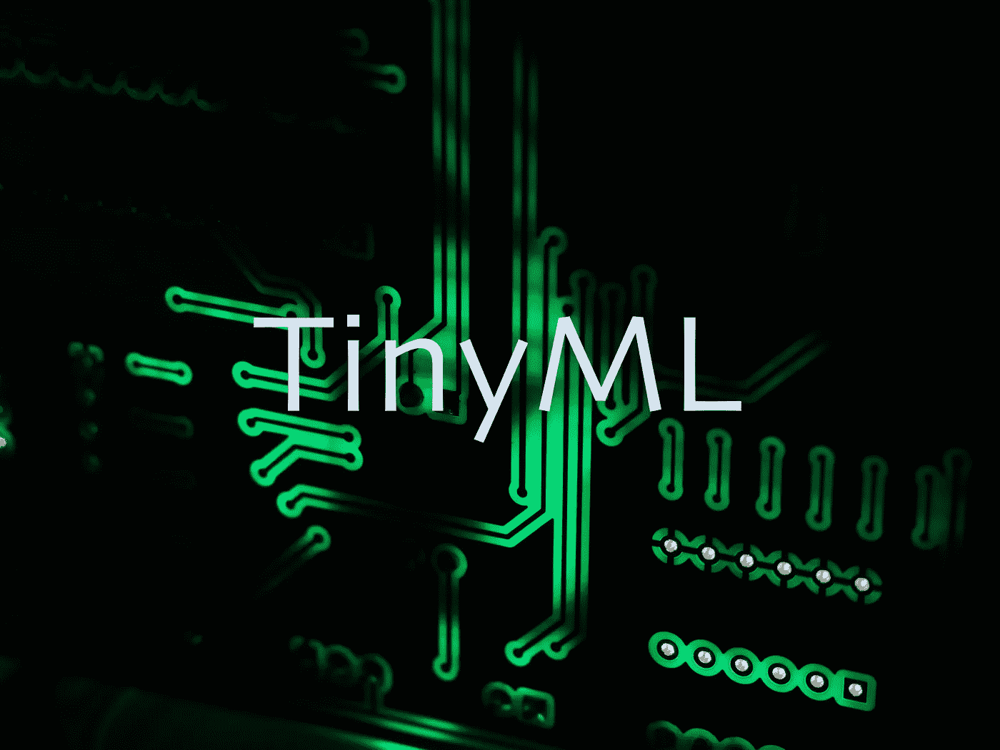

# TinyML(微型机器学习)改变了边缘计算

> 原文：<https://pub.towardsai.net/tinyml-tiny-machine-learning-transforms-edge-computing-f38cfce66694?source=collection_archive---------1----------------------->

## [机器学习](https://towardsai.net/p/category/machine-learning)

## 使用 TinyML 可以改善网络延迟、带宽、数据安全性和隐私性

[毗湿奴莫哈南](https://unsplash.com/@vishnumaiea?utm_source=unsplash&utm_medium=referral&utm_content=creditCopyText)在 [Unsplash](https://unsplash.com/s/photos/printed-circuit-board?utm_source=unsplash&utm_medium=referral&utm_content=creditCopyText) 上的照片(已修改)

通常，您需要高计算能力来部署和运行机器学习模型。GPU(图形处理单元)旨在执行浮点运算，而不像 CPU 那样完成更多样化的任务。GPU 有助于实现机器学习算法，因为它们能够执行复杂的数学计算。

微控制器不包含足够的资源来运行典型的机器学习算法。微控制器的计算能力远低于 GPU，这就是为什么标准的 ML 算法在这种资源受限的硬件上不可执行的原因。**挑战不仅在于计算能力，还在于资源，如功耗、延迟、可用的内部或外部内存容量以及连接性都是重要的参数。**特别是移动设备，应该体积小，功耗低，同时具有高计算能力。

我们需要将模型做得更小，以便在嵌入式系统(微控制器或微处理器)上部署机器学习模型。ML 模型的压缩必须非常小心，以免导致模型操作精度的显著降低。 **TinyML 的目标是让 AI 更快、更小、更节能。**

# 运行在边缘设备上以提高性能的 ML 模型

终端用户设备与边缘设备的通信比与云的通信延迟更低，速度更快。从终端用户设备(如智能手机或其他物联网设备)的角度来看，在边缘设备而不是云上部署机器学习模型可以提高运行模型的性能。

# 运行在边缘设备上以增加带宽的 ML 模型

将计算从云转移到边缘设备有助于优化网络。如果您的模型在边缘设备上运行，则不应通过互联网发送任何数据，因此直接连接到边缘设备时将有更高的带宽可用。

# 运行在边缘设备上以提高安全性的 ML 模型

安全性是在边缘设备上运行机器学习模型的另一个好处。因为您的数据不会离开组织或本地网络。越来越多的物理访问给网络攻击者带来了更多的威胁。数据隐私是另一个改进的方面，它将信息存储在本地，而不是为最终用户通过互联网与云通信。

# 边缘设备上的绿色计算

数字化正在全球范围内蔓延，一个可持续发展的世界需要在任何设备上消耗更少的资源，包括边缘设备。必须降低每个单独应用的能耗，以完全避免功耗爆炸。绿色物联网正在发展，以减少碳足迹。物联网设备应该节能，同时还运行机器学习模型。资源受限的设备可以配备更小的电池或相同的电池来工作更长时间。

# 模型修剪

修剪是一种模型压缩技术，可使模型适应设备上的可用资源。计算能力、内存和功耗是需要考虑的最重要的方面。另一方面，目标是避免在压缩过程中损失模型的准确性。**哪些权重或激活参数对结果的贡献较低，应在不改变模型架构的情况下识别并移除，以提高模型的推理速度，同时使用较少的存储器资源。**

# 量化作为一种压缩方法

在训练模型之后，可以通过应用量化技术来实现资源优化。**训练后量化技术通过将权重和/或激活浮点改变为整数类型来降低模型参数的精度，从而减小模型大小。**训练后量化对模型精度影响较小。

**动态和静态量化**

动态和静态量化是训练后量化的两种类型。用于舍入值的动态量化中的比例因子在推断期间动态确定。在静态量化中，在推断之前确定比例因子。所以静态量化比动态量化快。

**QAT(量化感知训练)**

量化感知训练是另一种类型的量化，它将量化作为训练过程的一部分。QAT 在训练期间产生假量化。在 QAT 完成之后，任何浮点权重和/或激活被转换成基于存储在伪量化模块中的值的整数值。**与其他两种训练后量化方法相比，QAT 具有更低的精度下降。**

# 作为修剪技术的彩票假设

根据麻省理工学院研究人员的说法，有一种方法可以训练一个神经网络，使一个过小版本的神经网络具有与其过大版本相同的性能。**这种认识为更小的新应用打开了新的大门，这些应用可以在资源有限的设备上运行。**

在网络训练期间，初始化过程通常是随机分配权重，并不总是导致收敛。微小的网络在训练过程中更有可能不收敛。正因为如此，我们通常从更广泛的网络开始，在训练之后，很少的连接会显著影响输出的准确性。

**彩票假说强调适当的初始配置以加速训练过程并找到中奖的彩票或配置。**有了这个概念，不同的初始配置为各种应用提供了最佳性能，这些配置在未来可以作为开源数据库提供给人工智能开发者。

# 微型机器学习的可用框架

**TensoFlowLite** 是一个广泛使用的开源深度学习框架，支持设备上的机器学习，由 Google 于 2017 年发布。 **TFLite 通过两种技术执行模型优化，即权重修剪和量化。**通过 TensorFlowLite 可以实现不同级别的量化，例如从浮点-32 到整数或浮点-16 的权重，以减少模型延迟和内存大小。 **TensorFlowLite Micro 是 TensorFlowLite 的扩展，支持在微控制器上执行千字节大小的深度学习模型。**

**PyTorch Mobile** 提供支持机器学习模型整个生命周期的运行时环境，从培训到部署到移动设备。脸书在 2019 年发布了 PyTorch Mobile，用于向 iOS 和 Android 设备提供模型。如上所述， **PyTorch 提供了三种量化方法:静态、动态和量化感知训练。**

**嵌入式学习库(ELL):** 微软部署 ELL 支持 Raspberry Pi、Adriano 和 micro:bit，在资源受限的平台上提供机器学习模型。ELL 是一个压缩 ML 模型的开源嵌入式框架。

# 展望和总结

TinyML 将通过让小型设备利用人工智能来彻底改变许多行业，如制造、医疗保健、物联网和汽车。了解模型中的哪些参数对模型的准确性有更显著的影响是模型修剪的关键因素。

TinyML 旨在通过正确表示模型参数(如权重和激活)来减少延迟、功耗和内存占用。为了得到一个更小的模型，我们需要从训练阶段的最开始就开始优化。

 [## 通过我的推荐链接加入媒体

### 作为一个媒体会员，你的会员费的一部分会给你阅读的作家，你可以完全接触到每一个故事…

medium.com](https://medium.com/@bhbenam/membership)