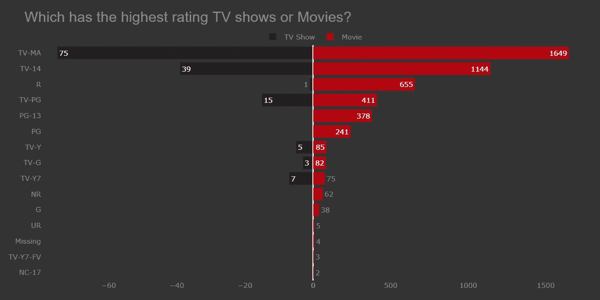
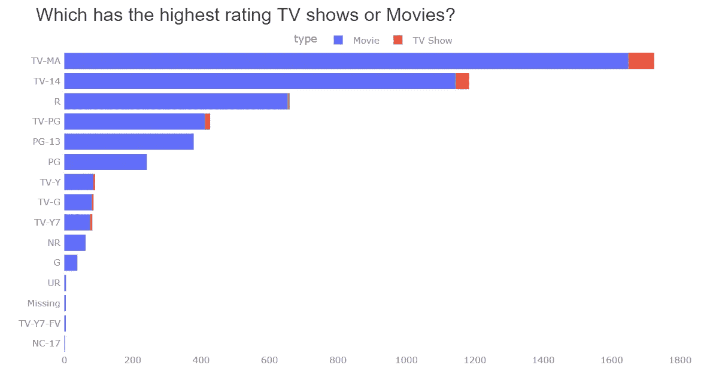
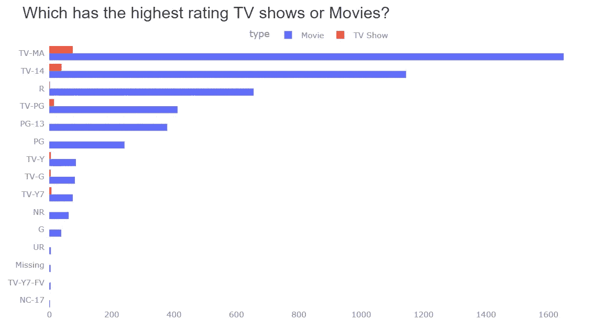
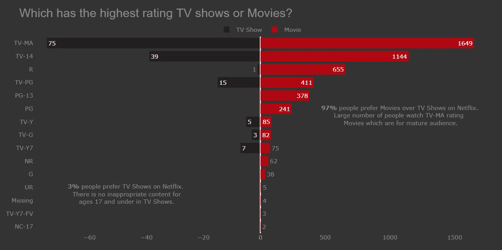
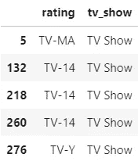
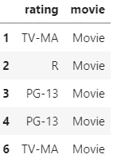
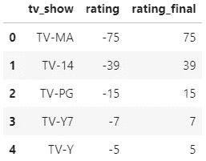
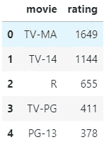

# Plotly 条形图的提示和技巧

> 原文：<https://pub.towardsai.net/tips-and-tricks-for-plotly-bar-chart-71261391c57b?source=collection_archive---------0----------------------->

## [数据可视化](https://towardsai.net/p/category/data-visualization)

一步一步的条形图和可视化指南。让您的工作变得简单的提示和技巧。



Plotly 条形图

你从来不知道你需要 Plotly！Plotly 就像视觉化的巧克力，你永远吃不够。最好的图书馆有最好的用户交互图表。

这里我要用 Plotly 来谈谈不同类型的条形图。数据取自 [Kaggle](https://www.kaggle.com/shivamb/netflix-shows) ，整个笔记本可从[这里](https://www.kaggle.com/kashishrastogi/guide-for-plotly-for-beginners)获得。

访问此[链接](https://github.com/Kashish-Rastogi/Blogs/blob/main/Tips%20and%20tricks%20for%20Plotly%20Bar%20Chart.ipynb)下载并使用数据和图表。

制作图表背后的想法。

你显示数据的方式比你使用的任何图表都更重要，但是正确的图表也很重要。

我们开始吧！

## 数据

制作图表的想法是为了展示哪个程序；电视节目或电影在网飞的收视率最高。


制作图表的数据

## 第一个情节

绘制了一个堆积条形图来比较电视节目和电影。这个图表告诉我们网飞的观众更喜欢看电影而不是电视节目。最高评级是给有电视马标签的电影和电视节目，这告诉我们网飞上的大部分内容是给成年观众的，而不是给 17 岁及以下的人。

**代码:**

```
fig = px.histogram(df, y='rating', color='type')
fig.update_yaxes(showgrid=False, categoryorder='total ascending', 
                 ticksuffix=' ', showline=False)
fig.show()
```



堆积条形图-绘图

我对堆叠条形图相当满意，但在图表中查找电视节目并不容易。有时电视节目的数量如此之少，以至于即使电视节目值在我第一眼看到图表时就出现在图表中，我也无法看到它。

别担心，我们也有另一个选择。

## 组条形图

**代码:**

```
fig = px.histogram(df, y='rating', color='type', barmode='group')
fig.update_yaxes(showgrid=False, categoryorder='total ascending', 
                 ticksuffix=' ', showline=False)
fig.show()
```



组条形图— Plotly

现在我可以清楚地看到和比较电视节目和电影的收视率。它现在看起来很优雅，但在电视节目中，“R”级的价值很小，“PG-13”，“PG”等没有任何价值。观众可能看不到这些信息，因为它们的价值很小。你认为还有比这更合适的图表吗？让我们找出答案。

## 双向条形图



双向条形图— Plotly

这是迄今为止最好的图表，很容易比较电视节目和电影的收视率。

## 代码:

```
# making a copy of df
dff = df.copy()#1\. making a df one for tv show with rating
df_tv_show = dff[dff['type']=='TV Show'][['rating', 'type']].rename(columns={'type':'tv_show'})# making a df for movie with rating
df_movie = dff[dff['type']=='Movie'][['rating', 'type']].rename(columns={'type':'movie'})
```

为每个有收视率的电视节目和电影制作数据框。

选择带有分级的**类型=电视节目**的数据，并将该列重命名为“tv_show”。df_tv_show 看起来像这样



df_tv_show 数据帧

选择带有评级的**类型=电影**的数据，并将该列重命名为“电影”。df_movie 看起来像这样



df_movie 的数据帧

现在让我们找出 df_tv_show 和 df_movie 中 rating 的值计数。

```
# 2.
df_tv_show = df_tv_show.rating.value_counts()
df_tv_show = pd.DataFrame(df_tv_show).reset_index().rename(columns={'index':'tv_show'})
df_tv_show['rating_final'] = df_tv_show['rating'] 
# making rating column value negative
df_tv_show['rating'] *= -1df_movie = df_movie.rating.value_counts()
df_movie = pd.DataFrame(df_movie).reset_index().rename(columns={'index':'movie'})
```

找出分级的值计数后，将列重命名为 tv_show。我们希望建立一个双向条形图，因此其中一个*‘类型’*必须设置负 x 轴上的评级值。让我们创建一个新的列 rating_final，其中用 rating 的原始值乘以(-1)。

df_tv_show 的数据是这样的。



找出分级的值计数后，将列重命名为电影。df_movie 的数据是这样的。



所有的预处理都完成了。

让我们制作双向条形图

**代号:**

```
fig = make_subplots(rows=1, cols=2, specs=[[{}, {}]], shared_yaxes=True, horizontal_spacing=0)# bar plot for tv shows
fig.append_trace(go.Bar(x=df_tv_show.rating, y=df_tv_show.tv_show,
                        orientation='h', showlegend=True, 
                        text=df_tv_show.rating_final, 
                        name='TV Show',
                        marker_color='#221f1f'), 1, 1)# bar plot for movies
fig.append_trace(go.Bar(x=df_movie.rating, y=df_movie.movie, 
                        orientation='h', showlegend=True,
                        text=df_movie.rating,
                        name='Movie', marker_color='#b20710'), 1, 2)
```

制作 2 个柱状图的支线剧情，一个柱状图有 df_tv_show，另一个有 df_movie。

**参数:**

*   **shared_yaxis= True:** 做双向条形图；条形图需要共享 y 轴
*   **horizontal_spacing=0:** 两个条形图之间的间距应为 0。如果您希望两个条形图之间有间隔，请在此参数中指定值。
*   **方向:**我们可以看到条形图有两种形式，一种是水平的，另一种是垂直的
*   **text:** 我们在条上看到的值与“text”参数一起显示。
*   **名称:**指定图例(电影、电视剧)的名称
*   **marker_color:** 您可以为条形指定任何想要的颜色。

关于参数的更多细节，请看这个博客。

这些是使条形图看起来更有吸引力的附加参数。

```
fig.update_xaxes(showgrid=False)
fig.update_yaxes(showgrid=False, categoryorder='total ascending', 
                 ticksuffix=' ', showline=False)fig.update_traces(hovertemplate=None)fig.update_layout(title='Which has the highest rating TV shows or Movies?',
                  margin=dict(t=80, b=0, l=70, r=40),
                  hovermode="y unified", 
                  xaxis_title=' ', yaxis_title=" ",
                  plot_bgcolor='#333', paper_bgcolor='#333',
                  title_font=dict(size=25, color='#8a8d93',
                                  family="Lato, sans-serif"),
                  font=dict(color='#8a8d93'),
                  legend=dict(orientation="h", yanchor="bottom",
                              y=1, xanchor="center", x=0.5),
                  hoverlabel=dict(bgcolor="black", font_size=13, 
                                  font_family="Lato, sans-serif"))fig.add_annotation(dict(x=0.81, y=0.6, ax=0, ay=0,
                    xref = "paper", yref = "paper",
                    text= "<b>97%</b> people prefer Movies over TV Shows on Netflix.<br> Large number of people watch TV-MA rating  <br> Movies which are for mature audience."
                  ))fig.add_annotation(dict(x=0.2, y=0.2, ax=0, ay=0,
                    xref = "paper", yref = "paper",
                    text= "<b>3%</b> people prefer TV Shows on Netflix.<br> There is no inappropriate content for<br> ages 17 and under in TV Shows."
                  ))
```

# 制作图表的步骤:

## 更改图表中条形的颜色。

*   选择合适的颜色，如网飞标志中的红色和黑色。你可以选择任何你想要的颜色，但是当你有需要比较的图表时，比如上面的图表，你可以选择对比色。

## 设置图表的背景颜色。

*   设置背景和条形颜色应该总是不同的，就像在这种情况下，电视节目的条形颜色是较暗的黑色，而背景是较浅的黑色。我们可以很容易区分酒吧和背景。

## 给图表加上适当的标题。

*   大多数时候，人们会使用一个非常简单的标题，比如“**类型与评级”**这个标题没有错，但是拥有一个自动告诉你图表的**标题**是非常关键的一步。
*   我们这里用的标题是**‘网飞收视率最高的电视节目或电影是哪部？’这个标题自动告诉我们，下面的图表将是电视节目和电影之间的收视率比较，此外，它还指出，我们正在寻找的数据来自网飞。**

## 向栏中添加文本

*   什么时候你应该把文本添加到工具条上，这取决于使用情况。
*   当我们比较电视节目和电影的收视率时，让我们举一个上面图表中的例子。在电视节目中，“R”级确实有价值，而“PG-13”、“PG”等没有任何价值。观众可能看不到这个信息，因为它的价值很小，这就是为什么在条上设置文本很重要。
*   此外，很容易比较电视节目和电影与收视率的并排栏。

## 向图表添加注释

*   在这里，我给出的信息是，97%的观众更喜欢电影而不是电视剧。展示更多与图表相关的信息是展示图表的最佳方式。

## 为条形图、标题和批注上的文本设置不同的颜色。

*   你应该始终遵循这条规则:
*   标题:标题的字体应该总是大一些
*   **条上的文本:**条上的文本应该总是比图表的主标题小。
*   通过使用这个规则，你制作的图表会看起来很好，所以总是遵循这个关于标题、注释和条上文本的规则。

如果你觉得这篇文章有用，请喜欢它。

## 其他资源:

酒吧赛车图表与 Plotly 给了一个看[在这里](https://www.analyticsvidhya.com/blog/2021/07/construct-various-types-of-bar-race-charts-with-plotly/)

您可以通过以下社交媒体平台联系我。

## [LinkedIn](https://www.linkedin.com/in/kashish-rastogi-3a8b4119a)|[ka ggle](https://www.kaggle.com/kashishrastogi)|[Tableau](https://public.tableau.com/app/profile/kashish.rastogi)|[Medium](https://kashishrastogi2000.medium.com/)|[Analytics vid hya](https://www.analyticsvidhya.com/blog/author/kashish1/)