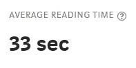

# 有效撰写技术博客的技巧

> 原文：<https://pub.towardsai.net/tips-for-effective-technical-blogging-b3d955d452d?source=collection_archive---------2----------------------->

## [技术](https://towardsai.net/p/category/technology)

## 我从 8 个月的持续写作中学到了什么

由[阿恩尔·哈萨诺维奇](https://unsplash.com/@arnelhasanovic?utm_source=medium&utm_medium=referral)在 [Unsplash](https://unsplash.com/?utm_source=medium&utm_medium=referral) 上拍摄的照片

今年，作为一名数据科学家、博客作者/作家(无论你怎么称呼它)，甚至作为一个人，我所取得的进步远远超出了我的预期，考虑到我们周围发生的混乱，我觉得这似乎很荒谬。当然，我认为今年帮助我进步的因素有很多，但今天我专注于博客，特别是技术博客。

我很早就知道写博客是传播思想的有效策略，因为在我决定成为一名键盘战士之前，我已经阅读了很多方法。事实上，开始写博客让我开阔了眼界，看到了写作给我带来的更多好处，比如组织我的想法，改善沟通，让我的名字出现在那里。

 [## 你应该拥有数据科学博客的 3 个理由

### 我认为写博客对你有利的原因

towardsdatascience.com](https://towardsdatascience.com/3-reasons-why-you-should-have-a-data-science-blog-cdc1d4b0e8f4) 

被人工智能的世界迷住了，不可避免的是，我将不得不写一些技术文章来更好地解释我的想法和我正在学习的东西。

自从发表我的第一篇帖子 [*混淆矩阵【未混淆*](https://towardsdatascience.com/confusion-matrix-un-confused-1ba98dee0d7f) 以来，已经积累了 *4.6k* 的浏览量*2020 年*2 月 16 日，*到目前为止，我已经写了 36 篇帖子(这是第 37 篇)，并被授予了**媒体人工智能类顶级作家**的地位。虽然远不是顶尖的技术作家，但在我写作的短暂时间里，我已经能够找到一些策略，帮助我有效地写下我的想法，并把我放在中等收入者的前 10%。*

说到这里，我想分享一下我所学到的东西。为了回报对我如此好并在今年对我的个人成长做出巨大贡献的人们…

*附:非常感谢大家*

## 知道你在和谁说话吗

我看着我妈妈对我一岁的侄女说——“米拉，到奶奶这儿来！你想要一个玩具吗？然后你必须吃你的早餐。来！”。现在，我妈妈 51 岁了，我肯定她在工作时不会那样说话，因为她还有工作。然而，如果她翻过剧本，开始对我的侄女说话，就好像她是一个工作同事一样，那就有点奇怪了——“*嘿，Mila，在 zoom 电话会议之后，我们要去喝虚拟饮料。你来吗？*”。

关键是，作为人类，我们自然会根据我们在和谁说话来调整我们的习惯、行为、音调等，然而当我们写作时，界限变得有点模糊，这并不自然，因为我们不能直接看到我们在和谁交流。

关键是要想象你在和谁打交道，并考虑他们的理解程度。

> *一个好的指导是写一篇帖子给一个更早版本的自己。*

我目前的软件运行在 Kurtis 2.0 上，但当我写作时，我经常想到 Kurtis 1.0 及其早期版本，因为这些版本不会有最新的软件更新——在我看来，我正在给 Kurtis 1.0 进行版本更新。

## 在读者的脑海中画一幅画

你看到我上面做的了吗？我举了一个例子，说明我们的行为和声音是如何随着我们的谈话对象而变化的。我举了我妈妈对一个婴儿(我 1 岁的侄女)说话的例子，这很容易理解——事实上，你可能甚至在脑海中描绘了整个事件。这个例子正好说明了我的观点。

当学习一个技术概念时，我们通常有一种方法来描绘出我们所理解的我们头脑中正在发生的事情。通常，像我上面做的那样使用插图会有所帮助，但有时当我们使用类比时，图片会更好地击中要害。例如，我记得当我第一次开始学习神经网络时，总会有一张真实神经元的图片。随着我对深度学习了解的越来越多，我意识到我们大脑中的神经元和人工神经网络的功能并不完全相同，但这种类比一直困扰着我。

**来源** : [深度学习——简单来说](https://mc.ai/deep-learning%E2%80%8A-%E2%80%8Ain-simple-words/)

## 链接到更多信息

在一个比以往任何时候都更需要我们关注的世界里，简洁是写作的关键。每篇博客文章应该只写你正在写的东西，任何其他信息都应该链接到另一篇文章中——你可能已经注意到我在这篇文章的开头就这样做了。

是的，当你写了更多的帖子时，这更容易，因为你可以链接到你自己的帖子，然而，我偶尔会发现自己链接到其他人的帖子(认可高质量的工作绝对没有错)。

> 保持信息的大小，将大的主题分解成小的帖子。

我相信机器学习领域的王者是杰森·布朗利，也就是机器学习大师。老实说，我不认为有一篇帖子没有链接到他正在讨论的其他主题——如果你找到了一篇，请在回复中留下该帖子的链接。

> **注意**:另一个很好的例子是维基百科。

## 易于阅读的格式

让我们面对现实吧。大多数人并不真正阅读博客，他们只是浏览一下！当我查看我的帖子的阅读时间统计时，这一点得到了证实。我的上一篇文章， [*从头开始的算法:K-最近邻*](https://towardsdatascience.com/algorithms-from-scratch-k-nearest-neighbors-fe19b431a57) *，*是一个 6 分钟读按介质。我们来看看用户在这个故事上的平均阅读时间…

我上一篇中型文章的平均阅读时间。

没错，就 **33 秒**！不要抱怨，让你正在琢磨的观点在视觉上突出出来是一件非常聪明的事情，尤其是对于技术或复杂的话题。

我要说的是，你的**标题、子标题和子标题**本身应该讲述一个足够引人注目的故事，但不要让读者觉得他们不需要阅读下面的内容。一个很好的例子就是我的最后一篇帖子…

 [## 从头开始的算法:K-最近邻

### 从头开始详述和构建 K-NN 算法

towardsdatascience.com](https://towardsdatascience.com/algorithms-from-scratch-k-nearest-neighbors-fe19b431a57) 

因此，我不是简单地自吹自擂，这里有一个详细的职位，正是我的意思…

 [## 如何为读者和谷歌|地平线峰博客写标题

### 构思一个具有煽动性的标题是写作 101。这是所有职业作家(或任何人谁收到任何…

www.horizonpeakconsulting.com](https://www.horizonpeakconsulting.com/how-to-write-headlines-for-readers-google/) 

要实现美观的格式，您还可以做以下事情:

*   使用**项目符号和数字**可有效给出个别要点和实际的逐步说明
*   **缩进章节**突出显示重要章节。
*   **留白**让读者的眼睛得到休息——在一些数学探索或技术作品的任何其他复杂部分之后非常有效
*   **彩色&有趣的图片**将注意力吸引到重要的部分
*   简短的段落让你的作品易于阅读

## 练习，练习，再练习…

如果你想写一篇文章然后像病毒一样传播，写博客可能不适合你。我不是说成为一个局外人是不可能的，有很多这样的例子，但它被称为局外人是有原因的。发展写一篇有效的技术文章的技能，就像其他技能一样，是通过实践而成熟的。

作为一名博客作者，我目前的旅程中最大的教训之一是，你永远不知道什么时候或什么内容会起飞，它经常会给你一个惊喜。

有时候，我会额外花一两个小时来微调我的帖子，好像我在试图找到最佳的超参数来减少我的帖子的泛化错误——这甚至没有意义。我迄今为止阅读量最大的帖子是科恩的 Kappa T1，我不骗你，它是在不到一个小时内写的。

因此，即使你的第一个或第二个帖子没有达到你的期望，继续实施新的技术来找到你的 mojo，继续把内容放在那里，并不断改进。

**全世界都想听你说些什么！**

让我们在 LinkedIn 上继续这个话题…

 [## Kurtis Pykes -人工智能作家-走向数据科学| LinkedIn

### 在世界上最大的职业社区 LinkedIn 上查看 Kurtis Pykes 的个人资料。Kurtis 有一个工作列在他们的…

www.linkedin.com](https://www.linkedin.com/in/kurtispykes/)