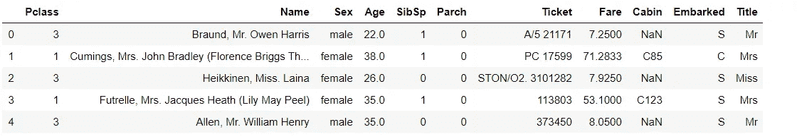
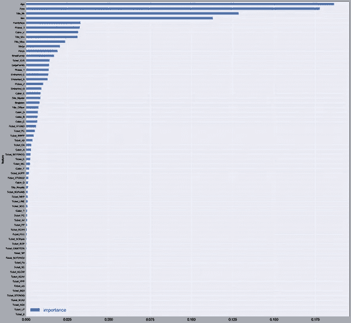

# 泰坦尼克号挑战—灾难恢复的机器学习—第二部分

> 原文：<https://pub.towardsai.net/titanic-challenge-machine-learning-for-disaster-recovery-part-2-22561e8137f4?source=collection_archive---------0----------------------->


来源: [Pxfuel](https://www.pxfuel.com/)

## 第 2 部分—预测模型构建

代码位置:[https://github.com/BindhuVinodh/Titanic 预测建模](https://github.com/BindhuVinodh/Titanic---Predictive-Model-Building)

# II —特征工程

在前一部分中，我们研究了数据，发现了一些有趣的相关性。

在这一部分中，我们将看到如何处理和转换这些变量，使数据变得可由机器学习算法管理。

我们还将创建或“设计”在构建模型时有用的附加功能。

我们将看到如何处理文本变量，如乘客姓名，并将这些信息集成到我们的模型中。

为了更加清晰，我们将把代码分解成独立的函数。

# 加载数据

当开始机器学习问题时，一个技巧是将训练集一起附加到测试集。

我们将使用训练集设计新功能，以防止信息泄漏。然后我们将这些变量添加到测试集中。

让我们加载训练集和测试集，并将它们附加在一起。

```
def get_combined_data():
    # reading train data
    train = pd.read_csv('./data/train.csv')

    # reading test data
    test = pd.read_csv('./data/test.csv')

    # extracting and then removing the targets from the training data 
    targets = train.Survived
    train.drop(['Survived'], 1, inplace=True)

    # merging train data and test data for future feature engineering
    # we'll also remove the PassengerID since this is not an informative feature
    combined = train.append(test)
    combined.reset_index(inplace=True)
    combined.drop(['index', 'PassengerId'], inplace=True, axis=1)

    return combined

combined = get_combined_data()
```

让我们来看看形状:

```
print(combined.shape)
# (1309, 10)
```

组合了训练集和测试集。

您可能会注意到，总行数(1309)是训练集和测试集中行数的精确总和。

```
combined.head()
```



提取乘客姓名

当查看乘客姓名时，人们可能会想知道如何处理它们以提取有用的信息。

如果你仔细观察这些第一个例子:

*   **布劳恩先生**欧文·哈里斯
*   **黑金小姐。**莱娜
*   Oliva y Ocana，Dona。费米纳
*   彼得，主人。迈克尔·J

你会注意到每个名字里面都有一个标题！这可能是一个简单的失误。或者夫人，但有时也可以是更高级的称呼，如主人、先生或夫人。在这种情况下，我们可以通过简单地解析姓名、提取头衔并将其转换为二进制变量来引入关于社会地位的附加信息。

让我们看看如何在下面的函数中做到这一点。

让我们先来看看火车系列中有哪些不同的标题

`print(titles)
# set(['Sir', 'Major', 'the Countess', 'Don', 'Mlle', 'Capt', 'Dr', 'Lady', 'Rev', 'Mrs', 'Jonkheer', 'Master', 'Ms', 'Mr', 'Mme', 'Miss', 'Col'])`

```
Title_Dictionary = {
    "Capt": "Officer",
    "Col": "Officer",
    "Major": "Officer",
    "Jonkheer": "Royalty",
    "Don": "Royalty",
    "Sir" : "Royalty",
    "Dr": "Officer",
    "Rev": "Officer",
    "the Countess":"Royalty",
    "Mme": "Mrs",
    "Mlle": "Miss",
    "Ms": "Mrs",
    "Mr" : "Mr",
    "Mrs" : "Mrs",
    "Miss" : "Miss",
    "Master" : "Master",
    "Lady" : "Royalty"
}def get_titles():
    # we extract the title from each name
    combined['Title'] = combined['Name'].map(lambda name:name.split(',')[1].split('.')[0].strip())

    # a map of more aggregated title
    # we map each title
    combined['Title'] = combined.Title.map(Title_Dictionary)
    status('Title')
    return combined
```

# 这个函数解析名字并提取标题。然后，它将标题映射到标题的类别。我们选择了:

*   警官
*   版税
*   先生
*   夫人
*   小姐ˌ女士
*   掌握

让我们运行它！

```
combined = get_titles()
combined.head()
```

让我们检查一下标题是否填对了。

```
combined[combined['Title'].isnull()]
```

第 1305 行中确实有一个 NaN 值。其实对应的名字是 Oliva y Ocana， **Dona** 。费尔米纳。

在训练数据集中没有遇到此标题。

完美。现在我们有了一个名为 **Title** 的额外列，其中包含了信息。

# 处理年龄

我们在第一部分已经看到，年龄变量缺少 177 个值。这是一个很大的数字(约占数据集的 13%)。简单地用平均年龄或中值年龄来代替它们可能不是最佳解决方案，因为年龄可能因乘客的组和类别而不同。

为了理解原因，让我们按照性别、头衔和乘客级别对数据集进行分组，并计算每个子集的平均年龄。

为了避免测试集中的数据泄漏，我们使用训练集来填充训练中缺失的年龄，并且使用从训练集计算的值来填充测试集中的年龄。

列车组中缺少的年龄数

```
print(combined.iloc[:891].Age.isnull().sum())
# 177
```

测试集中缺失年龄的数量

```
print(combined.iloc[891:].Age.isnull().sum())
# 86grouped_train = combined.iloc[:891].groupby(['Sex','Pclass','Title'])
grouped_median_train = grouped_train.median()
grouped_median_train = grouped_median_train.reset_index()[['Sex', 'Pclass', 'Title', 'Age']]grouped_median_train.head()
```

该数据框将帮助我们根据不同的标准估算缺失的年龄值。

查看“年龄中位数”栏，看看这个值如何根据性别、阶级和职位的不同而有所不同。

例如:

*   如果乘客是女性，从 1 级乘客到皇室成员，平均年龄为 40.5 岁。
*   如果乘客是男性，来自 Pclass 3，具有 Mr 头衔，则中值年龄为 26 岁。

让我们创建一个函数，根据这些不同的属性来填充缺少的年龄是**组合**。

```
def fill_age(row):
    condition = (
        (grouped_median_train['Sex'] == row['Sex']) & 
        (grouped_median_train['Title'] == row['Title']) & 
        (grouped_median_train['Pclass'] == row['Pclass'])
    ) 
    return grouped_median_train[condition]['Age'].values[0]

def process_age():
    global combined
    # a function that fills the missing values of the Age variable
    combined['Age'] = combined.apply(lambda row: fill_age(row) if np.isnan(row['Age']) else row['Age'], axis=1)
    status('age')
    return combined

combined = process_age()
```

完美。缺失的年代已经被取代。

但是，我们注意到票价中有一个缺失值，登机中有两个缺失值，客舱中有许多缺失值。我们稍后将回到这些变量。

让我们现在处理这些名字。

```
def process_names():
    global combined
    # we clean the Name variable
    combined.drop('Name', axis=1, inplace=True)

    # encoding in dummy variable
    titles_dummies = pd.get_dummies(combined['Title'], prefix='Title')
    combined = pd.concat([combined, titles_dummies], axis=1)

    # removing the title variable
    combined.drop('Title', axis=1, inplace=True)

    status('names')
    return combined
```

这个函数删除了 Name 列，因为我们创建了一个 Title 列，所以不再使用它。

然后，我们使用虚拟编码对标题值进行编码。

```
combined = process_names()

combined.head()
```

如你所见:

*   不再有名称功能。
*   出现了新的变量(Title_X)。这些特征是二元的。
*   例如，如果 Title_Mr = 1，则对应的标题是 Mr。

# 加工费

让我们用列车组上计算的平均票价来估算缺失的票价值

```
def process_fares():
    global combined
    # there's one missing fare value - replacing it with the mean.
    combined.Fare.fillna(combined.iloc[:891].Fare.mean(), inplace=True)
    status('fare')
    return combined
```

该函数简单地用平均值替换一个缺失的票价值。

```
combined = process_fares()
```

# 加工已开始

```
def process_embarked():
    global combined
    # two missing embarked values - filling them with the most frequent one in the train  set(S)
    combined.Embarked.fillna('S', inplace=True)
    # dummy encoding 
    embarked_dummies = pd.get_dummies(combined['Embarked'], prefix='Embarked')
    combined = pd.concat([combined, embarked_dummies], axis=1)
    combined.drop('Embarked', axis=1, inplace=True)
    status('embarked')
    return combined
```

该功能用最频繁的装载值替换装载的两个缺失值。

```
combined = process_embarked()combined.head()
```

# 加工舱

```
train_cabin, test_cabin = set(), set()for c in combined.iloc[:891]['Cabin']:
    try:
        train_cabin.add(c[0])
    except:
        train_cabin.add('U')

for c in combined.iloc[891:]['Cabin']:
    try:
        test_cabin.add(c[0])
    except:
        test_cabin.add('U')print(train_cabin)
# set(['A', 'C', 'B', 'E', 'D', 'G', 'F', 'U', 'T'])print(test_cabin)
# set(['A', 'C', 'B', 'E', 'D', 'G', 'F', 'U'])
```

我们在测试组中没有任何列车组中不存在的车厢字母。

```
def process_cabin():
    global combined    
    # replacing missing cabins with U (for Uknown)
    combined.Cabin.fillna('U', inplace=True)

    # mapping each Cabin value with the cabin letter
    combined['Cabin'] = combined['Cabin'].map(lambda c: c[0])

    # dummy encoding ...
    cabin_dummies = pd.get_dummies(combined['Cabin'], prefix='Cabin')    
    combined = pd.concat([combined, cabin_dummies], axis=1)

    combined.drop('Cabin', axis=1, inplace=True)
    status('cabin')
    return combined
```

该函数用 U 替换 NaN 值(对于未知的*)。然后，它将每个 Cabin 值映射到第一个字母。然后，它再次使用虚拟编码对客舱值进行编码。*

```
*combined = process_cabin()*
```

*好了，现在没有丢失值了。*

```
*combined.head()*
```

# *加工性*

```
*def process_sex():
    global combined
    # mapping string values to numerical one 
    combined['Sex'] = combined['Sex'].map({'male':1, 'female':0})
    status('Sex')
    return combined*
```

*这个函数将字符串值 male 和 female 分别映射到 1 和 0。*

```
*combined = process_sex()*
```

# *处理 Pclass*

```
*def process_pclass():

    global combined
    # encoding into 3 categories:
    pclass_dummies = pd.get_dummies(combined['Pclass'], prefix="Pclass")

    # adding dummy variable
    combined = pd.concat([combined, pclass_dummies],axis=1)

    # removing "Pclass"
    combined.drop('Pclass',axis=1,inplace=True)

    status('Pclass')
    return combined*
```

*此函数使用虚拟编码对 Pclass (1，2，3)的值进行编码。*

```
*combined = process_pclass()*
```

# *加工票*

*让我们首先来看看我们数据集中不同的票据前缀*

```
*def cleanTicket(ticket):
    ticket = ticket.replace('.', '')
    ticket = ticket.replace('/', '')
    ticket = ticket.split()
    ticket = map(lambda t : t.strip(), ticket)
    ticket = list(filter(lambda t : not t.isdigit(), ticket))
    if len(ticket) > 0:
        return ticket[0]
    else: 
        return 'XXX'

tickets = set()
for t in combined['Ticket']:
    tickets.add(cleanTicket(t))

print(len(tickets))
#37

def process_ticket():

    global combined

    # a function that extracts each prefix of the ticket, returns 'XXX' if no prefix (i.e the ticket is a digit)
    def cleanTicket(ticket):
        ticket = ticket.replace('.','')
        ticket = ticket.replace('/','')
        ticket = ticket.split()
        ticket = map(lambda t : t.strip(), ticket)
        ticket = filter(lambda t : not t.isdigit(), ticket)
        if len(ticket) > 0:
            return ticket[0]
        else: 
            return 'XXX'

    # Extracting dummy variables from tickets:

    combined['Ticket'] = combined['Ticket'].map(cleanTicket)
    tickets_dummies = pd.get_dummies(combined['Ticket'], prefix='Ticket')
    combined = pd.concat([combined, tickets_dummies], axis=1)
    combined.drop('Ticket', inplace=True, axis=1)

    status('Ticket')
    return combined

combined = process_ticket()*
```

# *加工系列*

*这一部分包括根据家庭的大小创建新的变量(顺便说一下，大小是我们创建的另一个变量)。*

*这种新变量的创造是在一个现实的假设下完成的:大家庭聚集在一起，因此他们比独自旅行的人更有可能获救。*

```
*def process_family():

    global combined
    # introducing a new feature : the size of families (including the passenger)
    combined['FamilySize'] = combined['Parch'] + combined['SibSp'] + 1

    # introducing other features based on the family size
    combined['Singleton'] = combined['FamilySize'].map(lambda s: 1 if s == 1 else 0)
    combined['SmallFamily'] = combined['FamilySize'].map(lambda s: 1 if 2 <= s <= 4 else 0)
    combined['LargeFamily'] = combined['FamilySize'].map(lambda s: 1 if 5 <= s else 0)

    status('family')
    return combined*
```

*该功能引入了 4 项新功能:*

*   *FamilySize:包括乘客本人在内的亲属总数。*
*   *西格顿:描述大小为 1 的家族的布尔变量*
*   *SmallFamily:描述 2 <= size <= 4 的家庭的布尔变量*
*   *LargeFamily:描述 5*

```
*combined = process_family()print(combined.shape)
# (1309, 67)*
```

*我们最终总共有 67 个特征。*

```
*combined.head()*
```

# *三——建模*

*在这一部分，我们根据我们创建的特征使用我们对乘客的了解，然后建立一个统计模型。你可以把这个模型想象成一个盒子，它处理任何新乘客的信息，并决定他是否幸存。*

*有各种各样的模型可以使用，从逻辑回归到决策树和更复杂的模型，如随机森林和梯度推进树。*

*我们将使用随机森林。随机森林在纸牌游戏中证明了巨大的效率。*

*回到我们的问题，我们现在必须:*

1.  *断开训练集和测试集中的组合数据集。*
2.  *使用训练集建立预测模型。*
3.  *使用训练集评估模型。*
4.  *使用测试集测试模型，并为提交生成一个输出文件。*

*请记住，我们将不得不重申 2。第三。直到达到可接受的评估分数。*

*让我们从导入有用的库开始。*

```
*from sklearn.pipeline import make_pipeline
from sklearn.ensemble import RandomForestClassifier
from sklearn.ensemble.gradient_boosting import GradientBoostingClassifier
from sklearn.feature_selection import SelectKBest
from sklearn.model_selection import StratifiedKFold
from sklearn.model_selection import GridSearchCV
from sklearn.model_selection import cross_val_score
from sklearn.feature_selection import SelectFromModel
from sklearn.linear_model import LogisticRegression, LogisticRegressionCV*
```

*为了评估我们的模型，我们将使用五重交叉验证，因为它是竞争对手在排行榜中使用的指标。*

*为此，我们将定义一个小的评分函数。*

```
*def compute_score(clf, X, y, scoring='accuracy'):
    xval = cross_val_score(clf, X, y, cv = 5, scoring=scoring)
    return np.mean(xval)*
```

*从组合的数据集中恢复训练集和测试集是一项简单的任务。*

```
*def recover_train_test_target():
    global combined

    targets = pd.read_csv('./data/train.csv', usecols=['Survived'])['Survived'].values
    train = combined.iloc[:891]
    test = combined.iloc[891:]

    return train, test, targets

train, test, targets = recover_train_test_target()*
```

# *特征选择*

*到目前为止，我们已经开发了 30 多个功能。这个数字相当大。*

*当特征工程完成后，我们通常倾向于通过选择“正确的”数量的捕捉本质的特征来降低维度。*

*事实上，功能选择有很多好处:*

*   *它减少了数据间的冗余*
*   *它加快了训练过程*
*   *它减少了过度拟合*

*基于树的估计器可用于计算特征重要性，这又可用于丢弃不相关的特征。*

```
*clf = RandomForestClassifier(n_estimators=50, max_features='sqrt')
clf = clf.fit(train, targets)*
```

*让我们来看看每个特性的重要性。*

```
*features = pd.DataFrame()
features['feature'] = train.columns
features['importance'] = clf.feature_importances_
features.sort_values(by=['importance'], ascending=True, inplace=True)
features.set_index('feature', inplace=True)features.plot(kind='barh', figsize=(25, 25))*
```

**

*你可能注意到了，头衔、先生、年龄、费用和性别都很重要。*

*与 Passenger_Id 还有一个重要的关联。*

*现在，让我们将我们的训练集和测试集转换成一个更紧凑的数据集。*

```
*model = SelectFromModel(clf, prefit=True)
train_reduced = model.transform(train)
print(train_reduced.shape)
# (891L, 14L)test_reduced = model.transform(test)
print(test_reduced.shape)
# (418L, 14L)logreg = LogisticRegression()
logreg_cv = LogisticRegressionCV()
rf = RandomForestClassifier()
gboost = GradientBoostingClassifier()

models = [logreg, logreg_cv, rf, gboost]

for model in models:
    print('Cross-validation of : {0}'.format(model.__class__))
    score = compute_score(clf=model, X=train_reduced, y=targets, scoring='accuracy')
    print('CV score = {0}'.format(score))
    print('****')*
```

*耶！现在我们减少了很多功能。*

*我们会看看我们是否会使用简化版或完整版的列车组。*

# *让我们试试不同的基本型号*

```
*logreg = LogisticRegression()
logreg_cv = LogisticRegressionCV()
rf = RandomForestClassifier()
gboost = GradientBoostingClassifier()

models = [logreg, logreg_cv, rf, gboost]

for model in models:
    print('Cross-validation of : {0}'.format(model.__class__))
    score = compute_score(clf=model, X=train_reduced, y=targets, scoring='accuracy')
    print('CV score = {0}'.format(score))
    print('****')Cross-validation of : <class 'sklearn.linear_model.logistic.LogisticRegression'>
CV score = 0.817071431282
****
Cross-validation of : <class 'sklearn.linear_model.logistic.LogisticRegressionCV'>
CV score = 0.819318764148
****
Cross-validation of : <class 'sklearn.ensemble.forest.RandomForestClassifier'>
CV score = 0.805891969854
****
Cross-validation of : <class 'sklearn.ensemble.gradient_boosting.GradientBoostingClassifier'>
CV score = 0.830560996274
*****
```

# *超参数调谐*

*正如建模部分开始时提到的，我们将使用随机森林模型。它可能不是这个任务的最佳模型，但是我们将展示如何调优。这项工作可以适用于不同的模型。*

*随机森林相当方便。然而，为了获得预测任务的最佳模型，它们确实带有一些要调整的参数。*

*要了解更多关于随机森林的信息，您可以参考此[链接](https://www.analyticsvidhya.com/blog/2015/06/tuning-random-forest-model/):*

*此外，我们将使用全套列车。*

```
*# turn run_gs to True if you want to run the gridsearch again.
run_gs = False

if run_gs:
    parameter_grid = {
                 'max_depth' : [4, 6, 8],
                 'n_estimators': [50, 10],
                 'max_features': ['sqrt', 'auto', 'log2'],
                 'min_samples_split': [2, 3, 10],
                 'min_samples_leaf': [1, 3, 10],
                 'bootstrap': [True, False],
                 }
    forest = RandomForestClassifier()
    cross_validation = StratifiedKFold(n_splits=5)

    grid_search = GridSearchCV(forest,
                               scoring='accuracy',
                               param_grid=parameter_grid,
                               cv=cross_validation,
                               verbose=1
                              )

    grid_search.fit(train, targets)
    model = grid_search
    parameters = grid_search.best_params_

    print('Best score: {}'.format(grid_search.best_score_))
    print('Best parameters: {}'.format(grid_search.best_params_))

else: 
    parameters = {'bootstrap': False, 'min_samples_leaf': 3, 'n_estimators': 50, 
                  'min_samples_split': 10, 'max_features': 'sqrt', 'max_depth': 6}

    model = RandomForestClassifier(**parameters)
    model.fit(train, targets)*
```

*既然模型是通过扫描超参数的几种组合构建的，我们可以生成一个输出文件提交到 Kaggle 上。*

```
*output = model.predict(test).astype(int)
df_output = pd.DataFrame()
aux = pd.read_csv('./data/test.csv')
df_output['PassengerId'] = aux['PassengerId']
df_output['Survived'] = output
df_output[['PassengerId','Survived']].to_csv('./predictions/gridsearch_rf.csv', index=False)*
```

# *四、结论*

*在本文中，我们探索了由 [Kaggle](http://kaggle.com/) 带给我们的一个有趣的数据集。*

*我们经历了数据科学管道的基本砖块:*

*   *数据探索和可视化:形成假设的第一步*
*   *数据清理*
*   *特征工程*
*   *特征选择*
*   *超参数调谐*
*   *提交*
*   *混合*

*关于这个挑战已经写了很多文章，所以很明显还有改进的空间。*

*以下是我对后续步骤的建议:*

*   *在数据中挖掘更多信息，并最终构建新功能。*
*   *尝试不同的模型:逻辑回归，梯度推进树，XGboost，…*
*   *尝试集成学习技术(堆叠)*
*   *运行自动 ML 框架*

*如果你能找到改进我的解决方案的方法，我会非常高兴。这可能会让我更新文章，并肯定给你的信用。所以请随意发表评论。*