# 巨大的挑战——用于灾难恢复的机器学习

> 原文：<https://pub.towardsai.net/titanic-challenge-machine-learning-from-disaster-c184103e58d6?source=collection_archive---------0----------------------->

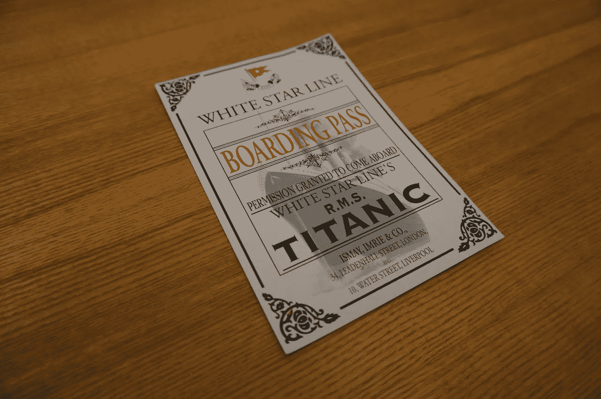

# 第 1 部分—数据可视化

GitHub 回购:[https://github.com/BindhuVinodh/Titanic-Data-Visualization](https://github.com/BindhuVinodh/Titanic-Data-Visualization)

由 Kaggle 主办的[泰坦尼克号挑战赛](https://www.kaggle.com/c/titanic/)是一项比赛，目标是根据一系列描述他的变量，如他的年龄、性别或他在船上的乘客级别，预测给定乘客的生存或死亡。

这篇文章是与你分享我的解决方案的机会。

为了使本教程更“学术”，以便任何人都可以受益，我将首先从探索性数据分析(EDA)开始，然后我将继续进行功能工程，最后介绍我建立的预测模型。

在整个 jupyter 笔记本中，我将在管道的每个层次使用 Python。本教程中涉及的主要库有:

*   **熊猫**用于数据处理和摄取
*   用于数据可视化的 **Matplotlib** 和 **seaborn**
*   **Numpy** 用于多维数组计算
*   **sklearn** 用于机器学习和预测建模

```
data = pd.read_csv('./data/train.csv')
```

有两个数据集可用:一个训练集和一个测试集。我们将使用训练集来构建我们的预测模型，并使用测试集来对其进行评分并生成输出文件。

```
print(data.shape)
#(891, 12)
```

我们有:

*   891 行
*   12 列

熊猫可以让你偷偷看一眼你的数据。

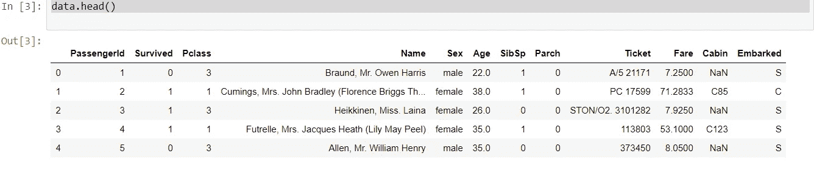

幸存的列是**目标变量**。如果 Survival = 1，乘客幸存，否则他死了。这是我们要预测的变量。

其他变量描述乘客。它们是**功能**。

*   乘客:船上的每个乘客都有身份证
*   乘客舱:乘客舱。它有三个可能的值:1、2、3(一等、二等和三等)
*   乘客的姓名
*   性
*   年龄
*   SibSp:与乘客同行的兄弟姐妹和配偶的数量
*   Parch:与乘客同行的父母和子女人数
*   机票号码
*   票价
*   机舱号
*   登船。这描述了泰坦尼克号上三个可能的区域，人们从那里出发。三个可能的值 S，C，Q

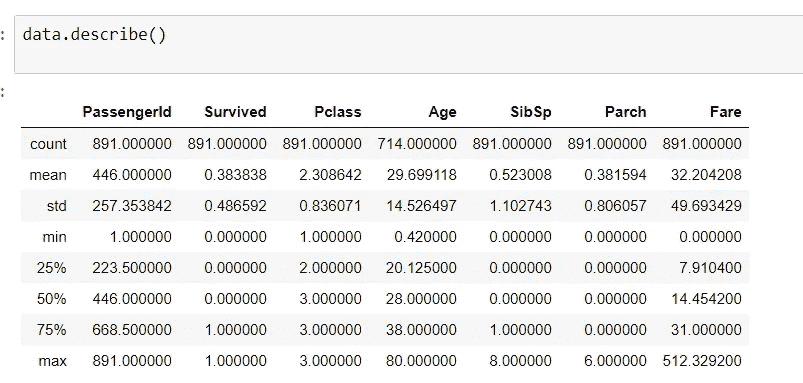

count 变量显示年龄列中缺少 177 个值。

一种解决方案是用中值年龄填充空值。我们也可以用平均年龄来估算，但是中位数对异常值更稳健。

#用年龄的中值填充“年龄”中的空值

数据['年龄'] =数据['年龄']。fillna(数据['年龄']。中位数())

现在让我们制作一些图表。

让我们根据性别来想象生存。

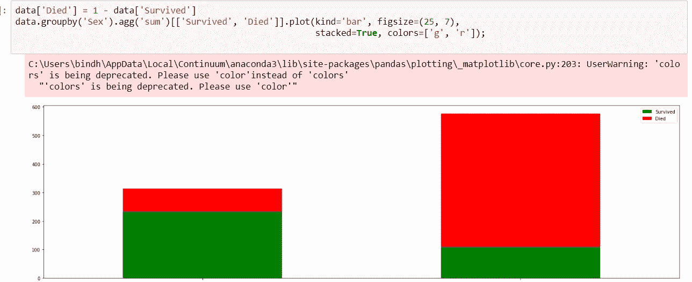

看起来男性乘客更容易屈服。

让我们绘制同样的图形，但用比率代替。

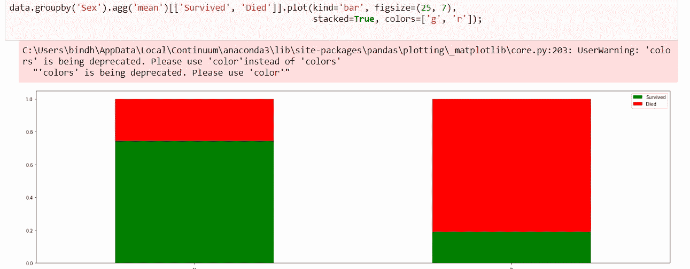

性别变量似乎是一个有区别的特征。女性更有可能活下来。

现在让我们把存活率和年龄变量联系起来。

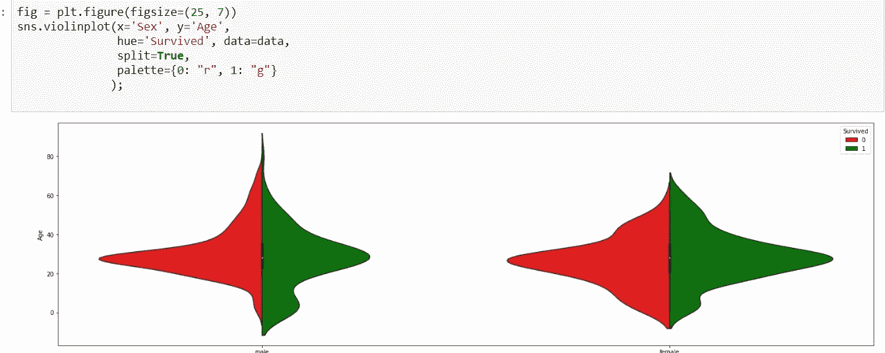

正如我们在上面的图表中看到的，并通过以下内容进行了验证:

*   如较大的女性绿色直方图所示，女性比男性存活时间长

现在，我们看到:

*   年龄决定了男性乘客的生存条件:
*   年轻的雄性倾向于生存
*   大量 20 到 40 岁的乘客屈服了
*   年龄似乎对女性生存没有直接影响

这些小提琴的情节证实了一个古老的行为准则，水手和船长在遇到威胁的情况下会遵循这个准则:“女人和孩子优先！”。

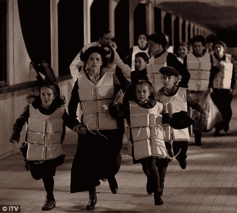

现在让我们把注意力集中在每个乘客的机票上，看看它如何影响生存。

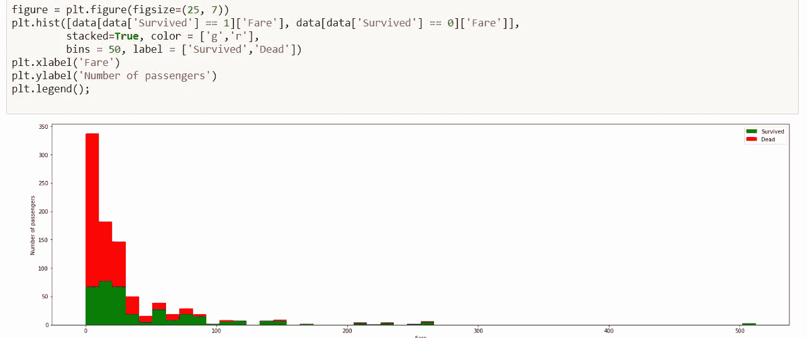

机票票价更便宜的乘客更容易死亡。换句话说，拥有更贵车票的乘客，以及因此更重要的社会地位，似乎会首先获救。

好吧，这很好。现在让我们把年龄、费用和存活率放在一张图表上。

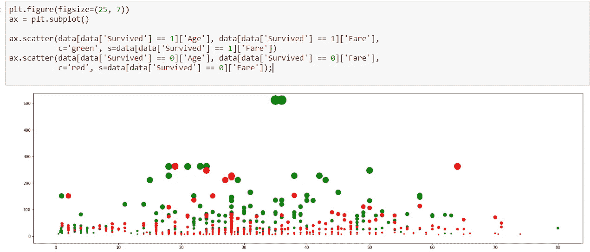

圆圈的大小与票价成正比。

x 轴代表年龄，y 轴代表票价。

我们可以观察到不同的集群:

1.  x=20 和 x=45 之间的大绿点:票价最高的成人
2.  x=10 到 x=45 之间的小红点，船上下层阶级的成年人
3.  x=0 和 x=7 之间的小贪婪点:这些是被拯救的孩子

事实上，正如我们在下面的图表中看到的，票价与舱位相关。

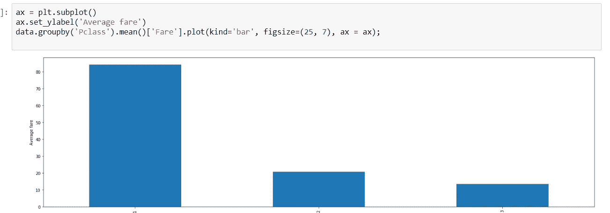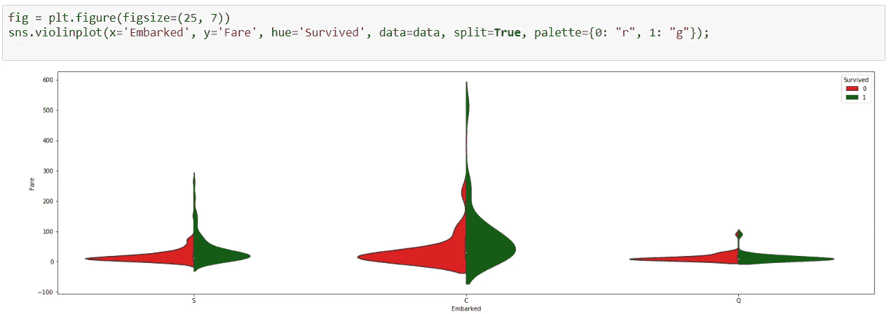

以上是装载地点如何影响生存的情节。

似乎 C 登机处的票价范围更广，因此支付最高价格的乘客是幸存者。

我们也看到这种情况发生在登船 S，较少发生在登船 q。

我希望这些数据可视化对你有用。

在下一篇博文中，我将继续特征工程和构建预测模型。