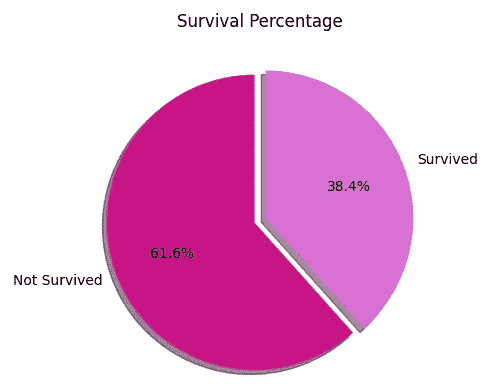
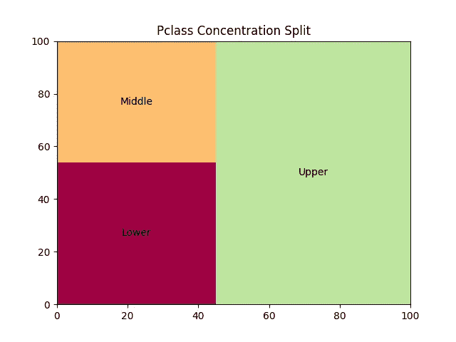
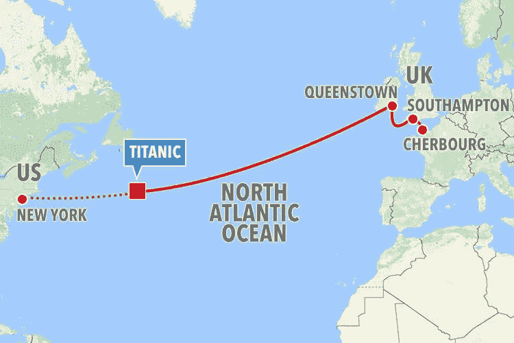

# 泰坦尼克号生存预测— I

> 原文：<https://pub.towardsai.net/titanic-survival-prediction-i-bf5a04afff46?source=collection_archive---------1----------------------->

## [数据分析](https://towardsai.net/p/category/data-analysis)

## Titanic 数据集上的探索性数据分析和特征工程


[图片来源](https://dribbble.com/ousama_alsaadi)

[*泰坦尼克号 Kaggle 竞赛*](https://www.kaggle.com/c/titanic) 是了解机器学习管道的好地方。在本文中，我们将讨论构建预测模型的初步步骤。我们开始吧！

***比赛总结:***

我们的目的是从一系列特征中确定一名乘客是否会在事故中幸存。换句话说，我们将建立一个二进制分类模型，输出‘1’表示乘客在泰坦尼克号沉没时幸存，输出‘0’表示没有幸存。

下面是所提供的训练数据集中的存活率的可视化。基于这个给定的基础事实的百分比；我们将训练五个典型的分类模型并比较它们的性能:



***探索性数据分析:***

构建机器学习模型的第一步也是最重要的一步是 EDA。这包括以下内容:

*   理解潜在的信息，如行数和列数、数据类型、查看数据中的几个样本、一般数字，如平均众数。
*   指出缺失值的比例，并决定如何解决它们。
*   数据可视化。

因此，让我们探索训练集，并建立对我们的数据的理解:

我们从上述代码中收集了以下信息:

*   训练数据包括总共 891 个例子和 12 个特征；包括'*幸存下来的*旗。
*   我们混合了离散和连续的特征。
*   有三列缺少值(年龄、客舱、上船)

继续，现在让我们详细讨论每个特性，以便获得更好的直觉。

1.  ***Pclass***

我们首先要考虑的特性是 **Pclass。这是一个分类特征，代表了乘客的社会经济地位。我们绘制了一张树状图，清楚地表明大多数乘客属于社会经济地位较高的阶层。**



2. ***名称***

因为乘客姓名不能照原样使用；因此，我们提取了数据中的标题，以便更好地理解这些信息。

3. ***着手进行***

此列中有两个值丢失。我们可以删除这些行，或者用模式值替换它们。删除行将最终导致数据丢失，并且给定的数据集已经非常小；因此，我们将采用选项二。我们还注意到大量乘客登上了南安普敦号。



4.**号*机舱*号**

虽然这个列中缺少大量的值，但是我们提取了指定客舱类别的字母。我将很快讨论我们如何利用它来重建特性。

5. ***年龄***

下面的代码使用*iterative inputr()*函数*近似计算缺失的年龄值。*稍后，我们将利用本专栏构建更复杂的特性。

***特征工程***

此方法用于增加现有数据的复杂性；通过在预先存在的柱的顶部构建新的特征。以便更好地表示数据的底层结构；我们可以拆分或合并不同列的信息。这是可以提高我们的模型性能的众多技术之一。

在 Titanic 数据集中，我们将使用这种方法包含**六个**附加列。就像我们小心翼翼地把所有乘客的名字转换成他们的头衔*；*让我们看看更多的栏目。

首先，我们将使用 *Parch* 和 *SibSp* 列来统计船上的家庭成员人数，如下所示:

此外，像*每个家庭的费用*这样的属性也有助于理解这两列之间的联系:

*Ticket* 列本身似乎并不太有用，因此我们将基于该数据的性质构建一个分类列:

将上面创建的列与我们之前转换的 *Cabin* 列连接起来，从这些特性中获得更多的价值:

还可以使用*年龄*列构建以下两个特征。对于*年龄组，*我们将使用 pandas *qcut()* 函数将年龄分成四个大小相等的离散时段。

最后，我们将*年龄*乘以*票价*得到一个新的*数字*列。

最初，训练数据集包含非常简单的特征，这些特征不足以让算法搜索模式。新构建的要素旨在建立数据集之间的对应关系，最终提高模型的准确性。

现在我们的特性已经准备好了，我们可以继续进行数据准备的下一步了。

***分类编码***

由于许多算法只能解释数字数据，因此，对分类特征进行编码是一个必要的步骤。对这类功能进行编码有三种常见的解决方法:

1.  一次热编码(二进制分割)
2.  标签编码(每个类别的数字分配)
3.  顺序编码(每个类别的有序分配)

在我们的例子中，我们将使用 sklearn *LabelEncoder()* 函数实现**标签编码**。我们将对下面提到的包含单词、字母或字母数字形式的分类信息的列列表进行标签编码。这项任务可以通过使用以下代码来完成:

```
['Pclass', 'Name', 'Sex', 'SibSp', 'Parch', 'Ticket', 'Fare', 'Embarked', 'familyMembers', 'ticketInfo', 'Cabin', 'Cabin_ticketInfo']
```

***标准缩放***

连续特征可能会发生很大变化，导致收敛速度非常慢，从而影响模型的整体性能。术语缩放表明，我们在固定的范围内重新分配特征值，从而使数据分散标准化。一旦实现了这一点，模型将有效地收敛到全局最小值。

最初，泰坦尼克号的数据只有一个单一的特征，即需要缩放的票价。在构建新的高级功能时，我们又增加了两个。下面是我们如何对所有连续数据进行标准缩放:

下面是未缩放值和缩放值*‘Fare’*之间的比较。我们可以看到，新的 *x 范围*已经大约缩小到 2，而且数据现在分布在零上*平均值:*


***结论***

既然我们对自己的数据感到有信心，让我们用它来训练一堆模型，并挑选最适合的算法！在下一篇文章中，我们将使用五种二元分类算法对 Titanic 数据集进行生存预测。

以下是来自最终培训数据的一些示例: