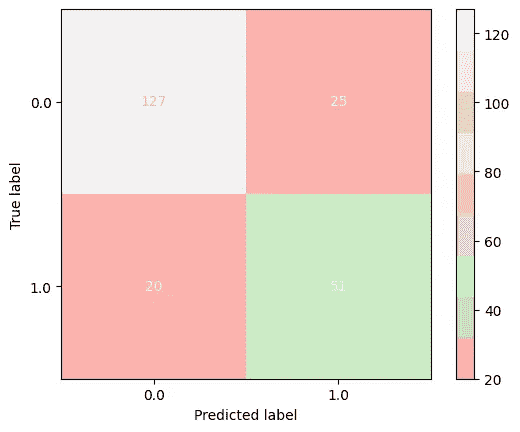
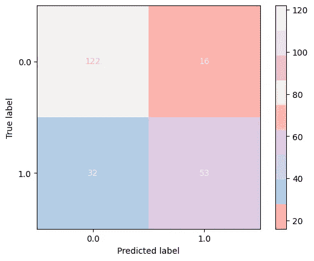
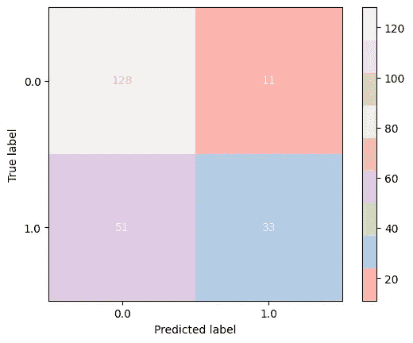
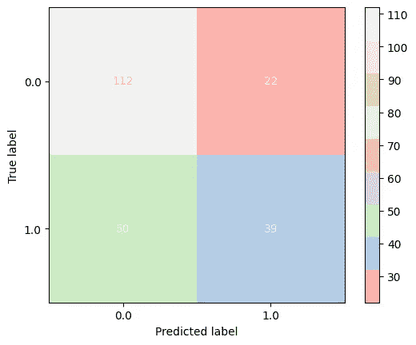
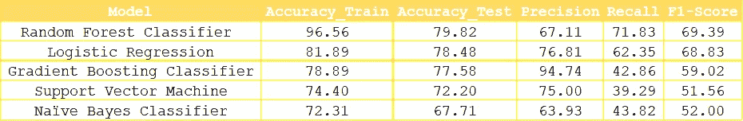

# 泰坦尼克号生存预测-II

> 原文：<https://pub.towardsai.net/titanic-survival-prediction-ii-551a9b44efa3?source=collection_archive---------6----------------------->

## [数据科学](https://towardsai.net/p/category/data-science)

## 预测谁在沉船中幸存！


[图片来源](http://fireart-d.dribbble.com/)

在之前的[文章](https://hiraakram88.medium.com/titanic-survival-prediction-i-bf5a04afff46)中，我们讨论了探索性数据分析、数据可视化和原始数据预处理的基本技术。我们还建立了对从原始数据集设计复杂新特征的方法的理解。此外，还介绍了常见的数据准备实践，如要素编码和标准缩放。

在本文中，让我们简要讨论一些广泛用于二元分类的算法，以及它们在 Titanic 数据集上的性能。此外，我们将根据不同的指标来训练、测试和评估我们的生存预测。

# **“*垃圾进，垃圾出*”有多真实？**

虽然建立机器学习模型并不强调选择哪种算法，而是主要关注 EDA 和数据挖掘，因为它们起着非常关键的作用。有时候，尽管插入了不同的算法，你的模型还是会持续给出相同的性能；不要从一种算法跳到另一种算法，建议采用以下方法:

1.  使用 SQL、Excel 或 Python/R 进行一些基本的 EDA，但是首选。
2.  估算缺失值。
3.  画出被认为重要的特征，并试图找到潜在的模式。
4.  对分类特征进行编码，并对连续特征进行标准化/规范化。
5.  选择一个简单的算法，直接训练模型。
6.  如果你幸运的话，你可能第一次就得到你想要的结果。在这种情况下，请重新运行模型来验证您的结果。
7.  如果你对第一次运行感到失望，观察模型的表现，以及你是否需要收集更多的数据或添加新的功能等。

**注意**:如果你给任何算法提供了正确的数据，你更有可能得到你想要的结果，而不必来回奔波。

# 二元分类器

我们的目标是根据给定的特征识别乘客，如*年龄、SibSp、Pclass、票价*等。谁更有可能在沉船事故中幸存。对于这个二元分类问题，让我们训练五个分类器，并比较它们在训练数据集上的性能。

我们将使用以下监督学习算法，这些算法可以帮助我们在 Titanic 数据集上进行生存预测:

*   随机森林分类器
*   逻辑回归
*   梯度推进分类器
*   支持向量机
*   朴素贝叶斯分类器

> ***随机森林分类器***

随机森林是一种非常灵活的集成学习算法，可用于使用 bagging 范式解决分类和回归问题。该算法使用替换进行随机采样，并创建数据集的多个副本。因此，在分类问题的情况下，可以通过对回归树的采样预测取平均值或者通过多数表决来获得新的预测。

在我们的例子中，这个模型的整体性能在训练数据集上看起来相当不错。有了相当数量的正确预测，我们能够获得令人满意的召回和 f1 分数。下图是从该分类器获得的混淆矩阵:



> ***逻辑回归***

逻辑回归属于监督学习算法类。与名称所暗示的相反，这种算法专门用于进行分类预测。它旨在输出两个可能的值，基于这两个值来定义类。一个这样的数学函数在我们期望的区间内赋值，即[0，1]被称为 sigmoid。如果这个函数返回一个更接近于 0 的预测，我们声明它是一个负类，而如果预测更接近于 1，它被认为是正的，因此是我们的目标类。

通过这个模型，我们得到了一个有些相似的结果。然而，准确性确实出现了轻微的下降。有了更多的真阳性，我们的模型的精度显著提高*。*下图显示了从该模型获得的混淆矩阵:



> ***梯度提升分类器***

移动到下一个分类器，这是一种有效的集成学习算法，但与随机森林不同，该算法利用了提升技术。

从下图中可以看出，我们正确地预测了大量的真阴性和真阳性，并且该模型在 precious 方面也表现出色。此外，它还提供了令人惊讶的低数量的假阳性:


> ***支持向量机***

由于其潜在的数学原理，支持向量机也被称为大间隔分类器。被决策边界分开的正例和反例之间有很大的距离。因此，这个决策边界有助于更好地概括未来的例子。

如下图所示，存在大量错误预测的标签，因此在我们的情况下，该模型未能做出可接受的预测:



> ***朴素贝叶斯分类器***

最后，我们使用朴素贝叶斯分类器训练数据，朴素贝叶斯分类器是一种超级简单的监督学习算法。这种分类技术背后的基本概念是假设每个特征在统计上反映了贝叶斯定理，即一个类中的每个特征彼此独立。

根据从该模型得出的结果，我们观察到它不仅不能保持准确性，而且在其他指标方面效率也特别低。这从混淆矩阵和*图-1:* 中可以明显看出



# 性能比较

通常情况下，分类器会根据各种度量标准进行评估，如精确度、召回率、F1 值、准确度等等。这些帮助我们决定模型的表现如何。具体来说，如果我们只考虑一个单一指标作为我们的决定因素，那么我们可能会得出不同的结论，并且总是存在一个权衡。

此外，重要的是通过多个决定因素来分析分类，以便我们对我们的选择更有信心。之前，我们分别检查了每个模型的混淆矩阵，以获得关于正确预测标签的直观视图。现在，让我们看看其他几个因素，以得出更准确的结论。从下图中可以看出，我们已经考虑了训练和测试数据集的准确性、精确度、召回率和每个模型的 f1 分数。然而，这些结果表明，在每种情况下，准确性数字都是相对可接受的，但当考虑其他因素时，显然'*随机森林分类器*'总体上表现更好。

下图显示了到目前为止我们训练的所有五个模型之间的完整比较:



***图-1***

# 结论

现在我们已经完成了模型选择，让我们继续测试阶段。随机森林还为我们提供了一个选项，将我们自己限制在对确定数据趋势有重要价值的特性上。以下是重要功能的列表:


```
features = pd.Series(rfc.feature_importances_, index=X_train.columns).sort_values()features.plot(kind='barh', cmap='Pastel1')
```

让我们只利用值≥ 0.06 的那些，以便我们基于对在我们的数据集中搜索隐藏模式具有更高影响的特征来重新训练我们的模型。这里有一个 [GitHub](https://github.com/h-i-r/Kaggle-Titanic-Survival-Competition) 项目的链接供参考。

感谢阅读！^_^