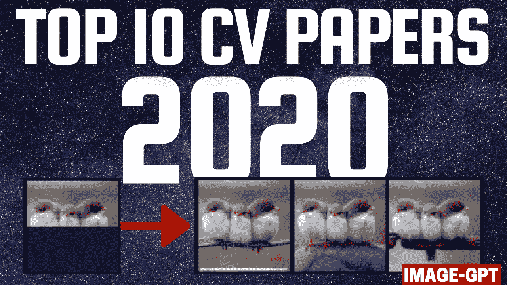

# 2020 年十大计算机视觉论文

> 原文：<https://pub.towardsai.net/top-10-computer-vision-papers-2020-aa606985f688?source=collection_archive---------0----------------------->

## [计算机视觉](https://towardsai.net/p/category/computer-vision)，[研究](https://towardsai.net/p/category/research)

## 2020 年十大计算机视觉论文，包括视频演示、文章、代码和论文参考。

即使今年世界上发生了这么多事情，我们仍然有机会看到许多惊人的研究成果问世。尤其是在人工智能领域，更准确地说是计算机视觉领域。此外，今年还强调了许多重要的方面，如伦理方面、重要的偏见等等。人工智能和我们对人脑及其与人工智能的联系的理解正在不断发展，在不久的将来显示出有前途的应用，这一点我肯定会谈到。

这里是我今年在计算机视觉领域最有趣的 10 篇研究论文，以防你错过其中的任何一篇。简而言之，它基本上是一个由**在人工智能和 CV** 方面的最新突破组成的列表，带有**清晰的视频解释**、**链接到更深入的文章**，以及**代码**(如果适用)。享受阅读，如果我错过了任何重要的论文，请在评论中告诉我，或者直接在 [LinkedIn](https://www.linkedin.com/in/whats-ai/) 上联系我！

本文末尾列出了每篇论文的完整参考资料。

[***访问 GitHub 资源库中的完整列表***](https://github.com/louisfb01/Top-10-Computer-Vision-Papers-2020)

***在***[***Twitter(@ Whats _ AI)***](https://twitter.com/Whats_AI)***或***[***LinkedIn(Louis(What ' s AI)***](https://www.linkedin.com/in/whats-ai/)***如果分享文章！***

# 在 5 分钟内观看完整的计算机视觉 2020 倒带

# [海透:一种从水下图像中去除水分的方法【1】](https://openaccess.thecvf.com/content_CVPR_2019/papers/Akkaynak_Sea-Thru_A_Method_for_Removing_Water_From_Underwater_Images_CVPR_2019_paper.pdf)

你有没有想过没有水的海洋会是什么样子？去掉水下照片的蓝绿色，仍然保留着珊瑚礁的真实颜色。好吧，使用计算机视觉和机器学习算法，海法大学的研究人员能够做到这一点！

 [## 这个人工智能从水下图像中移除水！

### 你有没有想过没有水的海洋会是什么样子？研究人员最近通过使用…

medium.com](https://medium.com/towards-artificial-intelligence/this-ai-removes-the-water-from-underwater-images-d277281bcd0f) 

[点击此处获取海运代码](https://github.com/jgibson2/sea-thru)

# [支持可审计自治的神经回路策略](https://www.nature.com/articles/s42256-020-00237-3.epdf?sharing_token=xHsXBg2SoR9l8XdbXeGSqtRgN0jAjWel9jnR3ZoTv0PbS_e49wmlSXvnXIRQ7wyir5MOFK7XBfQ8sxCtVjc7zD1lWeQB5kHoRr4BAmDEU0_1-UN5qHD5nXYVQyq5BrRV_tFa3_FZjs4LBHt-yebsG4eQcOnNsG4BenK3CmBRFLk%3D) [2]

来自澳大利亚 IST 大学和麻省理工学院的研究人员使用一种新的人工智能系统成功训练了一辆自动驾驶汽车，该系统基于微小动物的大脑，如蛲虫。与流行的深度神经网络(如 Inceptions、Resnets 或 VGG)所需的数百万个神经元相比，他们只需要几个神经元就能控制自动驾驶汽车。他们的网络能够只用 75 000 个参数完全控制一辆汽车，由 19 个控制神经元组成，而不是数百万个！

 [## 一个新的大脑启发的智能系统只用 19 个控制神经元来驾驶汽车！

### 模仿线虫的神经系统有效地处理信息，这种新的智能系统更强大…

medium.com](https://medium.com/towards-artificial-intelligence/a-new-brain-inspired-intelligent-system-drives-a-car-using-only-19-control-neurons-1ed127107db9) 

[点击此处获取 NCP 代码](https://github.com/mlech26l/keras-ncp)

# [神经:神经反射和可见度场
用于重新照明和视图合成](https://people.eecs.berkeley.edu/~pratul/nerv/)【3】

这种新方法能够生成完整的三维场景，并具有决定场景照明的能力。与以前的方法相比，所有这些只需要非常有限的计算成本和惊人的结果。

 [## 从一组输入图像生成任意光照条件下的完整 3D 场景

### 这种新方法能够生成一个完整的三维场景，并且能够决定场景的光照

medium.com](https://medium.com/what-is-artificial-intelligence/generate-a-complete-3d-scene-under-arbitrary-lighting-conditions-from-a-set-of-input-images-9d2fbce63243) 

[点击此处查看神经代码*(即将推出)*](https://people.eecs.berkeley.edu/~pratul/nerv/)

# [YOLOv4:物体检测的最佳速度和精度](https://arxiv.org/abs/2004.10934) [4]

这个第四版最近在 2020 年 4 月由 Alexey Bochkovsky 等人在论文“YOLOv4:物体检测的最佳速度和精度”中介绍。该算法的主要目标是制造一个在准确性方面具有高质量的超快速对象检测器。

 [## YOLOv4 算法|只看一次的介绍，第 4 版|实时对象检测

### 我最近发表了一篇文章，解释了“你只看一次”的基本原理，也就是众所周知的 YOLO 算法。还有…

medium.com](https://medium.com/what-is-artificial-intelligence/the-yolov4-algorithm-introduction-to-you-only-look-once-version-4-real-time-object-detection-5fd8a608b0fa) 

[点击此处获取 Yolo v4 代码](https://github.com/AlexeyAB/darknet)

# [脉冲:通过生成模型的潜在空间探索进行自我监督的照片上采样](https://arxiv.org/abs/2003.03808) [5]

这种新算法将模糊图像转换成高分辨率图像！
它可以拍摄超低分辨率的 16x16 图像，并将其变成 1080p 高清人脸！你不相信我？然后你可以像我一样做，在一分钟之内在自己身上试试！但首先，让我们看看他们是如何做到的。

 [## 这种人工智能使模糊的脸看起来清晰 60 倍

### 这种新算法将模糊图像转换成高分辨率图像！它可以拍摄超低分辨率的 16x16 图像…

medium.com](https://medium.com/what-is-artificial-intelligence/this-ai-makes-blurry-faces-look-60-times-sharper-7fcd3b820910) 

[点击此处获取脉冲代码](https://github.com/adamian98/pulse)

# [图像 GPT——从像素生成的预训练](https://openai.com/blog/image-gpt/) [6]

一个好的人工智能，如 Gmail 中使用的人工智能，可以生成连贯的文本并完成你的短语。这一个使用相同的原则为了完成一幅图像！所有这些都是在无人监督的训练中完成的，根本不需要任何标签！

 [## 这个人工智能可以使用 GPT 模型生成另一半图片

### 一个好的人工智能，如 Gmail 中使用的人工智能，可以生成连贯的文本并完成你的短语。这一个使用相同的…

medium.com](https://medium.com/towards-artificial-intelligence/this-ai-can-generate-the-pixels-of-half-of-a-picture-from-nothing-using-a-nlp-model-7d7ba14b5522) 

[点击此处获取 OpenAI 的图像 GPT 代码](https://github.com/openai/image-gpt)

# [DeepFaceDrawing:从草图深度生成人脸图像](http://geometrylearning.com/paper/DeepFaceDrawing.pdf)【7】

您现在可以使用这种新的图像到图像的翻译技术，从粗糙甚至不完整的草图中生成高质量的人脸图像，而无需任何绘图技能！如果你的绘画技巧和我一样差，你甚至可以调整眼睛、嘴巴和鼻子对最终图像的影响！让我们看看它是否真的有效，以及他们是如何做到的。

 [## AI 从草图生成真实人脸！

### 您现在可以使用……从粗糙甚至不完整的草图生成高质量的人脸图像，而无需任何绘图技能

medium.com](https://medium.com/what-is-artificial-intelligence/ai-generates-real-faces-from-sketches-8ccbac5d2b2e) 

[点击此处获取深度绘制代码](https://github.com/IGLICT/DeepFaceDrawing-Jittor)

# [PIFuHD:用于高分辨率 3D 人体数字化的多级像素对齐隐函数](https://arxiv.org/pdf/2004.00452.pdf)【8】

这个人工智能从 2D 图像中生成人的 3D 高分辨率重建！它只需要一张你的照片就能生成一个看起来和你一模一样的 3D 头像，甚至从背后看也是如此！

 [## 人工智能从 2D 图像中生成人的 3D 高分辨率重建

### 这个人工智能从 2D 图像中生成人的 3D 高分辨率重建！只需要一张你的照片…

medium.com](https://medium.com/towards-artificial-intelligence/ai-generates-3d-high-resolution-reconstructions-of-people-from-2d-images-introduction-to-pifuhd-d4aa515a482a) 

[点击此处获取 PiFuHD 代码](https://github.com/facebookresearch/pifuhd)

# [RAFT:用于光流的循环全对场变换](https://arxiv.org/pdf/2003.12039.pdf)【9】

普林斯顿团队获得 ECCV 2020 年最佳论文奖。他们为光流开发了一种新的端到端可训练模型。他们的方法在多个数据集上击败了最先进的架构的准确性，并且更加高效。他们甚至在 Github 上向所有人开放代码！

 [## ECCV 2020 最佳论文奖|光流的新架构

### 普林斯顿团队获得 ECCV 2020 年最佳论文奖。他们为光流开发了一个新的端到端可训练模型…

medium.com](https://medium.com/towards-artificial-intelligence/eccv-2020-best-paper-award-a-new-architecture-for-optical-flow-3298c8a40dc7) 

[点击此处获取 RAFT 代码](https://github.com/princeton-vl/RAFT)

# [学习视频修复的联合时空变换](https://arxiv.org/abs/2007.10247)【10】

这种人工智能可以填充移动物体背后的缺失像素，并以比当前最先进的方法更准确、更少模糊的方式重建整个视频！

 [## 这个 AI 拍摄一个视频，并填充一个对象后面缺失的像素！

### 视频修复—微软研究院

medium.com](https://medium.com/towards-artificial-intelligence/this-ai-takes-a-video-and-fills-the-missing-pixels-behind-an-object-video-inpainting-9be38e141f46) 

[点击此处获取此视频修复代码](https://github.com/researchmm/STTN?utm_source=catalyzex.com)

# [通过深层潜在空间平移修复旧照片](https://arxiv.org/pdf/2009.07047.pdf)【加成 1】

想象一下，你有你祖母 18 岁时的旧的，折叠的，甚至撕破的高清照片，没有任何瑕疵。这被称为旧照片恢复，这篇论文刚刚开辟了一条全新的途径，使用深度学习方法来解决这个问题。

 [## 使用深度学习的旧照片恢复

### 想象一下，拥有你祖母 18 岁时的旧的、折叠的、甚至撕破的高清照片…

medium.com](https://medium.com/towards-artificial-intelligence/old-photo-restoration-using-deep-learning-47d4ab1bdc4d) 

[点击此处获取旧照片复原码](https://github.com/microsoft/Bringing-Old-Photos-Back-to-Life?utm_source=catalyzex.com)

# [实时人像抠图真的需要绿色屏幕吗？](https://arxiv.org/pdf/2011.11961.pdf)【加成 2】

人体抠图是一项非常有趣的任务，目标是找到照片中的任何人，并从照片中移除背景。由于任务的复杂性，这真的很难实现，必须找到具有完美轮廓的人。在这篇文章中，我回顾了多年来使用的最佳技术和 2020 年 11 月 29 日发表的一种新颖的方法。许多技术正在使用基本的计算机视觉算法来完成这项任务，例如 GrabCut 算法，它速度极快，但不是很精确。

 [## 没有绿屏的高质量背景消除

### 这种新的背景去除技术可以从单个输入图像中提取一个人，而不需要绿色的…

medium.com](https://medium.com/datadriveninvestor/high-quality-background-removal-without-green-screens-8e61c69de63) 

[点击这里获取 MODNet 代码](https://github.com/ZHKKKe/MODNet)

# 解除锁定【奖励 3】

DeOldify 是一种彩色化和恢复旧黑白图像甚至电影胶片的技术。它是由一个人 Jason Antic 开发并更新的。这是现在最先进的黑白图像彩色化方法，一切都是开源的，但是我们一会儿会回到这个话题。

 [## 这个人工智能可以为你的黑白照片着色，呈现出真实的照片效果！(解密)

### 这种方法被称为 DeOldify，几乎适用于任何图片。如果你不相信我，你甚至可以尝试一下…

medium.com](https://medium.com/towards-artificial-intelligence/this-ai-can-colorize-your-black-white-photos-with-full-photorealistic-renders-deoldify-bf1eed5cb02a) 

[点击此处获取解除代码](https://github.com/jantic/DeOldify)

# 结论

如你所见，对于计算机视觉来说，这是极具洞察力的一年。我一定会报道 2021 年最令人兴奋和有趣的论文，如果你能参加这次冒险，我会很高兴的！如果你喜欢我的工作，并想了解最新的人工智能技术，你绝对应该在我的社交媒体频道上关注我。

*   支持我的最好方式就是在 [**中**](https://medium.com/@whats-ai) 关注我。
*   订阅我的 [**YouTube 频道**](https://www.youtube.com/channel/UCUzGQrN-lyyc0BWTYoJM_Sg) 。
*   在[**LinkedIn**](https://www.linkedin.com/in/whats-ai/)**上关注我的项目。**
*   一起学习 AI，加入我们的 [**Discord 社区**](https://discord.gg/learnaitogether) ，*分享你的项目、论文、最佳课程，寻找 Kaggle 队友，等等！*
*   订阅我的 [**简讯**](http://eepurl.com/huGLT5) ！

[***访问 GitHub 存储库中的完整列表***](https://github.com/louisfb01/Top-10-Computer-Vision-Papers-2020)

***在***[***Twitter(@ Whats _ AI)***](https://twitter.com/Whats_AI)***或***[***LinkedIn(Louis(What ' s AI)***](https://www.linkedin.com/in/whats-ai/)***如果分享文章！***

# 如果你对人工智能研究感兴趣，这里有另一篇很棒的文章给你:

 [## 2020:充满惊人人工智能论文的一年——综述

### 按发布日期排列的人工智能最新突破的精选列表，带有清晰的视频解释，链接到更多…

medium.com](https://medium.com/towards-artificial-intelligence/2020-a-year-full-of-amazing-ai-papers-a-review-c42fa07aff4b) 

# 论文参考

[1] Akkaynak，Derya & Treibitz，程昕婷。(2019).一种从水下图像中去除水分的方法。1682–1691.10.1109/CVPR

[2] Lechner，m .，Hasani，r .，Amini，A. *等*启用可审计自主性的神经回路策略。*国家机器智能* **2，**642–652(2020)。[https://doi.org/10.1038/s42256-020-00237-3](https://doi.org/10.1038/s42256-020-00237-3)

[3] P. P. Srinivasan、B. Deng、X. Zhang、M. Tancik、B. Mildenhall 和 J. T. Barron，“Nerv:用于重新照明和视图合成的神经反射和可见度场”，arXiv，2020 年。

[4] A. Bochkovskiy，C.-Y. Wang，和 H.-Y. M .廖，Yolov4:物体探测的最佳速度和精度，2020 年。arXiv:2004.10934 [cs。简历】。

[5] S. Menon，A. Damian，S. Hu，N. Ravi 和 C. Rudin，Pulse:通过生成模型的潜在空间探索进行自我监督的照片上采样，2020 年。arXiv:2003.03808 [cs。简历】。

[6] M. Chen，a .，R. Child，J. Wu，H. Jun，D. Luan 和 I. Sutskever，“从像素进行生成性预训练”，载于第 37 届机器学习国际会议论文集，H. D. III 和 A. Singh 编辑。，爵士。机器学习研究会议录，第 119 卷，虚拟:PMLR，2020 年 7 月 13-18 日，第 1691-1703 页。【在线】。

[7]陈世友、苏文伟、高、夏、傅，“深度人脸绘制:从草图深度生成人脸图像”，《美国计算机图形学学报》(2020 年美国计算机图形学学报)，第 39 卷，第 4 期，72:1–72:16，2020。可查:http://proceedings . MLR . press/v 119/Chen 20s . html

[8] S. Saito，T. Simon，J. Saragih，和 H. Joo，Pifuhd:用于高分辨率 3d 人体数字化的多级像素对齐隐函数，2020 年。arXiv:2004.00452 [cs。简历】。

[9] Z. Teed 和 J. Deng，Raft:用于光流的循环所有对场变换，2020 年。arXiv:2003.12039 [cs。简历】。

[10]曾玉燕，傅俊杰，赵海峰，学习视频嵌入的联合时空变换，2020 .arXiv:2007.10247 [cs。简历】。

[附加 1]万，张，陈，张，陈，廖，文，2020。arXiv:2009.07047 [cs。简历】。

[附加信息 2]柯志群、李克强、周永源、吴清源、毛晓东、严清源和刘瑞伟，“实时人像抠图真的需要绿色屏幕吗？”ArXiv，第 abs/2011.11961 卷，2020 年。

[奖金 3]贾森·安蒂奇，DeOldify，[https://github.com/jantic/DeOldify](https://github.com/jantic/DeOldify)的创造者