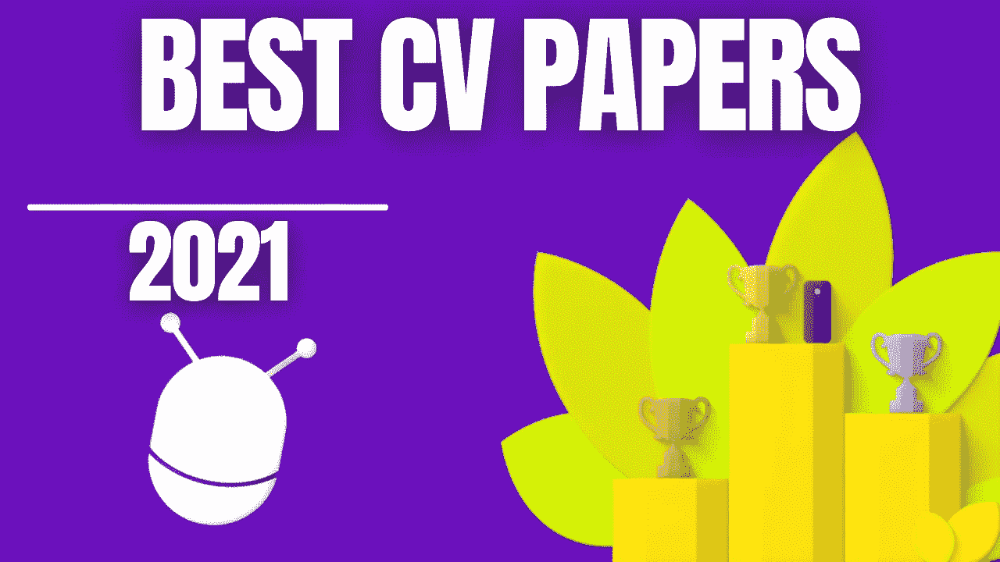

# 2021 年十大计算机视觉论文

> 原文：<https://pub.towardsai.net/top-10-computer-vision-papers-of-2021-3ce1ed2e6f59?source=collection_archive---------0----------------------->

## [计算机视觉](https://towardsai.net/p/category/computer-vision)

## 2021 年十大计算机视觉论文，包括视频演示、文章、代码和论文参考。

虽然世界仍在复苏，但研究并没有放缓其疯狂的步伐，尤其是在人工智能领域。此外，今年还强调了许多重要方面，如道德方面、重要偏见、治理、透明度等等。人工智能和我们对人脑及其与人工智能的联系的理解正在不断发展，显示出在不久的将来改善我们生活质量的有前途的应用。然而，我们应该小心选择应用哪种技术。

> "科学不能告诉我们应该做什么，只能告诉我们能做什么。"
> *——萨特《存在与虚无》*

这里是我今年在计算机视觉领域最有趣的 10 篇研究论文，以防你错过其中的任何一篇。简而言之，它基本上是人工智能和 CV 的最新突破的精选列表，有清晰的视频解释，更深入的文章链接和代码(如果适用)。享受阅读，如果我错过了任何重要的论文，请在评论中告诉我，或者直接在 LinkedIn 上联系我！

本文末尾列出了每篇论文的完整参考资料。

订阅我的 [**时事通讯**](http://eepurl.com/huGLT5)—AI 的最新更新每周都有解释，如果我错过了什么有趣的论文，请随时[给我发消息](https://www.louisbouchard.ai/contact/)！

*在* ***上给我加标签 Twitter****[*@ Whats _ AI*](https://twitter.com/Whats_AI)*或****LinkedIn****[*@ Louis(什么是 AI) Bouchard*](https://www.linkedin.com/in/whats-ai/) *如果分享一下名单！***

## **观看 2021 CV 倒带**

**去年错过了？看看这个: [2020 年:充满令人惊叹的人工智能论文的一年——一篇评论](https://github.com/louisfb01/best_AI_papers_2021)**

**👀如果你想支持我的工作，并使用 W&B(免费)来跟踪你的 ML 实验，使你的工作可重复或与团队合作，你可以通过遵循[这个指南](https://colab.research.google.com/github/louisfb01/examples/blob/master/colabs/pytorch/Simple_PyTorch_Integration.ipynb)来尝试一下！由于这里的大部分代码都是基于 PyTorch 的，我们认为分享一个在 PyTorch 上使用 W & B 的[快速入门指南](https://colab.research.google.com/github/louisfb01/examples/blob/master/colabs/pytorch/Simple_PyTorch_Integration.ipynb)会很有趣。**

**👉遵循[这个快速指南](https://colab.research.google.com/github/louisfb01/examples/blob/master/colabs/pytorch/Simple_PyTorch_Integration.ipynb)，在你的代码或下面的任何回复中使用相同的 W & B 行，让你所有的实验在你的 w & b 账户中自动跟踪！它不需要超过 5 分钟的时间来设置，并将改变你的生活，就像我改变你的生活一样！[这里有一个更高级的使用超参数扫描的指南](https://colab.research.google.com/github/louisfb01/examples/blob/master/colabs/pytorch/Organizing_Hyperparameter_Sweeps_in_PyTorch_with_W%26B.ipynb)，如果你感兴趣的话:)**

**🙌感谢[Weights&bias](https://wandb.ai/)赞助这个库和我一直在做的工作，感谢你们中的任何人使用这个链接并尝试 W & B！**

**[访问 GitHub 存储库中的完整列表](https://github.com/louisfb01/top-10-cv-papers-2021)**

# **目录**

*   **DALL E:open ai 的零镜头文本到图像生成[1]**
*   **驯服高分辨率图像合成的变压器[2]**
*   **Swin Transformer:使用移位窗口的分层视觉转换器[3]**
*   **深网:他们为视觉做过什么？[奖金]**
*   **无限自然:从单一图像生成自然场景的永久视图[4]**
*   **完全重新照明:学习为背景替换重新照明肖像[5]**
*   **用欧拉运动场制作动画[6]**
*   **CVPR 2021 最佳论文奖:长颈鹿——可控图像生成[7]**
*   **TimeLens:基于事件的视频帧插值[8]**
*   **(Style)CLIPDraw:文本到绘图合成中内容和样式的耦合[9]**
*   **城市 NeRF:城市尺度的建筑 NeRF[10]**
*   **论文参考**

## **DALL E:open ai 的零镜头文本到图像生成[1]**

**OpenAI 成功训练了一个能够从文本字幕生成图像的网络。它与 GPT 3 号和 GPT 图像非常相似，产生了惊人的效果。**

**短视频讲解**

**简短阅读**

** [## OpenAI 的 DALL E:解释文本到图像的生成

### OpenAI 刚刚发布了解释 DALL-E 如何工作的论文！它被称为“零镜头文本到图像的生成”。

pub.towardsai.net](/openais-dall-e-text-to-image-generation-explained-1f6fb4bb5a0a) 

*   论文:[零投文本转图像生成](https://arxiv.org/pdf/2102.12092.pdf)
*   代码:[代码&用于 DALL E](https://github.com/openai/DALL-E) 的离散 VAE 的更多信息** 

## **驯服高分辨率图像合成的变压器[2]**

**TL；DR:他们将 GANs 和卷积方法的效率与 transformers 的表达能力结合起来，为语义指导的高质量图像合成提供了一种强大而省时的方法。**

**短视频讲解**

**简短阅读**

** [## 结合变形金刚的表现力和 CNN 的高分辨率图像的效率…

### TL；DR:他们将 GANs 和卷积方法的效率与变压器的表达能力结合起来…

pub.towardsai.net](/combining-the-transformers-expressivity-with-the-cnns-efficiency-for-high-resolution-image-synthesis-31c6767547da) 

*   论文:[驯服高分辨率图像合成的变形金刚](https://compvis.github.io/taming-transformers/)
*   代号:[驯服变形金刚](https://github.com/CompVis/taming-transformers)** 

## **Swin Transformer:使用移位窗口的分层视觉转换器[3]**

**变形金刚会取代计算机视觉中的 CNN 吗？在不到 5 分钟的时间内，您将通过一篇名为 Swin transformer 的新论文了解如何将 Transformer 架构应用于计算机视觉。**

**短视频讲解**

**简短阅读**

** [## 变形金刚会取代计算机视觉中的 CNN 吗？

### 几分钟后，您将了解如何通过一种新的方式将 transformer 架构应用于计算机视觉

pub.towardsai.net](/will-transformers-replace-cnns-in-computer-vision-55657a196833) 

*   论文: [Swin 转换器:使用移位窗口的分层视觉转换器](https://arxiv.org/abs/2103.14030v1)
*   [点击此处获取代码](https://github.com/microsoft/Swin-Transformer)** 

## **深网:他们为视觉做过什么？[奖金]**

**“我将公开分享关于视觉应用深度网络的一切，它们的成功，以及我们必须解决的局限性。”**

**短视频讲解**

**简短阅读**

** [## AI 为计算机视觉做了什么？

### 关于当前深度网络的一切，他们为视觉应用做了什么。他们的成功和局限。

pub.towardsai.net](/what-has-ai-done-for-computer-vision-3748f5958e07) 

*   论文:[深网:他们为视觉做过什么？](https://arxiv.org/abs/1805.04025)** 

## **无限自然:从单一图像生成自然场景的永久视图[4]**

**视图合成的下一步:永久视图生成，目标是拍摄一幅图像，然后飞进去探索风景！**

**短视频讲解:**

**简短阅读**

** [## 无限自然:飞入一个影像，像控制无人机一样探索它！

### 视图合成的下一步:永久视图生成，其目标是获取一幅图像，然后…

pub.towardsai.net](/infinite-nature-fly-into-an-image-and-explore-it-like-controlling-a-drone-541cab44b8f5) 

*   论文:[无限自然:从单一图像生成自然场景的永久视图](https://arxiv.org/pdf/2012.09855.pdf)
*   [点击此处获取代码](https://github.com/google-research/google-research/tree/master/infinite_nature)
*   [Colab 演示](https://colab.research.google.com/github/google-research/google-research/blob/master/infinite_nature/infinite_nature_demo.ipynb#scrollTo=sCuRX1liUEVM)** 

## **完全重新照明:学习为背景替换重新照明肖像[5]**

**根据您添加的新背景的照明，正确地重新照亮任何肖像。你是否曾经想改变一张图片的背景，但却让它看起来很真实？如果你已经尝试过，你就会知道这并不简单。你不能在家里给自己拍张照片，然后给海滩换个背景。只是看起来很糟糕，不现实。任何人都会马上说“那是 PS 过的”。对于电影和专业视频，你需要完美的灯光和艺术家来再现高质量的图像，而这是超级昂贵的。你不可能用自己的照片做到这一点。还是可以？**

**短视频讲解**

**简短阅读**

** [## 用真实的灯光改变你的肖像背景

### 根据您添加的新背景的照明，正确地重新照亮任何肖像。

pub.towardsai.net](/change-your-portraits-backgrounds-with-realistic-lighting-b6f2ebeb1a85) 

*   Paper: [全面重新照明:学习为背景替换重新照亮肖像](https://augmentedperception.github.io/total_relighting/total_relighting_paper.pdf)

> 如果你也想阅读更多的研究论文，我推荐你阅读[我的文章](/how-to-read-more-research-papers-7737e3770d7f)，在那里我分享了寻找和阅读更多研究论文的最佳技巧。** 

## **用欧拉运动场制作动画[6]**

**该模型拍摄一张照片，了解哪些粒子应该在移动，并在无限循环中逼真地动画化它们，同时完全保留照片的其余部分，仍然创建像这样看起来令人惊叹的视频…**

**短视频讲解**

**简短阅读**

** [## 从图片创建逼真的动画循环视频

### 这个模型拍一张照片，了解哪些粒子应该在移动，并逼真地将它们动画化…

pub.towardsai.net](/create-realistic-animated-looping-videos-from-pictures-58debf6f139) 

*   论文:[用欧拉运动场制作图片动画](https://arxiv.org/abs/2011.15128)
*   [点击此处获取代码](https://eulerian.cs.washington.edu/)** 

## **CVPR 2021 最佳论文奖:长颈鹿——可控图像生成[7]**

**使用改进的 GAN 架构，他们可以移动图像中的对象，而不会影响背景或其他对象！**

**短视频讲解**

**简短阅读**

** [## CVPR 2021 年最佳论文奖:长颈鹿——可控图像生成

### 使用改良的氮化镓架构，他们甚至可以移动图像中的物体，而不影响背景或…

pub.towardsai.net](/cvpr-2021-best-paper-award-giraffe-controllable-image-generation-24eac0001ca4) 

*   论文:[长颈鹿:将场景表示为合成生成神经特征场](http://www.cvlibs.net/publications/Niemeyer2021CVPR.pdf)
*   [点击此处获取代码](https://github.com/autonomousvision/giraffe)** 

## **TimeLens:基于事件的视频帧插值[8]**

**TimeLens 可以理解视频帧之间的粒子运动，以我们肉眼无法看到的速度重建真实发生的事情。事实上，它实现了我们的智能手机和其他型号之前无法达到的效果！**

**短视频讲解**

**简短阅读**

** [## 用 AI 把视频换成慢动作！TimeLens 解释道

### 时间镜头可以理解视频帧之间的粒子运动，以重建真正的…

pub.towardsai.net](/change-video-into-slow-motion-with-ai-timelens-explained-4281d97c9b9d) 

*   论文: [TimeLens:基于事件的视频帧插值](http://rpg.ifi.uzh.ch/docs/CVPR21_Gehrig.pdf)
*   [点击此处获取代码](https://github.com/uzh-rpg/rpg_timelens)

> 订阅我的每周[时事通讯](http://eepurl.com/huGLT5)，了解 2022 年 AI 的最新出版物！** 

## **(Style)CLIPDraw:文本到绘图合成中内容和样式的耦合[9]**

**你有没有梦想过采用图片的风格，比如左边这个很酷的抖音绘画风格，并将其应用到你选择的新图片中？是的，我做到了，而且从来没有这么容易做到。事实上，你甚至可以只通过文本来实现，现在就可以用这种新方法和他们为每个人提供的 Google Colab 笔记本来尝试。只需拍下你想要复制的样式的图片，输入你想要生成的文本，这个算法就会从中生成一张新的图片！回头看看上面的结果就知道了，这么大的进步！结果非常令人印象深刻，尤其是如果您考虑到它们是由单行文本构成的！**

**短视频讲解**

**简短阅读**

** [## 具有艺术控制的文本到绘图合成| CLIPDraw & StyleCLIPDraw

### 给你想要复制的风格拍张照，输入文字，算法会从中生成一张新的图片！

pub.towardsai.net](/text-to-drawing-synthesis-with-artistic-control-clipdraw-styleclipdraw-dd56fa208bea) 

*   Paper (CLIPDraw): [CLIPDraw:通过语言图像编码器探索文本到绘图的合成](https://arxiv.org/abs/2106.14843)
*   paper(StyleCLIPDraw):[StyleCLIPDraw:文本到图形合成中内容和样式的耦合](https://arxiv.org/abs/2111.03133)
*   [CLIPDraw Colab 演示](https://colab.research.google.com/github/kvfrans/clipdraw/blob/main/clipdraw.ipynb)
*   [StyleCLIPDraw Colab 演示](https://colab.research.google.com/github/pschaldenbrand/StyleCLIPDraw/blob/master/Style_ClipDraw.ipynb)** 

## **城市 NeRF:城市尺度的建筑 NeRF[10]**

**这个模型被称为 CityNeRF，它是从 NeRF 发展而来的，我之前在我的频道中介绍过。NeRF 是首批使用辐射场和机器学习从图像中构建 3D 模型的模型之一。但是 NeRF 并不是那么有效，而且只适用于单一规模。在这里，CityNeRF 同时应用于卫星和地面图像，为任何视点生成各种 3D 模型比例。简而言之，他们将 NeRF 带到了城市规模。但是怎么做呢？**

**短视频讲解**

**简短阅读**

** [## CityNeRF:城市比例的 3D 渲染！

### 以任何比例生成具有高质量细节的城市级 3D 场景！

pub.towardsai.net](/technology-fcb0fbfa9c00) 

*   论文:[城市 NeRF:城市规模的建筑 NeRF](https://arxiv.org/pdf/2112.05504.pdf)
*   [点击此处获取代码(即将发布)](https://city-super.github.io/citynerf/)** 

> **如果你想阅读更多的论文并有更广阔的视野，这里有另一个涵盖 2020 年的伟大知识库: [2020:充满令人惊叹的人工智能论文的一年——综述](https://github.com/louisfb01/Best_AI_paper_2020)并随时订阅我的每周[时事通讯](http://eepurl.com/huGLT5)，了解 2022 年人工智能的最新出版物！**

***在* ***上给我贴标签****[*@ Whats _ AI*](https://twitter.com/Whats_AI)*或****LinkedIn****[*@ Louis(什么是 AI) Bouchard*](https://www.linkedin.com/in/whats-ai/) *如果分享一下名单！*****

# **论文参考**

**[1] A. Ramesh 等，零拍文本到图像的生成，2021。arXiv:2102.12092**

**[2]驯服高分辨率图像合成的变压器，Esser 等人，2020 年。**

**[3]刘，z .等，2021，“Swin 变压器:使用移位窗口的分层视觉变压器”，arXiv 预印本[，](https://arxiv.org/abs/2103.14030v1)**

**[奖金]尤耶和刘，2021 年。深网:他们为视觉做过什么？。《国际计算机视觉杂志》，129(3)，第 781–802 页，【https://arxiv.org/abs/1805.04025】T2。**

**[4]刘，a .，塔克，r .，贾帕尼，v .，马卡迪亚，a .，斯内夫利，n .，金泽，a .，2020。无限自然:从单一图像生成自然场景的永久视图，【https://arxiv.org/pdf/2012.09855.pdf **

**[5] Pandey 等人，2021，Total Relighting:学习为背景替换重新照亮人像，doi: 10.1145/3450626.3459872，[https://augmented perception . github . io/Total _ re lighting/Total _ re lighting _ paper . pdf](https://augmentedperception.github.io/total_relighting/total_relighting_paper.pdf)。**

**[6] Holynski，Aleksander 等人，“用欧拉运动场制作动画”IEEE/CVF 计算机视觉和模式识别会议录。2021.**

**[7] Michael Niemeyer 和 Andreas Geiger，(2021)，“长颈鹿:将场景表示为合成生成神经特征场”，发表于 CVPR 2021 年。**

**[8]斯捷潘·图利亚科夫*、丹尼尔·格赫里希*、斯塔马蒂亚斯·乔戈里斯、朱利叶斯·埃尔巴希、马蒂亚斯·格赫里希、李、大卫·斯卡拉穆扎，TimeLens:基于事件的视频帧内插，IEEE 计算机视觉和模式识别会议(CVPR)，纳什维尔，2021 年，[http://rpg.ifi.uzh.ch/docs/CVPR21_Gehrig.pdf](http://rpg.ifi.uzh.ch/docs/CVPR21_Gehrig.pdf)**

**[9] a) CLIPDraw:通过语言图像编码器探索文本到绘图的合成
b)StyleCLIPDraw:Schaldenbrand，p .，Liu，z .和 Oh，j .，2021。StyleCLIPDraw:文本到绘图合成中内容和样式的耦合。**

**[10]，杨，徐，李，潘，徐，赵，饶，李，戴，林，2021 .城市 NeRF:在城市尺度上建造 NeRF。**