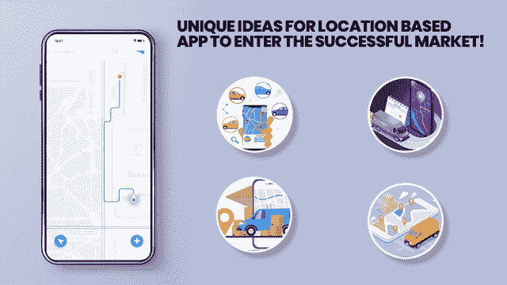
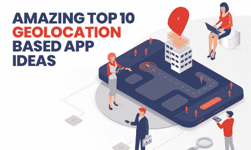
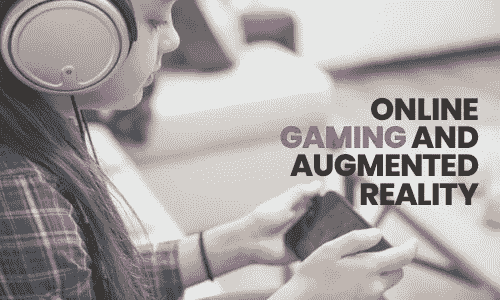
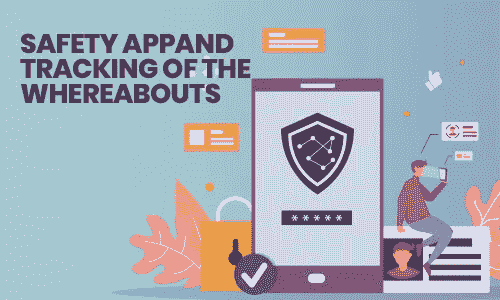
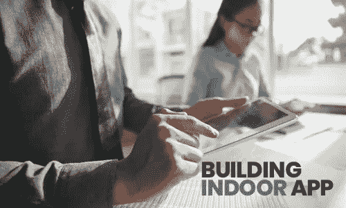

# 2021 年十大地理定位应用创意

> 原文：<https://pub.towardsai.net/top-10-geolocation-based-app-ideas-in-2020-which-one-for-successful-business-6a6a8b757412?source=collection_archive---------1----------------------->

> 地理位置是大多数企业的关键，企业家通常会在某个特定的地点建立他们的声誉。菲利斯·施拉弗利

不管你同意与否，但每部智能手机上安装的 90%以上的应用程序都见证了地理定位。这是用户在当今创新的技术环境中可以获得的最佳功能之一。

随着移动应用中地理定位功能的引入，许多新的大门已经为初创企业和企业打开。这一微小而重要的功能允许用户使用移动应用程序构建惊人的体验。

> **所以现在的问题是:**这一特性能否给智能设备带来未来整个游戏的改变？

好吧，这种独特的技术可以通过多种方式推进基于位置的服务的普及。最近对美国地理定位服务的研究表明，三分之一的美国成年人每周至少使用一次地理定位服务。这清楚地表明，集成可以是极好的，令人难以置信的。

因此，这里有一些独特的基于位置的应用程序的想法，我们已经向我们的观众展示。这些想法不仅会帮助他们将那个价值百万美元的想法变成现实，而且还会给他们一个他们想要的东西的蓝图。

# 令人惊叹的 10 大地理定位应用创意

这一特性有助于开发许多很酷很棒的应用程序，在不久的将来，它还会继续这样做。这里有一些最酷和最顶级的基于位置的应用程序 ideas 2021，它们会告诉你我们在这条路上走了多远，以及我们可以去哪里。

## 1.健身追踪和健康量表

NYU·朗戈医疗健康公司进行的一项研究显示，58%的美国智能手机用户倾向于下载那些与健康或健身应用相关的应用。这些基于位置的健身和健康应用程序甚至可以在跟踪实时位置的帮助下估计速度和活动。这些基于位置的应用程序的最大优势是，它们让用户可以在现场与朋友和当地社区联系。

对于所有运动爱好者来说，这些支持 GPS 的应用程序往往会输入数据来创建并跟踪他们的步行、骑自行车和跑步路线。不仅是里程，这些应用程序还会记录其他锻炼，如游泳、跳舞、骑自行车和其他许多事情。这些应用程序的工作方式是，它们访问手机的 GPS 数据来跟踪速度，绘制路线，甚至将用户与附近的其他跑步者联系起来。不仅是跟踪，该应用程序还倾向于在应用程序中使用地理定位，这种定位倾向于获取最迫在眉睫的健身工作室或私人教练，甚至观察视频流健身应用程序中的当地规定。

## 2.旅游导航和测绘

对于所有基于位置的应用和基于位置的应用开发来说，这是一个巨大的市场机会。当它与 AR 和所有其他应用程序配合使用时，奇迹往往会发生。对于喜欢旅游和游览新地方的人来说，他们总是需要一些帮助或者一个了解所有景点的有创新精神的朋友。像 NativeX 这样的应用程序倾向于显示人们正在旅行的城市中的一些最佳景点。基于位置的应用程序倾向于在移动设备上为用户提供关于景点和当地商业的信息。

它鼓励游客获得关于所选地点附近的旅游胜地、餐馆或可观赏城市的指导和建议。地理位置设置还允许应用程序显示驾驶方向或通知乘客可能的交通方式。有一些应用程序，比如 [**、Airbnb**](https://www.airbnb.com/a/?af=43720035&c=.pi0.pk25650614176_308642594612_c_12026464216&sem_position=1t1&sem_target=kwd-12026464216&location_of_interest=&location_physical=1024403&ghost=true&gclid=EAIaIQobChMItOKdrK635wIVdB6tBh1yIwNsEAAYASAAEgKpyvD_BwE) ，倾向于给用户定位，以及在试图寻找酒店或任何其他托管场所时提供指导。

## 3.在线游戏和增强现实

> 从超级马里奥开始，我们在这里。

那么手机游戏的流行从它出现的时候就已经伴随人们很久了。《口袋妖怪 Go》的大规模采用引起了每个人的轰动。这款游戏有一些非常有趣的地方，它可以帮助玩家重现他们生活的世界，这本身就非常令人兴奋。这款手机游戏的定位功能赢得了良好的人气。因此，很明显，像这样的游戏应用程序可以在市场上创造奇迹。

如果用户正在考虑生成一个增强现实游戏应用程序，那么他们应该考虑地理定位应用程序，以改善趋势游戏爱好者和爱好者利用该功能的优势。因此，地理定位是游戏应用中最有利的东西之一。这些应用程序还有很多其他的例子，倾向于使用位置。这些应用程序的一些例子包括像 scavify 这样的寻宝游戏。

**4。约会应用和日益增长的连通性**

这个功能的优点是提高了各种交友 app 的功能。创建一个像 Tinder 或 Bumble 这样的约会应用程序是一个非常好的和最重要的计划，用户可以结合地理位置功能创建和构建一个约会应用程序。他们有权添加几个特征，如位置、距离范围和其他内容。

现在，没有必要等待合适的应用程序，因为这些应用程序会让你一切都变得简单。最棒的是，用户可以根据自己的需要设置一切，并找到自己真正的需求。地理定位系统使应用程序设计者能够将距离范围结合到应用程序中。

毫无疑问，这些应用在市场上做得非常好，提供与 [**基于位置的移动应用开发**](https://www.xicom.biz/offerings/mobile-app-development/) 相关的服务。因此，构建这样的平台并不是一个坏主意。

## 5.安全应用程序和行踪跟踪

> 安全和追踪你所爱的人的下落:这难道不神奇吗？
> 
> 嗯，这是最著名和最热门的基于位置的移动应用软件 ideas 2021
> 
> 怎么会？

嗯，地理定位往往包括检测和跟踪一个人的位置，这往往会在他们的网站上向他们提供基于通信的信息。这些通信可能包括广告或其他相关内容。它可以是一封简短的电子邮件，也可以是针对地理位置的推送通知。地理定位通信由最精确和标准的文本或推送通知组成，当他们在社交媒体网站上打开特定应用程序时，它也可能会出现。地理定位使用户能够将用户定位到他们的设备将要去的任何地方。

> 像 [Road iD](https://www.roadid.com/) 、 [Garmin LiveTrack](https://www.garmin.com/en-US/blog/fitness/use-garmin-livetrack-track-activities-real-time/) 这样的应用程序使用这种技术来保证邻居的女人安全无恙。

## 6.查看天气相关的应用程序

如果你生活在一个天气和情绪一样的城市，那么你知道我在说什么。对于这些人来说，智能手机一直是他们的救星。像 Weather Underground 或 Yahoo Weather 这样的天气应用程序一直为用户提供关于气候的数据和信息，并且一直是基于位置的应用程序趋势之一。

它被归类为第三个最受欢迎和领先的移动应用程序，集成了地理定位系统，进一步根据用户的当前位置向用户提供准确和精确的预测。不仅如此，该应用程序还会阻止天气应用程序表示广泛而全面的数据，并提高其性能。

## 7.通过图片定位

让我们想象一下，你看到了一道菜的图片，真的很诱人，很丰盛。你上网开始寻找附近的候机室，但不幸的是，你无法找到想要的地方。

有时候，即使用户有一张照片，也很难找到并定位一个地方。因此，地理定位为他们提供了一种最简单的方法，通过图片定位他们的位置

> 这类应用程序的最大例子之一是 HoReCa。这种基于位置的应用程序对于广告商和访问者来说都是一个很好的工具。

> **地理定位应用程序在这个类别中如何工作**？嗯！

嗯，广告商可以利用这个应用程序来定位和查找快乐顾客的照片。不仅如此，他们可能会根据餐厅和咖啡馆的礼物来统计顾客，因为像这样的入住曾经在 [**Foursquare 应用程序中出现过。**](https://play.google.com/store/apps/details?id=com.joelapenna.foursquared&hl=en) 因此，随着这些应用的推出，观众已经接近了一个更加进化的未来。

## 8.建筑室内 App

如果 [**移动应用开发公司**](https://www.xicom.biz/offerings/mobile-app-development/) 认为地理定位只限于需要用户出行的户外应用，那你就有点错了。它不限于户外应用。有些应用程序主要面向酒店、大型度假村和购物中心，旨在创建帮助游客和购物者导航的应用程序。它可能包括场地，当地浴室，餐厅，桑拿泳池区，和许多这样的相关的东西。

> 这种室内导航倾向于利用 BLE 设备(蓝牙低能耗)的网络，而不是传统的 GPS 数据。然而，这种技术的可能性是无限的。

这些应用的一些最好的例子是[谷歌室内地图](https://www.google.com/maps/about/partners/indoormaps/)和[路径指南](https://play.google.com/store/apps/details?id=com.microsoft.msra.followus.app&hl=en)。这些应用程序倾向于获取手机和用户周围环境中的传感器。然后，他们倾向于构建地图来帮助用户，并帮助他们快速有效地移动到他们在建筑物内的期望位置。简而言之，这款应用有助于用户在一整栋模糊的建筑中找到自己的路。

## 9.社交变得容易了

在当今技术驱动的时代，如果不使用社交媒体平台或移动应用开发服务，你很难找到一个人。人们爱它，崇拜它，尽可能地珍惜它。

> 原因:他们倾向于创建、分享和讨论所有基于位置的内容。简单来说，社交媒体总是实时的。

这种应用程序最突出的例子之一是 Instagram。尽管基于位置的设置应用程序功能不是 Instagram 的重点部分，但它仍然致力于建立尽可能最好的用户体验。用户有权随时发布自己的生活，然后与其他用户和选定的朋友公开分享。

该应用程序几乎消除了发短信或打电话的需要。用户可以建立群组并分享不同的经历和事件，因为它们发生在特定的群组中(或不发生在特定的群组中)。类似地，如果用户曾经组织了一个社交网络应用程序，它不涉及焦点部分是什么，用户应该总是考虑组合地理位置部分。

## 10.不要忘记电子商务

基于位置的应用程序开发服务功能也是一个有用的定位应用程序，可以跟踪和帮助人们在电子商务应用程序上购物。这项功能使用户能够知道何时发货，何时收到发货。

不仅如此，如果有一个 [**电子商务应用**](https://www.xicom.biz/offerings/ecommerce-development/) 倾向于收取额外的运费，那么他们只能借助这个地理位置功能进行计算和汇总。

当它是关于零售和电子商务管理时，它也倾向于跟踪他们的客户和提供更好的服务的观众的位置。

也有零售商店，如塔吉特、 [**、宜家**](https://www.ikea.com/) **、**和 [**沃尔玛**](https://www.walmart.com/) 倾向于使用地理位置跟踪应用程序来帮助顾客和观众定位最近的商店。然后，他们倾向于在提货地点的帮助下送货。室内导航最棒的一点是，地理定位有助于信标技术，进而有助于增强体验。

> 因此，如果任何用户正在计划和思考创建或构建一个电子商务应用程序，那么基于地理位置的应用程序就是你的英雄。您所需要的就是集成地理定位功能，以便为您和您的客户利用这些优势。

# 简单地说

有一件事是清楚而明显的，那就是一旦个人熟悉了他们也能接受的任务和想法，他们就会毫不费力地知道自己想要什么。凭借地理定位的巨大潜力，移动市场应用正变得独一无二。为了帮助你进行更多的导航、路线跟踪以及产品和服务的个性化市场，地理定位是当今的英雄。在你雇佣移动应用开发者之前，确保他们了解最新的趋势。

> 我们希望这篇文章已经为你提供了所有基于位置的应用程序的所有必要的细节和信息。如果用户对以下主题有任何疑问，那么他们可以在下面的评论区写下他们的想法。我们的专家会回答这些问题，并提供重要的提示和信息。