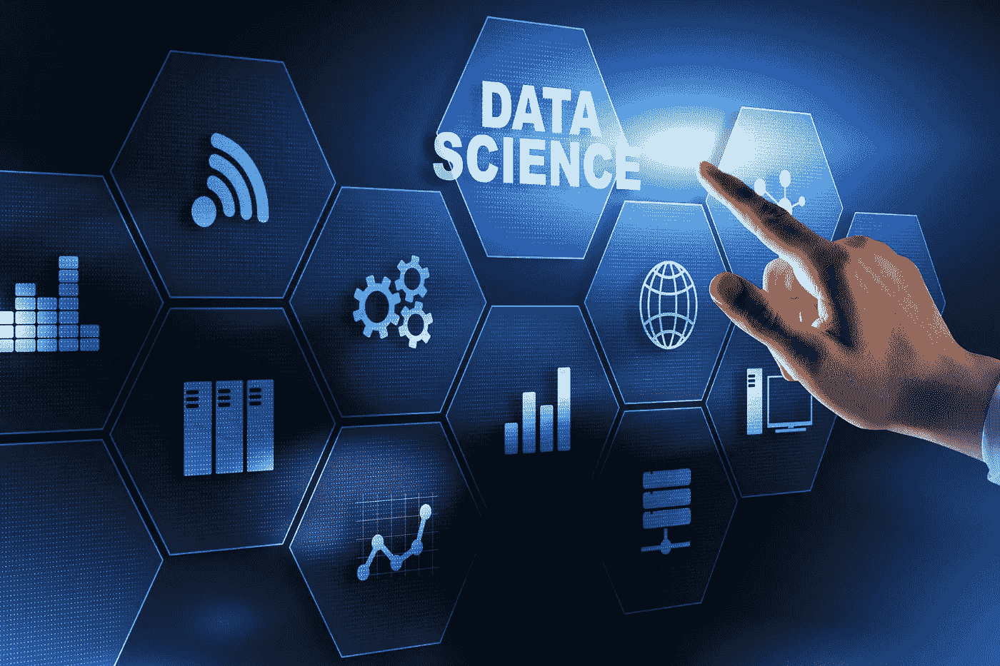
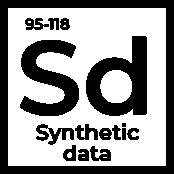
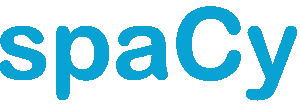
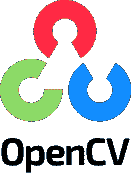
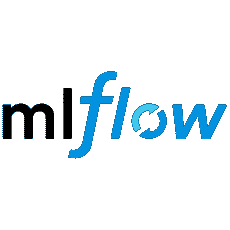
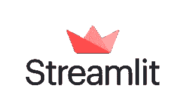
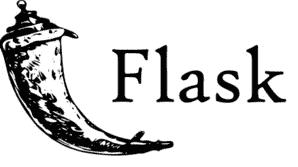
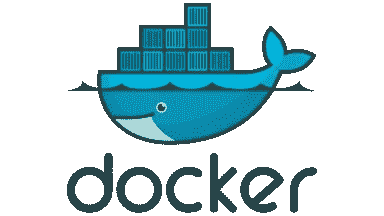

# 2022 年十大开源数据科学工具

> 原文：<https://pub.towardsai.net/top-10-open-source-data-science-tools-in-2022-6126a7f1b61e?source=collection_archive---------0----------------------->

## 一个固执己见的图书馆收藏，你一定会想去看看的

图片由作者通过 Canva 创建

我就不列举熊猫，NumPy，Scikit-learn，Matplotlib，Seaborn，TensorFlow，PyTorch 等了。

你可能已经知道这些了。这些库没有错；对于使用 python 的数据科学来说，它们已经是最基本的了。

互联网上充斥着关于这些工具的文章——这篇文章不会是其中之一，我向你保证，我的朋友。此外，我们不会讨论 Python 和 R，两者在学术界和业界都有自己的位置，但是今天我们将重点讨论 Python。

特别是，本文将重点关注鲜为人知但很有价值的 python 友好库。从收集数据到分析、数据建模、进行实验，最后部署模型，这些库涵盖了整个数据科学生命周期。

由于这些库和工具的发展，整个行业的人和进入数据科学开发的障碍已经大大减少。

# 这些库帮助你收集和综合数据

事实上，如果我们没有数据，就没有进一步的人工智能、机器学习或数据科学。这些库帮助我们通过网络获取实际数据，并创建合成数据。

[来源](https://github.com/scrapy/scrapy)

[**Scrapy**](https://scrapy.org/) 是一个快速的高级[网页抓取](https://en.wikipedia.org/wiki/Web_crawler)和[网页抓取](https://en.wikipedia.org/wiki/Web_scraping)框架，用于抓取网站并从其页面中提取结构化数据。它可以用于各种目的，从数据挖掘到监控和自动化测试。

我记得当我不得不从各种网站收集数据来收集关于一个城市的餐馆的细节和评论时，我使用了这个库，它很好地完成了工作。

尽管 Scrapy 最初是为 web 抓取而设计的，但它也可以用于使用 API 提取数据或作为通用的 web 爬虫。

[来源](https://github.com/ydataai/ydata-synthetic)

[**YData Synthetic**](https://github.com/ydataai/ydata-synthetic) 是一个开源的合成数据引擎。使用不同种类的[生成对抗网络(GANS)](https://medium.com/ydata-ai/generating-synthetic-tabular-data-with-gans-part-1-866705a77302) ，引擎学习原始数据的模式和统计属性。它可以创建与原始数据相似的合成数据的无限样本。

合成数据是人工生成的数据，不是从现实世界的事件中收集的。它复制实际数据的统计成分，不包含任何可识别的信息，确保个人隐私。

在全职工作期间，我曾在多个用例中使用过合成数据，我个人也参与了这个开源项目，并相信合成数据是在保护用户隐私的同时实现大规模高质量数据的方法。

# 这个库帮助你快速跟踪 EDA

信不信由你，你收集的数据总是杂乱无章。我们需要评估数据的质量，并从数据中发现真知灼见。

[来源](https://github.com/ydataai/pandas-profiling)

熊猫简介 的承诺简单明了；它**有助于通过更快的数据理解快速跟踪您的探索性数据分析。**

通过添加两行代码，您可以为您的数据生成一个分析报告，使用这个库在几分钟内检测数据问题并发现任何见解。熊猫档案是以数据为中心的人工智能社区的一部分，你也可以加入。

我开始的每个项目，只要我有了数据，我就通过 pandas-profiling 运行它，首先检查数据，清理数据，并通过生成的报告探索数据。

# 这些库帮助您跨域建模数据

由于我们拥有先进的库，数据科学家花在模型部分的时间更少了。这三个库在处理复杂算法方面做得很好，并为我们完成工作提供了简单的接口。

[来源](https://pycaret.org/)

PyCaret 是一个用 Python 编写的开源、低代码的机器学习库，可以自动化机器学习工作流。

与其他机器学习库相比，PyCaret 是一个替代的低代码库，可以用来用几行代码替换数百行代码。

您需要接触 PyCaret，以了解在当今的数据科学世界中开始对数据建模是多么容易。每当我想为手头的问题找到最佳的机器学习模型时，我都会继续使用这个工具。

[来源](https://spacy.io/)

自然语言处理(NLP)已经成为人工智能中一个不断发展的领域，并为聊天机器人、翻译服务、情感分析工具等各种商业问题的解决方案提供了动力。

虽然你可以从事数据科学而不必从事 NLP 工作，但如果你选择这样做，Spacy 是帮助你入门的最佳工具之一。

[**spaCy**](https://github.com/explosion/spaCy) 是 Python 和 Cython 中高级自然语言处理的库。它带有[预训练管道](https://spacy.io/models)，目前支持 60+语言的标记化和训练。

[来源](http://opencv.org)

与 NLP 类似，计算机视觉是人工智能的另一个突出领域，用于解决大量的商业问题，从图像检测到防盗。

[**OpenCV(开源计算机视觉库)**](http://opencv.org) 是一个开源库，包含了数百种计算机视觉算法。

OpenCV 提供了图像处理和计算机视觉的基础知识，如果您选择处理视觉数据，它是必不可少的。

# 这个库帮助你进行 ML 实验。

最佳执行模型的关键是一个迭代的过程，为手头的业务问题优化所选择的度量。实验是你的模型从一个普通模型变成一个好模型的过程。

[来源](https://mlflow.org/)

[**MLflow**](https://mlflow.org/) 是一个管理 ML 生命周期的开源平台，包括实验、可复制性、部署和中央模型注册。

本质上，MLflow 不仅仅是实验跟踪，但这是融入我们数据科学生命周期的良好起点。

就个人而言，在整合了这个库之后，我在跟踪和管理实验、模型以及与它们相关的结果方面节省了大量时间。

# 这些库是您部署模型的好朋友

如果没人用，那建立机器学习模型有什么意义？确保这些模型的部署对用户友好是至关重要的。

[来源](https://streamlit.io/)

创建一个 web 应用程序是展示你所有项目的好方法，即使它们是你简历中最喜欢的项目。

[**Streamlit**](https://www.streamlit.io/) 是一个开源的 Python 库，可以轻松创建和共享漂亮的、定制的机器学习和数据科学 web 应用。使用 Streamlit，我们可以在相对较短的时间内构建和部署强大的数据应用。

当我需要在几个小时内将 python 建模脚本快速原型化为一个 [web 应用程序时，Streamlit 是我的首选工具。这个库对 python 和数据科学家来说是友好的，几天之内你就能熟练地使用它。](/how-i-build-machine-learning-apps-in-hours-a1b1eaa642ed)

[来源](https://github.com/pallets/flask)

[**Flask**](https://github.com/pallets/flask) 是一个轻量级的 [Web 服务器网关接口](https://wsgi.readthedocs.io/) web 应用框架。它旨在快速轻松地开始使用，并能够扩展到复杂的应用程序。

最初是围绕 [Werkzeug](https://werkzeug.palletsprojects.com/) 和 [Jinja](https://jinja.palletsprojects.com/) 的一个简单包装器，现在已经成为最流行的 Python web 应用程序框架之一

虽然 Streamlit 非常适合快速原型开发，但 Flask 是另一个 web 应用程序工具，它可以帮助您创建更复杂、更易于生产的 web 应用程序。当有更多的开发空间时，我知道我可以依靠 Flask 来帮助我将我的模型转换成 web 应用程序，不管需求有多复杂。

[来源](https://www.docker.com/)

[**Docker**](https://www.docker.com/) 是一款旨在使用容器创建、部署和运行应用程序的工具。docker 容器只不过是打包的应用程序代码、所需的库和其他依赖项。

现在 Docker 并不特定于人工智能世界，而是一个标准的软件工程和应用程序开发工具。它是如何与人工智能相关的？当你清理完数据、实验、建模并将其转换成 web 应用程序后，是时候独立于开发环境打包应用程序了。

部署应用程序之前的最后一步是确保您构建的应用程序是可复制的 Docker 可以帮助您做到这一点。下面更详细地解释一下[数据科学家如何使用 docker。](https://towardsdatascience.com/how-to-dockerize-any-machine-learning-application-f78db654c601)

# 总结想法

本文列出了数据科学生命周期中的 10 大数据科学工具。我们详细介绍了每个工具的关键特性，以及如果您选择在下一个项目中使用它们，它们会有什么帮助。

我知道您在想什么——您可能使用过一个优秀的数据科学库，并且想知道为什么它没有出现在列表中。这个领域非常广阔，数据科学生态系统正在快速发展，因此总会有更多的东西。

让我知道你想在回复中添加什么。但是如果你还没有机会使用上面的任何一个，你应该检查一下！