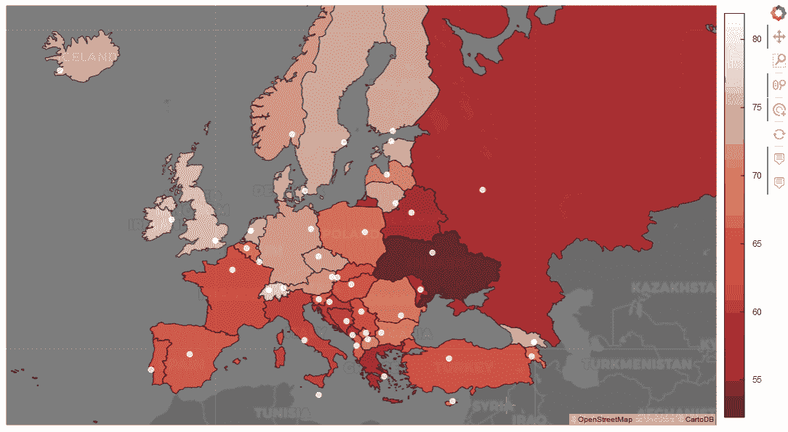
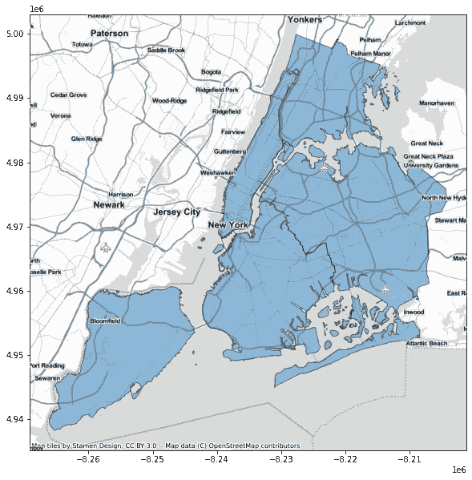
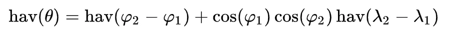

# 2022 年将使用地理空间数据的 10 大 Python 库

> 原文：<https://pub.towardsai.net/top-10-python-libraries-for-geocoding-in-2022-7202001575de?source=collection_archive---------0----------------------->



图片来自 [TDS 编辑](https://medium.com/u/7e12c71dfa81?source=post_page-----7202001575de--------------------------------)

**地理数据科学**是计算学科和应用的新兴领域。如今，现实世界中的大部分数据都与空间组件有关(例如，人口存量、交易数据、气候变化、病毒传播等……)。因此，了解如何检索、收集、清理地理要素并将其集成到数据集中是非常必要的。

无论你是否在**地理处理**或**地理计算**方面有一些技能，今天我向你推荐**最好的 Python 库**来处理、操作地理空间数据并与之交互。我还将包括找到包及其文档所需的所有**链接**，以及为**安装**运行的代码。

*我们开始吧！*

# 1.“PyCountry”，为国家标准符号。

[](https://pypi.org/project/pycountry/) [## pycountry

### pycountry 为这些标准提供了 ISO 数据库:这个包包含了 Debian 的 pkg-isocodes 的一个副本和…

pypi.org](https://pypi.org/project/pycountry/) [](https://github.com/flyingcircusio/pycountry) [## GitHub-flying circusio/py country:一个 Python 库，用于访问 ISO 国家、细分、语言…

### pycountry 为这些标准提供了 ISO 数据库:这个包包含了 Debian 的 pkg-isocodes 的一个副本和…

github.com](https://github.com/flyingcircusio/pycountry) 

**PyCountry** 模块为 ISO 标准提供以下数据库:

*   ISO [3166](https://en.wikipedia.org/wiki/ISO_3166) **国家**，其中:
    –ISO[3166–3](https://en.wikipedia.org/wiki/ISO_3166-3)删除国家
    –ISO[3166–2](https://en.wikipedia.org/wiki/ISO_3166-2)国家的细分
*   ISO[4217](https://en.wikipedia.org/wiki/ISO_4217)货币
*   ISO[639–3](https://en.wikipedia.org/wiki/ISO_639-3)语言(自然语言代码)
*   ISO[15924](https://en.wikipedia.org/wiki/ISO_15924)脚本(书写系统的代码)

我发现这个包对于从 [alpha 2](https://en.wikipedia.org/wiki/ISO_3166-1_alpha-2) 和 [alpha 3](https://en.wikipedia.org/wiki/ISO_3166-1_alpha-3) **ISO 代码**中检索国家名称特别有用(反之亦然)。

我个人认为它对于那些想要按照官方符号生成新数据(或清理现有数据)的人也非常有用，这样其他开发人员就可以更容易地复制和集成脚本和数据集。

## 安装:

```
pip install pycountry 
```

此外，我标记了一个可用的 pycountry 扩展，即[**py country-convert**](https://pypi.org/project/pycountry-convert/)，它提供了在国家名称和代码以及**大洲之间快速简单的转换功能。**

## 安装:

```
pip install pycountry-convert
```

如果你没有地理编码的经验，你想试试这个神奇的包，我给你留了一个我在 JuPyter 笔记本上做的例子的嵌入。希望你会觉得有用！

PyCountry 用法示例—作者提供的脚本

# 2.“GeoPy”，地理坐标。

[](https://pypi.org/project/geopy/) [## 地质公园

### geopy 是几种流行的地理编码 web 服务的 Python 客户端。geopy 使 Python 开发人员能够轻松…

pypi.org](https://pypi.org/project/geopy/) [](https://geopy.readthedocs.io/) [## 欢迎来到 GeoPy 的文档！- GeoPy 2.2.0 文档

### 文档 https://geopy.readthedocs.io/源代码 https://github.com/geopy/geopy 堆栈溢出…

geopy.readthedocs.io](https://geopy.readthedocs.io/) 

***GeoPy*** *让 Python 开发者轻松定位全球各地地址、城市、国家、地标的* ***坐标*** *。*

这个模块允许你检索纬度点和经度点，还可以得到邮政编码，距离等等！在各种处理地理数据的库中，这无疑是最受欢迎和最著名的一个。

还包括[OpenStreetMap nomim](https://nominatim.org/)和 [Google 地理编码 API (V3)](https://developers.google.com/maps/documentation/geocoding/) 作为可用的地理编码服务。

## 安装:

```
pip install geopy
```

# 3.“Geo-Py”，处理空间中的点。

*(没错，就是和前者不一样！)*

[](https://pypi.org/project/geo-py/) [## 地理拷贝

### 球面上的函数 geo . sphere . Approximate _ distance 近似计算距离(扩展三角…

pypi.org](https://pypi.org/project/geo-py/) 

**Geo-Py** 模块提供了与 [*大地测量*](https://pypi.org/project/geodesy/) *和地理空间数据*相关的*算法和结构，用于计算**距离**(通过在不同的公式中选择)**目的地**和**方位**，给定空间中的一些点。*

## 安装:

```
pip install geo-py
```

# 4.“反向地理编码器”，为…猜猜是什么？反向地理编码！

[](https://pypi.org/project/reverse_geocoder/) [## 反向地理编码器

### 反向地理编码器获取纬度/经度坐标，并返回最近的城镇/城市。这个图书馆改进了一个…

pypi.org](https://pypi.org/project/reverse_geocoder/) 

正如您从名称中所猜测的， **reverse_geocoder** 包接受一个*(纬度，经度)*坐标，并返回最近的城市，以及其各自的国家和行政区域 1 和 2。

因此，它可能对你处理**不同的** [**坚果等级**](https://en.wikipedia.org/wiki/Nomenclature_of_Territorial_Units_for_Statistics) 很有帮助。

## 安装:

```
pip install reverse_geocoder
```

# 5.“GeoPandas”，用于几何运算。

[](https://pypi.org/project/geopandas/) [## 地质公园

### GeoPandas 是一个为 Pandas 对象增加地理数据支持的项目。GeoPandas 的目标是使工作…

pypi.org](https://pypi.org/project/geopandas/) [](https://geopandas.org/) [## geo pandas 0 . 10 . 2+0 . g04d 377 f . dirty-geo pandas 0 . 10 . 2+0 . g04d 377 f . dirty 文档

### GeoPandas 是一个开源项目，旨在简化 python 中地理空间数据的处理。GeoPandas 扩展了…

geopandas.org](https://geopandas.org/) 

***geo Pandas****扩展了*[*Pandas*](https://pandas.pydata.org/)*使用的数据类型，允许对几何类型进行空间操作。*

这是一个流行的开源项目，旨在通过包含一些与 Pandas 非常相似的新结构来简化 Python 中的地理空间数据，如[地理数据框架](https://geopandas.org/en/stable/docs/reference/geodataframe.html)和[地理系列](https://geopandas.org/en/stable/docs/reference/geoseries.html)。



地质公园示例(图像形式[地质公园](https://geopandas.org/en/stable/gallery/plotting_basemap_background.html)

一般来说，它非常有名，用于**绘图**，因为它允许从几何数据轻松生成(甚至复杂和交互式)图表和地图。这可以通过专门设计的空间操作工具和数据结构来实现。

## 安装:

```
pip install geopandas
```

# 6.“DataPrep”，用于清洁和集成。

[](https://dataprep.ai/) [## data prep——用 Python 准备数据的最简单方法

### DataPrep 是为计算笔记本设计和优化的，这是数据科学家中最流行的环境

dataprep.ai](https://dataprep.ai/) 

这个库并不是专门为地理空间数据而创建的，而是为了收集、整合、清理和标准化任何类型的数据。这个想法是，您可以使用一个像这样的模块，用几行代码准备您的数据集，并立即开始工作。

然而，我发现利用地理数据非常有用，特别是一些有用的[功能来验证坐标](https://docs.dataprep.ai/user_guide/clean/clean_lat_long.html)，以及一个非常好的模块来检索每个国家的信息，清理它们并标准化 w.r.t. [ISO 3166](https://en.wikipedia.org/wiki/List_of_ISO_3166_country_codes) 。

这么好看的玩具，我推荐给每一个数据科学家！

## 安装:

```
pip install -U dataprep
```

# 7.“CountryInfo”，满足您的任何需求！

[](https://pypi.org/project/countryinfo/) [## 国家信息

### 一个 python 模块，用于返回关于国家、ISO 信息和州/省的数据。要访问其中一个…

pypi.org](https://pypi.org/project/countryinfo/) 

这个模块可以帮助你获得你可能需要的任何关于国家的信息！它有**20 多个 API**返回关于**面积**(平方公里)**首都城市****地区****接壤国家列表**等等的数据！

可惜我发现它非常(非常！)慢。

我试着用了很多次，但是我的代码运行了几十分钟，所以最后我放弃了它。

但是，如果您不使用大数据，并且您的数据集很小(只有几百条记录),我强烈推荐您使用它！它无疑是最完整和集成的软件包之一。

我还为这个库提供了一个例子，在一个非常小的数据框架上运行:你可以在下面的 GitHub gist 中找到它。

CountryInfo 用法示例—作者的脚本

## 安装:

```
pip install countryinfo
```

# 8.“PyPopulation”，代表人口数量。

[](https://pypi.org/project/pypopulation/) [## py 人口

### Python 3.6.1 及更高版本中使用 ISO 3166 alpha-1/2 国家代码的轻量级人口查找。目的是提供…

pypi.org](https://pypi.org/project/pypopulation/) 

这个图书馆被有意设计成“极简主义者”,所以它尽可能只做一件事:它的目的是提供在某个国家永久居住在 T21 的人数。

无论你给它国家的代码是 [alpha 2](https://en.wikipedia.org/wiki/ISO_3166-1_alpha-2) 还是 [alpha 3](https://en.wikipedia.org/wiki/ISO_3166-1_alpha-3) ，API 都会工作。

虽然这个包的用法非常简单，但是我也提供了一个简短的代码片段。

PyPopulation 用法示例—作者编写的脚本

该模块提供的人口来源于[世界银行](https://data.worldbank.org/indicator/SP.POP.TOTL)。

## 安装:

```
pip install pypopulation
```

# 9.“地理文本”，从文本中提取地理信息。

[](https://pypi.org/project/geotext/) [## 地理文本

### Geotext 从文本中提取国家和城市名称 pip 安装 https://github.com/elyase/geotext/archive/master.zip…

pypi.org](https://pypi.org/project/geotext/)  [## 欢迎来到 geotext 的文档！- geotext 0.1.0 文档

### 编辑描述

geotext.readthedocs.io](https://geotext.readthedocs.io/en/latest/) 

这是一个真正有用的(也相当快！)库，如果您使用[自然语言处理](https://en.wikipedia.org/wiki/Natural_language_processing)(无论您是否使用[*nltk*](https://www.nltk.org/) 构建了一个简单的项目，或者如果您设法设计了一些复杂的人类语言技术或应用程序)。

事实上，它的功能是从包含在文本数据中的提及中提取关于国家和城市的信息**。**

因此，该模块的主要优势之一是从非结构化数据中提取**结构化数据**。

## 安装:

```
pip install geotext
```

# 10.“哈弗森”，计算距离。

[](https://pypi.org/project/haversine/) [## 半正矢

### 使用纬度和经度计算地球上两点之间的距离(以各种单位)。pip 安装…

pypi.org](https://pypi.org/project/haversine/) 

最后，如果以前的库中可用的测地线距离的计算不满足您，这最后一个包允许您使用不同的公式来计算地球上两点之间的距离使用它们的纬度和经度。

具体来说， [**哈弗辛公式**](https://en.wikipedia.org/wiki/Haversine_formula) 如下:



哈弗森距离公式(来自维基百科)

它被表示为圆心角 *θ* (简单地说，球体上任意两点(坐标)之间的角度)的函数，并且它是直接从两点的纬度(由 *φ* 表示)和经度(由 *λ* 表示)计算出来的。

有了这个模块，输出有不同的测量单位。

## 安装:

```
pip install haversine
```

# 结论

我希望本文能为您提供一些探索地理数据科学世界的有用工具，以及处理地理空间数据的可能解决方案。

*大家好，我是* [*迪莉塔·格利亚*](https://dilettagoglia.netlify.app/) *，机器学习和大数据科学领域的初级研究员，致力于迁移理解和预测。*

*兴趣关注我:)*