# 数据科学家应该知道的 10 大 SQL 查询

> 原文：<https://pub.towardsai.net/top-10-sql-queries-a-data-scientist-should-know-99a04414d4f1?source=collection_archive---------1----------------------->


[活动创建者](https://unsplash.com/@campaign_creators?utm_source=unsplash&utm_medium=referral&utm_content=creditCopyText)在 [Unsplash](https://unsplash.com/s/photos/database?utm_source=unsplash&utm_medium=referral&utm_content=creditCopyText) 上的照片

结构化查询语言或 SQL 是一种基于查询的通用语言，用于读取、写入和管理数据库。在任何机器学习管道中，无论是数据、元数据还是日志，SQL 都被广泛应用于所有操作中。

当您使用数据库时，任何人都必须知道的四个基本操作是 CRUD(创建、读取、更新和删除)。但是，在这个博客中，我们将针对读取、更新和删除操作。

*让我们从基础开始。*

**1)选择**

如果您想知道客户的名字、姓氏和电子邮件，您可以指定所需列的列表以及关键字`SELECT`和`FROM`。

```
SELECT first_name,
       last_name,
       email 
FROM customer
```

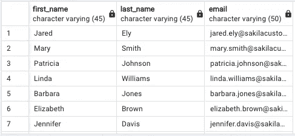

作者图片

然而，要查询表中的所有列，星号(*)是与`SELECT`一起使用的。

```
SELECT * 
FROM customer
```

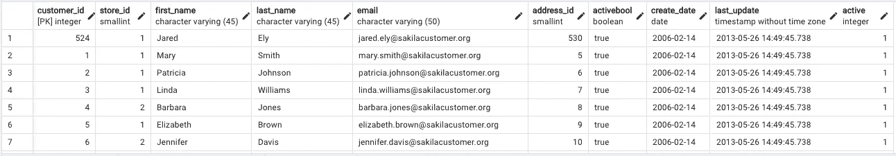

作者图片

**2)独特的**

`DISTINCT`限制查询中的重复行。 ***示例:*** *查询要打印的客户的创建日期。*

```
SELECT DISTINCT create_date
FROM customer
```

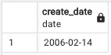

作者图片

**3)其中**

`WHERE`用于在查询中过滤结果。 ***示例:*** *查询德克萨斯区的所有地址。*

```
SELECT * FROM address
WHERE district='Texas'
```

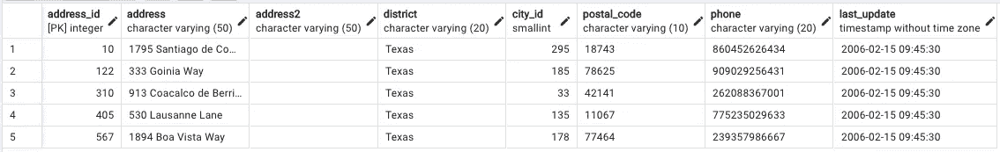

作者图片

**4)分组依据和拥有**

`GROUP BY`子句对具有相同值的行进行聚类。 ***举例:******每位客户的总付款是多少？***

```
**SELECT customer_id,
    SUM(amount) AS total_amount 
FROM payment
GROUP BY customer_id**
```

**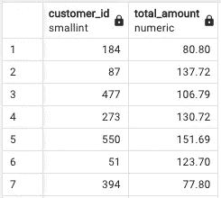**

**作者图片**

**在 SQL 中，`SUM` **、** `AVG` **、**、`COUNT`等聚合函数不能用在`WHERE`子句中。我们需要使用`HAVING`子句。**

```
**SELECT customer_id,
    SUM(amount) AS total_amount 
FROM payment
GROUP BY customer_id
HAVING SUM(amount) <=50**
```

**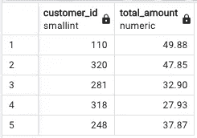**

**作者图片**

****5)排序依据和限制****

**`ORDER BY`根据特定列对结果进行升序或降序排序，ASC 和 DESC 关键字决定排序的顺序。 ***示例:*** *求出每个客户的付款总额，并按升序排序。***

```
**SELECT customer_id,
       SUM(amount) AS total_amount 
FROM payment
GROUP BY customer_id
ORDER BY total_amount ASC**
```

****

**作者图片**

**`LIMIT`将结果中的行数限制为指定的数目。 ***示例:*** *查找前 3 名最高付费客户。***

```
**SELECT customer_id, 
       SUM(amount) AS total_amount 
FROM payment
GROUP BY customer_id
ORDER BY total_amount DESC
LIMIT 3**
```

**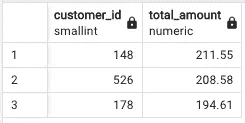**

**作者图片**

***注意:默认 Order By 子句按升序对结果进行排序。很少有 SQL 提供程序支持 TOP n 关键字来限制结果中的行数。***

****6)案例****

**`CASE`表达式遍历所有条件，并在满足第一个条件时返回值。 ***举例:*** *一个客户如果金额超过 50 就是高级客户。***

**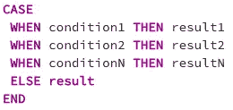**

**作者图片**

```
**SELECT customer_id,
    SUM(amount) AS total_amount,
    CASE 
     WHEN SUM(amount)>=50 THEN 'Premium Customer'
  ELSE 'Standard Customer'
    END AS customer_status
FROM payment
GROUP BY customer_id
ORDER BY total_amount ASC**
```

**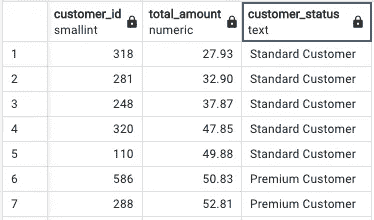**

**作者图片**

****7)加入****

**`INNER JOIN`这将导致两个表之间的公共行。**

**`LEFT JOIN`返回左表中的所有行和右表中的匹配行。如果在右表中没有找到匹配的行，则使用空值**。`RIGHT JOIN`是左连接的反序。****

**`FULL JOIN`是左右 join 的组合。如果在左表或右表中没有找到匹配的行，则使用空值**。****

**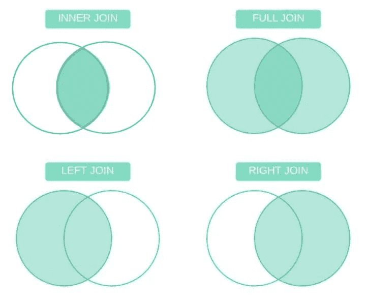**

**作者图片**

```
**SELECT c.first_name,
       c.last_name,
       c.customer_id,
       SUM(p.amount)
FROM customer c
INNER JOIN payment p
    ON c.customer_id = p.customer_id
GROUP BY c.first_name,
         c.last_name,
         c.customer_id**
```

**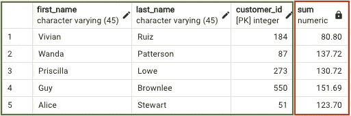**

**作者图片**

```
**SELECT c.first_name,
       c.last_name,
       c.customer_id,
       SUM(p.amount)
FROM customer c
LEFT JOIN payment p
    ON c.customer_id = p.customer_id
GROUP BY c.first_name,
         c.last_name,
         c.customer_id**
```

**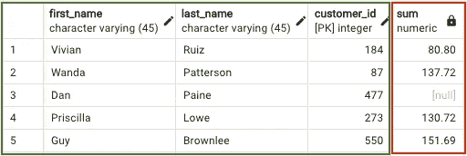**

**作者图片**

****8)子查询****

**子查询是嵌套在更大查询中的 SQL 查询。 ***举例:*****

```
**SELECT payment_id,
       amount,
       (SELECT SUM(amount) FROM payment) AS total_amount
FROM payment**
```

**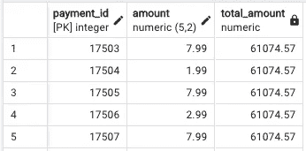**

**作者图片**

****9)带有等级的窗口函数****

**窗口函数适用于特定窗口(一组行)上的聚合和排名函数。`OVER`子句与窗口函数一起使用来定义该窗口。可与`PARTITION BY`和`ORDER BY`组合使用。**

```
**SELECT customer_id, 
    SUM(amount) AS total_amount, 
    RANK() OVER (ORDER BY SUM(amount) DESC)
FROM payment
GROUP BY customer_id**
```

**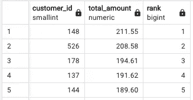**

**作者图片**

****10)插入、更新、删除和截断****

**顾名思义，`INSERT`用于将一条或多条记录推入表中，而`UPDATE`用于根据`WHERE`子句提供的某些条件修改表中的值。**

**`DELETE`和`TRUNCATE`都用于删除表中的记录，其中`DELETE`基于`WHERE`条件删除记录，`TRUNCATE`删除任意表中的所有记录。**

***注意:我们使用了 PostgreSQL，这是一个开源的关系型 DBMS，pgAdmin 作为客户端。查询在‘dvdrental’数据库上运行，我在参考资料部分提到了关于数据库和 PostgreSQL 的所有资源。***

****参考文献:****

**[1] PostgreSQL 官方页面。[https://www.postgresql.org/](https://www.postgresql.org/)**

**[2] pgAdmin 官方页面。[https://www.pgadmin.org/](https://www.pgadmin.org/)**

**[3] PostgreSQL docker 映像。[https://hub.docker.com/_/postgres](https://hub.docker.com/_/postgres)**

**[4] DVD 租赁数据库。[https://www . PostgreSQL tutorial . com/PostgreSQL-getting-started/load-PostgreSQL-sample-database/](https://www.postgresqltutorial.com/postgresql-getting-started/load-postgresql-sample-database/)**