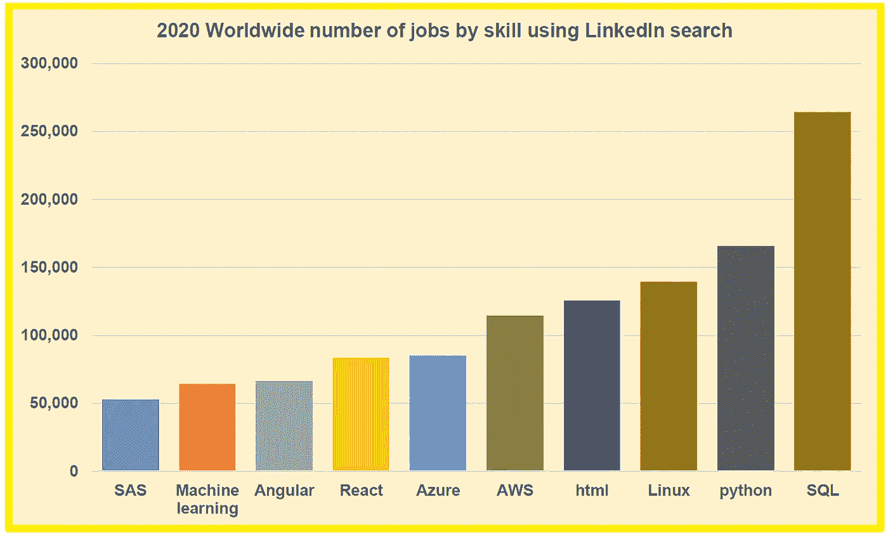
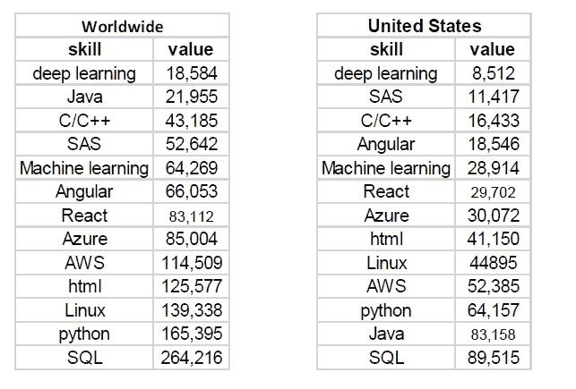

# 2020 年全球十大科技技能

> 原文：<https://pub.towardsai.net/top-10-tech-skills-in-2020-worldwide-ecef27c8d8ad?source=collection_archive---------0----------------------->

## 2020 年全球及美国十大科技技能。与数据相关的技能需求最高。

Benjamin O. Tayo 拍摄的照片

随着我们进入新的一年和新的十年，对拥有先进技术技能的个人的需求将继续增长。对具有高级技术技能的熟练工人的需求增长可归因于 3 个因素:

1.  世界正以前所未有的速度产生数据；于是，数据成为了一种价值极高的新商品。因此，需要高技能的个人来挖掘、转换和分析数据。
2.  越来越多的公司变得数据驱动。这些公司现在正在创建由熟练工人组成的团队，他们可以一起工作，利用数据的力量来改善日常业务运营或增加销售额和利润。
3.  在利用技术技能优化业务运营和决策方面，全球竞争日益激烈。因此，许多公司正在投入更多的资源来招募、雇佣和培养合适的人才，以保持在全球竞争中的优势。

如果你正在考虑加入高科技劳动力，你可能想知道你需要关注的技术技能。

为了解决这个问题，我们对全球范围内最受欢迎的技术技能做了一点研究。数据是使用 LinkedIn 平台上的求职工具(【https://www.linkedin.com/jobs/】**)收集的。由于我们对 2020 年最受欢迎的技术技能感兴趣，我们过滤了我们的搜索，只包括过去 1 个月发布的职位。例如，要搜索包含关键字"**python "**的招聘广告，我们只需在搜索框中键入" **python** "，然后使用"**发布日期**"下拉菜单，我们选择"**过去一个月。"**然后对于下一个搜索框，我们输入**地理位置**。对于每个感兴趣的技能，我们进行了两次搜索，一次是在全球范围内，另一次是在美国和 T21。我们分析了一系列不同的技术技能，然后为每个有问题的地点(全球和美国)选出了前 10 名。**

**用于我们分析的数据集如下所示:**

****

****使用 LinkedIn 求职工具的数据集。搜索时间为一个月:2019 年 12 月 18 日至 2020 年 1 月 18 日。两个关键字“全球”和“美国”用于地理位置。****

**然后使用 Excel 生成柱状图。以下是我们的分析结果(以下可视化图中仅显示了 10 大技术技能):**

********

****观察**:我们的分析显示，2020 年的大多数顶级科技工作都与数据有关。随着越来越多的公司成为数据驱动型公司，对拥有数据相关技能(数据挖掘、数据存储、数据检索、数据转换和清理以及数据分析)的工人的需求很高也就不足为奇了。我们还注意到，用于大规模数据科学项目的基础设施，如 **Linux** 、 **Azure** 和 **AWS** 也是顶级技术技能的特征。这是因为越来越多的公司将云计算用于数据科学和机器学习项目。**

**一些**顶级数据职位**需要本文中描述的一些技术技能，包括:**

**a)数据科学家**

**b)数据分析师**

**c)商业情报分析师**

**d)数据库开发者**

**e)数据库管理员**

**f)数据工程师**

**g)数据分析经理**

**h)大数据软件开发商**

**I)云开发者**

**j)云软件工程师**

**总之，我们已经讨论了一些预计在 2020 年最受欢迎的顶级技术技能。随着越来越多的公司变得由数据驱动，对拥有高级数据相关技能的员工的需求将继续增加。2020 年关注的技能将取决于一个人对什么样的技术领域感兴趣。对于数据分析师/数据科学家的工作角色来说，掌握 SQL、Python、机器学习、AWS 等技能是必不可少的。**