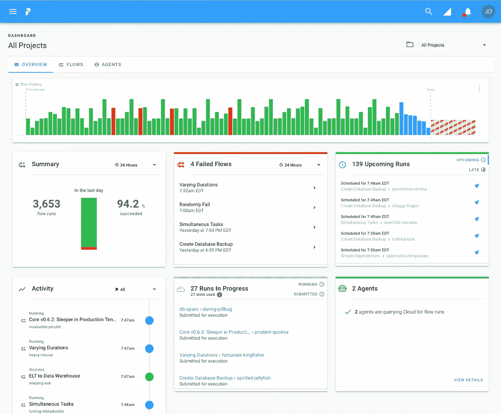

# 前 20 个数据工程工具和 5 个突出的

> 原文：<https://pub.towardsai.net/top-20-data-engineering-tools-and-5-stand-out-a71714b12f3c?source=collection_archive---------0----------------------->

## 前 20 个开源数据工程工具，以及 5 个脱颖而出的工具，用于在您的数据生命周期中部署


来自 Unsplash 的杰克·安斯蒂

我的重点是巩固

1. **Hadoop** : Hadoop 是一个开源框架[1]，允许使用简单的编程模型跨计算机集群分布式处理大型数据集。

用例:
—日志处理:Apache Hadoop 通常用于处理 web 服务器日志。它可以快速有效地处理大量数据。
—数据分析:通过使用 Hadoop，您可以获得对用户和运营的洞察。数据湖:数据湖是组织收集的所有数据的存储库。Apache Hadoop 可用于存储和处理这些数据，以便于访问和分析。

2. **Hive** : Hive 是一个构建在 Hadoop 之上的数据仓库基础设施[2]，提供数据分析和聚合的工具。Hive 通常用于数据仓库操作，包括从多个来源提取数据，并将其加载到中央存储库中以供进一步分析。此外，Hive 还可以用于 ETL(提取、转换、加载)任务，例如将数据从一种格式转换为另一种格式，或者执行聚合和汇总。Hive 还可以用于创建和查询数据集市，数据集市是为特定业务需求设计的专用数据集。


来自 Pexels 的 Christina Morillo

3. **Pig** : Pig 是一种高级数据处理语言[3]，用于分析大型数据集。在以下情况下，Pig 有助于数据工程:

—数据正在从一种格式转换为另一种格式，这种转换太复杂，无法在单个 MapReduce 作业中表达。
—数据需要分多步处理，每一步都涉及复杂的数据转换。
—有必要对大型数据集进行特别分析。

4. **Sqoop** : Sqoop 是一个能够在 Hadoop 和关系数据库之间传输数据的工具[5]。使用案例包括:

—数据传输:Sqoop 可用于将数据从 HDFS 传输到关系数据库，如 MySQL、Oracle，反之亦然。
—数据集成:将 HDFS 的数据与关系数据库的数据连接起来。
—数据分析:将关系数据库中的数据导入 Hadoop 进行分析。

5. **Flume** : Flume 是一个帮助将流数据摄取(收集、聚集和移动)到 Hadoop 中的工具。一些使用案例包括:

—处理来自社交媒体源(如 Twitter)的流数据。
—从多个服务器收集应用程序日志，并将数据集中起来以供进一步处理。
—将数据从一个 Hadoop 集群传输到另一个集群，以便进一步处理或分析。
—将来自多台服务器的日志数据收集到一个中心位置进行分析。
—创建实时流处理管道。


来自 Unsplash 的 Samuele Errico Piccarini

6.Oozie : Oozie 是 Hadoop [6]的一个工作流调度器，支持执行任务的有向无环图(Dag)。使用案例包括:

—常规数据处理作业的自动化。
—按计划运行 MapReduce 作业。
—协调涉及许多不同类型工作的大型工作流程。

7. **Zookeeper** : Zookeeper 是一个集中式服务，用于维护配置信息[7]，提供群组服务，在分布式环境中执行同步任务。一些使用案例包括:

—领导者选举:在分布式系统中，多个进程需要相互协调，并在它们之间选举一个领导者。Apache Zookeeper 使用协议和 API 来实现这种类型的协调。
—配置管理:Zookeeper 的另一个关键用例是存储和管理分布式应用程序的配置信息。例如，一个应用程序对于开发、试运行和生产环境可能有不同的配置设置。Zookeeper 可用于管理这些不同的配置，并使管理员在必要时轻松更新和回滚更改。
—组成员资格:Zookeeper 可用于跟踪一组或一群机器的成员。这对于确保只有经过授权的成员才能访问某些资源，并且所有成员都知道系统中的变化或故障非常重要。

8. **Ambari** : Ambari 是一个基于 web 的工具，用于供应、管理和监控 Apache Hadoop 集群[8]。实施包括:

—调配和管理 Hadoop 集群。
—监控和管理 Hadoop 集群。
—开发、部署和管理基于 Hadoop 的数据工程应用。


来自 Unsplash 的雅各布·基索

9.Avro : Avro 是一个与 Hadoop [9]一起使用的序列化系统，它使用 JSON 来实现与其他语言的互操作性。使用案例包括:

—数据流:Avro 通常用于数据流应用程序，因为它具有特定的大小，并且可以在考虑速度的情况下进行读写。
— NoSQL 数据库:Avro 在一些 NoSQL 数据库中使用，因为它支持数据压缩，并且可以与模式集成。
—消息代理:Avro 可用于消息代理系统，因为它支持消息序列化和反序列化。


来自 Unsplash 的 micha Parzuchowski

# 另请参见以下内容:

10. **Thrift** : Thrift 是一个跨语言的 RPC 框架[10]，可以用来开发多种语言的 Hadoop 应用。

11.Parquet :一种用于 Hadoop [11]的柱状存储格式，提供了高效的压缩和编码方案。

12. **ORC** : ORC 是一种 Hadoop 文件格式，为列数据提供了优化的存储格式[12]。

13.**HCatalog**:Hadoop[13]的表和存储管理服务，支持与其他数据处理工具的互操作性。

14. **Mahout** : Mahout 是一个与 Hadoop 一起使用的机器学习库，它提供了聚类、分类和降维的算法[14]。

15. **PigPen** :在 Apache Pig 中创建 MapReduce 程序的编程模型和工具集[15]。

16.**级联**:级联是在 Hadoop 之上开发数据处理应用的应用框架。

17.Crunch:一个用于编写、测试和运行 MapReduce 管道的 Java API[18]。

18.Chukwa : Chukwa 是一个用于监控大型分布式系统的系统，比如 Hadoop 集群[17]。

19.**Kite SDK**【19】:一套使用 Avro 数据格式开发 Hadoop 应用的库和工具。

20.DataFu 是一个库集合，用于使用 MapReduce 范式对大型数据集进行统计分析。

# 此外，了解以下 5 点:

## **1。airflow**【21】是一个以编程方式创作、调度和监控工作流的平台。

俯视有向无环图(DAG)的用户界面的可视化:


[21]

## 2.Dask 是一个灵活的并行计算库，用于 Python 中的分析。

他们陈述了以下作为他们的“美德”:

*—熟悉:提供并行化的 NumPy 数组和 Pandas DataFrame 对象。
—灵活:为自定义工作负载和与其他项目的集成提供任务调度接口。
— Native:通过访问 PyData 堆栈，在 Python 中实现分布式计算。
—注重速度:以数值算法所需的低延迟和最小串行化进行操作。
—纵向扩展:在具有数千个内核的集群上运行。
—缩小规模:在笔记本电脑上设置和运行一个简单的过程。
—响应迅速:设计时考虑了交互式计算，可提供快速反馈和诊断来帮助用户。*

查看 Dask 数据帧如何模仿熊猫:

```
import pandas as pd                     
df = pd.read_csv('2015-01-01.csv')      
df.groupby(df.user_id).value.mean()vsimport dask.dataframe as dd
df = dd.read_csv('2015-*-*.csv')
df.groupby(df.user_id).value.mean().compute()
```

## 3.**Prefect**【23】是一个为现代基础设施设计的工作流管理系统，由开源的 Prefect 核心工作流引擎提供支持。

用户将**任务**组织成**流**，提督负责剩下的。

```
from prefect import task, Flow, Parameter

@task(log_stdout=True)
def say_hello(name):
    print("Hello, {}!".format(name))

with Flow("My First Flow") as flow:
    name = Parameter('name')
    say_hello(name)

flow.run(name='world') # "Hello, world!"
flow.run(name='Marvin') # "Hello, Marvin!"
```

以下是用户界面和服务器的示例:



[23]

## 4.**Pachyderm**【24】是一个容器化的数据科学平台。他们试图将机器学习生命周期自动化和规模化，并考虑到可重复性；他们专注于数据驱动的自动化、Pb 级可扩展性和端到端可再现性。

## 5.**Seldon Core**【25】是一个开源的机器学习平台，用于在 Kubernetes 上部署机器学习模型。

Seldon Core 服务于在任何开源构建框架中构建的模型。您可以利用 Kubernetes 的特性，比如定制资源定义来管理模型图，并且可以连接您的持续集成和部署(CI/CD)工具来扩展和更新您的部署。他们在 Kubernetes 上构建了这一功能，以便能够在任何云或内部解决方案上运行。因为 Seldon Core 的定位是框架不可知的，所以它们支持机器学习库、工具包和语言。此外，您还可以选择运行推理图，用于带有实验、集合和转换器的高级部署。

如果您有任何编辑/修改建议或关于进一步扩展此主题的建议，请考虑与我分享您的想法。

# **另外，请考虑订阅我的每周简讯:**

[](https://pventures.substack.com/) [## 周日报告#1

### 设计思维与 AI 的共生关系设计思维能向 AI 揭示什么，AI 又能如何拥抱…

pventures.substack.com](https://pventures.substack.com/) 

# 我已经写了以下与这篇文章相关的内容；你可能对它们感兴趣:

# **非结构化数据与结构化数据:5 个最重要的区别**

[](/unstructured-vs-structured-data-the-5-most-important-differences-8d86078a163b) [## 非结构化数据与结构化数据:5 个最重要的区别

### 结构化数据、非结构化数据的分类、各自的优势，以及如何将它们部署在一起…

pub.towardsai.net](/unstructured-vs-structured-data-the-5-most-important-differences-8d86078a163b) 

# 2022 年的 12 种基本数据科学工具及其最佳实践

[](/12-essential-data-science-tools-in-2022-along-with-their-best-practices-ffae0b9f865f) [## 2022 年的 12 种基本数据科学工具及其最佳实践

### 考虑建立一个工具包，无论是新手还是高级专业人员，它包括这 12 个每天使用的工具…

pub.towardsai.net](/12-essential-data-science-tools-in-2022-along-with-their-best-practices-ffae0b9f865f) 

# 大数据可视化指南:与数据和技术的 10 大差异

[](/visual-guide-to-big-data-10-differences-vs-data-and-technologies-7bd8b27ba87) [## 大数据可视化指南:与数据和技术的 10 大差异

### 了解数据和大数据之间的 10 个区别，大数据实施中采取的 4 个高级步骤…

pub.towardsai.net](/visual-guide-to-big-data-10-differences-vs-data-and-technologies-7bd8b27ba87) 

*参考文献。*

*1。Apache Hadoop。(未注明)。检索到 2022 年 7 月 20 日，来自 https://hadoop.apache.org*[](https://hadoop.apache.org/)

**2。阿帕奇蜂房。(未注明)。检索到 2022 年 7 月 20 日，来自*[*https://hive.apache.org*](https://hive.apache.org/)*

**3。欢迎来到阿帕奇猪！(未注明)。检索 2022 年 7 月 20 日，来自*[*https://pig.apache.org*](https://pig.apache.org/)*

**4。欢迎来到阿帕奇水槽-阿帕奇水槽。(未注明)。检索到 2022 年 7 月 20 日，来自【https://flume.apache.org】[](https://flume.apache.org/)**

***5。Sqoop。(未注明)。检索 2022 年 7 月 20 日，转自*[*https://sqoop.apache.org*](https://sqoop.apache.org/)**

***6。$maven.build.timestamp .(未标明)。Oozie。面向 Hadoop 的 Apache Oozie 工作流调度器。检索 2022 年 7 月 20 日，转自*[*https://oozie.apache.org*](https://oozie.apache.org/)**

***7。阿帕奇动物园管理员。(未注明)。检索 2022 年 7 月 20 日，转自*[*https://zookeeper.apache.org*](https://zookeeper.apache.org/)**

***8。安巴里。(未注明)。检索 2022 年 7 月 20 日，转自*[*https://ambari.apache.org*](https://ambari.apache.org/)**

***9。欢迎来到阿帕奇 Avro！(未注明)。检索 2022 年 7 月 20 日，来自*[*https://avro.apache.org*](https://avro.apache.org/)**

***10。阿帕奇节俭。(未注明)。回家。检索 2022 年 7 月 20 日，来自*[*https://thrift.apache.org*](https://thrift.apache.org/)**

***11。阿帕奇拼花地板。(未注明)。阿帕奇拼花地板。检索到 2022 年 7 月 20 日，来自*[*【https://parquet.apache.org】*](https://parquet.apache.org/)**

**12。Apache ORC 适用于 hadoop 的高性能列存储。(未注明)。检索 2022 年 7 月 20 日，来自[](https://orc.apache.org/)**

****13。HCatalog。(未注明)。Cloudera 文档。2022 年 7 月 20 日检索，来自*[*https://docs . cloud era . com/documentation/enterprise/6/6.3/topics/hcatalog . html # hcatalog _ guide*](https://docs.cloudera.com/documentation/enterprise/6/6.3/topics/hcatalog.html#hcatalog_guide)***

***14。阿帕奇看象人。(未注明)。检索到 2022 年 7 月 20 日，来自*[【https://mahout.apache.org//】T21](https://mahout.apache.org/)**

**15。Map-Reduce for clojure。GitHub。检索到 2022 年 7 月 20 日，来自[*https://github.com/Netflix/PigPen*](https://github.com/Netflix/PigPen)**

**16。层叠。(未注明)。层叠。检索 2022 年 7 月 20 日，转自[*https://www.cascading.org*](https://www.cascading.org/)**

**17。Chukwa —欢迎来到 apache Chukwa。(未注明)。欢迎来到阿帕奇楚克瓦。检索 2022 年 7 月 20 日，转自[*https://chukwa.apache.org*](https://chukwa.apache.org/)**

***18。阿帕奇嘎吱嘎吱。(未注明)。阿帕奇嘎吱嘎吱。检索 2022 年 7 月 20 日，转自*[*https://crunch.apache.org*](https://crunch.apache.org/)**

***19。kite:Hadoop 的一个数据 API。(未注明)。检索 2022 年 7 月 20 日，来自*[*http://kitesdk.org/docs/current/*](http://kitesdk.org/docs/current/)**

**20。阿帕奇 DataFu。(未注明)。检索 2022 年 7 月 20 日，来自[*https://datafu.apache.org*](https://datafu.apache.org/)**

***21。回家。(未注明)。阿帕奇气流。检索 2022 年 7 月 20 日，来自*[*https://airflow.apache.org*](https://airflow.apache.org/)**

***22。达斯克。(未注明)。缩放您喜欢的 Python 工具。检索到 2022 年 7 月 20 日，来自*[*【https://www.dask.org】*](https://www.dask.org/)**

**23。地方长官。(未注明)。GitHub — PrefectHQ/prefect:自动化数据的最简单方法。GitHub。检索 2022 年 7 月 20 日，来自[](https://github.com/PrefectHQ/prefect)**

****24。产品。(2022 年 2 月 2 日)。厚皮公司*[*https://www.pachyderm.com/products/#community-edition*](https://www.pachyderm.com/products/#community-edition)***

***25。*[【https://www.seldon.io/solutions/open-source-projects/core】T21](https://www.seldon.io/solutions/open-source-projects/core)**