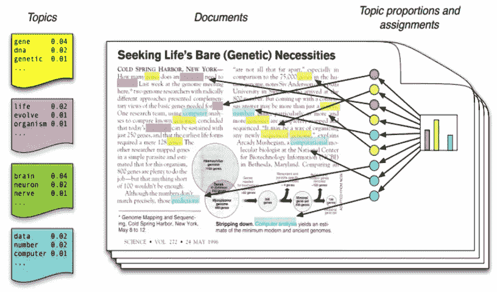
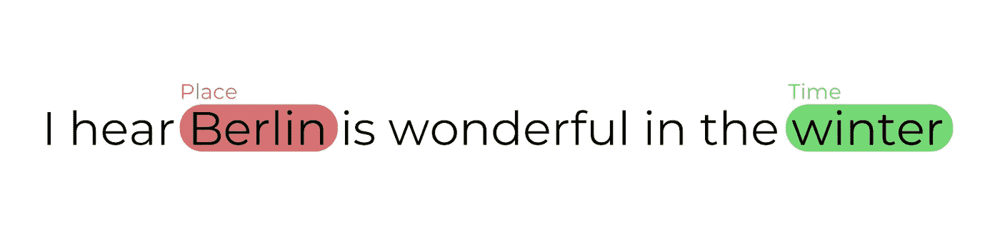
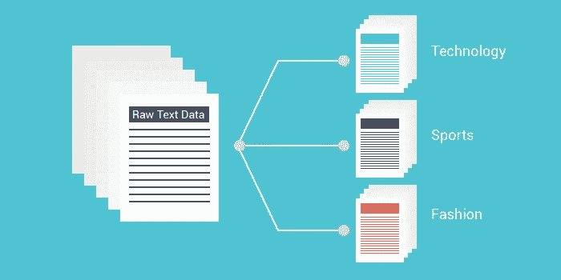

# 数据科学家应该知道的 3 大 NLP 用例

> 原文：<https://pub.towardsai.net/top-3-nlp-use-cases-a-data-scientist-should-know-637eacc3d1d4?source=collection_archive---------0----------------------->

## [自然语言处理](https://towardsai.net/p/category/nlp)

## 数据科学家如何处理文本

由 [Dmitry Ratushny](https://unsplash.com/@ratushny?utm_source=unsplash&utm_medium=referral&utm_content=creditCopyText) 在 [Unsplash](https://unsplash.com/s/photos/language?utm_source=unsplash&utm_medium=referral&utm_content=creditCopyText) 上拍摄的照片

本文旨在探索数据科学家在处理自然语言处理(NLP)时面临的最常见用例。设置场景，我们假设您是 NLP 新手，但不一定是数据科学新手。

作为数据科学家，我们经常需要处理非结构化数据。如果您不熟悉这个术语，那么可以将结构化数据想象成 Excel 或实际数据库中的一个表，其中每一列都是一个特征或属性。因此，与之相反的(非结构化)是我们没有这种格式。通常，这意味着我们必须处理图像或文本。NLP 处理文本的计算，它是关于让计算机理解我们的书面语言。如果你愿意，我们的总体目标或通用目标是创建理解文本的模型，就像人类理解文本一样。我们还没有做到这一点，但我们可以创建在不同环境中有用的模型。通常，作为数据科学家，我们面临三个与文本相关的常见任务。

## 主题建模

当我们有很多文档时，需要主题建模，我们希望将它们“自动”分组到不同的集合(集群)中，每个集合与一个特定的主题相关。可以说，最著名的方法是潜在的狄利克雷分配(LDA)。简而言之，LDA 假设文档具有混合的主题，因此每个主题可以根据它们的分布生成单词。所以，当我们使用 LDA 时，它基本上告诉我们每个文档是由哪些主题创建的。

当我们没有关于给定文档集的特定信息，并且我们想要创建一些我们怀疑或想要我们的文档被分组的组时，这是有用的。

在 SHIVAM BANSAL 的博客文章中发现的流行图片

有关主题建模的更多信息，您可以查看这里的[和/或这里的](https://www.analyticsvidhya.com/blog/2016/08/beginners-guide-to-topic-modeling-in-python/)和/或。

## 命名实体识别

命名实体识别(NER)是识别文档中引用的实体的任务。例如，可能有名称、公司、地址、产品等。为了实现高水平的准确性，通常需要大量带注释的训练数据，其中机器学习模型可以基于给定文档中的上下文学习所有不同的实体。这意味着每当我们感兴趣的实体出现时，必须有人手动检查大量文档并对其进行注释。

在这个系统的核心，通常有两个步骤:首先，模型需要理解一个或多个单词是否是一个实体。鉴于它们是一个实体，那么就对其进行正确的分类。

图片来自[克里斯托弗·马歇尔](https://medium.com/mysuperai/what-is-named-entity-recognition-ner-and-how-can-i-use-it-2b68cf6f545d)的博客文章

可以在[这里](https://medium.com/mysuperai/what-is-named-entity-recognition-ner-and-how-can-i-use-it-2b68cf6f545d)找到一个非常好的博客来进一步理解这一点。

另外，[这里的](https://towardsdatascience.com/named-entity-recognition-with-nltk-and-spacy-8c4a7d88e7da)是一个更加关注使用 python 和相关库的实现方面的博客。

## 文本分类

NER 包括文本分类，但通常最常见的任务只是预测给定文本的一些内容。这类似于任何数据科学用例，其中你根据相关数据训练机器学习模型，在这种情况下，文本并尝试从新的看不见的文本中预测一些东西。

简单来说，在任何其他机器学习监督的任务中，给定一组带有相应标签的特征，我们可以创建模型来预测这些标签。在这种情况下，我们的特征是从文本中提取的。鉴于文本可以用多种方式表示，深度学习方法经常被使用，特别是考虑到通常有机会在大量数据上进行训练。

图片来自 [Rohit Agrawal](https://towardsdatascience.com/analyzing-text-classification-techniques-on-youtube-data-7af578449f58) 的博客文章

一个很好的来源是后面的[。](https://towardsdatascience.com/text-classification-in-python-dd95d264c802)

正如我们提到的，深度学习方法效果最好，尤其是在大量数据的情况下。[本例](https://towardsdatascience.com/bert-text-classification-using-pytorch-723dfb8b6b5b)使用深度学习方法对假新闻进行分类。

喜欢这篇文章吗？成为 [*中等会员*](https://azenresearchlabs.medium.com/membership) *继续无限制学习。如果你使用下面的链接，我会收到你的一部分会员费，不需要你额外付费。*

您可能还会对以下内容感兴趣:

 [## 每个数据科学家都会犯的 3 大编程错误

### 如何使用熊猫、Sklearn 和函数

towardsdatascience.com](https://towardsdatascience.com/top-3-programming-mistakes-every-data-scientist-makes-c0a0476de3b9)  [## 数据科学家最常被问到的 3 个 Python 面试问题

### 面向数据科学家的顶级 python 面试问题

towardsdatascience.com](https://towardsdatascience.com/3-most-asked-python-interview-questions-for-data-scientists-1a2ad63ebe56)