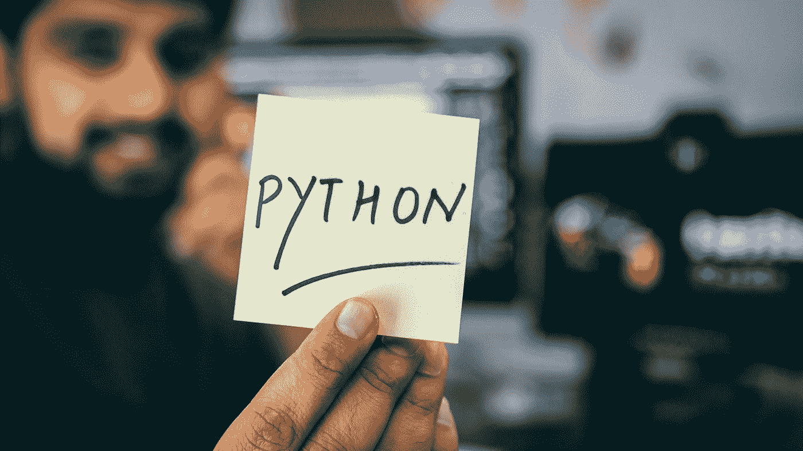

# 2021 年掌握 Python 的三大资源

> 原文：<https://pub.towardsai.net/top-3-resources-to-master-python-in-2021-4b1510552dc0?source=collection_archive---------1----------------------->

## [编程](https://towardsai.net/p/category/programming)， [Python](https://towardsai.net/p/category/programming/python)

## 学习最流行的编程语言的推荐资源

由[在](https://unsplash.com/@hiteshchoudhary?utm_source=medium&utm_medium=referral) [Unsplash](https://unsplash.com/?utm_source=medium&utm_medium=referral) 上拍摄的照片

ython 是一种解释型的高级通用编程语言。在过去的许多年里，它越来越受欢迎，成为最流行的编程语言。

## **是什么让 Python 如此受欢迎？**

人们喜欢 Python 的原因有上百种。最常见的原因似乎是——可读性、简单性、易用性、庞大的社区(快速增长)、第三方库(如 Pandas、Numpy、Scikit-learn 等)。).你可以做系统编程，图形用户界面，数字和科学编程。它可以用于自然语言分析、可视化、图像处理、机器学习。唉！不胜枚举。

## **如何精通 Python(或任何编程语言)？**

*   你学习 Python 可能是为了机器学习或者 Web 开发或者可视化或者系统编程等等。但是你需要对基本原理有很好的了解。我不是指 Numpy，熊猫，Scikit-learn 等。包，但编程语言的核心概念，如数据类型、函数、循环、OOP(类和对象)、生成器、模块和包等。重要的是，你不仅要学会如何使用它，还要了解它是如何工作的。这些知识会让你精通任何编程语言。
*   除了学习或参加课程，重要的是练习编码，开发个人项目，向热情的程序员学习(阅读博客/讨论/提问/建立网络)，写关于你所学概念的博客。

这将帮助你精通 Python 或任何你感兴趣的编程语言。根据个人的学习风格、时间和其他因素，掌握 Python 的基础知识可能需要几周到几个月的时间。然而，你可以在短短几天内高水平地学习非常基础的 Python，并开始使用它。

我尝试了几门课程和几本书来学习 Python，下面是帮助我彻底理解 Python 核心概念的顶级资源列表。相信我，一旦你完成了这些推荐的课程/书籍，你的 Python 知识将达到一个不同的水平，你将对解决任何问题充满信心。

# ***推荐意见***

# 1.Fred Baptiste 的 Python Deep Dive (Udemy)

这是 Udemy 上最好的 Python 课程，教授 Python 深度学习，这样每个人都能理解。指导老师弗雷德·巴普蒂斯特拥有数学博士学位。他从事编程已经 25 年了，从 2011 年开始学习 Python。弗雷德的教学风格和他对细节的关注令人惊叹。你会非常清楚地了解事情在记忆层面是如何运作的。我向所有 Python 爱好者推荐这个。

## a) Python 3:深潜(第 1 部分—功能)

第 1 部分涵盖了数据类型、函数、装饰器、模块和包、内存管理等。

 [## Python 3:深潜(第 1 部分-功能)

### 你好！这是一系列课程的第一部分，旨在深入研究…的内部机制和更复杂的方面

www.udemy.com](https://www.udemy.com/course/python-3-deep-dive-part-1/) 

## b) Python 3:深潜(第 2 部分——迭代、生成器)

第 2 部分涵盖了序列类型(比如列表、元组)、迭代和迭代器、生成器、上下文管理器、协同例程等。

 [## Python 3:深入研究(第 2 部分——迭代，生成器)

### 本 Python 3: Deep Dive 系列的第 2 部分深入探讨了:我将向您展示 Python 中迭代是如何工作的…

www.udemy.com](https://www.udemy.com/course/python-3-deep-dive-part-2/) 

## c) Python 3:深潜(第 3 部分——散列图)

第 3 部分涵盖了哈希映射、字典和集合、有序字典、第三方包 JSON 模式、Marshmallow、PyYaml 和 Serpy 第三方库等。

 [## Python 3:深潜(第 3 部分——散列图)

### 本课程深入探讨了 Python 词典。字典在 Python 中无处不在。类本质上是…

www.udemy.com](https://www.udemy.com/course/python-3-deep-dive-part-3/) 

## d) Python 4:深潜(第 4 部分——OOP)

第 4 部分涵盖了 OOP 概念——类、对象、方法、绑定、继承、元编程等。

 [## Python 3:深潜(第 4 部分- OOP)

### 我叫弗雷德·巴蒂斯特。我的职业生涯始于一个数学博士学位，并且一直在为…

www.udemy.com](https://www.udemy.com/course/python-3-deep-dive-part-4/) 

# 2.马克·卢茨的书

马克·卢茨是关于 Python 的三本畅销书的作者——学习 Python、编程 Python 和 Python 袖珍参考。Mark 自 1992 年起就加入了 Python 社区。因此，向这位在过去 28 年里一直从事 Python 研究的伟大作者学习是有意义的。

## a)学习 Python

从本书中获得对 python 基础的清晰理解。

 [## 学习 Python，第 5 版

### 通过这本动手操作的书，获得对核心 Python 语言的全面、深入的介绍。基于作者标记…

www.oreilly.com](https://www.oreilly.com/library/view/learning-python-5th/9781449355722/) 

## b)编程 Python

一旦你从**学习 Python** 中掌握了基础知识，这将是你的下一本书，讲述如何使用 Python 构建现实世界的应用程序。这本书建立在学习 Python 所获得的知识之上。所以，我的建议是，一旦你完成了 Python 的学习，或者如果你有 Python 的中级技能，就通读一下这本书。

 [## 编程 Python，第 4 版

### 如果你已经掌握了 Python 的基础，你就可以开始使用它来完成真正的工作了。编程 Python 将…

www.oreilly.com](https://www.oreilly.com/library/view/programming-python-4th/9781449398712/) 

# 3.流畅的 Python

这本书的目标读者是具备 Python 基础/中级知识的人。在本书中，作者卢西亚诺·拉马尔霍更详细地解释了核心概念，并将您的 Python“流利度”提升到了一个新的水平。

 [## 流畅的 Python

### Python 的简单性让您很快变得高效，但这通常意味着您没有使用它必须的一切…

www.oreilly.com](https://www.oreilly.com/library/view/fluent-python/9781491946237/) 

# 最后的想法

感谢您阅读本文。如果你喜欢这些 Python 课程/书籍，请与你的朋友和同事分享。如果您有任何问题或反馈，请留言。

*最初发表于 2020 年 12 月 14 日 pythonsimplified.com**的* [***。***](https://pythonsimplified.com/top-3-resources-to-master-python-in-2021/)

我希望你喜欢阅读这篇文章。如果你喜欢我的文章并想订阅 Medium，你可以在这里这样做:

 [## Chetan Ambi -介质

### 阅读 Chetan Ambi 在媒体上的文章。数据科学|机器学习| Python。参观 https://pythonsimplified.com/…

chetanambi.medium.com](https://chetanambi.medium.com) 

*阅读更多关于 Python 和数据科学的此类有趣文章，* [***订阅***](https://pythonsimplified.com/home/) *到我的博客*[***www.pythonsimplified.com******。*** 你也可以在](http://www.pythonsimplified.com)[**LinkedIn**](https://www.linkedin.com/in/chetanambi/)**上联系我。**