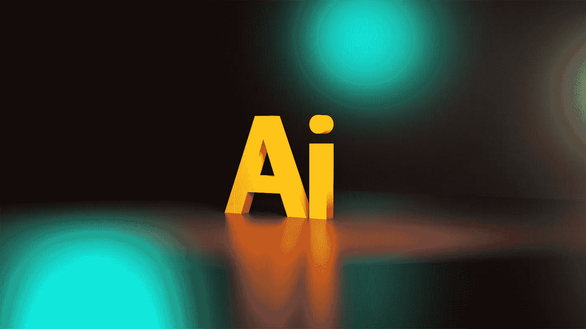

# 2022 年汽车行业的五大人工智能趋势

> 原文：<https://pub.towardsai.net/top-5-ai-trends-in-the-automotive-industry-in-2022-355339e0c75b?source=collection_archive---------2----------------------->

## [人工智能](https://towardsai.net/p/category/artificial-intelligence)

## 影响车辆架构的领先人工智能技术

照片由[杰克森索](https://unsplash.com/@jacksonsophat?utm_source=unsplash&utm_medium=referral&utm_content=creditCopyText)在 [Unsplash](https://unsplash.com/s/photos/2022-ai?utm_source=unsplash&utm_medium=referral&utm_content=creditCopyText) 上拍摄

# 数据是机器学习的重要组成部分

数据的影响力与日俱增。这是因为机器学习算法在学习和分析数据以及为企业增加价值方面变得越来越强大。当被正确和有效地解释时，数据是新的逻辑。多维数据可以回答复杂的查询，更精确地解决问题。选择有价值的数据，提取统计数据特征，如均值和方差，以及导致负责任的人工智能的数据的可观察性是数据分析的一部分。此外，基于云的解决方案中的数据隐私和治理以及 ML 开发的数据收集过程是关键的需求和紧迫的。

# 现状

现有的机器学习或深度学习算法如物体识别、分类等将在 2022 年得到改进和进一步发展。已经有很多性能令人满意的基本机器学习模型。我们将有更多可用的 ML 模型或算法的组合来解决未来新的和更复杂的功能。

目前，重点仅在于使用人工智能实现主要功能。但是，当使用基于人工智能的组件时，安全、保障和许多其他非功能性质量要求(如可用性)还不是汽车工程师的重点。在统计分析、分类、预测或自动化用例领域，AI 将对任何行业产生长期影响，但 AI 对汽车行业的短期影响是什么？以下是人工智能将在未来一年影响的五大关键汽车领域。

## 1.制造业、人形机器人和劳动力

AI 可以取代重复性的工作，主要从事制造业的人必须发展自己的技能。机器人变得越来越聪明，可以完成有限的任务。目前，学习编程语言作为新技能的意愿很高，但由于新的低代码/无代码平台或 GPT3 Codex 代码生成器的增长，这似乎不是正确的方向。

人形机器人将受益于人工智能的进步，来完成可以自动化的日常人类任务。危险的工作也是人工智能控制的机器人是最佳解决方案的领域。

## 2.维护、服务和保险

预测性维护是人工智能的一个新的工业趋势，它也可以帮助汽车行业预测车辆零件的故障，并降低最终产品成本。**驾驶员行为可以帮助保险公司计算单个驾驶员的风险，改善城市驾驶体验，最终减少事故数量，提高道路安全性。**

预测性维护使用数字孪生技术来预测系统行为的未来。结合了现实世界和虚拟世界的数字孪生概念并不新鲜。尽管如此，它确实有助于车辆部件的验证。特别是在自动驾驶领域，我们可以从数字双胞胎中受益。**我们可以使用历史数据和人工智能算法监控系统，并预测未来的故障，通过更换相关部件或提前计划维护活动来避免系统故障。**

## 3.安全性、可靠性、有效性和可解释性

GAN(生成对抗网络)是一种新的机器学习或用图表示数据的方法，将显著提高安全性和安全性分析。**安全分析过程中的危害分析和风险评估(HARA)和安全分析过程中的威胁分析和风险评估(TARA)可以用图形表示，通过可用的统计方法发现节点和边之间的关系。**我们可以使用统计技术和相应的机器学习算法来进一步深入分析。

GAN 可以生成不同的有效驾驶场景，帮助识别未知场景，以测试和验证复杂的车辆功能。**在新联网和自动化车辆的安全、安保和验证这三个领域，识别未知的未知是一个主要难题。**

可解释的 AI 意味着 AI 为什么做出决定是自动驾驶汽车安全的组成部分。我们应该解释，算法没有偏见，从大多数人的角度来看，所做的决定是正确的。**电车问题表明，我们需要这样的可解释性，以确保 ML 算法足够成熟，能够控制汽车，并成为我们交通中的安全参与者。**

联合学习应该是 ML 管道的一部分，以保证数据隐私和治理。联合学习可以回答谁拥有数据的问题。

## 4.AI DevOps 的 CI/CD

MLOps 元素因 ML 持续集成和持续部署而众所周知，但并非专门针对汽车行业。汽车人工智能专家需要一种整体方法来支持整个汽车生命周期，从概念阶段到设计和开发，再到现场监控。

**该汽车专用 ML 管道应解决传统汽车开发和自动驾驶开发相关问题，以及整个集成和供应流程的额外要求。**

## 5.环境感知

由于自动驾驶技术和 ADAS(高级驾驶辅助系统)的新独立功能，记录车辆周围环境的车辆传感器的数量正在增加。AI 为环境感知提供了强大的工具，如用于相机的 CNN(卷积神经网络)或用于雷达传感器的深度学习算法。

**主动学习提高了人工智能的性能，比目前用于训练人工智能模型的被动监督学习更具优势。**主动学习是成熟的人工智能模型的关键，该模型使用真实世界的交通场景来实现 4 级和 5 级自动驾驶。

# 观点

最终，所有的人工智能活动都应该在一定程度上帮助社会提高人们的生活质量。不管是什么行业，负责任的人工智能开发作为可解释的人工智能必须是所有人工智能进步的基础。**随着收集的数据量的增长，必须弄清楚这些数据在哪里被使用以及为什么被使用。普遍尊重人权需要全世界的共识。**如果没有这些考虑，开发人工通用智能(AGI)的下一步将使情况变得复杂。虽然人类水平上的理解还不可能，但我们有一个人类版本的 2.0，只要 AI 可以像人类一样理解，因为 AI 可以访问所有可用的知识。在那之前，我们有足够的时间就引进和应用人工智能技术达成协议。