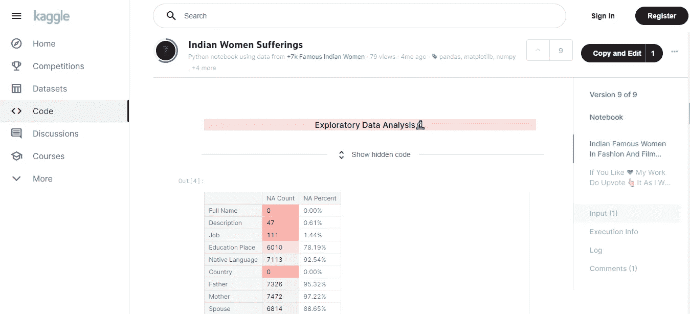
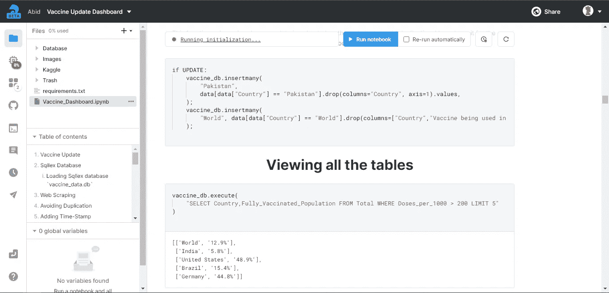
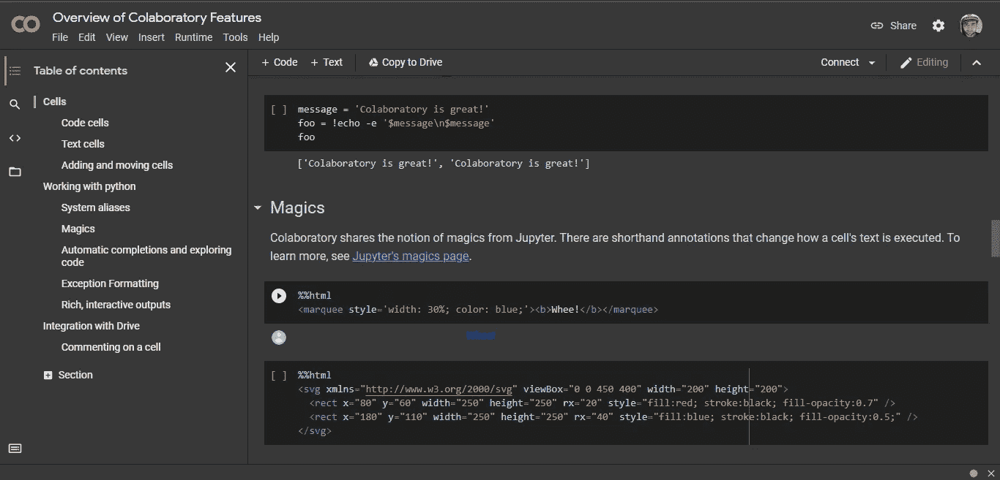
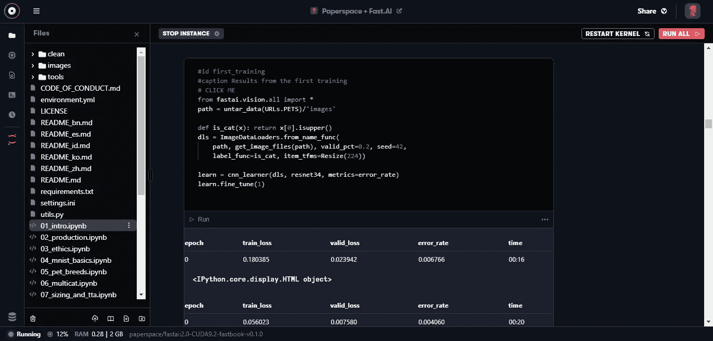
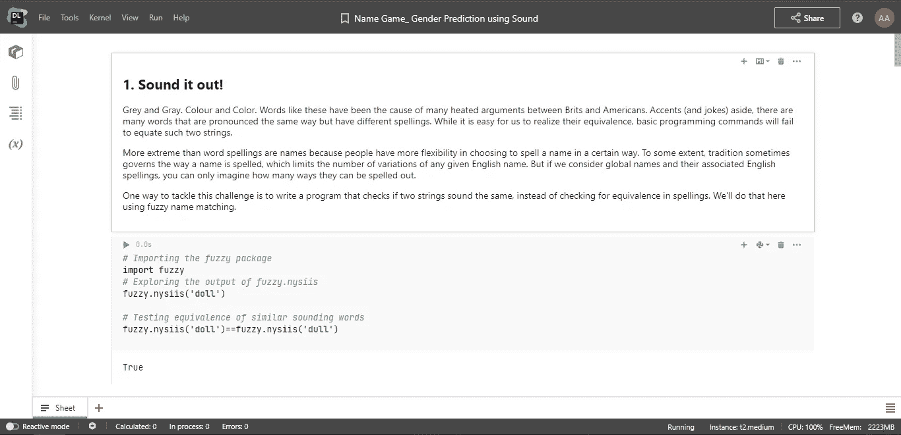

# 2021 年数据科学五大免费云 ide

> 原文：<https://pub.towardsai.net/top-5-free-cloud-ide-for-data-science-2021-9c129745590b?source=collection_archive---------1----------------------->

## [数据科学](https://towardsai.net/p/category/data-science)

## 借助内置环境、CPU、存储和 python 包的顶级免费 IDE，开始您的数据科学生涯。学习新技能，创建一个项目，并与他人分享。

作者图片| rawpixel.com 元素

# 云集成开发环境

IDE 或集成开发环境是一个代码编辑器，具有额外的功能来提高性能。ide 通过提供编写、测试、调试和构建解决方案的一站式解决方案，提高了程序员的工作效率。 [Codecademy](https://www.codecademy.com/articles/what-is-an-ide) 。

云 IDE 消除了在实际开始编码之前创建环境的麻烦，比如安装 IDE、协作、存储和计算能力。现代 Cud IDEA 是建立在 Jupyter 笔记本上的，它们为您提供了编写和部署工作所需的一切。在线 ide 允许在云中构建、测试和评审项目[斜面](https://www.slant.co/topics/713/~best-cloud-ides)。

Jupyter 笔记本可以说是数据科学中使用最广泛的工具。JetBrains 的数据博客。Jupyter notebook 是一个基于 web 的交互式计算环境，它带有一个输入/输出单元来执行一段代码。你也可以在笔记本上以 markdown 的形式写文档，就像你在起草一篇技术文章一样。

# 1.卡格尔

作者 Kaggle 笔记本| Kaggle.com

Google LLC 的子公司 Kaggle 是一个数据科学爱好者的在线社区，但不仅仅是这样。您可以发布数据集和笔记本。Kaggle 允许用户参加一场数据科学竞赛并赢得奖品，他们还免费提供云 IDE(内核)，以便用户可以分享和讨论改进机器学习模型。 [Kaggle —简介](https://en.wikipedia.org/wiki/Kaggle)

Kaggle 平台已经发展成为数据科学家的完整生态系统，用户可以在 **CPU、**GPU 和 **TPU** 上运行笔记本。你也可以运行 **python** 或者 **R** 脚本。简而言之，如果你正考虑在数据科学的子领域开始你的职业生涯，请从 Kaggle 平台开始，因为你有最大的数据科学家社区，他们每天都在分享他们的想法。Kaggle 为数据科学家和机器学习从业者提供一站式服务，让他们作为一个社区共同竞争和成长。更多信息 [Kaggle —维基百科](https://en.wikipedia.org/wiki/Kaggle)或访问 [Kaggle](https://www.kaggle.com/) 网站

## 报名的时候会得到什么？

*   **友好社区**
*   **空闲 CPU**
*   **现场协同编码**
*   **每个项目 5GB 存储**
*   **自定义环境**
*   **发布平台**
*   **数据库集成**
*   **新的细胞类型**
*   **计划运行**
*   **项目历史/快照**

我和 Kaggle 的经历是惊人的，很快，你就开始明白如何运行你的代码或派生其他作品。IDE 运行速度超快，而且干净利落。社区超级友好，多个正在进行的竞争使这个平台保持有趣，因为全世界的机器学习工程师都在努力争取荣耀和巨大的价格池。也可以少学几门课程，完成课程拿到证书。您还可以为您的班级或大众举办公开或私人的数据科学竞赛。这个平台提供了所有必要的工具，可以让您在处理真实世界的数据时为真实世界的项目做好准备，并且随着您在竞争环境上花费更多时间，竞争环境会让您变得更好。

# 2.深度笔记

作者 Deepnote 笔记本| Deepnote.com

Deepnote 是一款为团队和实时协作而打造的数据科学笔记本。它允许您创建、构建和共享数据科学项目。交互式用户界面使它成为初学者在 **python** 、 **R** 和 **Julia** 上编码的一个有吸引力的选择。该平台允许您专注于编码和构建数据科学解决方案，并将其他工作留给 deep note IDE[Jakub Jurovych](https://dataled.academy/tools/deepnote/)。

Deepnote 是这个行业的新竞争者，并迅速上升到顶端。它有一个活跃的、乐于助人的社区，甚至公司的 **CEO** 也在与用户互动。该平台提供实时支持，您可以建议新功能或错误报告，他们会很快将其添加到开发流程中。Deepnote 内核附带了所有基本的库、日程笔记本、现代 UI 和免费的团队计划。您可以向您的团队免费添加最多三名成员，并使用实时协作工具开始项目工作。当你完成工作后，你可以将你的笔记本发布为一篇文章或者一个 **WebApp** 。欲了解更多信息，请访问 [Deepnote](https://deepnote.com/) 网站。

## 报名的时候会得到什么？

*   **友好社区**
*   **空闲 CPU**
*   **现场协同编码**
*   **活支撑**
*   **每个项目 5GB 存储**
*   **自定义环境**
*   **发布平台**
*   **数据库集成**
*   **新的细胞类型**
*   **计划运行**
*   **项目历史/快照**

我和 Deepnote 的经历是一见钟情。它有我想要的一切，它有一个新的外观。唯一让我把它放在第二位的是，他们提供付费的 GPU，他们没有任何竞技或学习平台。我们可以说它们对这个世界来说仍然是新的，随着时间的推移，它们可能会添加新的功能。我在 Deepnote 上几乎创建了 58 个项目，发表了 30 多篇文章，如果我开始一个新项目，我会从 Deepnote 开始，然后如果我需要 GPU 或 TPU，我会转移到另一个平台。我会推荐任何希望学习数据科学和机器学习的人从 Deepnote 开始，我不是 Deepnote 的赞助者或支付者。

# 3.Google Colab

样本谷歌实验室笔记本| colab.research.google.com

**Google Colab** 是你深度学习问题的快速解决方案。通过 Colab，你可以添加一个数据集，使用谷歌的云服务器 **GPU 或 TPU** 训练你的神经网络，并在你的浏览器中评估所有这些。这个平台允许你分享你的代码和整合谷歌服务来改进你的工作站

Colab 的功能比 Deepnote 和 Kaggle 少得多。它的功能甚至比渐变和数据存储还要少。Colab 在我的排名中排名第三的原因是免费的 **GPU 和 CPU** 以及快速的加载时间。你不需要注册，你的谷歌账户就可以正常工作，你可以集成你的谷歌硬盘来保存和加载你的数据。UI 相当简单，大多数深度学习项目都有一个到 Google Colab 的链接，这使得它在数据科学家中相当受欢迎。机器学习实践者实验并训练他们的模型，然后将其部署到生产中。只需点击一下，你的机器就准备好执行一项庞大的任务，它的简单性和巨大的追随者使它进入前 3 名。更多信息，请访问[谷歌实验室](https://colab.research.google.com/)

## 报名的时候会得到什么？

*   **免费 GPU & TPU**
*   **谷歌整合**
*   **存储**
*   **完整的 python 环境**
*   **笔记本分享**

我和 Colab 是又爱又恨的关系。尽管它是免费的，但它带来了大量的性能问题，如果你不与细胞互动，它会自动关闭进程。即便如此，我的第三个选择是运行我的项目的 Colab，因为我可以在几秒钟内获得快速的 CPU 和 GPU。你需要学习处理谷歌 Colab 的功能，以及如何避免机器在你训练模型时自动关机。我建议把 Colab 作为你的实验伙伴，因为它会让你不时受挫。当我在 GitHub 上探索项目时，很容易在 Colab 上运行它，因为 GitHub 和 Colab 平台之间存在无缝集成。只需点击几下，你就可以在上面运行任何木星笔记本文件。

# 4.梯度

FastAI 渐变笔记本| gradient.paperspace.com

专注于构建模型，而不是管理您的环境。启动具有预配置 python 环境的笔记本电脑，该环境包括机器学习框架、python 库和运行任何深度学习模型所需的驱动程序。深度学习所需的所有框架、库和驱动程序。 **Gradient** 带有完全定制的容器，您可以加载预安装的库和数据集，这将使您在几秒钟内开始。安装任何与 Jupyter 兼容的自定义依赖项。除了云 IDE 之外，你还可以获得一个完整的**机器学习**生态系统，以便在生产中部署和测试你的模型。借助 **Paperspace** 集成平台，您可以将想法从笔记本电脑直接转化为产品。[纸空间](https://gradient.paperspace.com/notebooks)。

Gradient 自带免费的 CPU 和 GPU，但是 GPU 是共享的，很多时候因为多种原因不可用。使用 Gradient，您可以获得完整的 **MLOps** ，这意味着您可以进行实验、加载数据、部署模型以及监控性能。当您启动项目时，它会要求您从自定义环境中进行选择，然后选择启动实例的机器。它有一个全新的现代设计的用户界面，一旦你习惯了它，它会给你带来很多好处。渐变自带版本历史，可以和队友分享笔记本。更多信息，请阅读[文档](https://docs.paperspace.com/gradient/explore-train-deploy/notebooks)或访问[梯度](https://gradient.paperspace.com/)。

## 报名的时候会得到什么？

*   **部署平台**
*   **免费 GPU 和 CPU**
*   **公共数据集**
*   **轻松分享**
*   **工作流程**
*   **自定义环境**
*   **社区支持**
*   **版本历史**
*   CLI

由于杰米·霍华德 [FastAI 课程](https://course.fast.ai/)，我开始使用 gradient，我的体验非常积极。它拥有初学者的一切，但有时它会让你感到沮丧，因为有太多的选项可供选择，有时你收到的免费 CPU 或 GPU 是低端机器。总的来说，我喜欢它如何为 MLOPs 提供一个完整的生态系统，所以如果你正在开始机器学习的职业生涯，我会建议你从梯度开始。我把它放在第四位的原因是因为不可预测的机器类型，付费协作工具，ipywidgets 被禁用，它纯粹专注于机器学习。梯度有潜力，如果他们不断增加新的功能，如计划运行。我想随着时间的推移，我可能会用谷歌 Colab 取代它，因为它有可能接管旧的守卫。

# 5.数据资料

作者的数据笔记| datalore.jetbrains.com

Datalore 是 JetBrains 的产品，它为 Jupyter 笔记本提供了一个强大的在线环境，使您能够更有效地编辑、执行和分享您的代码[data lore(jetbrains.com)](https://www.jetbrains.com/help/datalore/datalore-quickstart.html)。Datalore 不需要任何设置，您可以立即进入一个交互式环境，在一个地方加载数据、训练机器学习模型并可视化性能。您还可以与您的队友共享您的笔记本，并在开源项目上进行协作。

Datalore 预装了 python 库，有免费的 CPU 和 GPU，但我把它放在第 5 位的原因是它只提供有限的 CPU 和 GPU 时间。简而言之，它为您提供团队协作，并且您可以与其他用户共享您的笔记本。它有一个活跃的社区，总是报告错误并给出产品改进的建议。该编辑器提供编码帮助、代码完成和自动快速修复。您可以在反应模式之间切换，从而将木星笔记本转换成文章。总的来说，如果你正在寻找其他选择，你喜欢 JetBrains 产品，你也会喜欢 Datalore。欲了解更多信息，请访问[数据库](https://datalore.jetbrains.com/)

## 报名的时候会得到什么？

*   **120 小时 CPU**
*   **10 小时 GPU**
*   **10 GB 云存储+ S3 桶支持**
*   **活跃社区**
*   **共享工作场所**
*   **版本历史**

最初，当我在 2020 年开始使用 Datalore 时，它非常糟糕，因为一些 python 库不工作，并且机器是低端的，甚至不认为它是一个可行的选择。我讨厌用户界面，我想这么大的知名公司怎么能推出这么低端的产品。但随着时间的推移，事情开始发生变化，他们提高了机器的性能，并增加了一个新的功能；他们现在提供免费的有限的 GPU。因此，我认为 Datalore 有潜力成为行业领导者，但它仍然缺乏版本历史、数据库集成、定制环境和发布平台等功能。

# 结论

在这篇文章中，我已经涵盖了 Top 5 Cloud IDE 上的所有基础，也分享了我的个人经验。其他有前途但没有进入我的前五名的免费云 ide 是 [Floyd hub](https://www.floydhub.com/) 、[土星云](https://saturncloud.io/)、 [Binder](https://mybinder.readthedocs.io/) 、 [Cocal](https://cocalc.com/) 和 [Grid](https://www.grid.ai/) 。这些云 IDE 缺乏性能，免费层需要信用卡，缺乏功能使其无法进入我们的排行榜。

图片作者|元素作者 [freepik](https://www.freepik.com/freepik)

如果您正开始您的数据科学或数据专业职业生涯，并且您没有一台好的机器来工作，我将强烈建议您从本地机器迁移到云，因为它为您提供了灵活性和无麻烦的工作台。

我最后的三个免费云 IDE 是 Kaggle、Deepnote 和 Google Colab。

通常，我在 Deepnote 上开始我的机器学习项目，然后转移到 Colab 的 Kaggle 进行更好的处理。Deepnote 平台为我提供了**出版**和**互动**编码平台，提高了我的生产力。如果你仍然不清楚你想从哪个平台开始，我建议你从 **Kaggle** 开始，然后寻找其他选择，因为 Kaggle 拥有你启动职业生涯所需的一切。

*就这样。希望你喜欢我的文章，也别忘了喜欢和分享我的文章。*