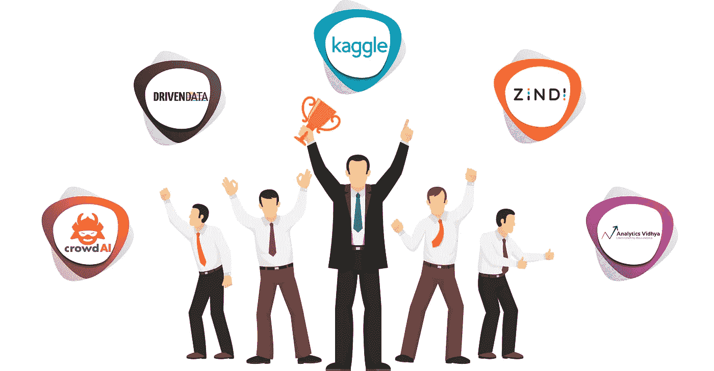
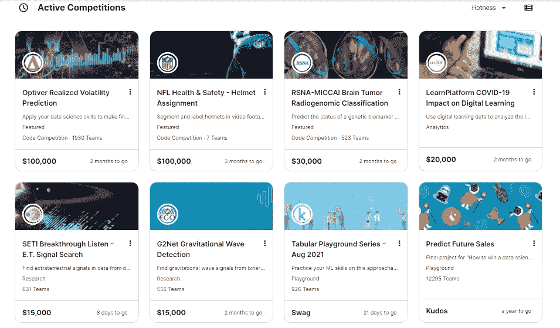
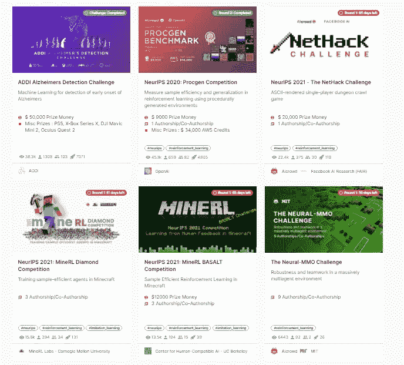
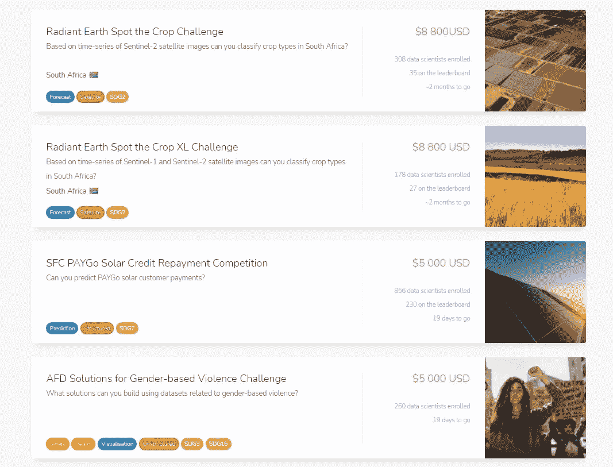
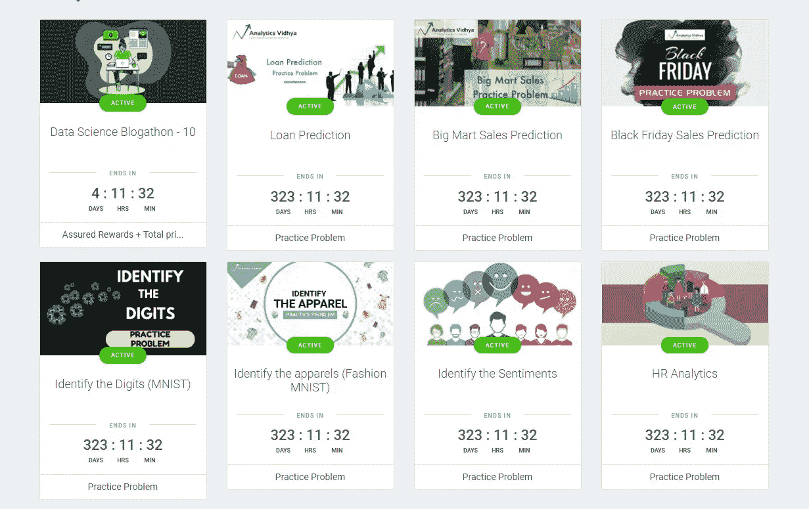

# 2021 年 5 大机器学习竞争平台

> 原文：<https://pub.towardsai.net/top-5-machine-learning-competitive-platforms-in-2021-feffe4c3773?source=collection_archive---------1----------------------->

## [职业生涯](https://towardsai.net/p/category/careers)

发现 2021 年最受欢迎的机器学习竞技平台，展示你最近获得的技能。

图片作者|元素作者[星线](https://www.freepik.com/starline)、[宏向量](https://www.freepik.com/macrovector)

# 介绍

阅读关于机器学习的书籍，参加 98 小时的课程，并积累编码经验有助于夯实基础，但你如何为现实世界的场景做准备呢？希望雇佣新毕业生的公司想知道你在机器学习和数据科学方面有多少经验，他们会要求项目、研究和证书。我知道你现在在想，当我不知道从哪里开始我的数据科学之旅[时，我该如何开始一个项目或获得认证。这就是黑客马拉松和数据科学竞赛的用武之地。参加这些竞赛将让你为现实世界做好准备，并帮助你为你的简历创造理想的组合。](https://towardsdatascience.com/top-competitive-data-science-platforms-other-than-kaggle-2995e9dad93c)

## **参加数据科学竞赛的主要优势**

*   **学习解决问题的创新方法:**你学习新的模型架构、处理数据和新的机器学习方法。
*   **处理独特类型的数据集:**您将处理医疗数据、航空航天、视频图像、音乐等。
*   **社区讨论:**通过讨论新想法共同成长，作为团队参与竞争。
*   **Portfolio:** 在 GitHub 上展示你的发现或发表研究论文，添加到你的简历中。
*   **排行榜:**您将了解自己在顶级数据从业者中的排名。
*   奖金:你将有资格赢得数千美元的奖金，有时还有可以炫耀的奖品。根据你的表现，你甚至可能得到工作机会。
*   **吹牛的权利:**炫耀你的排名，炫耀你的项目，告诉世界你是多么的伟大名列前茅。

# 1.卡格尔

[Kaggle 比赛](https://www.kaggle.com/competitions)

[**Kaggle**](https://www.kaggle.com/) 为数据科学家提供了一个完整的生态系统，共同学习和成长。 [Kaggle 竞赛](https://www.kaggle.com/competitions)从数据分析到机器学习不等。它拥有最大的数据科学社区，由初学者和专家组成。为什么 Kaggle 是独一无二的，并处于领先地位？因为它提供免费的云计算，包括每周 30 小时的 GPU 和 TPU，这样就不会有竞争对手因为机器的限制而落后。Kaggle 还拥有最大的可用于机器学习和数据科学项目的数据集。简而言之，如果你正在参加 Kaggle 比赛，你不必担心下载一个巨大的数据集。只需点击一下，您就可以将 GPU 和数据集加载到您的内核中。唯一阻止你赢得比赛的是你解决问题的知识。

# 2.数据驱动

[比赛(drivendata.org)](https://www.drivendata.org/competitions/)

[**DrivenData**](https://www.drivendata.org/) 是第二个让我迷上竞技学习的平台。在[数据营](https://learn.datacamp.com/)课程的最后一部分，我被指派参加名为[Reboot:Box-Plots for Education](https://www.drivendata.org/competitions/46/box-plots-for-education-reboot/)的驱动数据竞赛。对于初学者来说，这是一个相当具有挑战性的任务，它扩展了我关于表格数据和分类问题的知识。这时我意识到，学习机器学习任何子领域的最佳方式是参加比赛，并努力至少达到前 50 名。DrivenData 主办与社会公益相关的竞赛，包括健康、教育和公共部门的发展。通过简单的步骤，你可以像 Kaggle 一样参加比赛或举办比赛。DrivenData 不为您提供内核或 GPU，您必须在您的机器上下载数据，并生成带代码的模型或提交预测。参加这个比赛将会给你赢得奖金的机会，但它也为你在一个最终改善不发达国家人民生活的非营利项目中做出贡献提供了机会。简而言之，你在为一项有价值的事业做贡献。

# 3.爱克沃德

[AIcrowd](https://www.aicrowd.com/)

AIcrowd 是一个众包平台，帮助组织开发、管理和推广机器学习挑战 [AIcrowd](https://www.aicrowd.com/faq) 。这是解决人工智能相关问题的一种非常独特的方法。就像 Kaggle 一样，人们正在分享他们的代码/笔记本，整个社区都非常友好。当您参加一个特定的比赛时，初学者工具包由初学者代码、数据集、如何处理问题的完整说明以及其他资源组成。你既可以在[的谷歌实验室](https://colab.research.google.com/)上运行共享代码，也可以在本地运行。他们为初学者和专家提供完整的支持。有趣的是，他们举办各种数据科学竞赛，从[强化学习](https://www.aicrowd.com/challenges/neurips-2021-minerl-diamond-competition)到[老年痴呆症检测](https://www.aicrowd.com/challenges/addi-alzheimers-detection-challenge#introduction)。如果你想在个人资料中添加一个华而不实的项目，我建议你从一个网站开始。

# 4.津迪

[比赛—津迪](https://zindi.africa/competitions)

对我来说, [Zindi](https://zindi.africa/about) 是一个快乐的意外，因为我正在经历 ML 竞赛的初级比赛。突尼斯阿拉伯语的社交媒体情感分析引起了我的注意，因为我参加了 Kaggle 的灾难推文挑战，对文本分类非常在行。我花了一个月的时间做研究，并制作了一个基于变压器的模型，这为我打开了一个全新的世界，我在解决自然语言问题方面变得更加聪明。Zindi 是第一个基于非洲的竞争平台。它举办各种数据马拉松、黑客马拉松和机器学习比赛。他们专注于帮助总部设在非洲的公司。Zindi 最酷的一点是，任何人都可以参加这个比赛并获得奖励。社区确实分享解决方案和问题，但他们不像 Kaggle 那样开放。

# 5.分析 Vidhya

[竞赛|分析 Vidhya](https://datahack.analyticsvidhya.com/contest/all/)

[**Analytics vid hya**](https://datahack.analyticsvidhya.com/?utm_source=main-logo)**是一个面向分析和数据科学专业人士的基于社区的知识共享平台。他们以博客和视频课程的形式为初学者提供了很好的内容。该平台还让用户通过参与正在进行的黑客马拉松来解决现实世界的挑战。这次黑客马拉松不仅提供处理数据的实践经验，还提供奖金，有时还提供工作机会。分析 Vidhya 总部设在印度，所以它吸引了当地和国际人口。大多数公司为得分最高的参与者提供工作机会，所以如果你问我，这是在印度被雇用的最快和最容易的方式。**

> **到目前为止，我正在积极参与一个 [blogathon](https://datahack.analyticsvidhya.com/contest/data-science-blogathon-10/) 活动，在那里你提交了基于机器学习或数据科学新研究的文章。如果你在文章中添加了代码片段，你的文章更有可能被发表。我与编辑团队有着非常愉快的经历，他们提高了我撰写顶级技术文章的能力。**

# **结论**

**我是杰米·霍华德的超级粉丝，他总是说，如果你想学习一项新技能，就要通过实践来学习。你不需要学习所有的数学或统计学；你只需要一些基础知识，然后通过解决现实世界的问题变得更好。我袖手旁观他的话，我相信如果你想在数据科学或机器学习领域出类拔萃，那就开始做项目吧。我知道有时很难找到一个初学者友好的项目，这就是这些竞争平台帮助你为现实世界的问题做准备的地方。起初，理解甚至编写一行代码会很困难，但是在数据科学社区的帮助下，通过实践，事情会变得更容易。参与这些挑战也有助于您的投资组合，这将使您成为数据科学就业市场的可靠候选人。**

**最后，我会建议你注册这些平台，观察其他参与者的表现。你不必立即参与；你只需要学习，然后尝试复制工作。学习他们是如何处理问题的，我相信你很快就会在这些比赛中进入前 10 名。**

# **别忘了给你的👏**

****

**作者 gif**