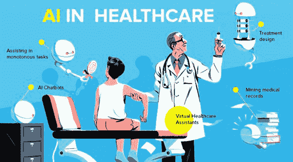
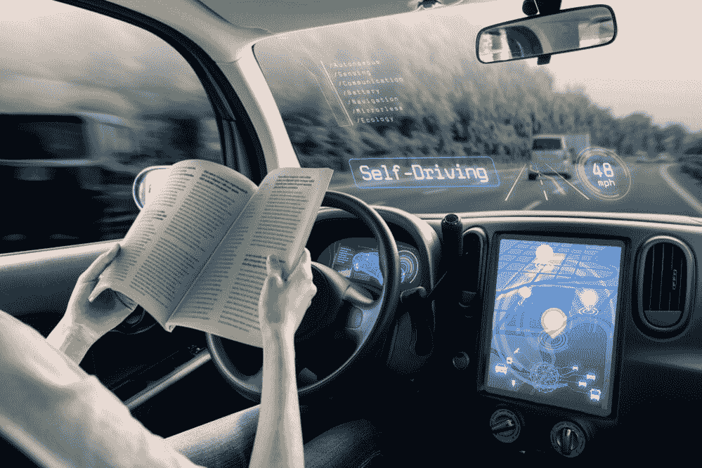
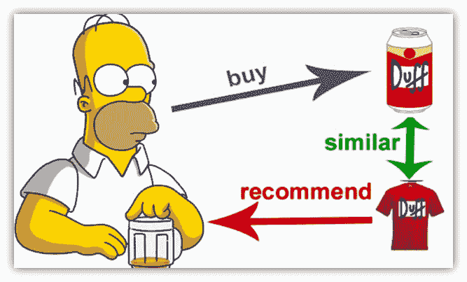

# 2022 年五大机器学习行业

> 原文：<https://pub.towardsai.net/top-5-machine-learning-industries-in-2022-ae63050cd146?source=collection_archive---------5----------------------->

## 机器学习正在迅速扩展到很多行业和领域！

[来源](https://www.nature.com/collections/hchdibjchj)

# 介绍

虽然人工智能在过去只不过是一个理论概念，但如今，公司正在花费大量资金将机器学习和其他基于人工智能的技术应用到自己的产品、服务等领域。不奇怪的是，现在大多数行业都有机器学习，未来还会有更多行业有机器学习。人工智能能够实现和完成什么是未知的，从天气预报到自动驾驶汽车和扫描人体内的肿瘤人工智能只是一个等待在我们日常生活中利用的奇迹。

在这篇短文中，我们将陈述总体上严重依赖机器学习和人工智能的 5 个行业。所有这些行业都被 AI 大大改善了，无论是节省成本、宝贵时间、拯救生命，还是完成从未听说过的事情。不多说了，让我们深入到当今最受关注的 5 个人工智能行业。

# 2022 年五大机器学习行业

## 1.卫生保健

作为当今机器学习最重要的用户之一，医疗保健行业可以被认为是十年来机器学习注入最多的行业之一。随着医疗行业的许多伟大飞跃，在这一节中，我们将只提到 AI 在医疗行业的两种用法。

## 医疗诊断和疾病分类

[来源](https://healthitanalytics.com/news/top-5-use-cases-for-artificial-intelligence-in-medical-imaging)

尽管在疾病识别的一些领域仍未成熟，但机器学习已被证明在某些身体诊断中提供了很大的准确性。

## 使用语音识别消除繁琐的任务

[来源](https://www.quora.com/What-should-doctors-do-when-they-are-pretty-much-replaced-by-AI)

人工智能的主要好处之一是它能够理解人类语言，或者更普遍的说法是自然语言处理。不管这些单词是书面的还是口头的，机器学习模型都能够理解这些单词并将其处理成机器可理解的格式。在医疗保健行业，特殊的机器学习模型能够理解和分类临床文档，从医生的日常任务列表中删除不必要的任务，如开处方、手动输入患者数据等。

## 2.运输

## 自动驾驶汽车

[来源](https://www.ericsson.com/en/blog/2020/1/self-driving-car-passenger-experience)

随着大量资金涌入自动驾驶汽车行业，客户可以预期再也不会握着方向盘了。通过在特定的汽车尺寸上安装超声波传感器，自动驾驶汽车可以检测周围物体的位置，如汽车、路边等等。使用先进的机器学习算法，汽车可以计算出道路上的最佳路径，实现完全的自动驾驶。

尽管仍未完全投入使用，但在未来十年，客户可以期待更多的自动驾驶汽车行业。

## 3.金融

## 降低贷款风险

[来源](https://www.graphen.ai/products/loan_risk_prediction.html)

哪里有钱赚，哪里就可以用机器学习。有了能够准确预测未来股票如何上涨的机器学习算法，如今

机器学习模型可以预测和评估贷款风险，降低整体财务成本。

## 银行系统中的欺诈检测

[来源](https://emerj.com/ai-sector-overviews/artificial-intelligence-fraud-banking/)

通过研究以前的客户模式，人工智能可以用来检测用户所做的任何杂项活动。通过使用这种欺诈检测系统，银行可以及早发现骗子，从而节省大量资金。

## 4.零售和客户服务

## 推荐系统

[来源](https://nafeea3000.medium.com/recommender-systems-c8db209dd0d3)

在过去的十年里，推荐系统已经证明了它们的价值。随着个人客户拥有自己的私人销售人员，他们知道自己所有的好恶，客户很难不不断地购买越来越多的东西。随着亚马逊等公司通过使用推荐系统获得大部分收入，难怪他们会花费数百万美元来改进和完善这种系统，以获得最大的利润和销售额。

## 5.房地产和财产评估

[来源](https://www.inc.com/james-paine/3-ways-ai-is-changing-real-estate.html)

你不能判断你的房子在今天的市场上会卖多少钱吗？如今，房地产业主无法准确预测他们的房产价格是很常见的。由于有数百个因素，如位置、大小、天气等，对人脑来说，人类分析可能会变得更加复杂。这就是人工智能派上用场的地方，先进的机器学习模式能够准确预测数百个因素的房地产属性。这种模型从数以百万计的已售或已知成本的房产中学习，允许进一步预测新的房产。

# 结论

无论是在医疗、交通、金融还是零售领域，人工智能和人类思维能力在过去几十年里极大地改善了这些行业。通过拯救数百万人的生命、时间和数十亿美元，谁知道人工智能在未来几年能完成什么。