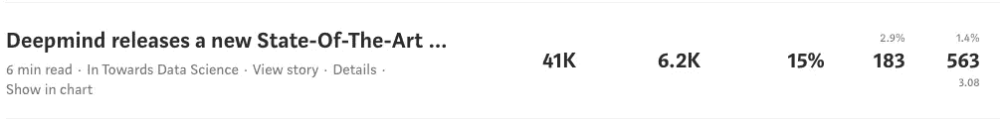
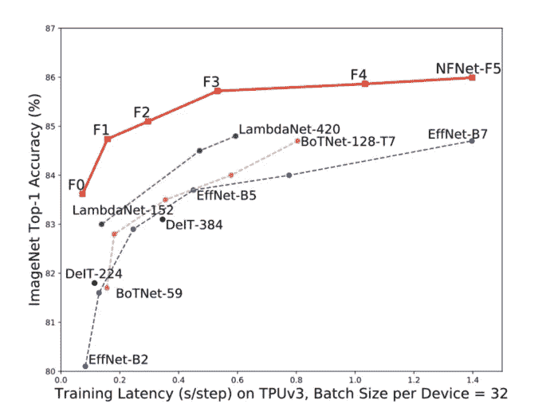
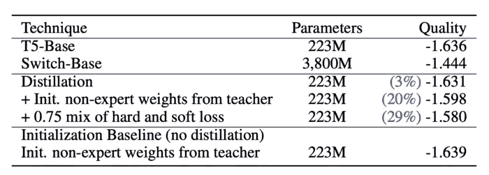

# 2021 年前 5 大机器学习模型

> 原文：<https://pub.towardsai.net/top-5-machine-learning-models-2021-1e03ce01dfe8?source=collection_archive---------1----------------------->

## [机器学习](https://towardsai.net/p/category/machine-learning)

## 过去一年中最值得注意的机器学习模型的集合

由[帕韦尔·切尔文斯基](https://unsplash.com/@pawel_czerwinski?utm_source=medium&utm_medium=referral)在 [Unsplash](https://unsplash.com?utm_source=medium&utm_medium=referral) 上拍摄的照片

今年有很多优秀的模特。在这篇文章中，我希望强调 10 个最值得注意的模型。这一年来，我一直在定期审查论文并解释它们，我认为我得到了相当多的好评。免责声明:可能有其他好的模型在这里没有提到，我并不声称自己是评估机器学习模型质量的最终专家！

另外，请注意，这个列表不是有序的！

1.  [**deep mind nfnet**](https://towardsdatascience.com/deepmind-releases-a-new-state-of-the-art-image-classification-model-nfnets-75c0b3f37312)

> *我们的小型模型与 ImageNet 上的 EfficientNet-B7 的测试精度相当，同时训练速度提高了 8.7 倍，我们的大型模型达到了 86.5%的最新顶级精度。*

来源: [arxiv](https://arxiv.org/abs/2102.06171)

Deepmind 于 2021 年 2 月发布了无规格化器网络，并获得了很多认可。我当时甚至写了一篇解释它们的文章，它获得了 41000 次浏览！

我自己的媒体统计

这篇论文最有趣的一点是他们对深度学习中现有的优化技术(如批处理规范化)所做的分析。他们的分析结果使他们得出这样的结论:它是不需要的，实际上删除它可以加快训练过程，而不会导致性能下降，因此得名“无归一化器网络”。

来源: [arxiv](https://arxiv.org/abs/2102.06171)

如果你有兴趣了解更多，请点击这里查看我的文章:

 [## Deepmind 发布了一个新的最先进的图像分类模型——NFNets

### NFNets 比 EfficientNets 快，而且它们不使用规范化

towardsdatascience.com](https://towardsdatascience.com/deepmind-releases-a-new-state-of-the-art-image-classification-model-nfnets-75c0b3f37312) 

**2。** [**OpenAI 夹**](https://towardsdatascience.com/open-ai-clip-learning-visual-concepts-from-natural-language-supervision-d02644969278)

CLIP 是一个基于转换的神经网络，它使用对比语言-图像预训练来对图像进行分类。CLIP 通过将图像分类转化为文本相似性问题来对非常广泛的图像进行分类。当前图像分类网络的问题是，它们是在固定数量的类别上训练的，CLIP 不是这样工作的，它直接从关于图像的原始文本中学习，因此它不受标签和监督的限制。

如果你正在寻找一篇关于变形金刚图像的有趣论文，请查看剪辑:

 [## 开放 AI 剪辑:从自然语言监督中学习视觉概念

### 一种基于变换的神经网络，使用对比语言-图像预训练对图像进行分类

towardsdatascience.com](https://towardsdatascience.com/open-ai-clip-learning-visual-concepts-from-natural-language-supervision-d02644969278) 

**3。** [**谷歌开关变形金刚**](https://towardsdatascience.com/google-switch-transformers-scaling-to-trillion-parameter-models-with-constant-computational-costs-806fd145923d)

本文介绍了一种新的方法，在保持每秒浮点运算次数(ML 计算成本标准指标)的同时，大幅增加参数数量。

众所周知，增加参数的数量会增加模型的复杂性和学习能力(当然在一定程度上)。正如预期的那样，该车型比 [T5-XXL](https://huggingface.co/google/t5-xxl-ssm) 提高了 4 倍，比 T5-Base 和 [T5-Large](https://huggingface.co/t5-large) 提高了 7 倍。

这篇论文使用了各种各样的 ML 概念，这使得它非常有趣，例如[专家混合](https://machinelearningmastery.com/mixture-of-experts/)、[蒸馏](https://en.wikipedia.org/wiki/Knowledge_distillation#:~:text=In%20machine%20learning%2C%20knowledge%20distillation,might%20not%20be%20fully%20utilized.)和模型分片。

来源: [arxiv](https://arxiv.org/abs/2101.03961) (乳胶转载表)

使用这种技术，他们设法在性能上比非常强大的现有基于变压器的模型提高了 3-30%。我们还可以看到，参数的数量相对较少。

 [## 谷歌开关变压器:在恒定计算成本下扩展到万亿参数模型

### 在强烈调整的 T5-XXL 基线(谷歌的顶级变压器)上实现了 4 倍的预训练加速。

towardsdatascience.com](https://towardsdatascience.com/google-switch-transformers-scaling-to-trillion-parameter-models-with-constant-computational-costs-806fd145923d) 

**4。**[**deep mind alpha fold 2**](https://towardsdatascience.com/deepmind-alphafold2-highly-accurate-protein-structure-prediction-7ef0946f60c0)

这可能是我今年最喜欢的模型，因为我是药物发现和医疗领域深度学习的忠实粉丝。AlphaFold2 是深度思维为解决蛋白质折叠问题而构建的高级模型。蛋白质折叠问题是生物信息学领域最大的问题之一，如果你想了解更多，请点击这里查看我的文章[。](https://ai.plainenglish.io/what-solving-the-protein-folding-problem-actually-means-a94ee2121a98)

AlphaFold2 是一个非常复杂的模型，有很多细节和技巧，如果你想了解更多关于它的工作原理和他们使用的“Evoformer”，请随意查看我在这里的文章:

 [## Deepmind AlphaFold2:高度精确的蛋白质结构预测

### 深入研究 AlphaFold2 的文章，它是如何工作的，为什么，以及一切

towardsdatascience.com](https://towardsdatascience.com/deepmind-alphafold2-highly-accurate-protein-structure-prediction-7ef0946f60c0) 

**5。**[**Google efficient net v2**](https://towardsdatascience.com/google-releases-efficientnetv2-a-smaller-faster-and-better-efficientnet-673a77bdd43c)

高效网络在图像识别任务中非常流行。今年，谷歌发布了第二个版本，其性能略高于最先进的图像模型，而训练速度是 5-10 倍。这是今年一个值得注意的论文模式，相当多的论文关注于更快地训练模型，而不是获得更高的性能。此外，我认为相当多的论文集中在基于图像的问题上。

EfficientNetV2 中使用的一个有趣的技术是渐进式学习，这意味着尽管训练开始时图像尺寸最初很小，但它们的尺寸会逐渐增加。这种解决方案源于这样一个事实，即 EfficientNets 的训练速度在高图像大小时开始受到影响。

 [## 谷歌发布 efficient net v2——一个更小、更快、更高效的网络

### 与最先进的技术相比，性能更高，同时训练速度提高 5-10 倍

towardsdatascience.com](https://towardsdatascience.com/google-releases-efficientnetv2-a-smaller-faster-and-better-efficientnet-673a77bdd43c) 

## 荣誉奖:

*   [**谷歌 MLP 混合器**](https://towardsdatascience.com/google-releases-mlp-mixer-an-all-mlp-architecture-for-vision-824fac3e788c) **:** 使用简单多层感知器的高性能图像模型
*   [**变焦距网络**](https://towardsdatascience.com/varifocalnet-vf-net-new-state-of-the-art-object-detection-network-a1d54e0f7c1e) **:** 一个强大的对象检测模型，实现了与 YoloV5 相似或更高的性能
*   [**open ai DALL-E**](https://openai.com/blog/dall-e/)**:**一个有趣的从文本创建图像的模型

## **结论**

我知道这些型号中的大多数都是由大公司发布的，我很确定还有其他在 2021 年发布的伟大型号没有被列入这个列表，只是因为它们没有那么受欢迎，没有达到更多的观众。令人难过的事实是，这些大公司的报纸总会有更大的影响力。只是说，我只是因为这些模型是大公司发布的而没有提到它们，我实际上是看了论文并在中型帖子中解释了它们。如果你有任何其他伟大的论文，请务必在下面的评论中留下它们！(当然，我已经错过了一些好的)

如果你想定期收到关于人工智能和机器学习的最新论文的评论，请在这里添加你的电子邮件并订阅！

[https://artisanal-motivator-8249.ck.page/5524b8f934](https://artisanal-motivator-8249.ck.page/5524b8f934)