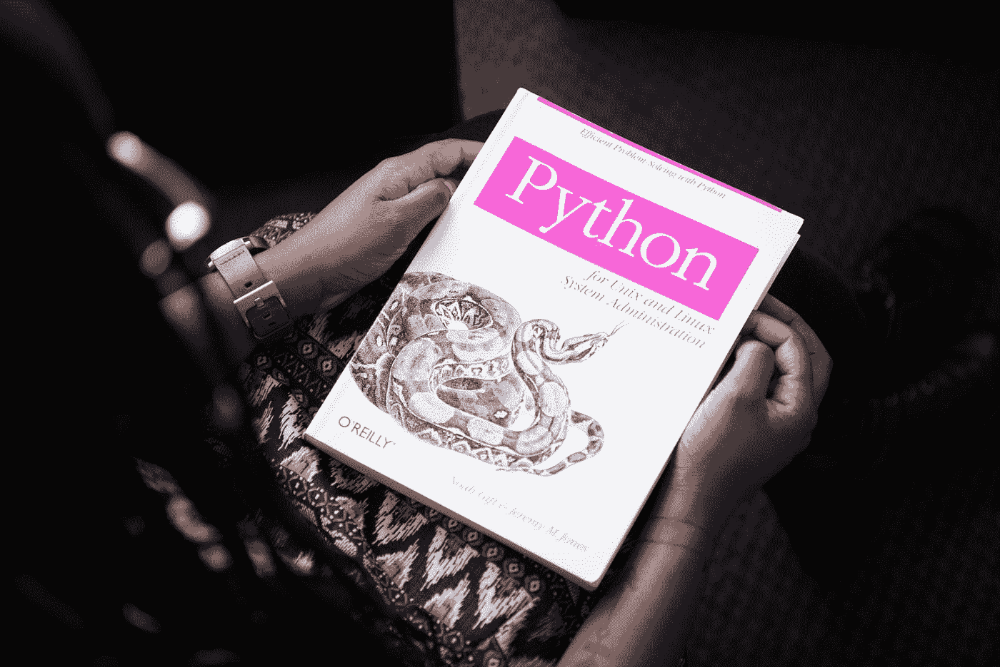

# 在您的项目中使用的前 5 个 NLP 库

> 原文：<https://pub.towardsai.net/top-5-nlp-libraries-to-use-in-your-projects-48a1214231fe?source=collection_archive---------5----------------------->

## 关于最常用的 NLP 库的博客

克里斯蒂娜@ wocintechchat.com 在 [Unsplash](https://unsplash.com?utm_source=medium&utm_medium=referral) 上的照片

自然语言处理是人工智能中最热门的领域之一。有许多顶尖的库可以帮助你在项目中使用 NLP。这个博客将列出排名前五的图书馆。这将有助于您的项目，也有助于您了解更多关于 NLP 的知识。

# 1.介绍

自然语言处理是人工智能的一个分支。它是关于理解、解释、处理和生成自然语言的。NLP 库的出现是为了解决设计、实现和部署 NLP 系统的问题。在这篇博客中，我们将讨论 5 大 NLP 库，你可以在你的项目中使用它们。

自然语言处理(NLP)是计算机科学和人工智能的一个领域，涉及计算机和人类(自然)语言之间的交互，特别是如何对计算机进行编程以处理和分析大量自然语言数据。作为计算机科学的一个子领域，自然语言处理涉及人工智能、信息检索、语音识别和机器翻译。鉴于这一领域的迅速发展，这是一个极其广泛和开放的研究领域。

# 2.NLTK

自然语言工具包(NLTK)是构建 Python 程序来处理人类语言数据的领先平台。它提供了 50 多个语料库和词汇资源(如 WordNet)的易用接口，以及一套用于分类、标记化、词干化、标记、解析和语义推理的文本处理库，工业级 NLP 库的包装器，以及一个活跃的讨论组和邮件列表。

NLTK 是“自然语言工具包”,它是一个强大的 Python 库，使处理文本变得简单而有趣。NLTK 是由 Steven Bird、Edward Loper 和 Alex Rubinstein 开发的，目的是满足他们自己的研究需要，被各种各样的人使用，包括学生、研究人员和开发人员，用来处理语言数据。

它提供了 50 多个语料库和词汇资源(如 WordNet)的易用接口，以及一套用于分类、标记化、词干化、标记、解析和语义推理的文本处理库、工业级 NLP 库的包装器和一个活跃的讨论论坛。

# 3.空间

spaCy 是一个免费的开源库，用于 Python 和 Cython 中的高级自然语言处理。它附带了各种实用程序，用于标记化、句子分割和解析、实体识别和共指解析。这个包也可以和其他语言一起使用，比如 Java，使用“spacy_bindings”库。它可以在 PyPI 上获得，并且可以与 pip 一起安装。spaCy 是一个用 Python 和 Cython 编写的开源库。它依赖于以下依赖项:NumPy、Scipy、sphinx、pillow、yaml、six、pandas、requests、docopt 和 jieba。

凭借其简单的 API 和强大的扩展，SpaCy 易于初学者使用，也是专家的强大工具。它可以用于词性标注、名词短语提取、情感分析等任务。凭借其基于神经网络的方法，它还可以很好地执行更困难的任务，如语义解析、依存解析和解析具有高度语法复杂性的英语文本。

# 4.斯坦福·科伦普

Stanford CoreNLP 是一个 Java 自然语言处理工具包，它提供了一组通用语言分析工具。它可以用于诸如信息提取、问题回答、信息检索、情感分析、文本消息分类和摘要的应用中。

Stanford CoreNLP 是 Stanford Parser 的一个基于 Java 的工具包，Stanford Parser 是由 Stanford NLP 小组编写的一个统计解析器。它可以用于查找命名实体，将文本分类到不同的类别，以及查找句子不同部分之间的关系。它由命令行工具和 Java 库组成。

Stanford CoreNLP 是一个基于 Java 的框架，用于处理自然语言文本。它可以接受原始文本输入，对其进行处理，然后为您提供一些结构化数据。框架中包含的每个 Java 类可以单独使用，也可以与其他类结合使用。您可以使用 Stanford CoreNLP 来:将输入文本标记为句子、单词和标点符号

1.  识别每个单词的词性
2.  根据词汇类别(如名词、动词、形容词、副词)对每个单词进行分类
3.  识别命名实体(例如，人员、组织、位置、时间、数量、百分比、货币)
4.  对输入文本执行语法分析(解析)*用结果生成结构化输出。

# 5.OpenNLP

OpenNLP 是一个基于机器学习的工具包，用于处理自然语言文本。它是在 Apache 2.0 许可下发布的，可以免费用于商业和非商业用途。它支持最常见的 NLP 任务，如标记化、句子分割、词性标注、命名实体提取、组块和解析。

OpenNLP 是最好的开源自然语言处理工具或库的事实上的标准。自然语言处理是用来解决机器理解人类语言问题的技术。在过去十年左右的时间里，这项技术一直是人工智能研究的重要组成部分。NLP 的目标是开发一种可以理解人类语言的机器，并以人类同样自然的方式处理它。

> **结论**

在以后的博客中，我们将会介绍在特定行业中有目的地使用 NLP 或者有目的的用例。