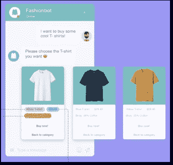
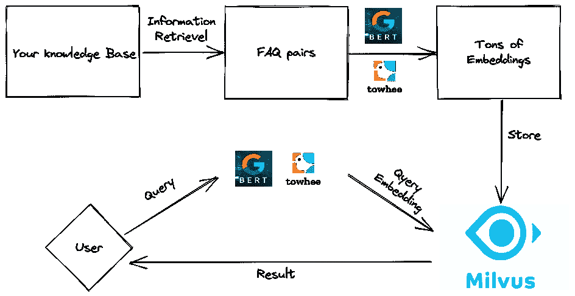
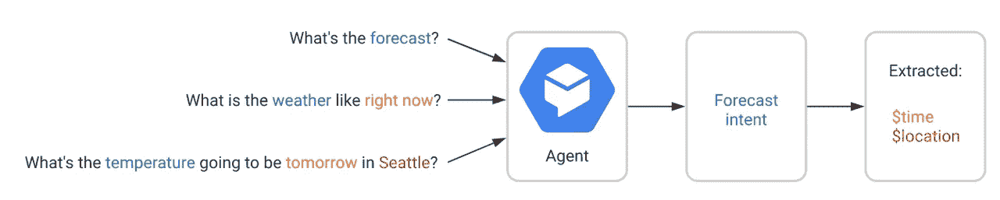
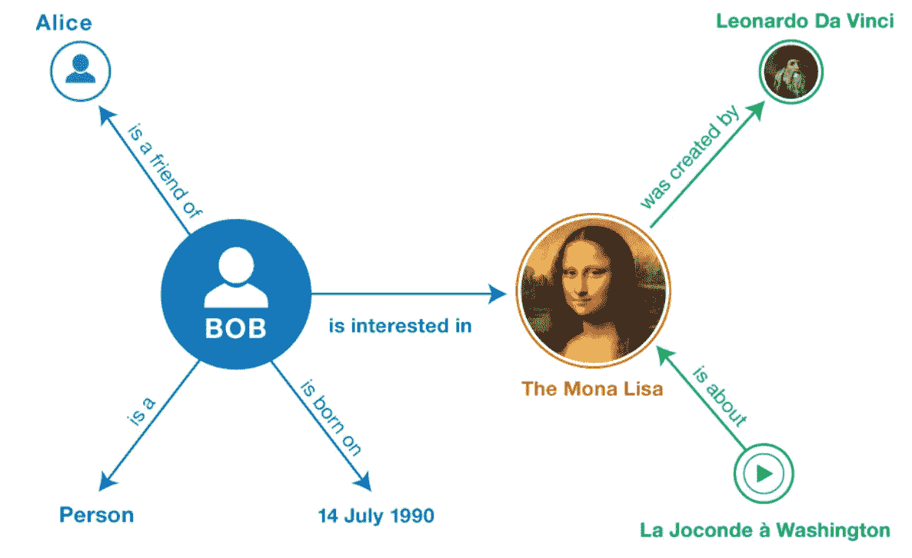

# 自然语言处理的 5 大现实应用

> 原文：<https://pub.towardsai.net/top-5-real-world-applications-for-natural-language-processing-85222380ce96?source=collection_archive---------3----------------------->

图片来源: [Unsplash](https://www.istockphoto.com/photo/nlp-natural-language-processing-cognitive-computing-technology-concept-gm1305028664-396017901?utm_source=unsplash&utm_medium=affiliate&utm_campaign=srp_photos_top&utm_content=https%3A%2F%2Funsplash.com%2Fs%2Fphotos%2Fnlp&utm_term=nlp%3A%3A%3A) 。

新兴技术极大地方便了我们的日常生活。例如，当你正在为自己做饭，但想打电话给你妈妈要秘方时，你不必停下手头的工作，拨打电话号码。相反，你需要做的只是大声说出来——“嘿，Siri，给妈妈打电话。”你的 iPhone 会自动帮你打电话。

这个应用程序很简单，但是它背后的技术可能很复杂。让上述场景成为可能的魔法是自然语言处理(NLP)。NLP 远不止是打造 Siri 的支柱。它还可以为现实世界中的许多其他人工智能应用提供支持。

本文首先解释什么是 NLP，然后介绍 NLP 的五个实际应用。

# 什么是 NLP？

从聊天机器人到 Siri，从虚拟支持代理到知识图谱，自然语言处理的应用和使用在我们的日常生活中无处不在。NLP 代表“自然语言处理”。简单来说，NLP 就是机器理解人类语言的能力。它是人类与机器直接互动和交流的桥梁。NLP 是人工智能(AI)的一个子领域，用比尔·盖茨的话说，“NLP 是人工智能皇冠上的明珠。”

随着 NLP 市场规模的不断扩大，无数公司都在大力投入这个行业，产品线也各不相同。通过利用 NLP 的能力，可以为各种任务和需求构建许多不同但特定的系统。

# 五个真实的自然语言处理应用

NLP 最受欢迎的令人兴奋和蓬勃发展的现实世界应用包括:对话式用户界面、人工智能支持的呼叫质量评估、智能出站呼叫、人工智能支持的呼叫话务员和知识图表，仅举几例。

## 电子商务中的聊天机器人

五年前，亚马逊已经意识到将 NLP 应用到他们的客户服务渠道的潜在好处。当时，当客户对他们订购的产品有问题时，他们唯一可以求助的方式是打电话给客户服务代理。然而，他们从电话的另一端得到的是“*您的电话对我们很重要。请稍等，我们目前正在经历一个高呼叫负载。*“大部分时间。令人欣慰的是，亚马逊立即意识到这可能对他们的品牌形象造成的破坏性影响，并试图建立聊天机器人。

如今，当你想快速获得，比如说，网上退款，有一个更方便的方法！你需要做的就是激活亚马逊客服聊天机器人，输入你的订购信息，提出退款请求。聊天机器人的互动和回复方式和真人一样。除了处理售后客户体验的聊天机器人，聊天机器人还提供售前咨询。如果你对将要购买的产品有任何疑问，你可以简单地与机器人聊天并得到答案。

电子商务聊天机器人。

随着元宇宙等新概念的出现，NLP 可以做的不仅仅是为 AI 聊天机器人提供动力。元宇宙的客户支持头像依赖于 NLP 技术。为客户提供更真实的聊天体验。

元宇宙的客户支持头像。

## 对话式用户界面

另一个更流行、更有前途的应用是交互系统。许多知名公司在 CUI(对话式用户界面)上下了大赌注。CUI 是一个通用术语，用来描述那些能够模拟与真人对话的计算机用户界面。

我们日常生活中最常见的 Cui 有苹果的 Siri，微软的 Cortana，谷歌的 Google Assistant，亚马逊的 Alexa 等。

苹果的 Siri 是对话式用户界面的一个常见例子。

此外，Cui 还可以嵌入汽车，尤其是 ev(电动汽车)。NIO 是一家致力于设计和开发电动汽车的汽车制造商，于 2018 年推出了一套名为 NOMI 的 CUI。从视觉上看，汽车中的 Cui 可以像 Siri 一样工作。司机可以专注于驾驶汽车，同时要求 CUI 调节 A/C 温度、播放歌曲、锁定窗户/门、引导司机到最近的加油站等。

汽车中的对话式用户界面。

**背后的算法**

尽管技术媒体吹嘘了所有花哨的算法，但构建聊天机器人的最基本方法之一是构建和组织 FAQ 对(或者更直白地说，问答对)，并使用 NLP 算法来计算用户查询是否与您的 FAQ 知识库中的任何一个匹配。一个简单的常见问题示例如下:

> *问:我可以喝点咖啡吗？*
> 
> *不，我想要一些排骨。*

既然这个 FAQ 对已经存储在您的 NLP 系统中，用户现在可以简单地问一个类似的问题，例如:“请给我咖啡！”。如果你的算法足够聪明，它会发现“请给我咖啡”和“我能喝点咖啡吗？”有很大的相似之处并且会输出相应的回答“不，我宁愿来点排骨。”事情就是这样做的。

长期以来，FAQ 搜索算法完全基于倒排索引。在这种情况下，首先对原始句子进行标记化，并将标记和文档放入 ElasticSearch 这样的系统中，该系统使用倒排索引进行索引，使用 TF-IDF 或 BM25 这样的算法进行评分。

在深度学习时代到来之前，这种算法同样适用。上述算法的最大问题之一是，无论是标记化还是倒排索引都没有考虑到句子的语义。例如，在上面的例子中，用户可以说“我可以要一杯卡布奇诺”来代替。现在有了标记化和倒排索引，系统很有可能不会将“咖啡”和“一杯卡布奇诺”识别为同一个东西，从而无法理解句子。人工智能工程师不得不为这类问题做很多变通。

但随着深度学习的发展，情况变得好了很多。有了像 BERT 这样预先训练好的模型和像[到](https://towhee.io/)这样的流水线，我们可以很容易地将所有的句子编码成向量并存储在向量数据库中，例如 [Milvus](https://milvus.io/) ，简单地计算向量距离就可以得出句子的语义相似度。

对话式用户界面背后的算法。

## 人工智能驱动的通话质量控制

对于许多关心客户体验的大公司来说，呼叫中心是必不可少的。为了更好地发现问题并提高通话质量，评估是必要的。然而，问题是大型跨国公司的呼叫中心每天都会收到大量的呼入电话。因此，收听数百万个电话中的每一个并作出评估是不切实际的。大多数时候，当你听到“为了改善我们的服务，这个电话可以被录音。”从电话的另一端，这并不一定意味着你的电话会被检查服务质量。事实上，即使在大的组织中，也只有 2%-3%的电话会被质量控制人员人工重播和检查。

呼叫中心。图片来源: [Pexels](https://www.pexels.com/zh-cn/photo/5453837/?utm_content=attributionCopyText&utm_medium=referral&utm_source=pexels) 作者[马体·米罗什尼琴科](https://www.pexels.com/zh-cn/@tima-miroshnichenko?utm_content=attributionCopyText&utm_medium=referral&utm_source=pexels)。

这就是 NLP 可以提供帮助的地方。由 NLP 驱动的人工智能呼叫质量控制引擎可以自动发现呼叫中的问题，并可以在相对较短的时间内处理大量的呼叫。该引擎有助于检测呼叫接线员是否使用了正确的开头和结尾句子，并避免在呼叫中使用被禁止的俚语和禁忌词。这将很容易地将检查率从 2%-3%提高到 100%，甚至更少的人力和其他成本。

对于典型的人工智能呼叫质量控制服务，用户需要首先将呼叫记录上传到该服务。然后使用自动语音识别(ASR)技术将音频文件转录成文本。所有文本随后使用深度学习模型进行矢量化，并随后存储在向量数据库中。该服务比较文本向量和从某个标准集生成的向量之间的相似性，该标准集诸如禁忌词向量和期望的开始和结束句子的向量。有了高效的向量相似性搜索，处理大量的通话记录可以更加准确和节省时间。

## 智能呼出电话

信不信由你，你接到的一些电话不是人类打来的！很有可能是电话另一端的机器人在说话。为了降低运营成本，一些公司可能会将人工智能电话用于营销目的等等。谷歌早在 2018 年就推出了 Google Duplex，这是一个可以通过电话进行人机对话和完成现实世界任务的系统。人工智能电话背后的机制与聊天机器人背后的机制非常相似。

用户向 Google Assistant 请求预约，然后 Assistant 通过让 Duplex 呼叫业务来安排预约。图片来源:[谷歌 AI 博客](https://ai.googleblog.com/2018/05/duplex-ai-system-for-natural-conversation.html)。

在其他情况下，您可能也在电话中听到过类似这样的话:

*“谢谢你打电话来。建立新帐户，请按 1。要修改现有帐户的密码，请按 2。要与我们的客户服务代理通话，请按 0。”，*

或者近些年来，类似于(带有浓重的机器人口音):

*“请告诉我我能帮你什么。比如你可以问我‘查一下我账户的余额’。”*

这被称为交互式语音应答(IVR)。这是一个自动电话系统，它与呼叫者进行交互，并根据呼叫者的回答和动作进行操作。通常通过菜单给呼叫者提供一些选择。然后他们的选择将决定电话呼叫系统如何工作。如果用户请求太复杂，系统可以将呼叫者路由到人工代理。这样可以大大降低人力成本，为公司节省时间。

在处理这类电话时，意图通常很有帮助。意图是代表特定用户意图的一组句子或方言。比如“天气预报”可以是意图，这个意图可以用不同的句子来触发。参见下面 Google Dialogflow 示例的图片。意图可以组织在一起，以完成复杂的交互式人机对话。比如订餐厅，订机票等。

Google Dialogflow。

## 人工智能呼叫接线员

通过采用 NLP 技术，公司可以将呼叫运营服务提升到一个新的水平。传统上，电话接线员需要查阅一百页长的专业手册来处理客户的每一个电话，并逐个解决每个用户的问题。这一过程非常耗时，并且在大多数时间内不能用理想的解决方案来满足呼叫者。然而，有了人工智能驱动的呼叫中心，处理客户电话既舒适又高效。

人工智能帮助话务员提高效率。图片来源: [Pexels](https://www.pexels.com/zh-cn/photo/7709221/?utm_content=attributionCopyText&utm_medium=referral&utm_source=pexels) 由 [MART 出品](https://www.pexels.com/zh-cn/@mart-production?utm_content=attributionCopyText&utm_medium=referral&utm_source=pexels)。

当客户拨入时，系统立即在数据库中搜索客户及其订购信息，以便呼叫接线员可以对该案例有一个大致的了解，如客户的年龄、婚姻状况、过去购买的物品等。在对话过程中，整个聊天过程将被记录下来，并在屏幕上显示一个实时聊天日志(感谢 live 自动语音识别)。此外，当客户提出一个棘手的问题或开始抱怨时，机器会自动捕捉它，查看人工智能数据库，并告诉你最好的回应方式是什么。有了一个像样的深度学习模型，你的服务就能始终给你的客户提供超过 99%的正确答案，并能始终用最恰当的语言处理客户的投诉。

## 知识图表

知识图是一种基于信息的图，由节点、边和标签组成。其中一个节点(或一个顶点)通常代表一个实体。它可以是一个人、一个地方、一件物品或一件事件。边是连接节点的线。还有一些标签表示一对节点之间的连接或关系。典型的知识图示例如下所示:

知识图表示例。来源:知识图表指南。

用于构建知识图的原始数据可能来自各种来源——非结构化文档、半结构化数据和结构化知识。必须对这些数据应用各种算法，以便提取实体(节点)和实体之间的关系(边)。举几个例子，需要做实体识别、关系提取、标签挖掘、实体链接。例如，为了用文档中的数据构建知识图，我们需要首先使用深度学习管道来生成嵌入，并将它们存储在向量数据库中。

一旦构建了知识图，您可以将它视为许多更具体应用的基础支柱，如智能搜索引擎、问答系统、推荐系统、广告等等。

# 尾注

本文介绍了现实世界中的五大 NLP 应用。在您的业务中利用 NLP 可以大大降低运营成本并改善用户体验。当然，除了本文介绍的五个应用程序，NLP 还可以促进更多的业务场景，包括社交媒体分析、翻译、情感分析、会议总结等等。

还有一堆 NLP+，或者更笼统的说，这几年越来越流行的 AI+概念。比如用 AI + RPA(机器人流程自动化)。您可以轻松构建智能管道，为您自动完成工作流，例如费用报销工作流，您只需上传收据，AI + RPA 将为您完成所有其他工作。还有 AI + OCR，你只需要拍一张照片，比如说一份合同，AI 就会告诉你你的合同有没有错误，比如说一家公司的电话号码和谷歌搜索显示的号码不匹配。

既然您现在已经熟悉了 NLP 的五大应用，那么您还可以了解能够增强您的 ML 应用的 [7 个基本 NLP 模型。](https://medium.com/@zilliz_learn/7-basic-nlp-models-to-empower-your-ml-application-5d1a09ac325f)