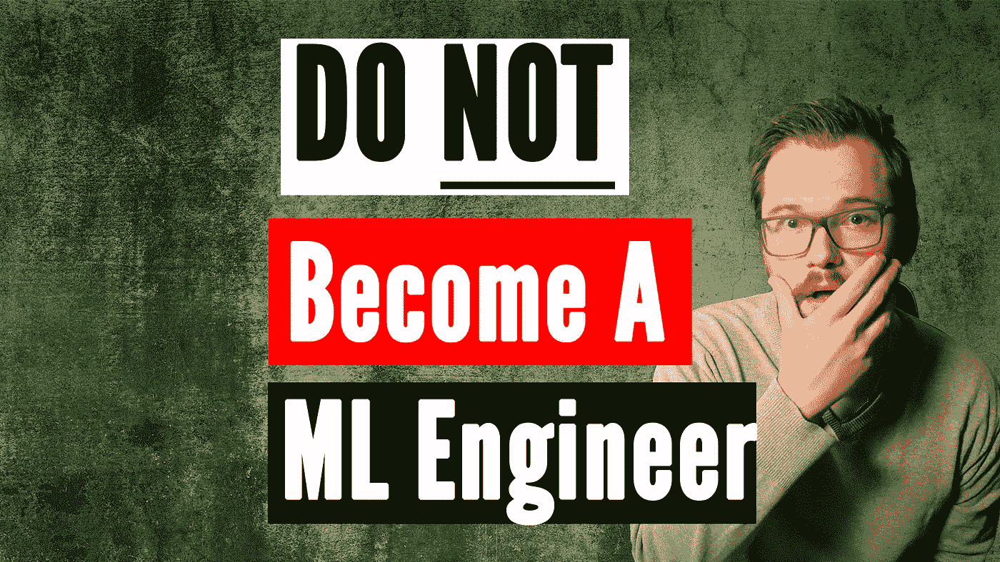

# 不成为机器学习工程师的五大理由

> 原文：<https://pub.towardsai.net/top-5-reasons-not-to-become-a-machine-learning-engineer-75a2d5472e11?source=collection_archive---------1----------------------->

## 明白什么不适合你

作者创造的形象，人就是作者

以下是我不成为机器学习工程师的五大理由。我认为成为一名 ML 工程师是一个梦幻般的职业，但它并不适合每个人！我认为有很多人有很好的意图，但是这种类型的工作并不是他们真正喜欢的。希望这份不要当机器学习工程师的理由清单有所帮助！

> 每一个新的开始都来自另一个开始的结束。
> 
> **-塞内卡**

不要误解我的意思，我是一名机器学习工程师，我认为这是你可以选择的最有趣的职业道路之一，但是有些人真的不是注定要成为机器学习工程师的。

很多年前，我想学习音乐并在那个领域做些事情，所以我学习了所有的音阶并投入了大量时间，但必须意识到每天练习 8 个多小时，基本上永远是技术性的音乐，这不是我个人可以处理的事情。因此，如果你正处于人生的某个阶段，不确定自己是否想成为一名 ML 工程师或其他什么，我相信这是你应该留意的 5 个迹象，它们可能会告诉你这不适合你。

# 不断学习

感谢 Kenny Eliason 在@unsplash 上免费提供这张照片🎁【https://unsplash.com/photos/1-aA2Fadydc? 

对我来说，第一个原因是你真的不喜欢不断地学习新东西。您可能需要很大的自我激励来让自己去看一个新的 python 包或一篇新文章，并对其进行研究。我认为这可能是一个明确的信号，表明这不是你的职业。

我的意思是，我并不是说你需要在大学的水平上继续学习，但是，ML 工程领域是不断变化的，你应该跟上它。我的意思是，你再次加入的每家公司都将有自己的一套软件体系，如果不学习它们，你不可能变得高效或有价值。

尤其是当你第一次开始学习编程和数据处理的基础知识，或者神经网络如何工作，这些梯度背后的数学是什么，以及统计数据与它到底有什么关系。相信我，他们会把那些已经很复杂的数学知识，扔进向量和矩阵中，这需要强大的内在动力才能生存。

> 生活的 10%是发生在你身上的事，90%是你如何应对。
> 
> **——查尔斯·r·斯温多尔**

# 毅力

亚历克斯·纪尧姆在 [Unsplash](https://unsplash.com/s/photos/perseverance?utm_source=unsplash&utm_medium=referral&utm_content=creditCopyText) 上的照片

这也让我想到了第二个原因，那就是快速放弃。如果你是一个很快放弃的人，ML 工程的世界对你来说将是地狱。看，我是第一个放弃的人，当谈到我阳台上的植物或买裤子时，但当谈到计算机和程序时，我是截然相反的，这就是这里的问题。

当你正在调试 ML 模型，却不知道日常生活中发生了什么。有时我会花几天时间去寻找错误，更糟糕的是，有时错误会以一种新的颜色出现在某个地方。如果你想在机器学习方面做任何事情，你真的应该有很大的耐心，让那些被称为你的计算机和服务器的部件以你想要的速度做你想要的事情。此外，需求可能会在运行中改变，您将被迫适应新的现实，其速度比您将代码推向生产的速度还要快。当然，您的利益相关者有时会期望您处理甚至是最不可能的情况，这些情况可能会飞进您的模型管道中。

# 变化

这让我想到了第三个理由:当你不得不重做工作时，你会感到非常沮丧。尽管你的模型完成后看起来很糟糕，但有必要继续 a)改进它，b)处理新的奇怪的边缘情况和随时间发生的变化。

有时，他们只是改变数据源，或者决定使用新技术，同时潜在地删除您的历史数据，而没有意识到您的关注。参与机器学习意味着至少在训练时，你处于一条漫长管道的末端，在这条管道中，你公司的几乎所有其他程序员都已经用你最终得到的东西做了一些事情。

当然，您的生产模型可能嵌入在正常的软件堆栈中，但通常您和其他数据人员将是唯一关心 5 年前的数据的人，这带来了许多特殊的解决方案，以某种方式仍然能够使用旧数据，当然，这带来了许多会议来找出这一点，有时甚至是您的数据在哪里。

# 利益相关者管理

在社交网站上为[活动的创建者](https://unsplash.com/@campaign_creators)大声喊出来，或者复制下面的文字进行归因。

对我来说，这是第四个理由，如果你不喜欢开会或者和人打交道。通常会有这种孤立的机器学习工程师独自在地下室修补他的模型的图像，但事实并非如此。虽然肯定有一些非常高效的星期，你只花 10%的时间在会议上，但更多的时候，你会讨论很多，关于你想了解他们的数据是什么，在什么情况下哪些列必须与什么相乘等等。他们，我指的是利益相关者，应该如何使用你的模型，或者他们需要注意哪些失败案例。

我不得不说，自从最近家庭办公室的巨大变化以来，听播客风格的节目变得有点冷了，但你仍然可以发视频和电子邮件，不要忘记记录很多东西，供其他人在未来某个时候阅读。通常问题还不清楚，你需要做需求工程，这真的需要你去了解他们的用例，以及他们是否可以用机器学习来解决。

# 小机器学习

这就引出了我的最后一点，你只想做机器学习。我知道这份工作被称为机器学习工程师，但它仍然只占你工作的 10-20%左右，这取决于你如何计算，当然，现在是建立一个 ML 管道 MLOps，还是机器学习？你决定，无论如何，你将不得不写一些 API 和大量的数据转换，从 SQL 到机器学习就绪的输入。

> 自动化是好的，只要你知道机器该放在哪里。
> 
> -埃利耶胡·戈德拉特

将会有如此多的数据科学、数据工程和软件工程，以至于你经常不能确定你到底是什么，这是该领域许多人的经验。因此，如果你真的只想在一个花哨的深度学习模型上修修补补，可能会考虑在人工智能研究中找到一个角色，但即使这样，你也不会达到 100%。

# 结论

我真的希望这能帮助你在投入大量时间和金钱之前确定你真的想成为一名机器学习工程师，毕竟这真的是一项巨大的终身投资，你可以确保这真的是适合你的事情。

如果你比以前更加确信你想成为一名 ML 工程师，请确保也看看我的视频，如何成为一名 ML 工程师。

如果你喜欢这篇文章，我会很高兴在 Twitter 或 LinkedIn 上联系你。

一定要看看我的 [YouTube](https://www.youtube.com/channel/UCHD5o0P16usdF00-ZQVcFog?view_as=subscriber) 频道，我每周都会在那里发布新视频。