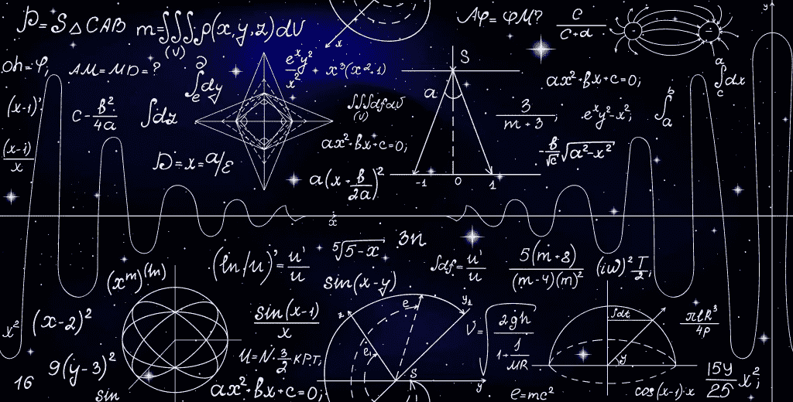

# 有史以来最伟大的数学家的 7 大数学名言

> 原文：<https://pub.towardsai.net/top-7-math-quotes-from-the-greatest-mathematicians-of-all-time-42613829ab40?source=collection_archive---------0----------------------->

**(鸣谢:玛丽娜孙/Shutterstock)**

尽管我是一名物理学家，但数学一直是我的最爱。大约 20 年前，我在阅读一本微积分教科书时偶然发现了其中的一些引文。时至今日，这些名言仍然是我灵感和动力的源泉。

1.  *让不懂几何的人不要进入*——**柏拉图**

传说这句话被刻在柏拉图学院的门口，这所学校是他在雅典创立的。

2.我们可能总是认为，不能被翻译成好的英语和合理的常识的代数是糟糕的代数

3."*数学家是能在定理之间找到类比的人；一个更好的数学家能看到证明之间的相似之处，而最好的数学家能注意到理论之间的相似之处。人们可以想象，最终的数学家是能够看到类比之间的类比的人——**斯特凡·巴拿赫***

4.*人类的头脑从来没有发明过一个等同于代数的省力机器*——**j·威拉德·吉布斯**

5.在大多数科学领域，一代人会拆除另一代人建立的东西，而一个人建立的东西，另一个人会推翻。仅在数学领域，每一代人都会给旧的结构添加一个新的故事——**赫尔曼·汉克尔**

6.“*数学是科学女王，数论是数学女王*”——**卡尔·弗里德里希·高斯**

7.“不要担心你在数学上的困难。我可以向你保证我的更伟大