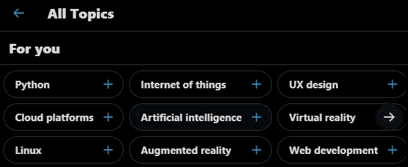

# 顶级免费数据科学学习平台

> 原文：<https://pub.towardsai.net/top-free-data-science-learning-platforms-42eef434fd?source=collection_archive---------2----------------------->

## [职业生涯](https://towardsai.net/p/category/careers)

免费的数据科学隐藏宝石，将帮助您学习新的数据技能。

JESHOOTS.COM 在 [Unsplash](https://unsplash.com?utm_source=medium&utm_medium=referral) 上[的照片](https://unsplash.com/@jeshoots?utm_source=medium&utm_medium=referral)

Glassdoor 将数据科学列为 2021 年美国第二大工作。 [BLOCKGENI](https://blockgeni.com/demand-for-data-scientists-in-industry/) 。为了满足高需求，优质数据科学家的数量有限，这迫使公司支付大量费用来吸引数据科学家，因此，为了获得高薪工作，你需要从某个地方开始，这就是本文帮助你获得免费学习资源、最新技术项目新闻和找到你的利基的地方。这些学习平台帮助我学习了基本技能，之后帮助我找到了我可以努力并变得更好的位置。

# **GitHub**

你可以在 GitHub 上找到一个解释得很好的项目，它将与最新的解决方案和技术相集成。我会推荐你安装 GitHub [移动应用](https://github.com/mobile/)并且在你空闲的时候浏览其他人的项目，你会学到很多东西，尽管这对你来说很难理解。对于学习资源，你会在初学者到高级指南中找到大量何伶材料，用户共享帮助代码片段、指导笔记本和关于这些函数如何工作的详细描述，以便你可以学习并立即开始自己的编码。如果你正在 GitHub 上寻找数据科学材料，我会建议你首先尝试这些存储库[数据科学笔记本](https://github.com/donnemartin/data-science-ipython-notebooks)、 [awesome-datascience](https://github.com/academic/awesome-datascience) 、[免费学习数据科学](https://github.com/therealsreehari/Learn-Data-Science-For-Free)和[机器学习思维导图](https://github.com/dformoso/machine-learning-mindmap)。

 [## GitHub:世界构建软件的地方

### GitHub 是超过 6500 万开发者共同塑造软件未来的地方。为开源做贡献…

github.com](http://github.com/) 

# **付费学习平台**

[Datacamp](https://learn.datacamp.com/) 、 [Coursera](https://www.coursera.org/) 、 [Udemy](https://www.udemy.com/) 、 [Udacity](https://www.udacity.com/) 等平台让任何人从绝对零度开始学习数据科学变得很容易。试试他们的免费试用版，或者你可以使用微软 Azure 和 GitHub 学生帐户免费订阅 2 个月。有些学校还提供经济资助和免费课程，帮助你学习基础知识。我会一直选择付费平台，因为他们有一个交互式的编码环境，可以帮助社区和员工。这些课程还附带一份证书，你可以在 LinkedIn 的个人资料上展示或添加到你的简历中。我强烈建议你先看看这些，然后找一个激发你兴趣的免费课程。我还链接了微软阿祖拉和 GitHub 学生包，它们为学习平台提供了各种各样的免费路径，如 [Datacamp](https://learn.datacamp.com/) 和 [Educative](https://www.educative.io/github-students?utm_source=github-student-pack) 。

 [## GitHub 学生开发者包

### GitHub 学生开发者包是你学习如何编码所需要的。去拿你的包。

education.github.com](https://education.github.com/pack)  [## 面向学生的 Azure-免费帐户点数| Microsoft Azure

### 开始构建应用程序使用您喜欢的语言进行开发，并在 Visual Studio 中创建自定义应用程序。让您的应用程序…

azure.microsoft.com](https://azure.microsoft.com/en-us/free/students/) 

# **YouTube**

在这个平台上，您可以快速解决或详细解释某个特定的一揽子计划或完整的职业道路。你会发现大量的内容创作者免费发布教程视频。我会推荐你开始找你喜欢的教程，以后再加看。由于免费的学习体验和丰富多样的内容，YouTube 是新人的最爱。如果你是这个平台的新手，正在努力寻找更好的学习资源，我会建议你看看免费代码营频道。你也可以寻找[尤里卡！](https://www.youtube.com/user/edurekaIN)、[肯吉](https://www.youtube.com/channel/UCiT9RITQ9PW6BhXK0y2jaeg)、 [Simplilearn](https://www.youtube.com/user/Simplilearn) 、 [CodeWithHarry](https://www.youtube.com/channel/UCeVMnSShP_Iviwkknt83cww) 、[数据教授](https://www.youtube.com/channel/UCV8e2g4IWQqK71bbzGDEI4Q)。

免费代码营的 YouTube 视频|数据科学课程

# **卡格尔**

Kaggle 是一个由数据科学家和机器学习实践者组成的在线社区。你可以使用策划的课程学习，用 GPU 在 python 内核上训练模型，参加机器学习比赛，讨论数据和模型，同时通过上传数据和在[维基百科](https://en.wikipedia.org/wiki/Kaggle)上分享你的代码做出贡献。简而言之，你正在获得一个完整的数据科学生态系统，如果你是这个世界的新手，我建议你在学习任何东西之前在这个平台上创建你的帐户。这个平台是你进入现实世界的门户。

通过 Kaggle 课程，您可以获得一个交互式环境，在这里您可以学习、编码并与现实生活中的数据进行交互。课程结束时，您将收到一份结业证书，可以放在您的简历和 LinkedIn 个人资料中。Kaggle 也有一个巨大的社区驱动的学习资源，你只需要搜索关键词，你就会找到 100 本相同主题的笔记本。

 [## 学习 Python，Data Viz，Pandas &更多|教程| Kaggle

### 你可以立即应用的实用数据技能:这就是你将在这些免费的微型课程中学到的东西。他们是…

www.kaggle.com](https://www.kaggle.com/learn) 

# **博客**

数据科学博客在像[走向数据科学](https://towardsdatascience.com/)这样的媒介上，为数据科学家分享他们的研究和代码创造了一种新的方式。我建议你在谷歌上搜索文章，如果你偶然发现一个比 medium 更好的平台，那么就开始订阅它们，因为这些出版公司总是发布关于机器学习和数据科学的最佳文章。为了让你充分利用博客的潜力，我建议你跟随作者，他的文章对你有意义，并在几分钟内教会你所知道的事情。与研究论文相比，博客更容易阅读，因为它们有非正式和简单的语言，这对初学者来说很有吸引力。最后，我会强烈推荐你在 [Medium](https://medium.com/) 、 [Analytics Vidhya](https://www.analyticsvidhya.com/) 、 [Data Science Central](https://www.datasciencecentral.com/) 和 [hackernoon](https://hackernoon.com/) 等网站上创建一个账户

 [## 走向人工智能

### 《走向人工智能》是世界领先的多学科科学出版物。走向人工智能出版最好的技术…

pub.towardsai.net](https://pub.towardsai.net) 

# **推特**

我知道你们都认为 Twitter 是政治驱动的社交媒体，但它将接触到那些在数据科学所有领域的最新技术中工作和合作的人，这可以帮助你在滚动帖子的同时学习。你所需要做的就是跟随那些在顶级行业工作的名人，向他们学习，因为他们每天都在分享他们的经验。我关注的一些活跃的数据科学家是[杰瑞米·霍华德](https://twitter.com/jeremyphoward)、 [JFPuget](https://twitter.com/JFPuget) 、 [Abhishek](https://twitter.com/abhi1thakur) 和 [Bojan Tunguz](https://twitter.com/tunguz) ，他们都是各自领域的顶尖人物。他们让我意识到这个行业是多么的快，而跟上这种快节奏的唯一方法就是互相学习。

丹尼尔推特|大纲分析

推特也有话题选项，你可以选择你感兴趣的话题，你会得到相关的新闻和推文，你唯一需要做的就是每天登录查看更新。

主题选择| Twitter

# **Reddit**

这也是一个与网络上的其他人分享想法和代码的著名平台。它提供了一个独特的解决方案，为您提供最佳和独特的作品，因为最高投票的职位显示在您的活动。Reddit 是我进入数据科学世界的门户，有一天我偶然发现了一篇关于如何预测股票价格的文章，这篇文章非常简单易懂，它们让我兴奋地加入了与数据科学相关的特定团体。如果你想加入机器学习实践者和数据科学家的社区，我会推荐你加入[r/数据科学](https://www.reddit.com/r/datascience/)和[r/机器学习](https://www.reddit.com/r/MachineLearning/)，在那里你可以学习从基础到高级的概念。Reddit 是一个非常有吸引力的地方，每天都有很多人展示他们的项目并讨论这个新概念。Twitter 是一个更一般化的社交平台，但有了 Reddit，你可以享受成为活跃社区一员的额外待遇。

 [## r/数据科学

### r/datascience:数据科学从业者和专业人士讨论和辩论数据科学职业生涯的地方…

www.reddit.com](https://www.reddit.com/r/datascience/) 

# 书

从书本中学习是一种独特的体验，因为你按照自己的节奏学习，如果你是守旧派，你会更喜欢买书而不是在线阅读。与一个小时的视频教程相比，我对书籍的体验非常好，因为你可以获得深入的知识。

**你可以从亚马逊购买付费图书**

 [## Fastai 和 PyTorch 的深度学习:没有博士学位的人工智能应用

### Fastai 和 PyTorch 的深度学习:没有博士学位的 ai 应用程序…

www.amazon.com](https://www.amazon.com/Deep-Learning-Coders-fastai-PyTorch/dp/1492045527) 

或者你可以从 GitHub 免费获得整本书

 [## GitHub - fastai/course-v3:第三版 course.fast.ai

### 程序员实用深度学习第三版。笔记本见 nbs 文件夹。您需要将 fastai1 与…

github.com](https://github.com/fastai/course-v3) 

你会发现很多免费的书很贵，因为有些作者把这些书做成了 GitHub repositor，相当于原来的书，例如:[接近几乎](https://github.com/abhishekkrthakur/approachingalmost)，[python-machine-learning-book-3rd-edition](https://github.com/rasbt/python-machine-learning-book-3rd-edition)

学习一项新技能的唯一方法是明确你的目标，并花时间去实现它，这些学习资源和平台会随后出现。如果你只是漫不经心地谈论数据科学和试水，我会建议你从 Reddit 和 Twitter 开始，然后转向 YouTube 教程，最终完成付费课程。这些付费课程都有时间表，它会让你按时完成课程。一旦您习惯了一些数据科学的基础知识，其他资源(如博客和 GitHub)也会随之而来。

> 学习数据科学的唯一快速方法是投入时间和精力，一旦你掌握了关键概念，在 Kaggle 上创建一个档案，并通过贡献和向大师学习开始向上爬。

**祝你好运**