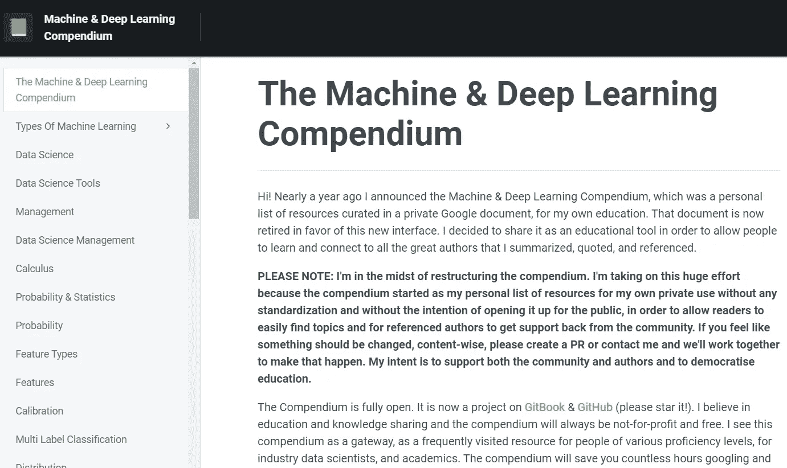
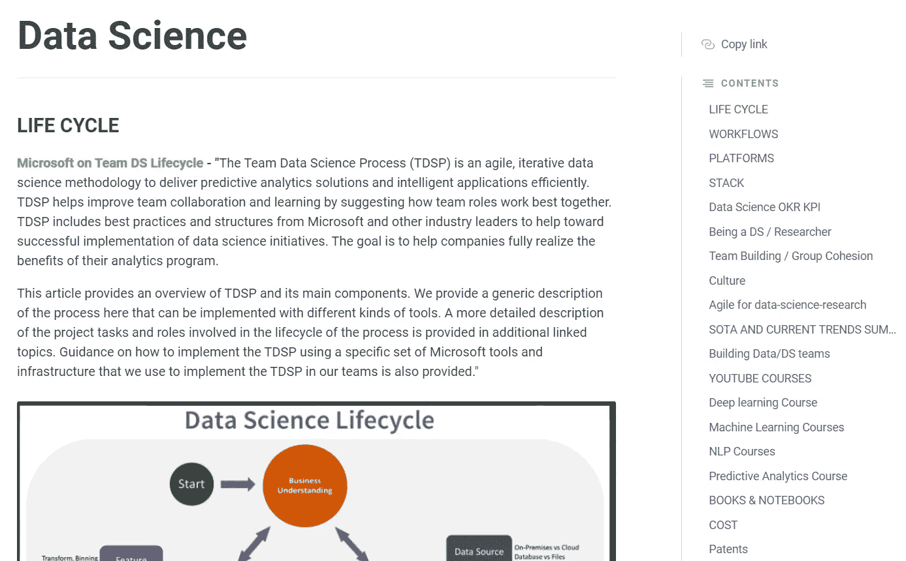
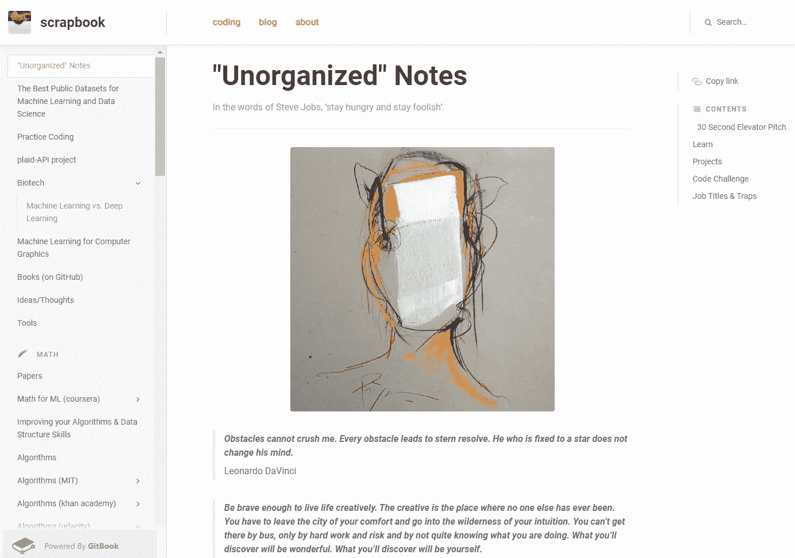
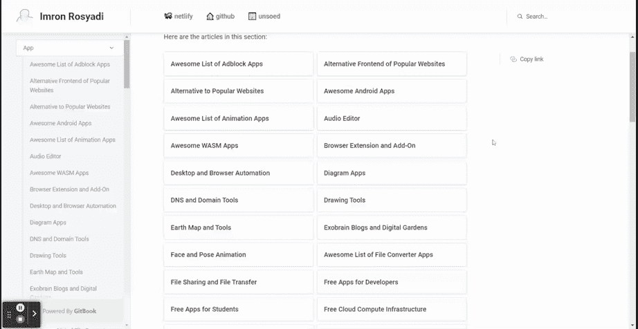
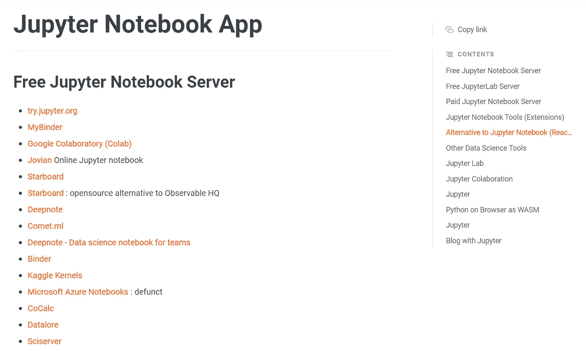
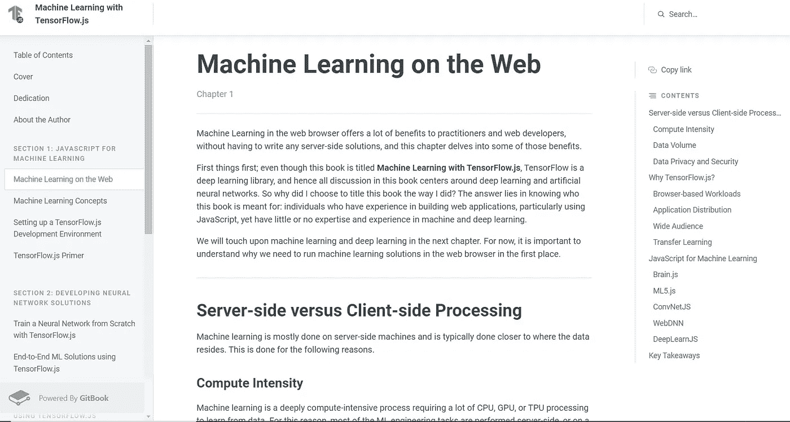

# 学习机器学习的顶级 GitBook 项目

> 原文：<https://pub.towardsai.net/top-gitbook-projects-to-learn-machine-learning-4f8c27edcd59?source=collection_archive---------2----------------------->

## 将这些项目添加到您的机器学习学习材料中

罗曼·辛克维奇·🇺🇦在 [Unsplash](https://unsplash.com?utm_source=medium&utm_medium=referral) 上拍摄的照片

作为数据科学家，机器学习是我们工作的必备技能。学习机器学习的材料很容易在网上找到，因为许多人已经开发了材料供他人理解。然而，很难找到一个涵盖初学者所有需求的软件。

为了帮助每个人找到合适的学习材料，我想在本文中介绍我的顶级机器学习 GitHub 图书项目。让我们开始吧。

# 1.ml 纲要

[ml 简编](https://mlcompendium.gitbook.io/machine-and-deep-learning-compendium/) GitBook 项目是由 [Ori Cohen](https://github.com/orico) 发起的一个开源项目。该项目旨在将所有机器学习教育材料集中在一个地方，他们做得很好。如果我们试着数一数，已经有超过 500 个主题被添加到了 mlcompendium GitBook 项目中。

作者图片

该纲要由信息丰富的文章、链接、论文、课程等组成。阅读所有概要材料可能需要很长时间，所以我建议你慢慢来。

学习材料写得很好，非常适合初学者和专业人士。例如，数据科学部分的内容简明扼要，但涵盖了每个人都应该知道的关于数据科学的许多概念。

作者图片

你可以找到机器学习所需的几乎所有信息——数据科学工具、统计学、微积分、NLP、评估指标等等。你学习所需的所有材料都有。

有些内容可能会带你到另一个链接或课程，但它们仍然是你学习的好内容。总的来说，mlcompendium 对于任何学习机器学习的人来说都是一个极好的参考。

如果你想为这个汇编做贡献，不要犹豫，联系[作者](https://www.linkedin.com/in/cohenori/)。

# 2.瑞特潘

[瑞特潘](https://ruipeterpan.gitbook.io/paper-reading-notes/)或潘瑞的博客是由[潘瑞](https://ruipan.xyz/)发起的 GitBook 项目，旨在策划一篇机器学习论文。正是为了托管他的读书论文和各种关于机器学习和操作系统的博客。

我知道很多人不习惯看论文，需要上一课。幸运的是，Ruiterpan GitBook 项目编写了一个课程来学习如何阅读学术论文。

作者图片

在 Ruitepan GitBook 项目中还有一个部分，用于学习你需要了解的关于计算机科学博士生活的任何知识——从申请、准备什么，甚至博士毕业后的生活。

在我看来，Ruiterpan GitBook 非常适合从学术角度热爱学习机器学习并希望应用更多实验数据科学的人。

# 3.剪贴簿

如果说瑞特潘 GitBook 项目侧重于学术视角的话，[剪贴簿](https://stephanosterburg.gitbook.io/scrapbook/)则是一个侧重于动手学习的项目。它专注于让自己成为一名机器学习工程师，因为该项目是由[斯蒂芬·奥斯特伯格](https://www.linkedin.com/in/stephanosterburg/)开发的，他本人就是一名机器学习工程师。

作者图片

剪贴簿中的大部分内容是数据科学的基本概念和你可以做的实践。比如学习项目、代码挑战、SQL 代码等等。

然而，有些内容会让你在就业方面有所准备——面试、职称、产品管理、敏捷方法等等。

也有很多书、课程和特定项目资源的外部链接来帮助你学习。

如果你喜欢动手而不是理论，我建议你看看剪贴簿 GitBook。对于想要准备机器学习面试和数据科学就业的人来说，内容非常好。

# 4.Irosyadi

[Irosyadi GitBook 项目](https://irosyadi.gitbook.io/irosyadi/)不是一个简单的机器学习 GitBook 项目；相反，它侧重于他们的数据(和其他)应用程序，以便我们理解。Irosyadi GitBook 的名字来源于作者 [Imron Rosyadi](https://irosyadi.netlify.app/) 。

在下面的 GIF 中，让我展示一下你在 Irosyadi GitBook 项目中会看到什么。

作者 GIF

如您所见，您可以从 Irosyadi GitBook 项目中选择和学习大量的应用。每个内容将包含各种应用程序，例如 Jupyter 笔记本应用程序。

作者图片

内容分类得很好。尽管如此，还是希望访问许多外部链接，因为这些知识来自所列的各种应用，而不是 GitBook 中的详尽解释。

# 5.使用 TensorFlow.js 进行机器学习

这个名字是自我描述的，因为这本 GitBook 致力于通过 TensorFlow.js 教授所有你需要知道的关于[机器学习的知识。](https://adnanhashmi.gitbook.io/machine-learning-with-tensorflow-js/)

作者图片

本 GitBook 项目的内容分为四个部分，即:

1.  用于机器学习的 JavaScript
2.  开发神经网络解决方案
3.  使用 TensorFlow.js 的深度学习
4.  总结和总结

这个 GitBook 项目对于想要更详细地使用 TensorFlow 学习机器学习的人来说是很好的。有些部分还没有完成，但大多数学习材料对学生来说还是很不错的。

# **结论**

机器学习对于数据科学家来说是必不可少的，因为它是我们工作中使用的工具。为了帮助每个人找到合适的学习材料，我想介绍一下我的顶级机器学习 GitHub 图书项目:

1.  ml 纲要
2.  瑞特潘
3.  剪贴簿
4.  Irosyadi
5.  使用 Tensorflow.js 进行机器学习

希望有帮助！

在我的 [**LinkedIn**](https://www.linkedin.com/in/cornellius-yudha-wijaya/) 或 [**Twitter**](https://twitter.com/CornelliusYW) 上访问我。

> *如果您喜欢我的内容，并希望获得更多关于数据或数据科学家日常生活的深入知识，请考虑在此订阅我的* ***简讯。***

> *如果您不是作为中等会员认购，请考虑通过* [*我的推荐*](https://cornelliusyudhawijaya.medium.com/membership) *进行认购。*