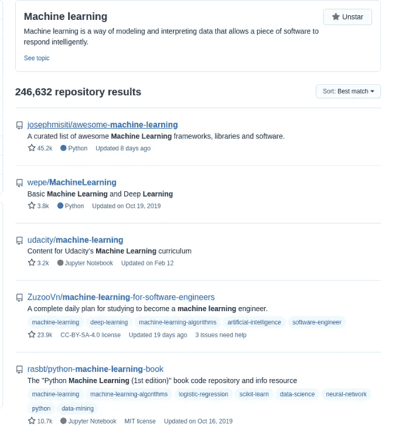
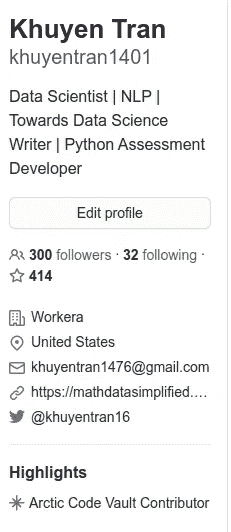
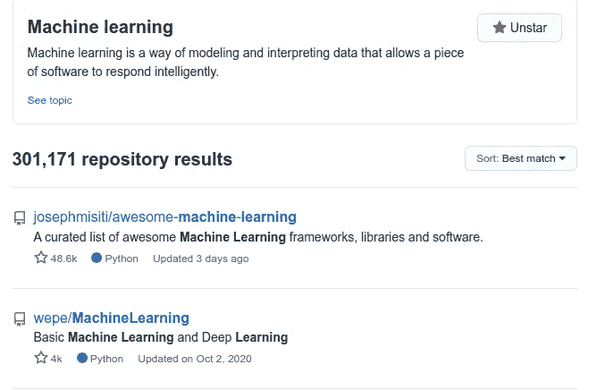
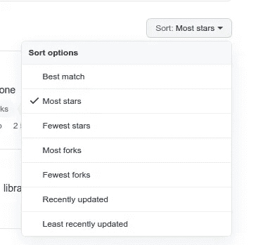
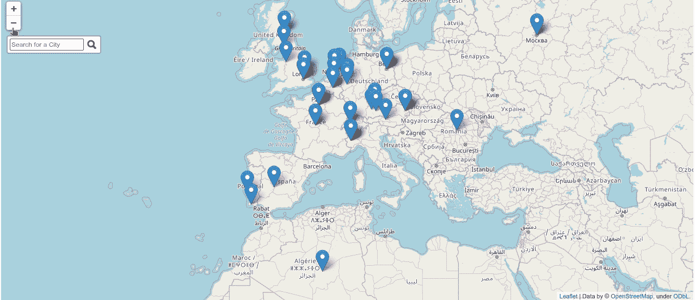

# 根据一行代码中的一个关键字来搜索 Github 用户和存储库

> 原文：<https://pub.towardsai.net/top-github-scraper-scrape-top-github-users-and-repositories-based-on-a-keyword-in-one-line-of-code-d48b29954aac?source=collection_archive---------4----------------------->

## [网页抓取](https://towardsai.net/p/category/web-scraping)

## 并创建地图来搜索特定位置的用户


照片由[阿迪托·瑞安·哈里斯纳](https://unsplash.com/@arditoryan?utm_source=medium&utm_medium=referral)在 [Unsplash](https://unsplash.com?utm_source=medium&utm_medium=referral) 上拍摄

***免责声明:*** *本文仅出于教育目的。我们不鼓励任何人抓取网站，尤其是那些可能有条款和条件反对此类行为的网站。*

# 动机

GitHub 是一个帮助开发者存储和跟踪代码的网站。我喜欢 GitHub 不仅仅是因为它让我可以控制我的代码，它还帮助我发现有趣的库、项目和很酷的开发者。

GitHub 有超过 5600 万开发者。这意味着仅仅通过探索 GitHub，你就有可能找到你软件的合作伙伴或者你的下一个员工。为什么我们不利用这个平台去寻找有趣的人呢？

# 什么是顶级 Github 刮刀？

T [op-github-scraper](https://github.com/khuyentran1401/top-github-scraper) 是我在我的文章[中创建的用于抓取 1k 多顶级机器学习 github 配置文件的库，我抓取了 1k 多顶级机器学习 GitHub 配置文件，这是我找到的](https://towardsdatascience.com/i-scraped-more-than-1k-top-machine-learning-github-profiles-and-this-is-what-i-found-1ab4fb0c0474)。

Top-github-scraper 允许您根据某个关键字获得顶级 github 用户、贡献者和存储库。



对于每个用户，top-github-scraper 会抓取 16 个不同的数据点。



更好的是，您只需要一行代码:

当搜索关键词机器学习时，要获得所有顶级 GitHub 库贡献者的表格:

这个工具对我了解其他 GitHub 用户很有帮助，所以我希望它对你也有帮助！

# 安装和设置

安装[顶部刮泥板](https://github.com/khuyentran1401/top-github-scraper)时，使用

```
pip install top-github-scraper
```

## 添加凭据

请注意，在没有凭证的情况下使用 top-github-scraper 完全没问题。但是你每小时最多只能提出 60 个请求。通过添加您的凭证(用户名和令牌)，您可以每小时发出多达**5000 个请求。**

为了确保你能收集到许多存储库和用户，把你的 GitHub 的证书添加到根目录下的`.env`文件中。

```
touch .env
```

将您的用户名和[令牌](https://docs.github.com/en/github/authenticating-to-github/creating-a-personal-access-token)添加到`.env`文件中:

```
GITHUB_USERNAME=yourusername
GITHUB_TOKEN=yourtoken
```

# 你能用 top-github-scraper 做什么？

除了获得贡献者表之外，您还可以获得其他有趣的数据，比如顶级存储库和用户。

## 获取顶级 GitHub 资源库的 URL

当搜索某个关键词时，您可以抓取在搜索结果中首先显示的存储库 URL 列表:



使用`get_top_repo_urls`方法:

```
 [
    "/josephmisiti/awesome-machine-learning",
    "/wepe/MachineLearning",
    "/udacity/machine-learning",
    "/Jack-Cherish/Machine-Learning",
    "/ZuzooVn/machine-learning-for-software-engineers",
    "/rasbt/python-machine-learning-book",
    "/lawlite19/MachineLearning_Python",
    "/lazyprogrammer/machine_learning_examples",
    "/trekhleb/homemade-machine-learning",
    "/ujjwalkarn/Machine-Learning-Tutorials",
    ...
]
```

或者，您可以在搜索某个关键词时抓取拥有最多星级的存储库:



通过运行上面的代码，您应该会看到类似这样的内容:

```
['/tensorflow/tensorflow',
 '/josephmisiti/awesome-machine-learning',
 '/scikit-learn/scikit-learn',
 '/fighting41love/funNLP',
 '/ZuzooVn/machine-learning-for-software-engineers',
 '/ageron/handson-ml',
 '/eriklindernoren/ML-From-Scratch',
 '/trekhleb/homemade-machine-learning',
 '/PaddlePaddle/Paddle',
 '/kailashahirwar/cheatsheets-ai',
 '/ageron/handson-ml2',
 '/ty4z2008/Qix',
 '/lutzroeder/netron',
 ...
]
```

## 获取顶级 GitHub 库的信息

您还可以获得最佳匹配库的信息，包括`stargazers_count`、`forks_count`、`contributors`和贡献者信息。

您应该获得一个字典列表，每个字典包含一个存储库的信息。这是 1 个存储库的信息。

```
{
        "stargazers_count": 48620,
        "forks_count": 12155,
        "contributors": {
            "login": [
                "josephmisiti",
                "josephmmisiti",
                "hslatman",
                "0asa",
                "ajkl",
                "ipcenas",
                "cogmission",
                "spekulatius",
                "basickarl",
                "NathanEpstein"
            ],
            "url": [
                "[https://api.github.com/users/josephmisiti](https://api.github.com/users/josephmisiti)",
                "[https://api.github.com/users/josephmmisiti](https://api.github.com/users/josephmmisiti)",
                "[https://api.github.com/users/hslatman](https://api.github.com/users/hslatman)",
                "[https://api.github.com/users/0asa](https://api.github.com/users/0asa)",
                "[https://api.github.com/users/ajkl](https://api.github.com/users/ajkl)",
                "[https://api.github.com/users/ipcenas](https://api.github.com/users/ipcenas)",
                "[https://api.github.com/users/cogmission](https://api.github.com/users/cogmission)",
                "[https://api.github.com/users/spekulatius](https://api.github.com/users/spekulatius)",
                "[https://api.github.com/users/basickarl](https://api.github.com/users/basickarl)",
                "[https://api.github.com/users/NathanEpstein](https://api.github.com/users/NathanEpstein)"
            ],
            "contributions": [
                671,
                105,
                21,
                12,
                11,
                9,
                8,
                7,
                7,
                7
            ]
        }
    }
```

## 获取顶级 GitHub 用户的个人资料

在搜索某个关键词时，您还可以获得拥有最多关注者的用户列表。


酷！现在我们有了数据。但是仅仅看着桌子并不有趣。我们可以[分析数据](https://towardsdatascience.com/i-scraped-more-than-1k-top-machine-learning-github-profiles-and-this-is-what-i-found-1ab4fb0c0474)或者创建一个地图来根据用户的位置搜索用户。

# 创建带有搜索框的地图

如果你是一个正在使用 GitHub 寻找未来雇员的雇主，你可能希望根据位置来搜索他们。因此，我们将创建一个地图，显示 GitHub 顶级用户的位置，如下所示:



[作者 GIF](https://datapane.com/u/khuyentran1401/reports/top-github-profiles/?blocksquery=//*[@id=%27map%27])

我们将使用[叶子](https://python-visualization.github.io/folium/quickstart.html#Getting-Started)创建一个地图。使用安装叶片

```
pip install folium
```

现在我们将获得顶级机器学习贡献者和用户的数据，并将它们结合在一起。

获取纬度、经度、地址和城市

将熊猫数据框架转换为地理数据框架

创建带有搜索框的地图

酷！如果您想查找旧金山的用户，请在搜索框中键入“旧金山”。地图应该会给你指出用户的大概位置。将鼠标悬停在每个标记上以获取用户信息。

如果你对合作感兴趣，给他们发一封电子邮件！

# 结论

恭喜你！您刚刚学习了如何使用 top-github-scraper 根据关键字获得顶级用户、贡献者和存储库。您还学习了如何创建带有搜索框的地图来查找您感兴趣的用户！

希望你以此为工具，从 GitHub 中获得真知灼见，拓展人脉！

随意使用 [top-github-scraper](https://github.com/khuyentran1401/top-github-scraper) 或[本文提供的代码](https://github.com/khuyentran1401/Data-science/blob/master/scraping/scrape_top_github.ipynb)。

我喜欢写一些基本的数据科学概念，并尝试不同的算法和数据科学工具。你可以在 [LinkedIn](https://www.linkedin.com/in/khuyen-tran-1ab926151/) 和 [Twitter](https://twitter.com/KhuyenTran16) 上和我联系。

如果你想查看我写的所有文章的代码，请点击这里。在 Medium 上关注我，了解我的最新数据科学文章，例如:

[](https://towardsdatascience.com/how-to-create-fake-data-with-faker-a835e5b7a9d9) [## 如何用 Faker 创建假数据

### 您可以收集数据或创建自己的数据

towardsdatascience.com](https://towardsdatascience.com/how-to-create-fake-data-with-faker-a835e5b7a9d9) [](https://towardsdatascience.com/find-common-words-in-article-with-python-module-newspaper-and-nltk-8c7d6c75733) [## 用 Python 模块 Newspaper 和 NLTK 查找文章中的常用词

### 使用 newspaper3k 和 NLTK 从报纸中提取信息和发现见解的分步指南

towardsdatascience.com](https://towardsdatascience.com/find-common-words-in-article-with-python-module-newspaper-and-nltk-8c7d6c75733) [](https://towardsdatascience.com/sentiment-analysis-of-linkedin-messages-3bb152307f84) [## 使用 Python 和情感分析探索和可视化您的 LinkedIn 网络

### 希望优化您的 LinkedIn 个人资料？为什么不让数据为你服务呢？

towardsdatascience.com](https://towardsdatascience.com/sentiment-analysis-of-linkedin-messages-3bb152307f84) [](https://towardsdatascience.com/streamlit-and-spacy-create-an-app-to-predict-sentiment-and-word-similarities-with-minimal-domain-14085085a5d4) [## Streamlit 和 spaCy:创建一个应用程序来预测情绪和单词的相似性，最小域…

### 只需要 10 行代码！

towardsdatascience.com](https://towardsdatascience.com/streamlit-and-spacy-create-an-app-to-predict-sentiment-and-word-similarities-with-minimal-domain-14085085a5d4)