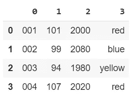
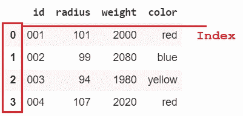
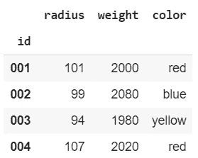
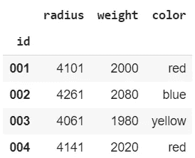
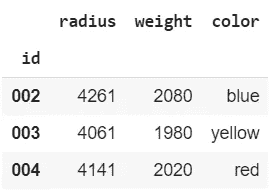
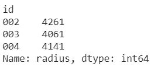
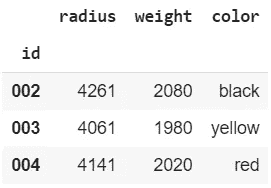
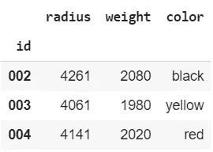
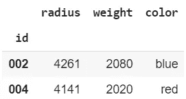

# 快速熊猫方法排行榜

> 原文：<https://pub.towardsai.net/top-list-of-quick-pandas-methods-eef778a82bb1?source=collection_archive---------2----------------------->

## [数据科学](https://towardsai.net/p/category/data-science)

## 用这些有用的技巧节省你的时间

在每天学习熊猫 3 个月后，这些是你可以用来快速但有意义的编辑而不会失去耐心的顶级算法。如果你是一个专家，你可能已经知道所有这些，但是如果你是一个**初学者**，这些将对你非常有用。


照片由[锡德·巴拉钱德朗](https://unsplash.com/@itookthose?utm_source=medium&utm_medium=referral)在 [Unsplash](https://unsplash.com?utm_source=medium&utm_medium=referral) 上拍摄

让我从创建一个数据集开始，我将用许多不同的方式编辑它

```
df = [
      ['001', 101, 2000, 'red'], 
      ['002', 99, 2080, 'blue'], 
      ['003', 94, 1980, 'yellow'], 
      ['004', 107, 2020, 'red'], 
]
dfimport pandas as pd
df = pd.DataFrame(df)
df
```



# 编辑列标题

不幸的是，这些列被简单地存储为 0，1，2，3。为了编辑标题，我将使用下面一行代码:

```
df.columns = ['id', 'radius', 'weight', 'color']
```

我将列作为列表传递，以更改标题。


# 添加索引

默认情况下，数据帧有一个数字索引。但是，您可能希望根据自己的需要进行更改。



```
df.index = df['id']
df.pop('id')
df
```



一个可能需要使用索引的非常常见的实际应用是时间序列。当训练 LSTM 神经网络时，你必须丢弃数据集的时间戳。但是，您可以将它作为索引添加，而不是删除它。

# 编辑整个数据集

这绝对是我最喜欢的功能。使用 apply 和 lambda 函数，我可以根据我的指令编辑数据集中的所有信息。

例如，我想向半径列添加两倍的权重值。

```
df['radius'] = df['weight'].apply(lambda x : x+df['radius'])
df
```



# 删除第 n 行

```
df = df.drop(df.index[[0]])
df
```



# 将序列转换为数据帧

熊猫的一个看似不切实际的用途是自动将一个列转换成一个系列。

```
row = df['radius']
row
```



现在，我可以应用于 DataFrame 的所有设置和方法都无效了，因为它本质上表现得像一个 NumPy 数组。

```
row = pd.DataFrame(df['radius'])
row
```


如您所见，您可以将单个列(系列)转换回 DataFrame。

# 制作数据集的副本

一个错误的假设是，通过定义另一个变量，您可以简单地复制数据集:

```
a = df
a
```

我不会修改 a 的元素:

```
a['color'][0] = 'black'
a
```



但是，如果我们看一下 df，我们没有直接编辑:

```
df
```



我们可以看到两个数据集都被修改了。这是因为 Pandas 通过向新变量分配引用来工作。

要解决这个问题:

```
a = df.copy()
```

如果我们进行同样的实验，你会看到只有将被修改。


# 仅维护具有特定值的行

现在让我假设我只想保存权重值大于 2000 的行。

```
df = df.loc[df['weight'] > 2000]
df
```

