# 2022 年关于数据科学的顶级媒体出版物和标签

> 原文：<https://pub.towardsai.net/top-medium-publications-and-tags-about-data-science-in-2022-95a0b5f950b7?source=collection_archive---------3----------------------->

## [数据科学](https://towardsai.net/p/category/data-science)

## 哪里可以找到适合数据科学家的最佳文章

[Ga](https://unsplash.com/@neringa?utm_source=medium&utm_medium=referral) 在 [Unsplash](https://unsplash.com?utm_source=medium&utm_medium=referral) 上拍照

成立于 2012 年的 Medium 现已成为世界上最受欢迎的网站之一，根据 Alexa 的数据，它目前是全球互联网流量和参与度排名第 140 位的网站。

中型出版物目前涵盖了你能想到的所有类别，有超过 12K 的独立出版物。然而，特别是对于新用户来说，看着成百上千的用户是令人生畏的。此外，并非所有出版物都仍然活跃。

为了解决这些问题，我分析了许多最流行的出版物和标签，以了解该平台的当前状态。在本文中，我将深入研究与*数据科学相关的出版物和标签。*

# 数据科学如何与媒体上的其他主题相关联

下图显示了 Medium 的顶级出版物(蓝色)和标签(绿色)的情况。关于相似主题的出版物和标签显示在一起，它们形成了语义区域(看看本文的结尾就知道我是如何进行这种分析的)。大尺寸的蓝色气泡意味着出版物有许多追随者，而大尺寸的绿色气泡意味着标签有许多故事。你可以在这里和它[互动。](https://pubs-and-tags.social/)

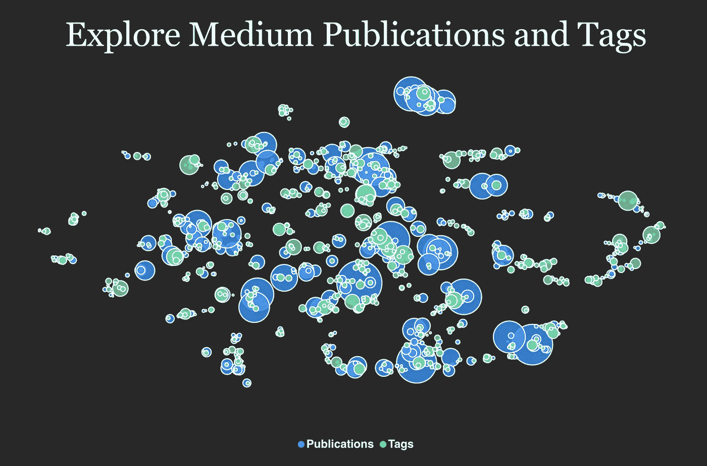

出版物和标签的媒介语义景观。图片由作者提供。

悬停在蓝色气泡上，您可以看到其出版物的详细信息:名称、描述、关注者数量、它是否仍然活跃(这取决于最后一篇发表文章的日期)，以及它是否接受投稿(从出版物的作者数量中推断)。

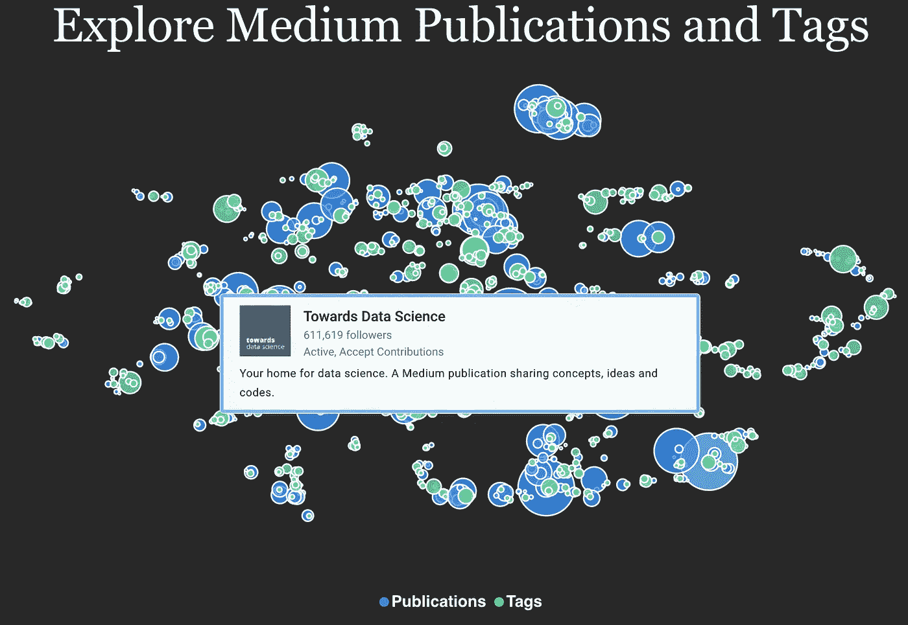

出版物和标签的中等语义景观，以及“走向数据科学”出版物的详细信息。图片由作者提供。

在研究了这张图表一段时间后，我确定了这些主要的媒体领域:

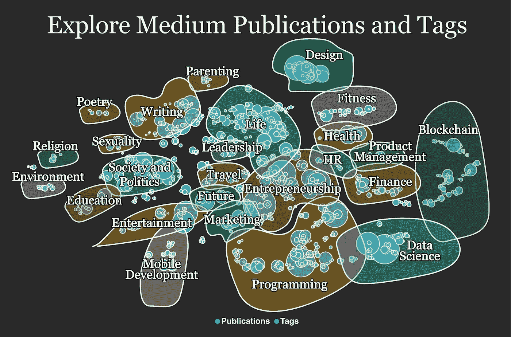

媒体发布和标签被分组到语义区域中。图片由作者提供。

[*数据科学*](https://medium.com/tag/data-science) 标签是一个绿色气泡，位于图表的右下方，我在下一张图中画了一个红叉。

“数据科学”标签的详细信息及其与其他媒体出版物和标签的相关性。图片由作者提供。

在本文中，我们将讨论数据科学领域，以及在标签*数据科学*附近可以找到的最近的出版物和标签。

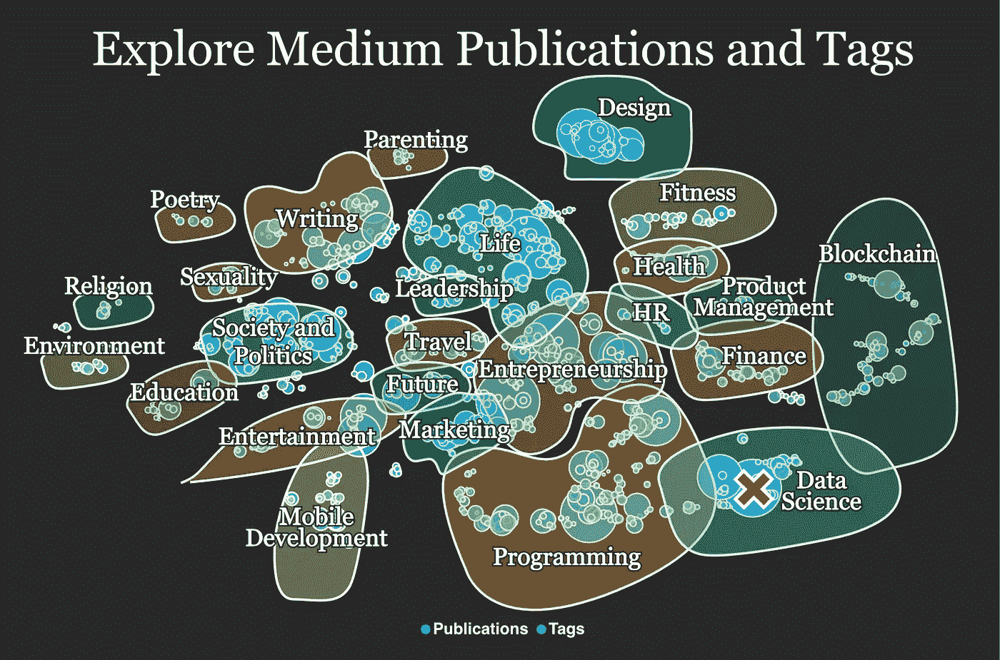

媒体出版物和标签分组到语义区域，显示标签“数据科学”在哪里。图片由作者提供。

# 与数据科学相关的顶级出版物和标签

目前， [*数据科学*](https://medium.com/tag/data-science) 标签出现在 15.3 万篇故事中，由大约 5.7 万名作家撰写。

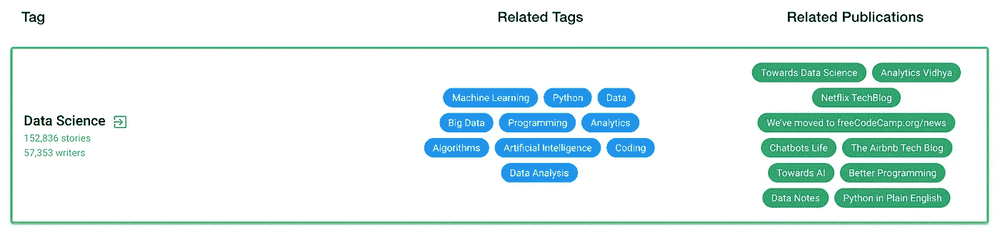

“数据科学”标签的详细信息。图片由作者提供。

与*数据科学*相关的主要出版物有[走向数据科学](https://towardsdatascience.com/)(媒体上第二大出版物)[分析 Vidhya](https://medium.com/analytics-vidhya) 、[聊天机器人杂志](https://chatbotsmagazine.com/)(不活跃)[成为人类:人工智能杂志](https://becominghuman.ai/)、[聊天机器人生活](https://chatbotslife.com/)、[走向人工智能](https://pub.towardsai.net/)、 [ML 评论](https://blog.mlreview.com/)(不活跃) [Python 直白英语](https://python.plainenglish.io/)、“他们的追随者数量从 2k 到 611k 不等，他们都非常适合数据科学文章。在下图中，您可以看到每份出版物的内容、关注者数量及其相关标签和出版物。

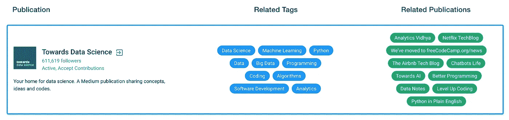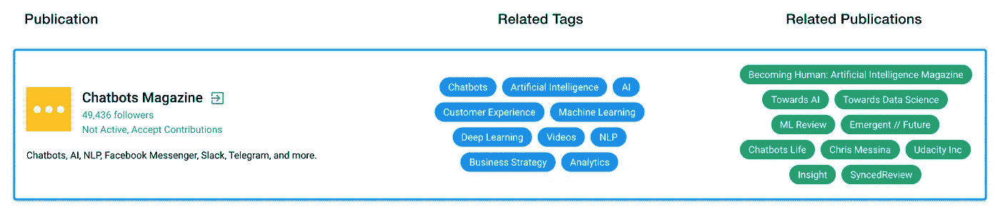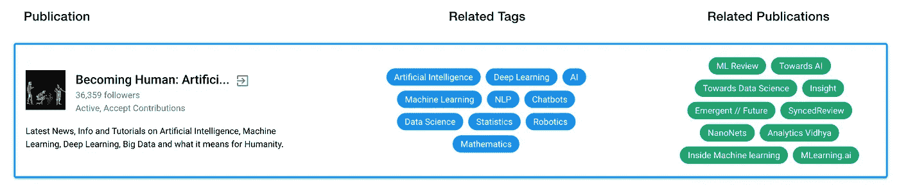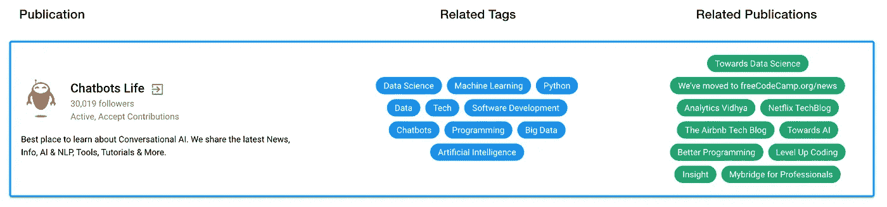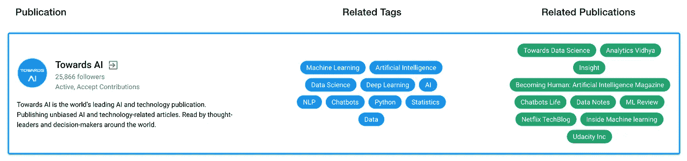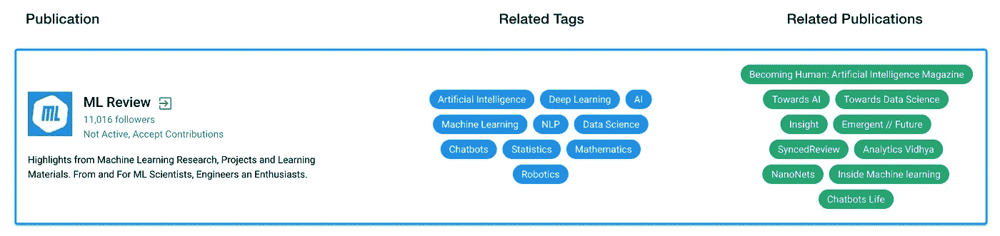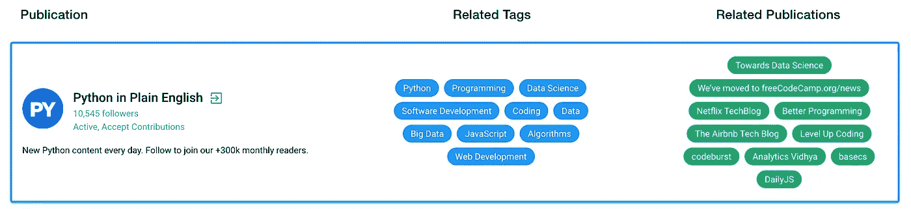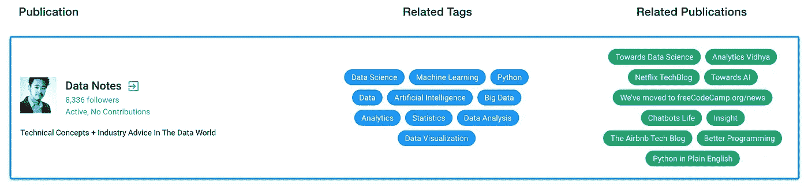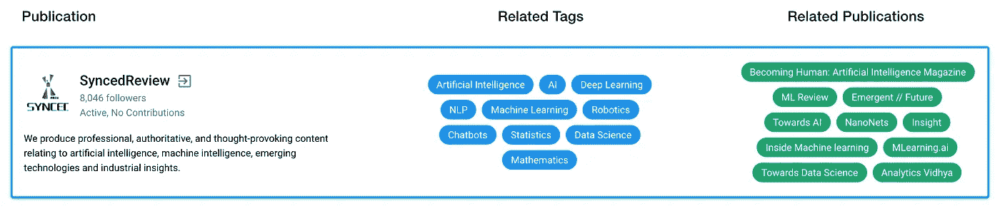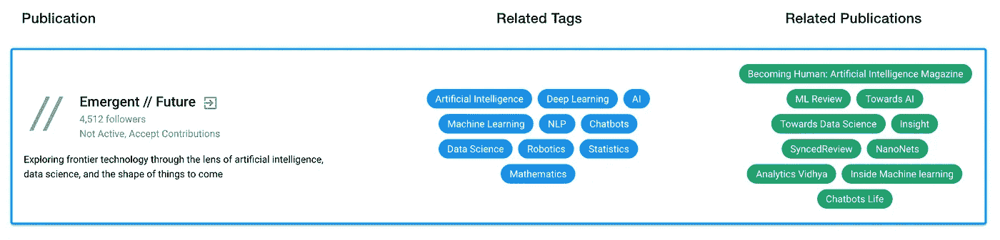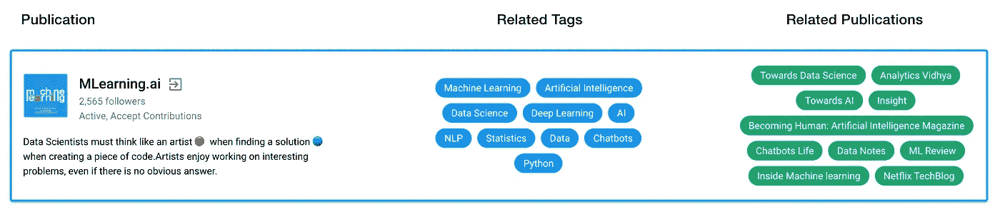

与数据科学相关的顶级出版物。作者图片。

与*数据科学*相关的主要标签有 [AI](https://medium.com/tag/ai) ，[机器学习](https://medium.com/tag/machine-learning)，[深度学习](https://medium.com/tag/deep-learning)，[统计](https://medium.com/tag/statistics)，[聊天机器人](https://medium.com/tag/chatbots)， [NLP](https://medium.com/tag/nlp) ，[机器人](https://medium.com/tag/robotics)，[数学](https://medium.com/tag/mathematics)， [Python](https://medium.com/tag/python) ，[数据](https://medium.com/tag/data)，[大数据](https://medium.com/tag/big-data)，[他们的故事数量从 16k 到 178k 不等，表明这个话题的巨大流量。在下图中，您可以看到每个标记的故事和作者数量，以及相关的标记和出版物。](https://medium.com/tag/analytics)

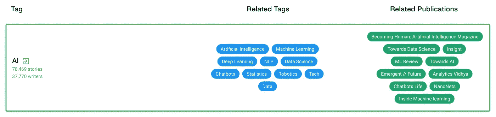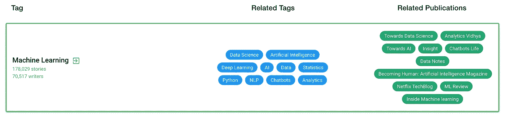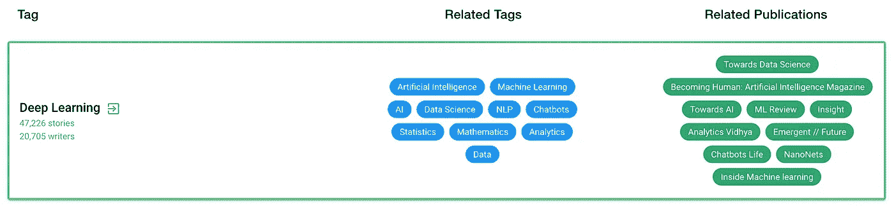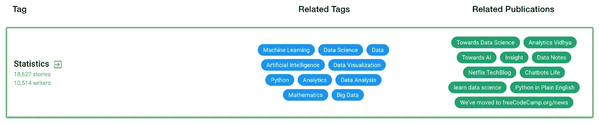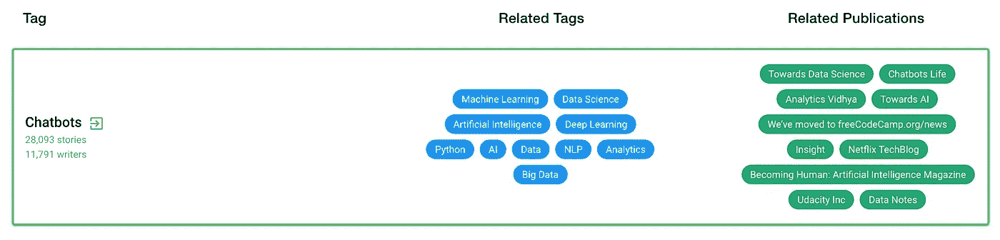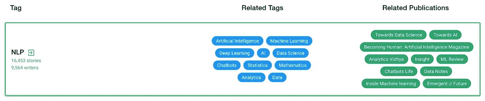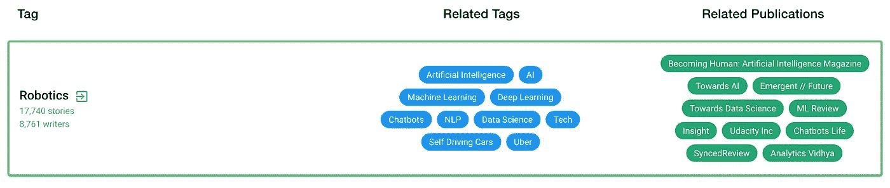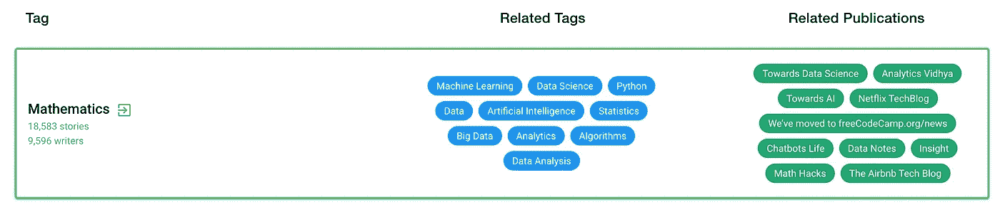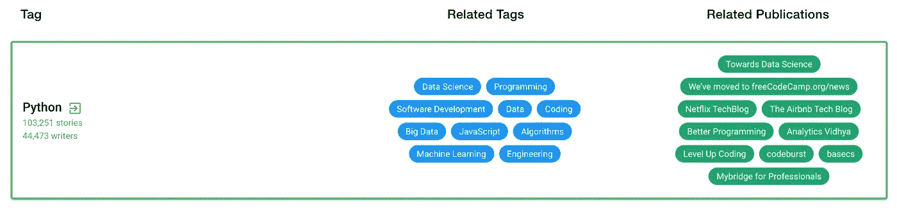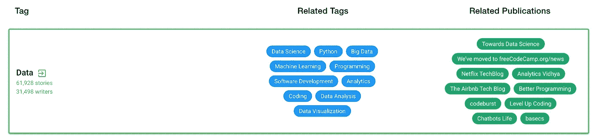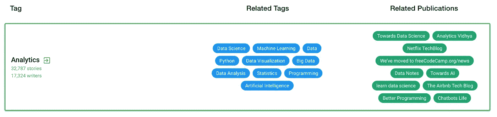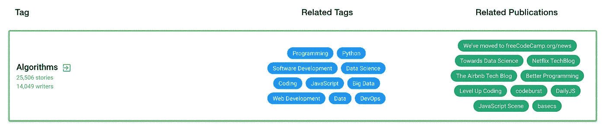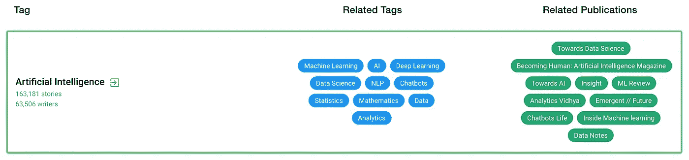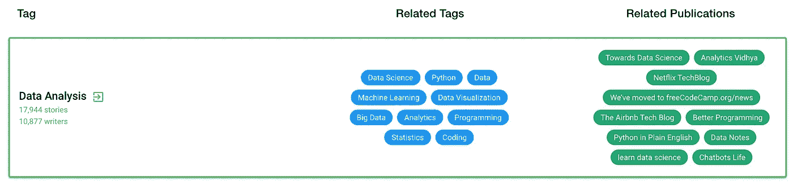

与数据科学相关的热门标签。作者图片。

# 如何自己查找更多相关的出版物和标签

如果你想搜索相关的出版物和标签，和前面几段的分析进行互动，可以在这里[做](https://pubs-and-tags.social/)。出版物可以根据关注者的数量进行排序，并筛选出当前活跃并接受投稿的出版物。

这种分析使用自然语言处理技术，这是人工智能处理人类语言的一个领域。简而言之，如果他们的文章是关于相同的主题，出版物和标签彼此相似，这是利用一种叫做[单词嵌入](https://medium.com/nlplanet/two-minutes-nlp-11-word-embeddings-models-you-should-know-a0581763b9a9)的技术完成的。如果你有兴趣了解更多关于自然语言处理是如何工作的，我建议你看看我的出版物 [NLPlanet](https://medium.com/nlplanet) 。