# 学习强化学习的顶级 Python 包

> 原文：<https://pub.towardsai.net/top-python-packages-for-studying-reinforcement-learning-e332e1c6e16a?source=collection_archive---------0----------------------->

## 通过这些包学习强化学习实践

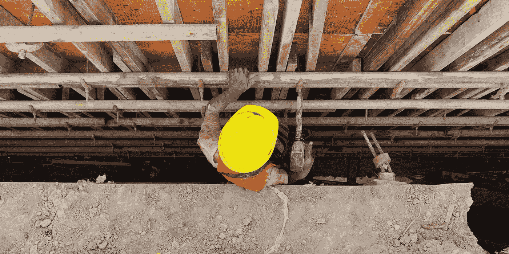

由 [Unsplash](https://unsplash.com?utm_source=medium&utm_medium=referral) 上的 [Tinky Delta](https://unsplash.com/@tinkydelta?utm_source=medium&utm_medium=referral) 拍摄

[强化学习](https://www.sciencedirect.com/science/article/abs/pii/B978044462604200023X)是一个关于最优决策的机器学习研究领域。通过从环境中学习，强化学习会找到使回报最大化的参数。

与监督或无监督学习不同，强化学习使用独立的学习者(代理)来学习环境，没有任何标签或方向。学习者必须遵循学习前制定的特定政策和奖励制度。

本质上，强化学习需要四个要素:

1.  学习者
2.  环境
3.  政策行动
4.  报酬

一般来说，会有一个有价值的函数，在这个函数中，算法会试图通过基于动作学习环境来最大化平均回报。

一开始听起来可能不太容易，但是我们可以尝试更直观地学习强化学习。使用本文中介绍的 Python 包，我们将学到比理论更多的东西。

这些包裹是什么？让我们开始吧。

# 1.Pyqlearning

[Pyqlearning](https://code.accel-brain.com/Reinforcement-Learning/index.html) 是一个用于强化学习和深度强化学习的 Python 包，尤其适用于 Q-Learning 方法。该软件包旨在设计一个强化学习算法，而不是获得一个单一的学习 API，这意味着我们可以玩这个结构。

至于学习强化学习，Pyqlearning 文档是完美的开始。强化学习中许多基本的高级过程都被概括出来，供人们学习。

Pyqlearning [文档](https://code.accel-brain.com/Reinforcement-Learning/)由软件包和算法背后的理论的描述构成。你会学到很多概念，包括:

*   ε贪婪 Q 学习
*   玻尔兹曼 Q 学习
*   深度强化学习
*   深度 Q 网络

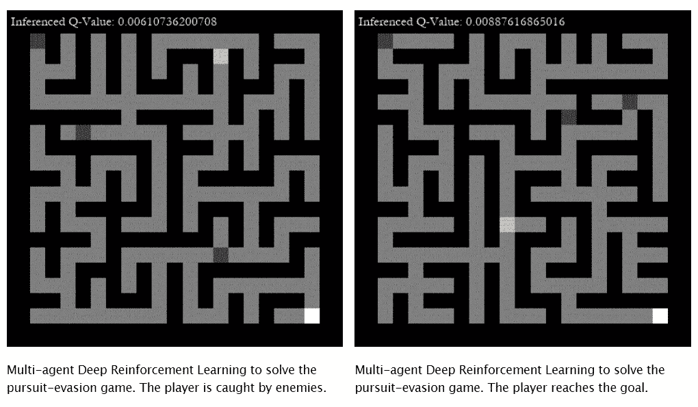

作者图片

接下来是教程，教您如何开发钢筋模型。这个教程很容易理解，而且对每个人都解释得很清楚。

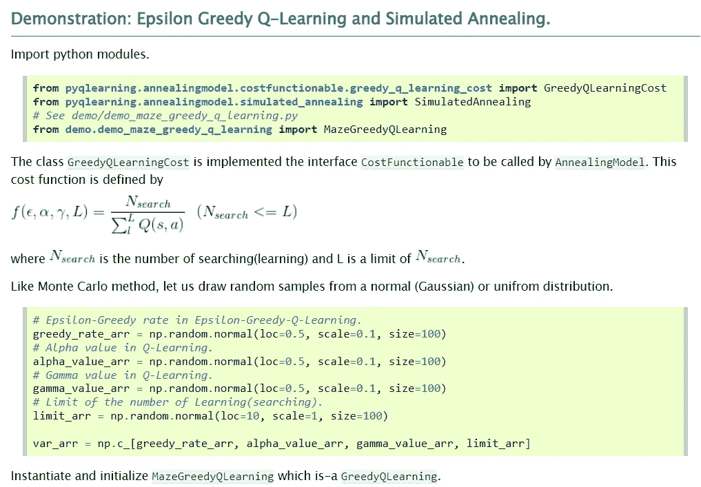

作者图片

如果您想安装这个包，请使用下面的代码。

```
pip install pyqlearning
```

如果你要访问 Pyqlearning 演示，你可以访问下面的[页面](https://github.com/accel-brain/accel-brain-code/tree/master/Reinforcement-Learning/demo)。

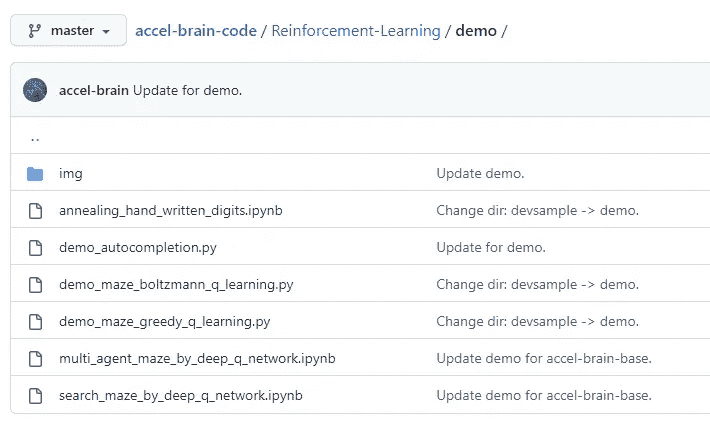

作者图片

# 2.ChainerRL

[chainerl](https://github.com/chainer/chainerrl)是一个用于强化学习的 Python 包，实现了 [Chainer](https://github.com/chainer/chainer) 深度学习框架。包很好用，GitHub 包提供了很多优秀的学习资料。

我们可以使用下面的代码来安装这个包。

```
pip install chainerrl
```

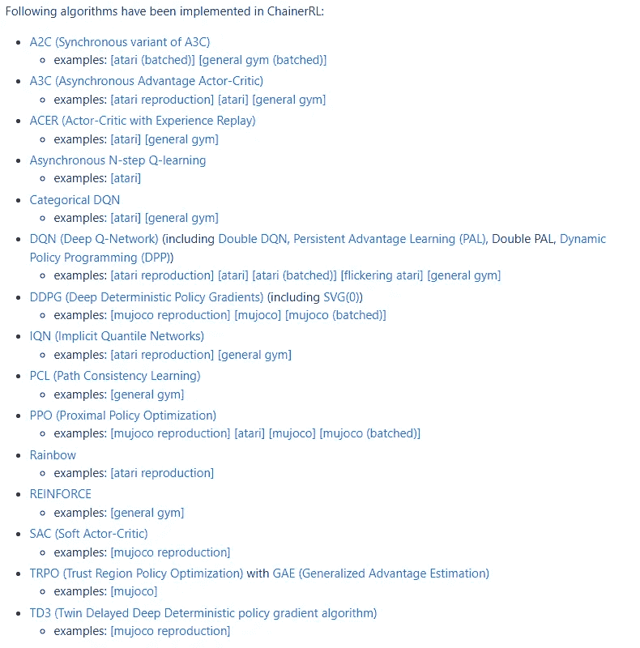

作者图片

ChaineRL 还提供了另一个名为[ChaineRL-Visualizer](https://github.com/chainer/chainerrl-visualizer)的包来分析代理是如何工作的，这使得调试器的工作更加容易。

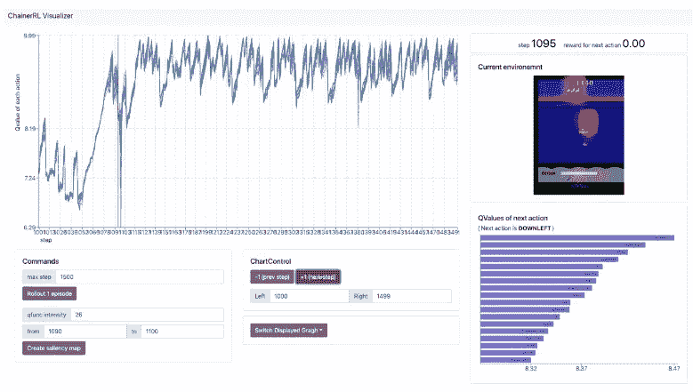

作者图片

我们可以用下面的代码安装 ChainerRL-Visualizer。

```
pip install chainerrl-visualizer
```

最后，[快速入门指南](https://github.com/chainer/chainerrl/blob/master/examples/quickstart/quickstart.ipynb)是你想动手学习的最佳起点。

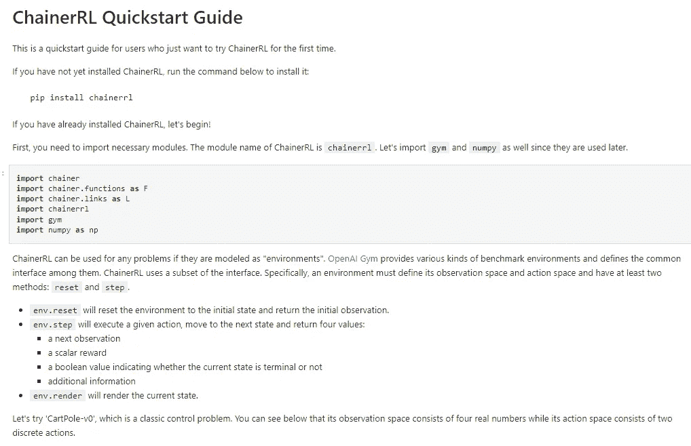

作者图片

# 3.教练

[蔻驰](https://github.com/IntelLabs/coach)是英特尔 AI 实验室开发的用于实现强化学习的 Python 包。该软件包试图提供一个简单的 API，并允许用户用几行代码训练模型。

文档的入门部分是强化学习研究的最佳部分，因为它提供了易于遵循的教程和理解强化学习所需的概念。

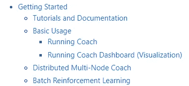

作者图片

如果你想了解一个深入的教程，你可以随时访问蔻驰提供的资源。

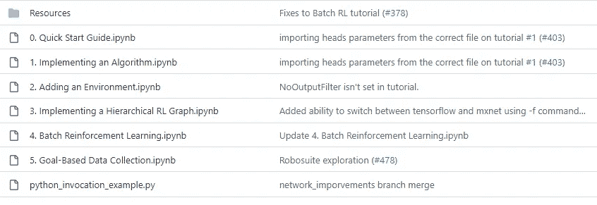

作者图片

最后，coach 文档提供了一组强化学习算法，您可以加以利用。

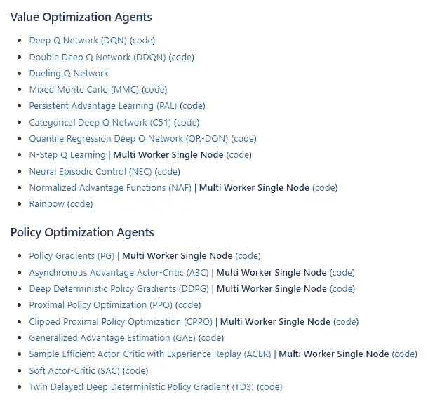

作者图片

# 4.体育馆

[Gymnasium](https://gymnasium.farama.org/) 是 OpenAI 开发的提供强化学习标准 API 的 Python 包。许多其他包依赖于 Gymnasium 包，所以它们的文档是完整的。

要安装这个包，我们只需要运行下面的代码。

```
pip install gymnasium
```

基本用法部分是你开始学习使用健身房包强化学习的最好部分。本节详细解释了使用包和强化学习的基本概念。

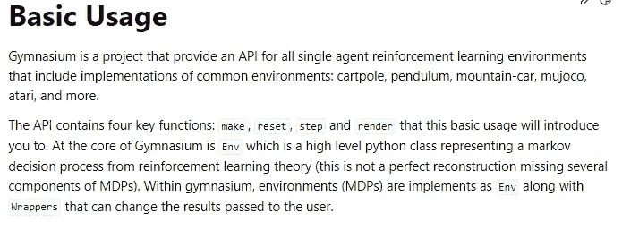

作者图片

如果你更喜欢动手学习，教程会适合你。

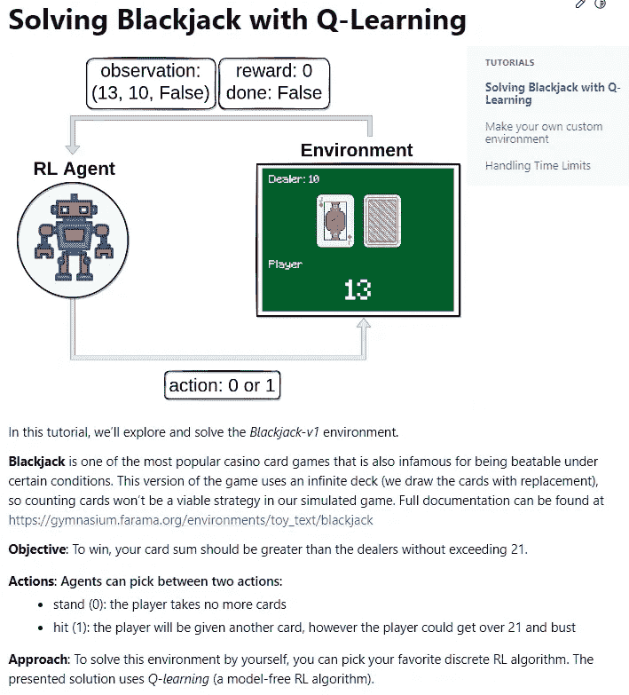

作者图片

# 5.试剂

[ReAgent](https://reagent.ai/) 是脸书团队开发的用于应用强化学习的开源 Python 包。该包是为端到端解决方案而设计的，并提供了各种 API 来简化数据科学家的工作。

像往常一样，[快速入门指南](https://reagent.ai/usage.html#quick-start)是你开始学习之旅的最佳地方。文档解释了如何运行强化学习，尤其是对于大规模分析，因为试剂是为大规模分析而设计的。

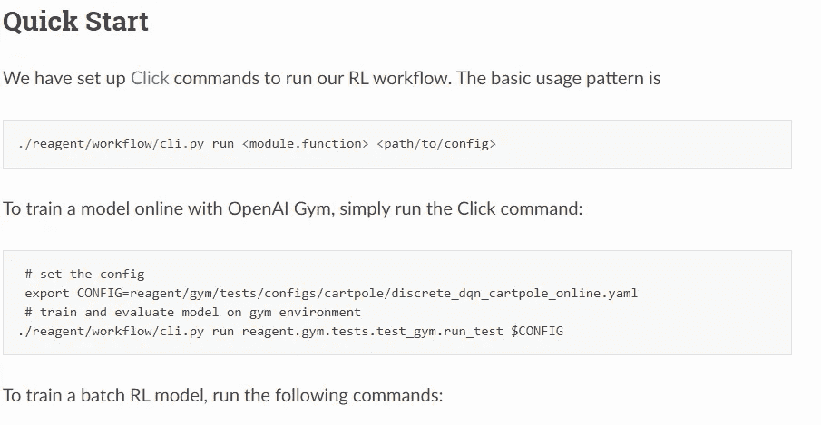

作者图片

GitHub 页面还提供了我们可以阅读的各种论文，以进一步了解强化学习。

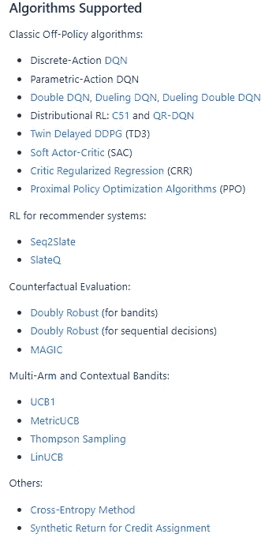

作者图片

# **结论**

强化学习是一种机器学习研究领域，它使用算法从环境中学习，并最大化其价值函数。虽然，相对于其他的机器学习算法，强化学习的学习资料并不多。

本文将提供我的顶级 Python 包来研究强化学习。它们是:

1.  Pyqlearning
2.  ChainerRL
3.  教练
4.  体育馆
5.  试剂

希望有帮助！

> 如果您没有订阅为中等会员，请考虑通过[我的推荐](https://cornelliusyudhawijaya.medium.com/membership)订阅。