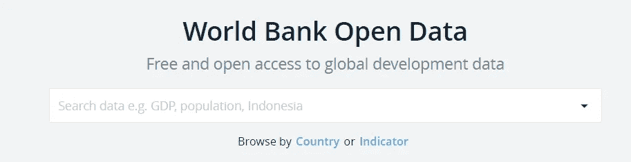
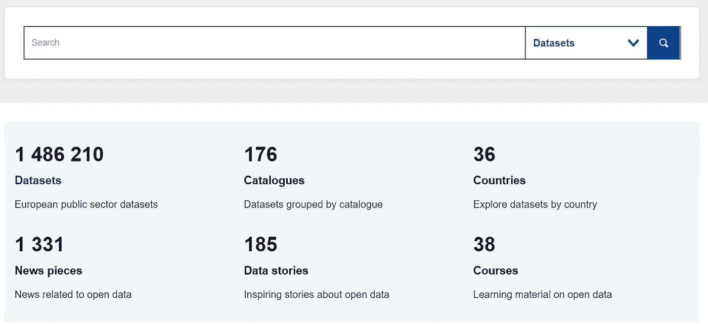
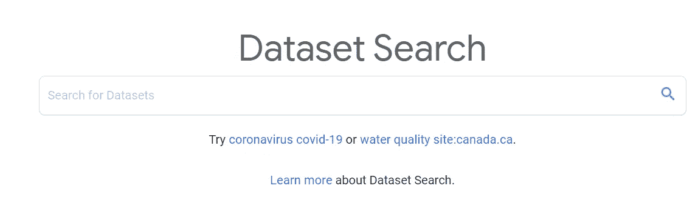
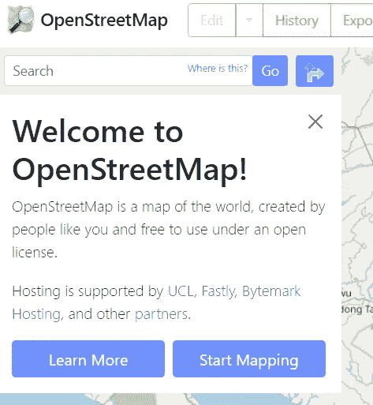
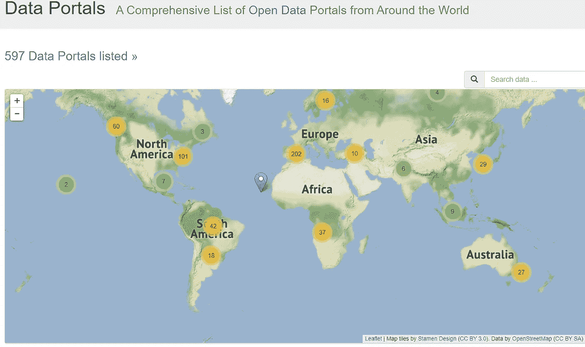

# 开源数据集的热门网站

> 原文：<https://pub.towardsai.net/top-sites-for-open-source-dataset-29b2e05828f2?source=collection_archive---------2----------------------->

## 利用这些网站为您的项目获取数据集

[斯科特·格雷厄姆](https://unsplash.com/@homajob?utm_source=medium&utm_medium=referral)在 [Unsplash](https://unsplash.com?utm_source=medium&utm_medium=referral) 上拍照

数据是每个数据项目的核心。有了适当的数据，我们的项目就会存在。然而，为我们的预期项目找到合适的数据集并不容易——尤其是如果我们不在公司或任何数据源中工作。

幸运的是，许多网站提供开源数据集供公众使用。这些网站是什么？让我们开始吧。

# 1.卡格尔

[Kaggle](https://www.kaggle.com/) 是许多数据科学活动的一站式网站，包括数据学习、机器学习项目和寻找开源数据集。对于初学者和专家来说，这是一个练习使用开源数据集和与社区一起学习的完美网站。

作者图片

Kaggle 是为数据项目寻找开源数据集的完整网站之一。大部分数据来自社区，因此质量可能有所不同，但这是一个有用的网站。

# 2.世界银行公开数据

[世界银行开放数据](https://data.worldbank.org/)是世界银行发起的一项倡议，旨在提供有关国家发展的数据以及与全球增长相关的各种数据集。这是世界银行为减轻贫困做出的承诺。

作者图片

该网站易于使用，对于需要国家数据统计的任何人来说都非常容易访问。试着从网络数据集[指南](https://data.worldbank.org/about/get-started)中学习，使网络导航更加容易。

# 3.data . Europ . eu

[data.europa.eu](https://data.europa.eu/en) 是一个获取与任何欧洲数据相关的开放数据集以及与欧洲数据相关的任何活动的网站。这是一个由欧盟出版办公室管理的网站。

作者图片

你可以在这个网站上找到许多数据集和课程。如果您想了解关于数据集的更多信息，请访问[文档](https://dataeuropa.gitlab.io/data-provider-manual/)。

# 4.UCI 机器学习知识库

[UCI 机器学习库](https://archive.ics.uci.edu/ml/index.php)是由加州大学欧文分校开发的一个网站，用于维护社区用来分析机器学习算法的数据库集合。

作者图片

该网站主要托管一个完全用于实验目的的开源数据集。

# 5.数据集搜索

[数据集搜索](https://datasetsearch.research.google.com/)是谷歌团队开发的开源数据集搜索引擎。它旨在使用户能够普遍访问各种数据集，并改进数据共享做法。

作者图片

你可以使用[了解更多](https://datasetsearch.research.google.com/help)页面来学习如何使用搜索引擎。

# 6.OpenStreetMap

[OpenStreetMap](https://www.openstreetmap.org/) 是一个由社区驱动的网站，提供关于地图的数据，如道路、小径、咖啡馆、火车站等来自世界各地的信息。它可以免费使用，非常适合任何需要分析的绘图活动。

作者图片

您可以使用[关于](https://www.openstreetmap.org/about)部分了解该网站的更多信息。

# 7.数据门户

[DataPortals](http://www.dataportals.org/) 与上述示例略有不同，因为它不是直接从网站获取开源数据集。DataPortals 是一个汇集全球所有开放数据计划的网站。该门户由所有国际数据专家管理，我们可以使用它来获得我们的开源数据。

作者图片

如果您想了解更多关于数据门户的信息，请访问他们的[关于](http://www.dataportals.org/about)部分。

# **结论**

数据集是任何数据项目的核心，有时很难为我们的预期项目获取开源数据集。

在本文中，我们了解了各种获取开源数据集的网站，包括:

1.  卡格尔
2.  世界银行公开数据
3.  data . Europ . eu
4.  UCI 机器学习知识库
5.  数据集搜索
6.  OpenStreetMap
7.  数据门户

希望有帮助！

> 如果您没有订阅为中等会员，请考虑通过[我的推荐](https://cornelliusyudhawijaya.medium.com/membership)订阅。