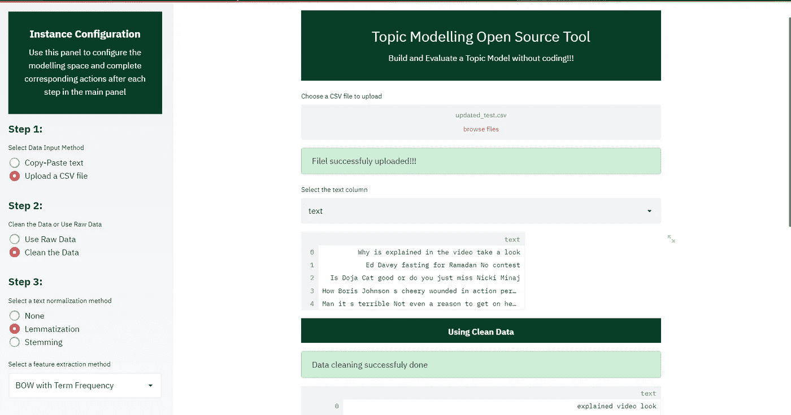
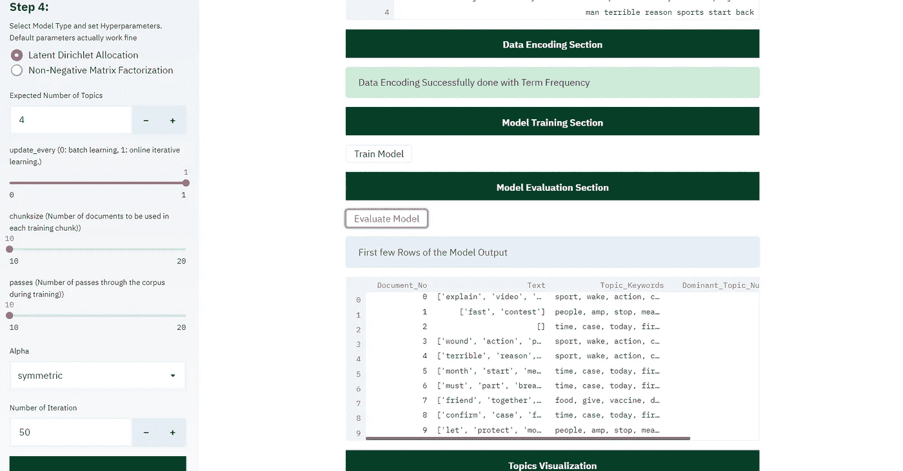
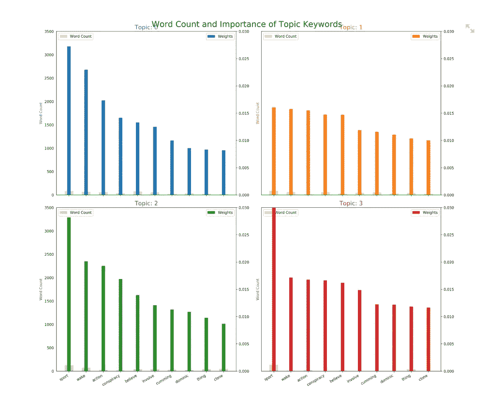
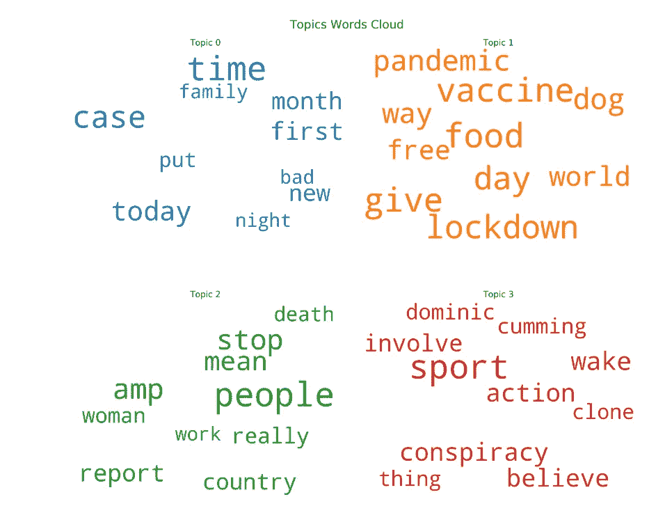
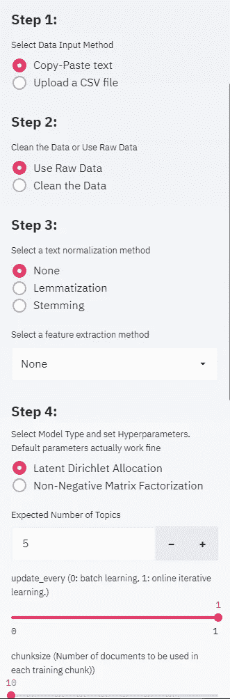
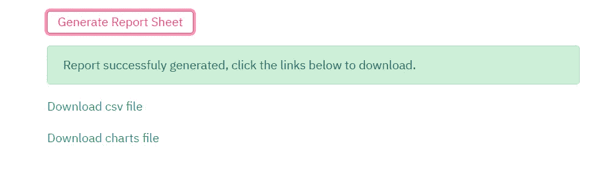
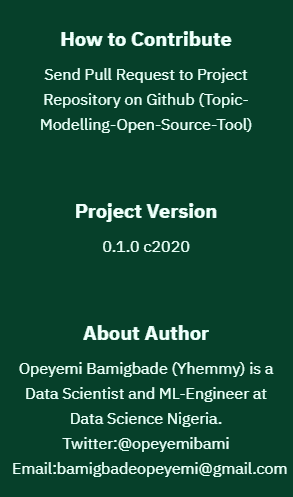

# 主题建模开源工具

> 原文：<https://pub.towardsai.net/topic-modeling-open-source-tool-fbdcc06f43f6?source=collection_archive---------0----------------------->

## [机器学习](https://towardsai.net/p/category/machine-learning)

## 用 Python 和 Streamlit 构建的主题建模工具


图片由 tommyboland 提供

每秒钟都有大量数据以不同的形式生成和收集。从数据中获取正确的、相关的和想要的信息是一项有趣而又难以在一定时间内完成的任务。技术和算法已经发展到获取我们正在寻找的信息，其中一些就像使用字典和搜索引擎一样简单。尽管如此，这些方法的结果需要缩小范围或用特定的主题进行总结。在文本挖掘中，用于提取正确信息的技术之一是 ***主题建模*** ，这是一个自动识别给定文本中存在的主题并导出潜在模式的过程。

应用程序演示

***通过*** [*主题建模开源工具链接*](https://topic-modelling-tool.herokuapp.com/) 访问工具

***本文结束时，您将能够了解什么是主题建模，现有的方法和途径，主题建模的一些评估方法，了解“主题建模开源工具”是如何构建的，如何部署到 Heroku，如何使用该工具，并可能对开源项目有所贡献。***

## 先决条件:

*   理解自然语言处理。
*   Gensim 库。
*   文本预处理。
*   Python 编程。
*   细流。



快照

## 内容

*   主题建模概述。
*   主题建模方法和算法。
*   话题建模的评价。
*   为什么主题建模开源工具。
*   项目环境设置
*   需求文件。
*   脚本和解释。
*   使用 streamlit 的项目用户界面。
*   streamlit 中的会话状态。
*   部署到 Heroku。
*   如何投稿？


照片由 bigstockphoto 提供

## 主题建模概述

主题建模方法和算法不同于基于规则的文本挖掘的使用，基于规则的文本挖掘使用字典中的关键字或搜索技术中的正则表达式，而是一种在大型文本簇中发现和观察称为主题的一串单词的无监督方法。通过主题建模，我们可以很容易地理解、组织和总结大量的文本信息。这些单词(主题)和模式隐藏在整个文档中，但在训练了主题模型后会被发现和注意到。

主题模型的假设是每个 ***文档*** 由主题的混合组成，每个 ***主题*** 由单词的集合组成。这意味着最终目标是确定假设，进而发现潜在的一串单词(主题)。

通过主题建模，我们可以做到以下几点:

*   文本摘要
*   改善搜索结果
*   推荐引擎
*   文档组织等等

## 主题建模方法和算法

建立和训练主题模型的算法和方法有很多，其中有*【LSA】***概率潜在语义分析***【PLSA】***潜在狄利克雷分配***【LSA】*【HDP】等。其中，最常见和最流行的是 LDA，它也是这个开源工具中实现的第一个算法。其他人将尽快包括在内。**

****LDA** 是一种概率主题建模。也就是说，它使用条件概率来发现潜在的主题结构。这里通常选择它，因为它很容易推广到新文档。您可以通过本文末尾的参考资料了解更多信息。**

## **主题建模评估**

**对无监督机器学习的评估总是具有挑战性，因为没有基本事实。主题建模也是这类机器学习的一个例子，也不例外。然而，我们仍然需要理解模型输出，并决定是否保留它。评估主题模型常用方法包括但不限于**

*   **目测:在这种情况下，我们可以提取模型已经预测为主题的单词列表中的前 N 个单词*。***
*   ***评估后验分布的密度或散度***
*   ***话题连贯性可以是*内在尺度*或*外在尺度****

**如 *(Wallach et al .，2009)* 所示，LDA 通常通过测量一些次要任务(如文档分类或信息检索)的性能进行评估，或者通过估计给定一些训练文档的看不见的隐藏文档的概率进行评估。平均而言，一个更好的模型将导致更高的延迟文档概率。**

## **为什么主题建模开源工具**

**数据科学是一个迭代过程，可能涉及许多重复的步骤，目的是从给定的数据中获得最佳效果。有些任务甚至遵循相同的建模模式，只有很小的变化。这有时会很累，尤其是当你必须在过程中对所有动作点进行编码的时候。有了这个开源工具，主题建模中的重复过程可以通过点击一个按钮或选择一个动作栏来完成，而不需要编写任何代码。主题模型也可以用可视化来评估，这是一种更好的交流数据见解的方式。使用这个工具，可以在建模和评估完成后生成和下载报告。**

## **项目环境设置**

**项目文件夹、模块和脚本已经以这样一种方式进行了安排，以便于贡献和强调干净的编码最佳实践。**

```
**C:.
|   .gitignore
|   app.py
|   input_output.py
|   lda.py
|   model_evaluator.py
|   nltk.txt
|   preprocessor.py
|   Procfile
|   README.md
|   requirements.txt
|   SessionState.py
|   setup.sh
|   __init__.py**
```

**可以在本地 PC 上创建一个新的 Python 环境，用正确的版本安装所有必需的包、框架和库。这些库可以在 requirements.txt 文件中找到**

## **需求文件**

```
**pandas == 1.0.4
numpy == 1.18.4
pathlib
streamlit == 0.62.0
gensim==3.6.0
matplotlib==3.0.1
seaborn==0.10.1
wordcloud==1.7.0
PyPDF2==1.26.0
nltk==3.5
spacy==2.3.1
https://github.com/explosion/spacy-models/releases/download/en_core_web_sm-2.3.1/en_core_web_sm-2.3.1.tar.gz#egg=en_core_web_sm==2.3.1**
```

## **脚本和解释**

**每个脚本都包含代码，这些代码处理或协同工作以实现一个共同的目标。以下是对每个脚本的高级解释。有关更多详细信息，请参见 Gensim 库文档或 google 搜索词**

*   ****input_output.py:** 项目成功的第一步是确定如何成功地从用户那里收集数据，以及输出的格式。用 ***的 get_input 函数*** ，我们可以收集 ***。csv 文本*** 文件或让用户 ***复制粘贴*** 我们创建熊猫数据帧的文本。对于 ***上传的 CSV 文件*** ，我们使用***select _ feature***功能选择包含待分析文本的特征。**

**输入 _ 输出. py 脚本**

*   ****Preprocessor.py** :这个脚本处理所有需要的文本预处理，以确保模型的最佳性能。 ***clean_data 函数*** clean 有助于删除电子邮件、网站链接等不需要的单词和模式，并对语料库进行标记。我们使用“***【Spacy】***词性(POS)来选择我们需要进行分析的单词，并过滤掉那些不需要的单词。encode 函数使用 ***词频*** 或 ***词频-逆词频*** 对 Gensim 语料库词典创建的“ ***id2word*** ”进行评分和编码。 **Extract_feature** 函数用于形成二元模型、三元模型，并对语料库执行词条化或词干化。**

**预处理程序. py**

*   ****lda.py** :通过这个脚本，我们使用 Gensim 实例化了 lda 模型，其中包含一些默认的超参数，用户可以通过应用程序界面更改这些参数。**

**lda.py 脚本**

****

**快照 2**

*   ****Model_evualator.py:** 它处理模型评估，向用户显示模型输出的几个顶级角色、单词分布的可视化，以及跨每个文档和显示主导主题单词的单词云的计数。***get _ model***result 函数用于显示模型输出的几行，我们可以对其进行目测，以分析模型的执行情况。利用***vis _ distribution***功能，我们可以可视化主题分布，并以 PDF 格式导出项目目录。***vis _ word _ cloud***和***vis _ word _ count***执行类似的任务，其中视觉效果以 PDF 格式导出。***generate _ chart***函数使用 PyPDF2 库读取、合并生成的 PDF，合并后删除每一个。合并的可视化充当模型的报告。选择每个生成的图表，以便消除内存中存储文件的指数增长**

****

**可视化快照**

****

**可视化快照**

## **使用 streamlit 的用户界面**

****

**[Streamlit](https://www.streamlit.io/) 是一个开源的应用程序框架，它为数据科学家和机器学习工程师提供了一种相对简单的方法，可以在几个小时内创建漂亮、高性能的应用程序！它结合了围绕 Python 脚本、交互编织和即时部署的三个理念。使用 streamlit，将后端与前端耦合起来并不是一件困难的任务，但是跟踪用户会话状态却有点困难，因为 streamlit 的构建方式是自上而下地运行每一个微小的更改。项目的会话状态保持将在下一个小标题中解释。我们将用户界面分为侧面板和主面板，侧面板处理所需的大部分更改，主面板显示每个侧面板更改的效果和主面板的小操作按钮。**

**标题. py**

**项目界面中的标题用 HTML 设计，但用 streamlit 呈现为 markdown。这些函数在应用程序逻辑中的任何主要任务之前被调用。**

****

**侧面板少数参数用户界面**

**在 app.py 中，从用户处收集参数，如下面的代码片段所示:**

**parameters.py**

## **Streamlit 中的会话状态**

**使用 streamlit 的一个主要问题是保持会话状态。该应用程序旨在接受用户需要执行任务时的更改，而不仅仅是预定义的方法。Streamlit 提供了一种缓存机制，允许应用程序即使在从 web 加载数据、操作大型数据集或执行昂贵的计算时也能保持高性能。这可以通过使用“@st.cache”函数 decorator 来完成，它告诉 Streamlit，无论何时调用该函数，它都需要检查一些事情:**

1.  **用来调用函数的输入参数**
2.  **函数中使用的任何外部变量的值**
3.  **函数的主体**
4.  **缓存函数中使用的任何函数的主体**

**这里缓存的问题是，我们是在类级别而不是函数级别工作，因此，我们需要一个可以在类级别运行的机制。这导致了会话状态类的创建和使用，正如下面的脚本中所描述的。采用并修改的原代码片段来自于这个 Git gist:[https://gist . github . com/tvst/faf 057 abbedaccaa 70 b 48216 a 1866 cdd](https://gist.github.com/tvst/faf057abbedaccaa70b48216a1866cdd)**

**会话状态. py**

**使用 session state 类，我们可以跟踪用户所做的每一项更改的变量状态和值，从而产生预期的输出。每次重新运行脚本时更新的任何变量都被添加到会话状态变量中，如下面的代码片段所述:**

**会话状态变量**

## **报告图表生成和下载**

**模型评估后有两个文件可以下载。这些是:**

*   **包含模型输出的 CSV 文件**
*   **报告图表**

****

**快照**

**文件 _ 下载器. py**

**报告图表生成为 PDF 文件，以 base64 编码和解码，可以通过生成的链接下载，作为调用时的函数返回。**

## **部署到 Heroku**

**该应用程序托管在 Heroku 上，这在以前的文章中解释过几次。这些文章的链接可以在本文的参考资料部分找到。唯一的区别是添加了“NLTK.txt”需求文件，该文件用于处理 NLTK 依赖项。**

## **如何投稿**

****

**一定要抽出时间来为这个工具做贡献，看看我的其他文章，以及参考资料部分的进一步阅读。请记得关注我，以便获得我的出版物的通知。**

***在*[***Twitter***](https://twitter.com/opeyemibami)*和*[***LinkedIn***](https://www.linkedin.com/in/bamigbade-opeyemi-49007a122/)**

****查看 GitHub 项目资源库，记得在下面的链接中注明:****

**[](https://github.com/opeyemibami/Topic-Modelling-Open-Source-Tool) [## opeyemibami/主题-建模-开源-工具

### 上传一个. csv 文件或复制粘贴文本进行预处理构建和评估主题模型，无需编码评估…

github.com](https://github.com/opeyemibami/Topic-Modelling-Open-Source-Tool) 

**参考文献:**

[](https://medium.com/@opeyemibami/deployment-of-machine-learning-models-demystified-part-2-63eadaca1571) [## 揭秘机器学习模型的部署(第二部分)

### 具有无风险可贷金额的贷款接受状态预测

medium.com](https://medium.com/@opeyemibami/deployment-of-machine-learning-models-demystified-part-2-63eadaca1571) [](https://towardsdatascience.com/deployment-of-machine-learning-model-demystified-part-1-1181d91815d2) [## 揭秘机器学习模型的部署(第 1 部分)

### 如果概率度量最好用在贷款违约算法中呢？

towardsdatascience.com](https://towardsdatascience.com/deployment-of-machine-learning-model-demystified-part-1-1181d91815d2) [](https://heartbeat.fritz.ai/deploying-machine-learning-models-on-google-cloud-platform-gcp-7b1ff8140144) [## 在谷歌云平台上部署机器学习模型(GCP)

### 在 Kaggle 上训练；部署在谷歌云上

heartbeat.fritz.ai](https://heartbeat.fritz.ai/deploying-machine-learning-models-on-google-cloud-platform-gcp-7b1ff8140144) [](https://heartbeat.fritz.ai/deploy-a-machine-learning-model-as-a-web-application-part-1-a1c1ff624f7a) [## 将机器学习模型部署为 Web 应用程序(第 1 部分)

### 具有 Streamlit 的机器学习支持的 Web 应用程序

heartbeat.fritz.ai](https://heartbeat.fritz.ai/deploy-a-machine-learning-model-as-a-web-application-part-1-a1c1ff624f7a) 

*   [https://www . analyticsvidhya . com/blog/2016/08/初学者指南-主题建模-python/](https://www.analyticsvidhya.com/blog/2016/08/beginners-guide-to-topic-modeling-in-python/)
*   [https://medium . com/nano nets/topic-modeling-with-LSA-psla-LDA-and-LDA 2 vec-555 ff 65 b 0b 05](https://medium.com/nanonets/topic-modeling-with-lsa-psla-lda-and-lda2vec-555ff65b0b05)
*   [https://www . kdnugges . com/2016/07/text-mining-101-Topic-modeling . html #:~:text = Topic % 20 modeling % 20 提供%20us%20with，documents %根据% 20to %这些%20topics](https://www.kdnuggets.com/2016/07/text-mining-101-topic-modeling.html#:~:text=Topic%20modelling%20provides%20us%20with,documents%20according%20to%20these%20topics)
*   [https://www . tutorialspoint . com/gensim/gensim _ topic _ modeling . htm](https://www.tutorialspoint.com/gensim/gensim_topic_modeling.htm)
*   [https://towards data science . com/evaluate-topic-model-in-python-latent-Dirichlet-allocation-LDA-7d 57484 bb5d 0](https://towardsdatascience.com/evaluate-topic-model-in-python-latent-dirichlet-allocation-lda-7d57484bb5d0)
*   (Wallach 等人，2009 年)Wallach，H. M .，Murray，I .，Salakhutdinov，r .，和 Mimno，D. (2009 年)。主题模型的评估方法。*第 26 届机器学习国际会议论文集，ICML 2009* ， *4* ，1105–1112。**