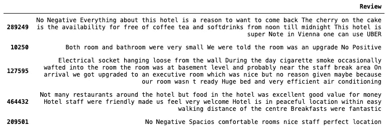
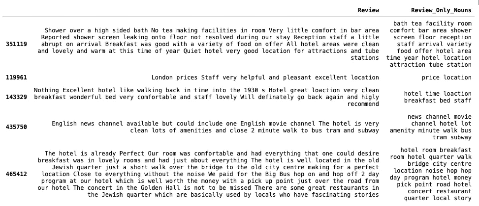
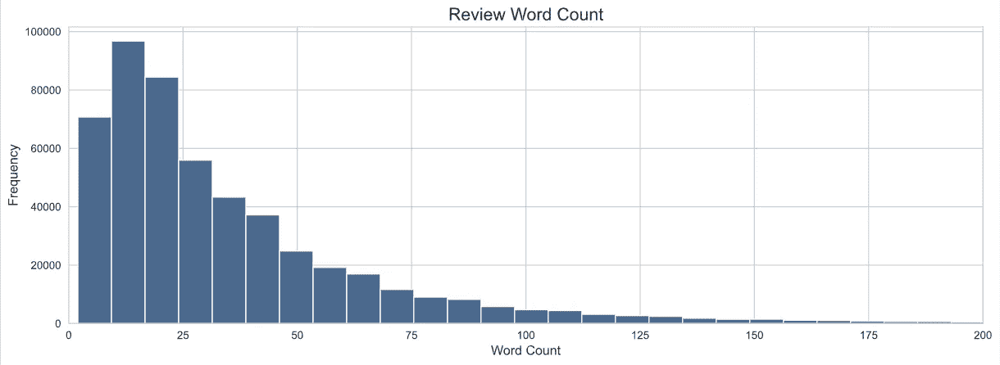
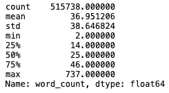
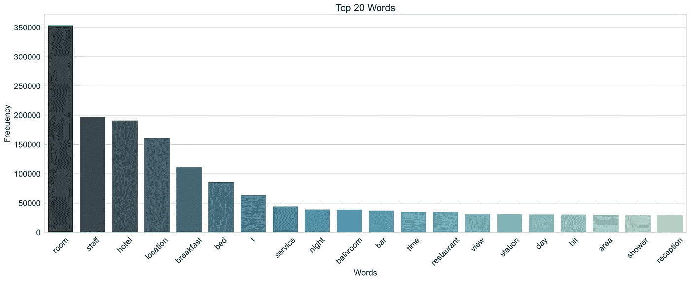
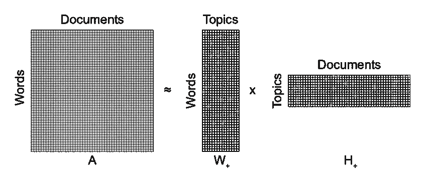
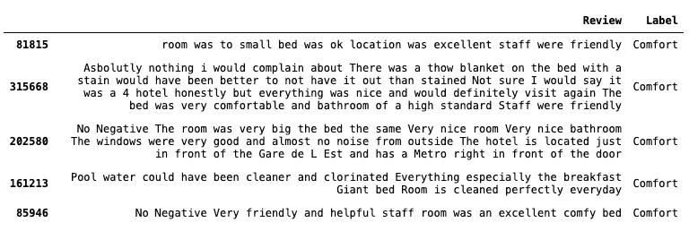

# 基于 NMF 的用户评论分类主题建模

> 原文：<https://pub.towardsai.net/topic-modeling-with-nmf-for-user-reviews-classification-65913d0b44fe?source=collection_archive---------1----------------------->

## [自然语言处理](https://towardsai.net/p/category/nlp)

## 使用文本挖掘技术识别一组文档的主题并按主题对其进行聚类的实用指南

主题建模是一种基于内容主题的无监督学习文档聚类方法。

在本文中，我们将使用名为非负矩阵分解(NMF)的主题建模技术创建一个模型，以推断酒店评论数据集中存在的主要主题，分析这种分类在所有文档中的准确性，并使用我们训练好的模型预测新文档的主题。


在 [Unsplash](https://unsplash.com/@annietheby?utm_source=unsplash&utm_medium=referral&utm_content=creditCopyText) 上 [Annie Theby](https://unsplash.com/@annietheby?utm_source=unsplash&utm_medium=referral&utm_content=creditCopyText) 拍摄的照片

# 主题建模简介

在这个领域中，一个 ***主题*** 指的是在同一主题的文档组合中频繁使用的术语的集合。因此，主题建模的关键输出是:主题列表*和与每个主题相关的文档列表*。**

**主题建模在 NLP 中有几个实际应用，例如:**

*   **决定聊天机器人的对话主题。**
*   **检测给定主题的相似用户意见。**
*   **推断一组文档中隐藏的主题。**
*   **聚集客户反馈。**

# **数据预处理**

**对于本文，我们将使用[这个数据集](https://www.kaggle.com/jiashenliu/515k-hotel-reviews-data-in-europe)在 *Kaggle* 中可用，其中包含 51.5 万条英文客户评论，对他们在欧洲各地酒店的体验进行评级。**

```
**import pandas as pd
df = pd.read_csv('data/Hotel_Reviews.csv')# Join positive and negative review
df["Review"] = df["Negative_Review"] + " " + df["Positive_Review"]# Keep only relevant columns
df = df[['Review']]**
```

**以下是该数据集中包含的文档示例:**

****

**为了获得可能的最佳结果，我们应该通过删除停用词、特殊字符、HTML 标签、URL、换行符来清理数据集，并通过应用词干化或词干处理来标准化数据集。**

**然而，由于我们希望在本文中关注主题建模的应用，我们将只保留文档中的名词，假设这些名词拥有足够的信息来从评论中推断出主题。我们将使用**s*paCy*来提取它们的引理，这些引理就是单词的规范形式。****

```
**import spacy
import en_core_web_sm
nlp = en_core_web_sm.load()def extract_nouns(texts):
  output = []
  for doc in nlp.pipe(texts):
    nouns = " ".join(token.lemma_ for token in doc if token.pos_ == 'NOUN')
    output.append(nouns)
  return outputdf['Review_Only_Nouns'] = extract_nouns(df['Review'])**
```

**结果如下:**

****

# **探索性数据分析**

**让我们首先做一些探索性的数据分析，以熟悉数据并找到在建模过程中可以帮助我们的有见地的事实。**

**例如，如果我们的数据集仅由几个单词的文档组成，那么主题建模可能会很有挑战性。因此，我们有兴趣了解每个文档的字数分布:**

****

**更准确地说，我们可以使用 ***中的*描述*功能，熊猫*** 发现我们正在处理平均 37 个单词的文本，并且 75%的文档包含 46 个术语:**

**

*我们还应该验证我们的预处理管道的有效性。为此，我们可以按频率检查前 20 个术语，并确保没有特殊字符或同一术语的多个变体出现:*

**

*由于我们只考虑名词，这是一个可以接受的结果。最后，我们了解到我们预处理过的数据集由总共 32 220 个独特的名词组成，这将对我们以后的特征选择有用。*

# *什么是非负矩阵分解？*

*非负矩阵分解(NMF)是一种线性代数算法，它将高维向量(如术语文档矩阵)分解为低维表示，只有一个约束:分解的矩阵仅由非负值组成。*

*与其他流行的算法(如 LDA)不同，LDA 是一种概率算法，NMF 是一种确定性算法，它根据潜在主题来实现语料库的单一表示。*

*实质上，给定一个按单词排列的文档矩阵(A)，NMF 将给我们两个矩阵:一个按单词排列主题的矩阵 W，和按主题排列文档的系数矩阵 H。*

**

*来源:[https://www . researchgate . net/figure/Conceptual-illustration-of-non-negative-matrix-factorization-NMF 分解-of-a_fig1_312157184](https://www.researchgate.net/figure/Conceptual-illustration-of-non-negative-matrix-factorization-NMF-decomposition-of-a_fig1_312157184)*

*NMF 算法将迭代地调整 W 和 H 的值，直到它们乘积的近似误差收敛。*

# *特征创建和主题建模*

*对于 NMF 的输入矩阵，我们可以使用任何提供术语文档矩阵的特征创建技术，比如 TFIDF、词袋或 word2vec。*

*我们将使用 TFIDF 或 tf-idf，术语频率-逆文档频率的缩写，包括前 5K 个最频繁的术语 *(max_features)* ，并排除那些出现在少于 2 个文档 *(min_df)* 或超过 95% *(max_df)* 的文档中的术语。*

```
*from sklearn.feature_extraction.text import CountVectorizer, TfidfVectorizervec = TfidfVectorizer(
  max_features=5000, 
  stop_words="english", 
  max_df=0.95, 
  min_df=2
)features = vec.fit_transform(df.only_nouns)*
```

*一旦我们将我们的文档转换成特征矩阵，我们将适合我们的 NMF 模型。对于我们的第一次迭代，我们将我们想要强制模型推断的主题数量定义为 10。*

*主题的数量会对你的主题的连贯性产生巨大的影响。这可能是超参数化的，但是我不会在本文中讨论这个过程。*

```
*from sklearn.decomposition import NMF
n_topics = 10
random_state = 42nmf = NMF(n_components=n_topics, random_state=random_state)
nmf.fit(features)*
```

*为了直观显示组成每个主题的单词集，我们将创建一个助手函数，打印每个主题的前 15 个单词:*

```
*def display_top_words(n_top_words=15, feature_names, nmf):
  for i, topic_vec in enumerate(nmf.components_):
  print(i, end=' ')
  for fid in topic_vec.argsort()[-1:-n_top_words-1:-1]:
    print(feature_names[fid], end=' ')
  print()display_top_words(15, vec.get_feature_names(), nmf)*
```

*这些是代表 10 个主题的词，我们的模型也将根据这些词对未来的文档进行分类:*

```
*Topic 0: room size window air floor noise bathroom space coffee night door people tea day bathTopic 1: location facility value cleanliness distance size stuff attraction tube money shopping design access comfort decorTopic 2 staff reception stay food desk member friendliness experience trouble atmosphere cleanliness decor facility check wayTopic 3: hotel star stay time city thing experience parking boutique minute centre day center way designTopic 4: breakfast choice buffet selection variety option egg quality morning table cost coffee parking dinner dayTopic 5: bed bathroom shower comfy size pillow mattress sheet bath king sofa tv space sleep linenTopic 6: service food customer quality reception charge desk concierge menu time check positive level star experienceTopic 7: bar bit restaurant station bathroom facility area night shower time food reception place stay dayTopic 8: view window floor city river pool terrace balcony roof building rooftop wall tower suite canalTopic 9: price value money quality parking drink size star com night food place euro bar comfort*
```

*从质量上来说，我们可以得出结论，这些主题彼此之间有很大的不同，甚至可以尝试给它们贴上一个标签，说明它们所代表的主题:*

```
*Topic 0: Room
Topic 1: Location
Topic 2: Reception
Topic 3: Hotel
Topic 4: Breakfast
Topic 5: Comfort
Topic 6: Customer service
Topic 7: Facilities
Topic 8: Views
Topic 9: Value for money*
```

*我们还可以通过定义评分函数来定量地确定我们的模型的有效性，并相应地调整我们的模型，直到我们获得最佳结果。*

# *用主题标记数据集*

*我们现在可以创建一个由前 5 个术语和我们的自定义标签标记的主题的辅助表，并使用它将聚类应用到我们的数据集，并用最具代表性的主题标记每个文档。*

```
*def topic_table(n_top_words, feature_names, nmf):
  topics = {}
  for i, topic_vec in enumerate(nmf.components_):
    topic_descr = ''
    for fid in topic_vec.argsort()[-1:-n_top_words-1:-1]:
      topic_descr = topic_descr + feature_names[fid] + " "
    topics[i] = topic_descr
  return pd.DataFrame({'Top_Topic_Terms': topics})# Label topics with top 5 terms
topic_df = topic_table(5, vec.get_feature_names(), nmf)# Manually label topics
topic_df['Label'] = ['Room', 'Location', 'Reception', 'Hotel', 'Breakfast', 'Comfort', 'Customer service', 'Facilities', 'Views', 'Value for money']# Getting weights to classify our dataset
document_weights = nmf.transform(vec.transform(df['Review_Only_Nouns']))# Store most representative topic
df["Topic_idx"] = document_weights.argmax(axis=1)# Joining the original dataset with labels
df = pd.merge(df, topic_df, left_on='Topic_idx', right_index=True, how='left')*
```

*为了确认在我们的评论数据集中是否准确地分配了主题，我们可以检查每个主题的几个样本。例如，以下是一些标有主题 5 的示例评论，从理论上讲，这些评论应该描述住在酒店的舒适程度:*

**

# *预测新文档的主题*

*这项技术不仅有助于对源数据集中的文档进行分类或聚类。我们还可以给模型一个新的检查，让模型预测它最有代表性的主题。我们只需要使用 *TfidfVectorizer* 将文本转换成特征，并将其传递给我们模型的转换函数。*

```
*new_review = [
  "At breakfast you need to gaurd your table. Once I had finished my cereal went to get some toast by the time I had returned the table had been cleared and other guests had been seated when I complained to the waitress as they seemed to think it was my fault when a simple sorry would have been a more acceptable outcome. Quiet location great swimming pool"
]nmf.transform(vec.transform(new_review)).argsort(axis=1)[:,-1]*
```

*结果是一个形状为[2，n_topics]的矩阵，每个主题都有一个分数。最高分代表文档中最具代表性的主题。*

*在这种情况下，即使这篇评论有一些拼写错误，我们的模型预测这篇评论本质上是关于主题 4 的，之前我们将其标记为与早餐体验相关。*

## *参考*

*[1]法特玛，f .，[主题模型的工业应用](https://medium.com/@fatmafatma/industrial-applications-of-topic-model-100e48a15ce4)*

*[2]李苏珊，[话题建模 Quora 问题与 LDA &，](https://towardsdatascience.com/topic-modeling-quora-questions-with-lda-nmf-aff8dce5e1dd)，*走向数据科学**

*[3]罗布·萨尔加多，[主题建模文章与 NMF](https://towardsdatascience.com/topic-modeling-articles-with-nmf-8c6b2a227a45) ，*走向数据科学**

*[4] Sanjaya Subedi，[使用 Python 的 NLP:主题建模](https://sanjayasubedi.com.np/nlp/nlp-with-python-topic-modeling/)*

*[5] Keith Stevens 等人，[探索许多模型和许多主题的主题一致性](https://www.aclweb.org/anthology/D12-1087.pdf)*