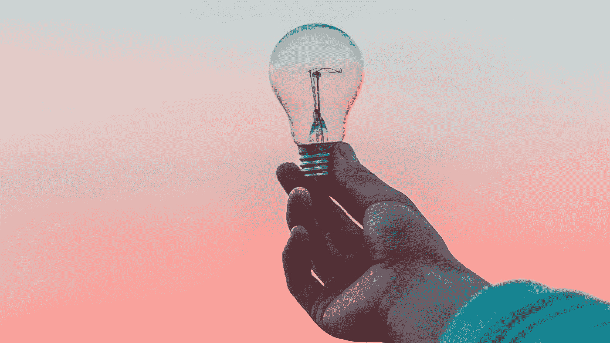

# 走向人工智能宣布收购最大的人工智能不和谐社区 Learn AI Together

> 原文：<https://pub.towardsai.net/towards-ai-announces-acquisition-of-learn-ai-together-the-largest-ai-discord-community-cc4ac4acee75?source=collection_archive---------1----------------------->

来源: [Unsplash](https://unsplash.com/photos/fIq0tET6llw)

*   [**一起学习人工智能**](https://ws.towardsai.net/discord) 是一个由 25000 名人工智能开发者和爱好者组成的高度参与的社区。
*   此次收购加速了人工智能的计划，以实现人工智能的民主化，并为共享人工智能技能、知识和发展建立关键的社区和平台。

领先的人工智能内容共享在线社区和平台 [**向人工智能迈进**](https://towardsai.net/) 宣布收购 Learn AI Together Discord 社区。Learn AI Together 由 Louis Bouchard 于 2020 年 6 月成立，并迅速发展成为最大的专注于人工智能的 Discord 社区。“一起学习人工智能”是在这样的前提下开始的，当你和其他人一起学习和工作时，学习会更有趣。它提供了一个互相帮助、提问、集思广益和讨论人工智能最新新闻和发展的平台。Louis Bouchard 将作为联合创始人和社区负责人加入“走向人工智能”团队。该社区设有活跃的讨论频道，主题包括:人工智能、机器学习、深度学习、人工智能中的伦理、计算机视觉、医疗保健人工智能、论文讨论和每日人工智能新闻。它汇集了来自不同背景和经验水平的人，并提供了一个宝贵的“村庄广场”，用于在整个人工智能社区中分享想法和意见。请 [**加入我们**](http://ws.towardsai.net/discord) ！

走向人工智能，公司是由路易彼得斯，联合创始人兼首席执行官，评论收购说，

> “几年来，Louis 一直定期为《走向人工智能》撰稿，并分享了我们提高人工智能可访问性的愿景。我们一直是他的博客、教育类 Youtube 频道和 Discord 社区的粉丝。我们的目标非常一致，我们觉得有很多方法可以一起学习人工智能，并且在人工智能方面可以相互补充。”

Louis Bouchard 是 Learn AI Together 的创始人，他将作为股东、联合创始人和社区负责人加入到 AI 中，他说:

> “我一直是《走向人工智能》平台的粉丝。Louie 对该项目的愿景与我在“什么是人工智能”和“一起学习人工智能”的目标非常契合，我真的很高兴能够加入这个合并后的项目。

在与社区的讨论中，人们经常提到我们缺乏有组织的活动，但也缺乏更专业的支持来帮助管理社区和回答社区快速扩展时的所有问题。我相信我们与 oriented AI 的合并将满足所有这些需求，并帮助我们用更多的资源进一步改善社区。我们的社区一点也不会改变；我们只是计划用更多的财政和人力资源来改善它，同时跟上成员数量和参与度的增长，提供协作项目和更多有用的内容。"

自其 [**新投资和领导层过渡**](https://towardsai.net/p/news/towards-ai-announces-new-investment-to-expand-platform-for-the-ai-community-a1561a8f8ca2) 以来，今年早些时候，朝向人工智能迅速扩大了团队，并在提高内容质量、增加贡献者和追随者的计划方面取得了进展，开始开发更深入的教育资源，并推进了帮助解决人工智能开发者和人工智能公司在求职和招聘过程中的痛点的计划。

Louis Bouchard 的加入进一步加强了 oriental AI 团队，而收购 Learn AI Together 又为 oriental AI 社区带来了 25，000 人，并大大加快了 oriental AI 的社区增长计划。“走向人工智能”和“一起学习人工智能”将共同努力，建立一个人工智能爱好者和专家参与、包容和互利的社区。它将被开发为关键的人工智能社区和平台，用于共享人工智能技能、知识和发展，允许学生、工程师、企业家、学者和其他人协同工作，使人工智能对所有人开放。

路易·彼得斯在评论社区未来的计划时说:

> “在走向人工智能，我们首先要建立一个人工智能社区，用资源来满足它的需求，而不是相反。我们有许多令人兴奋的项目正在进行中，包括人工智能领域的入门和持续学习材料，以及解决人工智能社区面临的痛点的项目，如招聘过程。我们相信，当我们从社区获得对这些项目的反馈、指导和支持时，我们有许多方法可以互相帮助，同时我们确保我们的项目为社区提供最大的价值。
> 
> 路易斯将继续像以前一样领导这个社区，同时我们计划慢慢地将 Learn AI Together 转变为与更广泛的“走向人工智能”平台和社区更加集成。我们将向社区投入更多的时间、想法和财政资源，以提供课程、活动、讨论会、竞赛、资源和许多对学习人工智能以及准备和寻找行业工作有用的令人兴奋的东西。"

请来加入我们并在 [**学习 AI 一起不和谐**](http://ws.towardsai.net/discord) 介绍你自己。

# 关于走向人工智能公司。

自 2019 年以来，走向人工智能提供了一个共享信息、教育内容和人工智能研究的开放平台。它拥有 2000 多名作者，并受益于人工智能社区中成千上万的追随者。该平台是人工智能领导者、从业者和学生的领先教育资源和社区。《走向人工智能》致力于发布不带偏见的人工智能和技术相关文章，并以透明的方式只与高度相关内容的赞助商合作。走向人工智能提供了一个独特的空间，为人工智能和技术客户的营销和分销工作提供服务，并与领先的企业和机构赞助商合作，包括亚马逊科学，卡内基梅隆大学，浮潜人工智能，Lambda Labs，Superb AI 和 Gather AI。