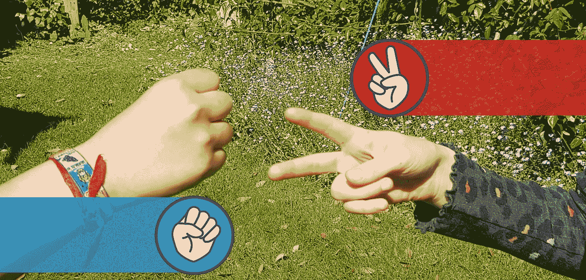
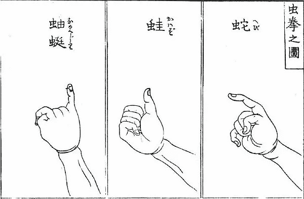
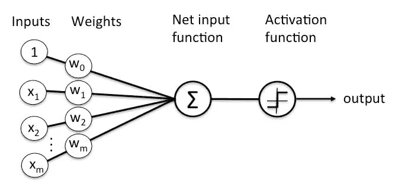

# 面向石头、布、剪刀的人工智能

> 原文：<https://pub.towardsai.net/towards-an-ai-for-rock-paper-scissors-3fb05780271f?source=collection_archive---------0----------------------->

## [人工智能](https://towardsai.net/p/category/artificial-intelligence)，[博弈论](https://towardsai.net/p/category/game-theory)

石头、布、剪刀——人工智能研究的一个有前途的领域，但还不是奥运会项目。

石头剪子布(RPS)是一个有着迷人策略的绝对不平凡的游戏。在这里，我提出了一个简单的 RPS 人工智能与代码和一些关于游戏的一般参数和人对人和人工智能对人工智能 RPS 策略的本质的高级注释。

# 一款在线 RPS 游戏

首先，一个 RPS 对手的基本实现，带源代码，在我的网站有[。看一看！现在请继续阅读…](http://www.datasmith.org/2020/05/17/ai-for-rock-paper-scissors/)

# 石头剪刀布的游戏

石头剪子布是一款研究不足的游戏。它的极简主义使它在众所周知的游戏中独树一帜，但其强大的潜在原则却极其广泛地适用，并具有迷人的含义。在考虑 RPS 策略之前，本文将简要总结 RPS 的核心原则和历史。

# 关键原则:非随机性

理解 RPS 没有随机成分是绝对重要的。结果完全由玩家的决定决定。这就是为什么 RPS 的节奏很快:

*   如果 RPS 玩得很慢，或者根本没有时间限制，玩家就有时间要么想出一个真正随机的值来作为他们游戏的基础，要么过度思考他们自己的投掷和对手的投掷，直到结果如此复杂以至于它可能是随机的。这两种可能性都有相同的结果——随机游戏和随着时间的推移两个玩家都有相同的获胜预期。
*   如果 RPS 玩得很快并且有节奏，玩家没有时间去寻找随机移动的来源或者过度思考。因此，胜负取决于玩家快速选择策略、放弃失败策略、保持冷静以及分析对手行为的能力。

出于这个原因，虽然 RPS 游戏因地区而异，但总是有快速倒计时或圣歌和快速周转时间。例如，在 90 年代，RPS 在日本的一些地方通常是为了钱而玩的，一场“三局两胜”的游戏可能在四五秒钟内结束。

# 关键原则:Sansukumi

Sansukumi(日语链接)是一个日语表达，指的是相互牵制的三种力量。这个概念起源于中国，但很早就出现在日本文学中，与游戏和各种有教育意义的哲学概念联系在一起。比如“皇帝指挥公民，公民指挥奴隶，奴隶威胁反抗皇帝。”

Sansukumi 经常被用作平衡电脑游戏的重要元素；例如，步兵/骑兵/炮兵团在战争游戏中很常见。

# 历史和背景

手势游戏是一个大的游戏家族，在历史的各个时期被独立发现。东亚在现存的和历史上的手势游戏方面特别丰富，其中 RPS 是国际上最成功的例子。

RPS 是这个家族中的日本成员。RPS 的日文名称是‘janken’；Janken 起源于一个叫做 mushi-ken 的早期游戏，其中三个投掷代表青蛙、蛇和蛞蝓(或者可能是蜈蚣，取决于我们如何重建更早的变体)。

Mushi-ken 的手势，1809 年插图。

像 mushi-ken 一样，RPS 是一个只有三个选项的小型 sansukumi 游戏。整个亚洲的其他 sansukumi 手势游戏可能有五个甚至四个选项，尤其是日本，它有丰富的变体，围绕核心的 sansukumi 概念引入了一个更大的元游戏——例如 [yakyuuken(日本链接)](https://ja.wikipedia.org/wiki/%E9%87%8E%E7%90%83%E6%8B%B3)，在这种游戏中，竞争对手需要在投掷之间唱歌和跳舞！

不基于 sansukumi 的手势游戏通常基于奇数/偶数结果——包括[的赔率和偶数](https://en.wikipedia.org/wiki/Odds_and_evens_(hand_game))，但也有更复杂的变体。这些奇数/偶数游戏是否完全类似于 sansukumi 游戏是一个有趣的问题。

虽然手势游戏的历史，特别是亚洲的 sansukumi 游戏本身很有趣，但公平地说，RPS 成功地在一套非常简单的规则中捕捉了整个游戏家族中几乎所有有趣的概念。这也许解释了它的成功。

自 20 世纪中期以来，Janken 已经扩展到日本以外的世界，采用了许多名称(剪刀石头布、Roshambo……)，并开发了自己的变体和规则集。80 年代期间，Janken 受到了相当的重视，这个时候既有对中日战略的实质性分析，也有一些大型的锦标赛。不幸的是，在过去 20 年左右的时间里，这项运动的知名度已经下降；仍有一些大型游戏，如[这一个((日本链接)](https://ja.wikipedia.org/wiki/AKB48%E3%82%B0%E3%83%AB%E3%83%BC%E3%83%97%E3%81%98%E3%82%83%E3%82%93%E3%81%91%E3%82%93%E5%A4%A7%E4%BC%9A)，但在日本或全球都没有强有力的管理机构。与此同时，对 RPS 作为人工智能挑战的兴趣已经上升…

# 战略

RPS 策略是一个复杂的话题，没有人能完全理解。一般来说，我们可以将战略分为三个方面:

*   核心战略。核心策略围绕着创造一种高速的、几乎自动化的行为，在这种行为中，玩家不加思考地调整自己的投掷以适应对手，从而赢得一半以上的时间。
*   边缘策略。这包括与团队合作、时机和心理相关的策略。
*   元游戏。游戏本身之外的事件，但仍会影响结果。

# 核心战略

核心策略通常由严肃的玩家建模，不是根据石头、布、剪刀的投掷，而是根据以下选项:

1.  作为最后一次投掷的获胜者:玩和上次一样的投掷
2.  作为最后一次投掷的获胜者:玩能击败最后一次投掷的投掷
3.  作为最后一掷的赢家:玩会输给最后一掷的一掷(即你对手的最后一掷)
4.  作为最后一掷的失败者:复制获胜的一掷
5.  作为最后一次投掷的失败者:玩一次能击败获胜投掷的投掷
6.  作为最后一掷的失败者:玩会输给获胜一掷的一掷(即重复你自己的最后一掷)

原因是石头、布、剪刀这些实际的符号不像“我赢了，所以我会继续做同样的事情”或“我输了，所以我会做一些不同的事情”这样的概念那样能引起人们的共鸣。以上六个选项是 RPS 的基本原子；每次投掷后，每个玩家从这些原子中选择三个。

从这些原子中，玩家实时组合出一个他们希望能击败对手的策略。例如，一个玩家可能会首先想到:

“我赢了，所以我要再扔一次同样的手牌。”

然后，又过了几个回合:

“赢了之后再玩同样的投掷已经不行了，我要换成赢了之后再玩输者的投掷。”

或许几个回合后:

“在获胜后玩失败者的投掷让我有 50%的成功率，但如果我在获胜后改用重复投掷，我应该能够在我的对手适应之前赢得一两次额外的胜利……”

有一些广泛的统计观察可以帮助确定初始策略:

*   石头约占投掷总数的 36%，布占 34%，剪刀占 30%。这些比率在不同的时间、地点和游戏类型中似乎都是正确的。
*   胜利者重复最后一掷的次数远远多于失败者。

但只有优秀的玩家才能实时进化出策略并持续获胜。

# 边缘战略

边缘策略是游戏的重要组成部分。特别是，边缘策略与时机(比赛的速度和平局的处理)和团队合作有关。

定时是 RPS 的一个关键参数。RPS 的游戏速度越快，玩家越有可能玩‘默认’招式(扔石头越多，重复致胜投掷越多)，实现伪随机性的能力越差。RPS 游戏速度越快，玩家之间的胜率差异越大。这种差异甚至在日本的圣歌(“Jan，ken，PON！”投掷发生在第三个音节)和较慢的美式变化(“一二三开始！”在第四个音节上有一个投掷)。

团队游戏为 RPS 增加了另一个维度。有些人因为不为人知的原因，表现不如其他人。交换团队成员，或者改变游戏顺序，会对团队游戏产生深远的影响。

规则的严格性也很重要。当规则非常严格时，连败的玩家几乎没有选择。当规则不太严格时，输的玩家可能会换手或改变时机，希望打破常规。

最后，评分规则发挥了强大的影响力。RPS 通常以“三局两胜”为一组来玩，但并不总是这样。一名球员在“暂停”前必须掷多少次球？领先的玩家多久“储存”一次他们的成功？严肃 RPS 通常由三场或五场“三局两胜”游戏快速组成，中间没有休息时间，因此有充足的时间来了解对手的行为，但如果获胜的掷数没有有效分配，也有充足的机会输掉。

# 元游戏

不考虑元游戏，RPS 策略的讨论是不完整的；在这方面(绝对没有其他，我觉得！)，RPS 和高尔夫奇怪的相似。元游戏(即不属于 RPS 规则但影响游戏结果的行动和决策)随着时间的推移会对游戏结果产生深远的影响。需要考虑的一些要点是:

*   休闲玩家比严肃玩家更随机，因此更难被击败。
*   RPS 玩家容易受到扑克中所谓的'[倾斜](https://www.cardschat.com/tilt.php)'的影响这可以被描述为一种由对游戏中“不公平”的无意识感知而导致的错误倾向。倾斜的玩家经常会改变不必要的投掷或重复模式，因为他们觉得他们“应该”赢。在团队比赛中，“倾斜”的球员可以得到休息和时间来恢复。
*   钱。尤其是在过去，RPS 已经被玩了相当多的钱。游戏期间的资金管理至关重要，这让所有玩家都有了额外的担忧。当玩现金游戏时，钱通常由队长或朋友处理，以避免对玩家产生情绪影响。
*   酒精。这很可悲，但却是事实——并非所有 RPS 玩家都保持最佳身体状态，当比赛在酒吧和酒馆进行时，酒精往往是一个因素。例如，一些分析家认为，喝过酒的运动员更有可能重复失败的投掷。
*   虚张声势和心理游戏。我见过一个球员在比赛前走到他的对手面前说，“打算再扔石头吗？太好了，我等着。”和扑克一样，不同的地方对这种技巧的容忍度也不同。

# 分析:构建 RPS 人工智能

最后，我的经验是，好的玩家打败了坏的玩家，可能有 60%的几率。这在预期的结果上并没有很大的差异，但单个 RPS 游戏的短暂性是如此之小，以至于差异迅速增加。我们能很容易地实现一个 RPS 人工智能来管理至少这个结果吗？

嗯，是也不是。

*   构建一个最初以显著优势击败大多数人的 RPS AI 非常容易。
*   构建一个打败*所有人*或者长期持续获胜的 RPS AI 要困难得多。

长期获胜的难度尤其有趣。简单的人工智能策略通常足以击败毫无准备的人类对手，但人类最终会学习人工智能的行为——也许是有意识的，但也许是直觉的——人工智能将停止获胜。一个成功的人工智能有两个要素:

*   构建成功行为的模型
*   一个元模型，当对手停止失败时，它会触发一个不同策略的变化

我们先考虑如何搭建一个框架。第一投，其实是一个 AI 最难的。应该完全随机吗？应该基于最近的投掷历史，还是只基于最近的*第*次投掷历史？为了避免这个问题，本文提供的算法只是简单地玩一串无休止的投掷，而不是分成“三局两胜”的组。

抛开第一次投掷的问题，基本选择归结为上述六个选择，其中三个在任何给定时刻都有效(不算第一次投掷)。在每一步，算法必须从三个选项中选择一个，给出一系列的观察结果，这些观察结果包括到目前为止的投掷历史。我们可以把它表述为一个分类问题，把情况分类如下:

*   重复最后一次投掷是最好的情况。
*   在这种情况下，投掷最好能击败最后一次投掷
*   玩输给最后一次投掷的投掷是最好的情况

如果我们接受这是一个分类问题，那么一个[感知器](https://en.wikipedia.org/wiki/Perceptron)是显而易见的方法。感知器非常适合表达给定一组观察结果的置信度。

抽象感知机。

在这种情况下，我们的感知机的输入节点由最后 *n* 轮游戏中每一轮的一组观察到的特征组成，而“激活函数”由输入的简单加权集合组成，可以通过比较来找到最可能的对手投掷。

还有其他可能的方法:

*   [蒙特卡罗](https://en.wikipedia.org/wiki/Monte_Carlo_method)方法已经被提出，但是不太可能获得足够多的在极其相似的情况下做出的投掷*作为 MC 模拟的基础。我还怀疑这个问题的组合空间不够大，不足以使 MC 成为一个好的方法。
*   马尔可夫链(一个上下文马尔可夫链，不是一个纯粹的马尔可夫过程)看起来是一个诱人的方法，但是和蒙特卡洛一样，挑战的一部分将是建立一个观察投掷的语料库，并从中预测下一次投掷。这种方法可能非常强大，但是需要有趣的马尔可夫链算法和预先存在的游戏历史主体，从中可以选择与当前游戏相关的场景。这方面的进一步研究将会很有趣。
*   [贝叶斯逻辑](http://www.scholarpedia.org/article/Bayesian_statistics)看起来很适合，因为我们正在进行一系列观察(投掷)并调整预期结果。然而，一个重要的挑战是:贝叶斯模型如何应对对手策略的突然变化？如果一个已经扔了二十次剪刀的对手突然扔了四次纸，贝叶斯模型是否可以重新加权来表示下一次扔的很可能是纸？我不确定。

顺便提一下，我还应该提到东京大学采用的一种非常不同的方法，如图所示。东京大学，你真可耻！

# RPS 的感知器

按照上述思路构建一个感知机并不难。感知器只是神经网络的一种非常退化的情况，在这种情况下，每个特征都有一个输入，并且它们都连接到一个输出。事实上，感知器只是一个权重列表——一个可以应用反馈来训练模型的权重列表。我们需要三个感知器，每个感知器对应一种可能的结果。对于每个感知器，特征向量将是游戏(或最近投掷)的历史，权重将这些特征与预期结果相关联，通过以通常的[神经网络]方式训练感知器来获得。

特征向量当然必须是“游戏的历史”，但在实践中，我们在定义什么特征方面有很大的余地。显而易见的方法是使用与我们的输出类别相同的特征，因此对于我们存储的每个级别的历史，我们进行三次观察(“对手重复了一次投掷吗？“对手投出的球会输给他们之前的球吗？”等等。).尽管显而易见，这种方法可能不是最佳的；例如，将每次投掷的获胜者编码为网络的输入，结果大大提高了预测能力。

要考虑作为输入的历史投掷的数量是很难决定的。乍一看，人们可能认为较长的历史是更好的预测，但实验表明，历史的最佳深度约为 5 至 7 次投掷。这表明，当人们试图随机选择时，会考虑大约 5 到 7 次投掷的情况。超过这个数字的历史往往会导致更糟糕的结果，这表明即使几秒钟前的投掷也不能很好地预测球员的下一个决定。可以有效利用的历史深度似乎随着更复杂的预测而增加。

本文提供的示例是有效的，但实现有限。没有隐藏节点，但最重要的是，特征向量仅由“石头”、“布”和“剪刀”组成——没有尝试对谁赢得投掷的影响以及任何投掷与前一投掷的关系进行建模。这足以在一段时间内令人惊讶地对抗许多人类对手，但仍然明显弱于具有更有趣的特征向量的实现。

# 改变策略

构建了预测器后，我们现在需要知道何时不使用预测器。事实证明，与人类玩家不同，人工智能不需要有意识地切换模式。相反，人工智能可以并行运行多个模型，除了预测每个模型的下一次投掷，我们还*预测给定模型成为给定投掷的最佳模型的可能性。

现在，我们可以在这一页上看到这个有点幼稚的模型的用法；我们需要一群具有不同特征集的不同感知机。在每次投掷时，我们对每个感知机模型进行回溯测试，看看它的表现如何。我们期望一个足够熟练的对手(人工智能与否)不时改变模型，通过在每次投掷中选择模型，我们应该能够在遭受几次失败后尽快适应。

“几次”损失是一个非常模糊的术语，它凸显了另一个挑战——确定改变模型的线索，因为我们预计即使在非常成功的模型中也会偶尔出现一系列损失。同样，最好的方法可能不是识别触发模型变更的离散特性，而是基于回溯测试维护每个模型的滚动视图；然而，一个足够好的元模型可能会识别出游戏中模型应该改变的“拐点”。

# 结论

这篇文章仅仅触及了 RPS 的历史、策略和技术的表面。不过，我希望这篇文章至少强调了 RPS 绝不是一个碰运气的游戏。我期待着有一天 RPS AIs(当然，禁止使用随机数生成器)在这个迷人的学科中进行最高水平的竞争。

*本页讨论的 RPS 对手的打字稿源代码可以在* [*这里*](http://datasmith.org/jkp/jkp.ts) *找到。你可以随意用它来做任何你喜欢的事情。如果合适，请相信我。*