# 迈向自动驾驶汽车 2021

> 原文：<https://pub.towardsai.net/towards-autonomous-vehicles-8224bb0bf18d?source=collection_archive---------2----------------------->

## [自动驾驶汽车](https://towardsai.net/p/category/self-driving-cars)、[未来](https://towardsai.net/p/category/future)、[科技](https://towardsai.net/p/category/technology)

## 世界上最热门的未来科技完全指南

照片由[刘芷萌·阿迪亚](https://www.deviantart.com/jandyaditya/gallery)拍摄

# 交通的未来是自主的。

人类想要便利；更快、更容易、更安全的运输。自动驾驶汽车目前比以往任何时候都更热门，2021 年将是新发布的一年。传统汽车制造商面临一场自主革命，这场革命主要由科技行业驱动。“汽车正在演变成轮子上的计算机，”他们说。

科技巨头谷歌、亚马逊、苹果、英伟达和英特尔都在开发这项未来技术。阿里巴巴的 AutoX 和百度都在 2020 年 12 月发布了第一款没有安全驱动的中国机器人轴。俄罗斯的 Yandex 自 2018 年以来一直在运营其自动驾驶汽车。Plus.ai、Embark Trucks、TuSimple 等美国创业公司都在开发自动驾驶卡车。

戴姆勒、沃尔沃、日产和现代等其他欧洲和亚洲汽车公司也在竞争自动驾驶汽车。据报道，韩国政府计划在 2021-2027 年间在这项技术上投资 1.7 万亿韩元(1.5 万亿美元)。然而，并非一切都一帆风顺，因为宝马、梅赛德斯-奔驰和优步等大型公司因“昂贵的开发成本”在 2020 年停止了他们的 4 级自动驾驶汽车项目

这篇文章旨在总结你应该知道的关于自动驾驶汽车及其技术的一切。这里的主要焦点是揭开自动驾驶汽车的神秘面纱，而不是比较用户体验、工程设计或该行业的商业模式。

# 目录

*   [2020 年十大 AV 新闻](#95e3)
*   [车辆的自主水平](#7383)
*   [社会影响](#641d)
*   [安全性和可靠性](#e286)
*   [自动驾驶的基础知识](#b42e)
*   [车辆感知技术](#78ea)
*   [车对一切](#40ed)
*   [系统架构](#e93f)
*   [工程限制](#b274)
*   [总结](#4db8)

# 2020 年十大 AV 新闻

*   TechCrunch — [自动驾驶汽车初创公司 Argo AI(福特)完成与大众汽车公司的 26 亿美元交易，向欧洲扩张(2020 年 6 月)](https://techcrunch.com/2020/06/01/self-driving-vehicle-startup-argo-ai-completes-2-6b-deal-with-volkswagen-expands-to-europe/)
*   The Verge — [亚马逊收购自动驾驶汽车初创公司 Zoox(2020 年 6 月)](https://www.theverge.com/2020/6/26/21304111/amazon-zoox-acquisition-self-driving-car-autonomous-vehicles-startup-robotaxi-bi-directional-vehicle)， [Zoox 推出自动驾驶汽车，这可能成为亚马逊的第一辆 robotaxi(2020 年 12 月)](https://www.theverge.com/2020/12/14/22173971/zoox-amazon-robotaxi-self-driving-autonomous-vehicle-ride-hailing)
*   福布斯— [埃隆·马斯克:特斯拉接近实现 level 5 AV 技术(07/2020)](https://www.forbes.com/sites/johnkoetsier/2020/07/09/elon-musk-tesla-will-have-level-5-self-driving-cars-this-year/?sh=3d0fde332d1d) ，[特斯拉发布“完全自动驾驶”测试版；静止二级(2020 年 10 月)](https://www.theverge.com/2020/10/22/21528508/tesla-full-self-driving-beta-first-reaction-video)
*   The Verge — [戴姆勒与 Waymo 合作开发 4 级自动驾驶卡车(2020 年 10 月)](https://www.theverge.com/2020/10/27/21536048/waymo-daimler-driverless-semi-trucks-cascadia-freightliner)
*   汽车世界— [Aptiv: SIMUSAFE 推进基于虚拟现实的汽车安全研究(2020 年 12 月)](https://www.automotiveworld.com/news-releases/aptiv-simusafe-advances-vr-based-vehicle-safety-research/)
*   The Verge — [Mobileye(英特尔)在慕尼黑测试 4 级 AVs(2020 年 12 月)](https://www.cnet.com/roadshow/news/mobileye-self-driving-munich-demonstration/)
*   美国有线电视新闻网— [无人驾驶机器人 axis 正在中国起飞(2020 年 12 月)](https://edition.cnn.com/2020/12/03/tech/autox-robotaxi-china-intl-hnk/index.html)
*   《纽约时报》— [经过多年的努力，优步即将完成其无人驾驶汽车项目(12/2020)](https://www.nytimes.com/2020/12/07/technology/uber-self-driving-car-project.html)
*   《卫报》——[苹果公司计划在 2024 年推出采用新一代电池技术的无人驾驶汽车(2020 年 12 月)](https://www.theguardian.com/technology/2020/dec/22/apple-plans-self-driving-car-in-2024-with-next-level-battery-technology)
*   BBC 新闻— [自动驾驶汽车初创公司 Nuro 将成为加州第一辆无人驾驶送货车(12/2020)](https://www.bbc.co.uk/news/technology-55438969)

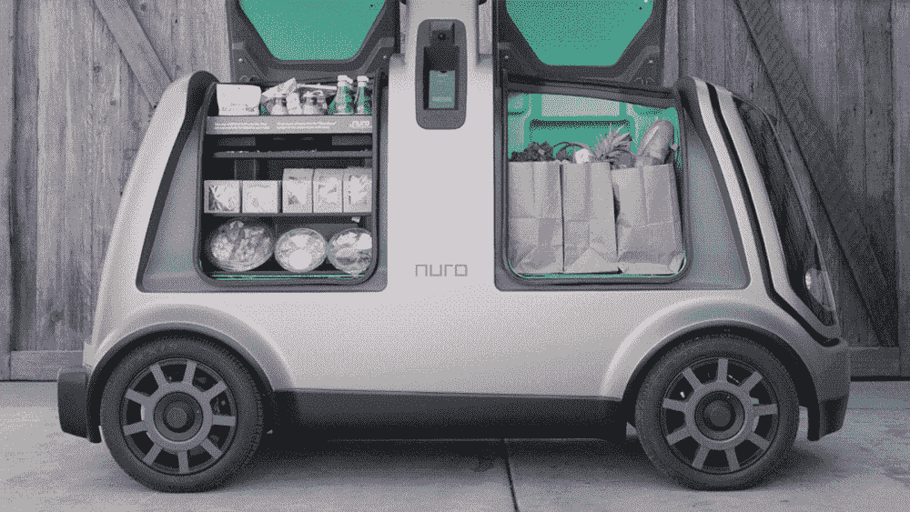

Nuro R2 自动驾驶送货车(2020) | GIF via [nuro.ai](http://nuro.ai)

> " [T **明年还会有更多。**](https://www.cnbc.com/2020/12/09/gms-cruise-begins-testing-autonomous-vehicles-without-human-drivers-in-san-francisco.html)
> 
> —通用汽车公司首席执行官丹·阿曼

# 解释了自治级别

自动驾驶汽车根据其驾驶能力有不同的[自主级别](https://www.nhtsa.gov/technology-innovation/automated-vehicles-safety)。这个分类是由汽车工程师协会(SAE)定义的。今天路上的大多数车辆都是 0 级和 1 级。

**0 级** **(无自动化)——**该级别车辆必须手动驾驶。没有任何驾驶辅助设备来帮助你驾驶。交通事故最有可能涉及这个级别的车辆。

**1 级(小自动化/“驾驶辅助”)——**大多数驾驶辅助技术都是在 20 世纪后期首次开发的。这个级别的一些自动驾驶汽车(AV)技术有[防抱死制动系统](https://en.wikipedia.org/wiki/Anti-lock_braking_system)、[自适应巡航控制](https://en.wikipedia.org/wiki/Adaptive_cruise_control)、[车道偏离预警系统](https://en.wikipedia.org/wiki/Lane_departure_warning_system)。

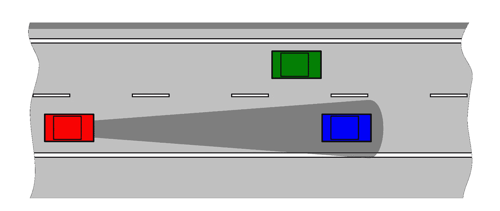

自适应巡航控制——红色汽车自动保持与蓝色汽车的距离。

**第二级(部分自动化/*****【放手可能】)——**汽车制造商一直致力于改善驾驶系统和感知技术。2 级 AVs 拥有[高级驾驶辅助系统](https://en.wikipedia.org/wiki/Advanced_driver-assistance_systems)。这项技术包括[驾驶员监控系统](https://en.wikipedia.org/wiki/Driver_Monitoring_System)、[自动泊车](https://en.wikipedia.org/wiki/Automatic_parking)和[汽车导航系统](https://en.wikipedia.org/wiki/Automotive_navigation_system)等。*

***第三级(有条件的自动化/“几乎不需要注意”)——**这是第二级技术的巨大飞跃。当车辆达到第三级自主时，驾驶任务是自动化的，几乎不需要人类的输入。3 级 AVs 通常可以自己从 A 点导航到 b 点。然而，3 级 AVs 还远非完美。他们将请求人类在困难的驾驶情况下进行干预。*

*奥迪 A8 是全球首款 3 级 AV(2017)*

***第 4 级(高度自动化/“可以睡觉”)——**目前，传统汽车制造商仍专注于开发第 2 级和第 3 级的 AVs。四级 AVs 才是真材实料。在这种自主水平下，车辆可以像任何有驾照的人一样智能驾驶。当你乘坐 4 级 AVs 时，你可以坐下来，放松，甚至睡觉——他们会处理驾驶，即使你没有对干预请求做出回应。4 级 AVs 的测试和运行只允许在世界上的某些地区进行。*

*Waymo 的 4 级自动驾驶出租车在地理围栏区域运营(2017 年)*

***第五级(全自动/“方向盘可选”)——**再次变平意味着实现全自主。这是最高境界。方向盘和踏板不会存在于这种类型的 AV 上。这些焊接在一起的金属和电子元件将成为比人类更好的驾驶员。我们还没到那一步，但是 AV 技术在过去的十年里已经有了显著的进步。*

> *“传统汽车制造商正面临一场自主革命。汽车正在演变成轮子上的计算机。”*

# *我们需要自动驾驶汽车吗？*

*围绕自动驾驶汽车有太多的炒作，尽管我相信这是出于一个好的原因。人类容易出错。这项研究表明，超过 90%的车祸的主要原因是驾驶员的失误。在我们的社会中集成完全可靠的 AVs 将减少交通事故和拥堵。*

*AVs 最有可能是电动汽车，所以它们将是环保的。在物流方面也有许多应用，例如城市配送、配送运输和供应链中设施之间的货物转移。AVs 比人类更好地适应交通，节省燃料、时间和对司机的需求。另一个创造性的用途是用于农业和采矿的自动特种车辆。这有利于经济。*

*[统计数据对于证明 AVs 的合理性至关重要(06/2019)](https://www.forbes.com/sites/lanceeliot/2019/05/30/essential-stats-for-justifying-and-comparing-self-driving-cars-to-humans-at-the-wheel/) 。看来说到开车，人类还不够好。当然，交通事故的数量很大程度上取决于交通系统及其规章制度。一些国家的基础设施质量比其他国家好。无论你住在哪里，AVs 都有机会产生巨大的社会影响。据专家称，安全性将是 AVs 的最大卖点。*

> *美国因车祸造成的大致死亡和受伤人数*
> 
> *每小时:每小时 4 人死亡*
> 
> *每小时:每小时 285 人受伤*
> 
> *每天:每天 100 人死亡*
> 
> *每天:每天 6850 人受伤*
> 
> *每周:每周 700 人死亡*
> 
> *每周:每周 48，000 人受伤*
> 
> *每月:每月 3000 人死亡*
> 
> *每月:每月 205，000 人受伤*
> 
> *每年:每年 37，000 人死亡*
> 
> *每年:每年 250 万人受伤*
> 
> **资料来源:[福布斯](https://www.forbes.com/sites/lanceeliot/2019/05/30/essential-stats-for-justifying-and-comparing-self-driving-cars-to-humans-at-the-wheel/) (2019)*

# *安全性和可靠性*

*公众对 AVs 的接受程度取决于社会和个人态度。不信任感是 AVs 的主要障碍之一。涉及 AVs 的事故，谁该负责？这些车辆[是否安全，不会受到网络黑客攻击](https://spectrum.ieee.org/the-institute/ieee-products-services/learn-how-to-protect-autonomous-vehicles-against-hackers)？还有一个定义算法的社会困境。在两败俱伤的情况下，车辆应该优先考虑自己还是行人？*

*已经有一些 4 级 AVs 的试驾在现实世界中发生了。世界上最大的自动驾驶服务公司 way mo(2020 年)已经进行了十年的试驾，其中大部分是在车内有安全驾驶员的情况下进行的。我们以这家公司为例。仅去年一年，Waymo 就进行了相当于大约 500 年驾驶时间的试驾。据[消息来源](https://www.theverge.com/2020/10/30/21538999/waymo-self-driving-car-data-miles-crashes-phoenix-google)称，在此期间，他们卷入了 18 起撞车事故和 29 起未遂碰撞。因为这个数据不平衡，很难判断它的安全性，而且操作区域有限。但是，与上一节中涉及人类驾驶员的近似统计数据相比，这些数字要少得多。*

*随着不断的开发和进一步的测试，4 级 AVs 只会随着时间的推移而改进。还有关于人类驾驶行为的研究，让[的工程师更深入地研究车辆安全的人为因素](https://www.automotiveworld.com/news-releases/aptiv-simusafe-advances-vr-based-vehicle-safety-research/)。可以设计技术来提高半自动驾驶汽车的驾驶员注意力。*

*如果您对 AV 安全方法感兴趣，您应该直接听取专家的意见。请看下面的视频。*

*一种开放、透明、行业驱动的 AV 安全方法| 2018 年布鲁塞尔 AutoSens 会议*

*AVs 的合法运营仍然是一个巨大的挑战。就目前而言，一些国家比其他国家准备得更充分。根据 [2019 AV 就绪指数](https://home.kpmg/xx/en/home/insights/2019/02/2019-autonomous-vehicles-readiness-index.html)，荷兰排名第一，新加坡紧随其后，[2018 年为测试自动驾驶巴士](https://www.bloomberg.com/news/features/2018-06-04/singapore-built-a-town-to-test-autonomous-self-driving-vehicles)而建的小镇。*

*怎样才能判断技术是否可靠？创建 AVs 有风险和评估标准。地方政府同意汽车工业生产的每一辆车的法规。*

*我们会信任自动驾驶汽车吗？理解背后的概念是建立信任的第一步。因此，本文的其余部分将讨论自动驾驶系统的基础知识。*

*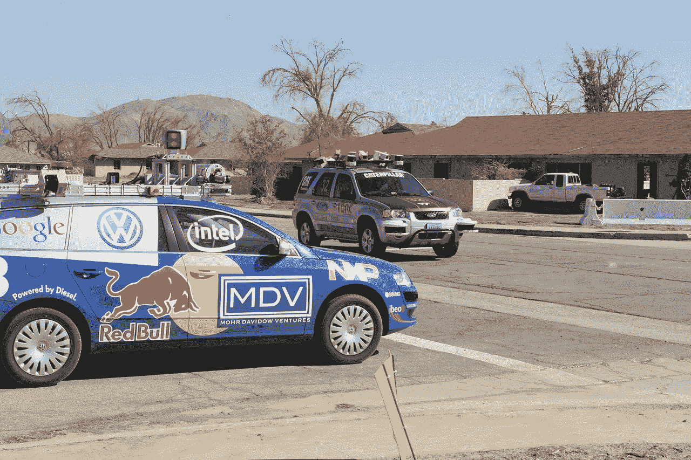*

*2007 年 DARPA 城市挑战赛上的斯坦福赛车和维克多探戈；一场刺激美国自动驾驶汽车发展的竞赛|图片来自维基共享*

# *自动驾驶的基础知识*

*自主车辆包括高度复杂的实时互操作系统。我们可以将自动驾驶过程简化为三个模块:感知、感知和决策。*

*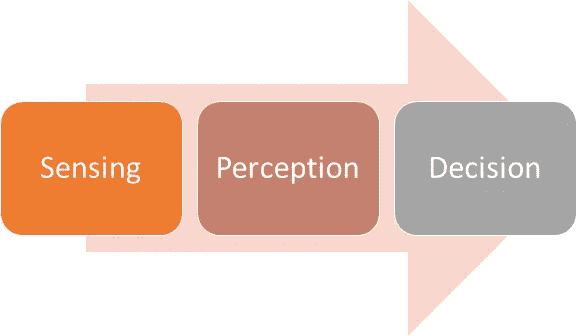*

*基于[7]的自动驾驶三大模块*

***可靠的 AVs 优先考虑道路上每个人的安全**——自身、其他车辆、乘客和周围的行人。就像人类司机一样，AVs 必须遵守交通规则。*

**感应*是自动驾驶的第一步。例如，过去四年生产的特斯拉汽车有 8 个摄像头，12 个超声波传感器和一个前置雷达。大多数 AV 公司也为他们的车辆配备激光雷达技术。感知相对容易。*

*感知是真正的挑战所在。必须创建基于传感器测量的知识数据库。换句话说，如何让 AVs 足够智能，能够独立驾驶。[因此，感知算法是开发安全自主系统的关键](https://www.ansys.com/blog/perception-algorithms-autonomous-vehicles)。*

**决策*是自动驾驶系统中的最后一个过程。它涉及应用在感知模块中获得的知识。智能 AVs 可以计算风险，安全导航，并可靠地控制车辆。*

*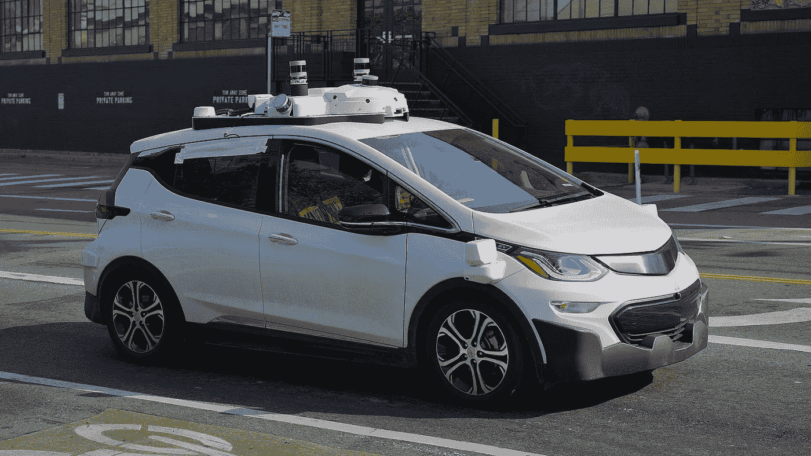*

*配备激光雷达技术的 Cruise Automation 自动驾驶汽车(2017) |图片来自维基共享*

*AV 系统架构的开发通常可以分为两种方法:*

*   ***模块化方法** /“中介感知”——架构由许多相互连接的顺序模块组成。*
*   ***端到端驾驶** /“行为反射”——作为单个机器学习任务的整个自动驾驶管道*

*本文解释了模块化方法，这是目前广泛使用的 AVs [8]。随着研究人员朝着 AVs 的方向努力，模块化方法的受欢迎程度在未来可能会发生变化。*

*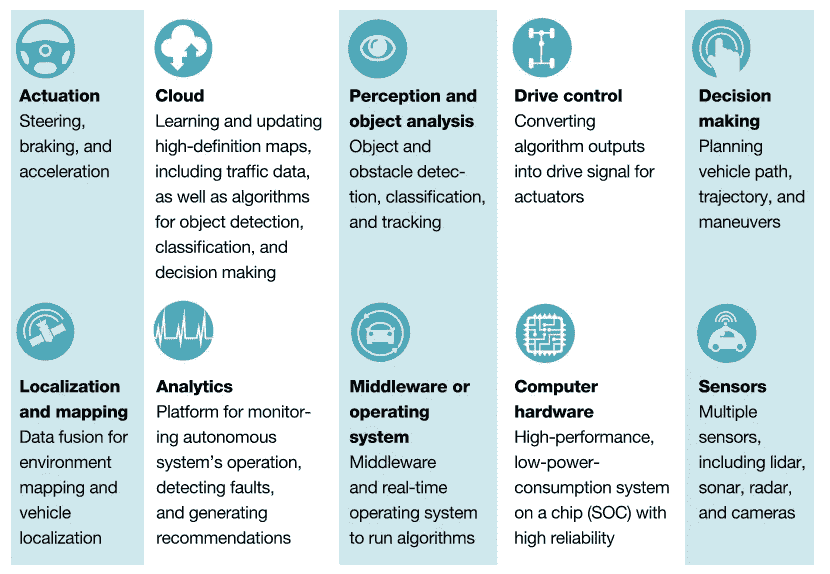*

*自动驾驶系统的要素|来源:[麦肯锡&公司](https://www.mckinsey.com/industries/automotive-and-assembly/our-insights/self-driving-car-technology-when-will-the-robots-hit-the-road)*

# *车辆感知技术*

*感知是理解世界的关键。该部分连接自动驾驶系统中的*传感*和*感知*。根据其功能，车辆感知技术可以分为两大类:*

*   ***定位—** 在地图上定位车辆的位置*
*   ***识别—** 目标检测、目标跟踪和运动估计*

*AVs 通常需要执行同步定位和地图创建(SLAM)以在动态环境中运行。在这里，定位被认为是感知模块的一部分，而规划和控制是决策模块的一部分。*

*车辆感知技术可以根据其感知媒介进行分类:*

*   ***通过无线电波感知** (GPS、雷达)*
*   ***通过声波感知**(超声波传感器)*
*   ***通过光感知**(激光雷达、摄像机)*

*大部分 AV 公司都是靠高清地图导航的。有了这张地图，AV 就可以利用它的技术轻松感知周围的环境。车辆将在行驶过程中针对地图中的任何变化进行比较和更新。*

> *“如果我们想到处都有自动驾驶汽车，我们就必须到处都有数字地图，”Mobileye 首席执行官 am non sha shua([《纽约时报》2017](https://www.nytimes.com/2017/03/02/automobiles/wheels/self-driving-cars-gps-maps.html) )*

*真实的道路是动态的；由于建设或自然灾害，它们可能会发生巨大变化。一些公司，如特斯拉和苹果，设定了使用“无地图”运动规划系统的雄心壮志。他们完全依靠视觉。*

## *GPS/IMU*

*使用 GNSS **，**简称全球导航卫星系统可以实现定位。这就是通常所说的 [GPS](https://en.wikipedia.org/wiki/Global_Positioning_System) ，是全球导航卫星系统的一种。GPS 的更新速率约为 10 Hz。*

*此外， [IMU](https://en.wikipedia.org/wiki/Inertial_measurement_unit) 设备也用于 AVs 中，以实现地图中的实时车辆定位。IMU 设备工作在 200 Hz 左右，比 GPS 的更新速率高得多。*

> *一些技术，如[跟踪滤波器](https://ieeexplore.ieee.org/document/1031864)和[顺序蒙特卡罗](https://en.wikipedia.org/wiki/Particle_filter#:~:text=Particle%20filtering%20uses%20a%20set,can%20take%20any%20form%20required.)方法，可用于组合来自多个来源的传感器测量值。*

*我们不能仅仅依靠 GPS/IMU 来定位，因为 GPS 不够精确。*

## ***雷达***

*AVs 中的无线电探测和测距系统(雷达)可以探测附近物体的速度和距离。雷达由发射机和接收机组成。AV [雷达](https://en.wikipedia.org/wiki/Radar) s(毫米波雷达)以[极高的频率](https://en.wikipedia.org/wiki/Extremely_high_frequency)发射和接收无线电波来感知环境。*

*雷达分别通过脉冲压缩和[多普勒频移](https://en.wikipedia.org/wiki/Doppler_effect#:~:text=The%20Doppler%20effect%20(or%20the,described%20the%20phenomenon%20in%201842.)来测量物体的距离和相对速度。AVs 中的雷达可以是远程、中程或短程的。这三种类型都可以在 AV 中一起使用。*

*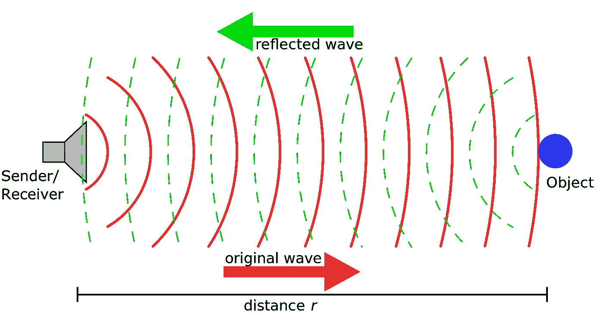*

*多普勒效应|图片来自维基共享*

> *雷达最大的优点是可以全天候工作。在驾驶应用中，雷达通常以脉冲、线性调频连续波和频移键控方式工作。*

*雷达常见的实际挑战是时间同步、接口通信、数字信号处理的最佳分配和最小化干扰。AVs 通常使用雷达和超声波传感器来完成避障任务。*

## *超声波传感器*

*[超声波导航测距](https://en.wikipedia.org/wiki/Sonar)(声纳)也发射波，并将反射波转换成类似雷达的电信号，共振频率在 48 Hz 左右。它由超声波换能器和接收电路组成。*

*超声波传感器可以“看穿”物体，适合识别缓慢移动的目标。该传感器不受天气条件的影响，但快速的温度变化会影响其准确性。*

> *通过测量发射和反射之间经过的时间间隔，可以计算超声波传感器检测到的物体的范围。*

*远程超声波传感器可以探测到 8 米以外的物体。大多数 AVs 将超声波传感器用于安全驾驶应用，如自动泊车和碰撞警告。*

*有[种方法](https://www.researchgate.net/publication/290363887_Airborne_ultrasonic_imaging_Sonar_based_image_generation_for_autonomous_vehicles)从空中超声波生成图像。这是医学成像和机器人学中相对较新的研究领域。然而，超声波图像的信息内容仍然不如激光雷达或照相机。因此，从声纳生成图像的过程是不必要的。*

**

## *激光雷达*

*光探测和测距系统(LiDAR)由激光扫描仪和激光接收器组成。[激光雷达](https://en.wikipedia.org/wiki/Lidar)以脉冲激光的形式使用紫外、可见光或红外光对物体成像，每秒钟高达 15 万个脉冲。*

*激光雷达有三种类型:[飞行时间](https://en.wikipedia.org/wiki/Time-of-flight_camera)、[三角测量](https://en.wikipedia.org/wiki/TriDAR)和相位测距。世界上分辨率最高的激光雷达是威力登 VLS-128。它的范围为 300 米，每秒可以记录高达 240 万到 960 万个数据点。*

> *激光雷达通过测量目标散射光的发射和反射之间的脉冲间隔来计算探测到的物体的距离。*

*激光雷达技术因相当昂贵而臭名昭著，但它近年来一直在经历最大的技术进步。2020 年的创新包括[微机电镜](https://en.wikipedia.org/wiki/Microscanner) (MEMS)和[固态激光雷达](https://spectrum.ieee.org/tech-talk/semiconductors/design/kyber-photonics-solid-state-lidar-on-a-chip-system)。那些激光雷达没有机械部件，因此降低了单位成本。*

*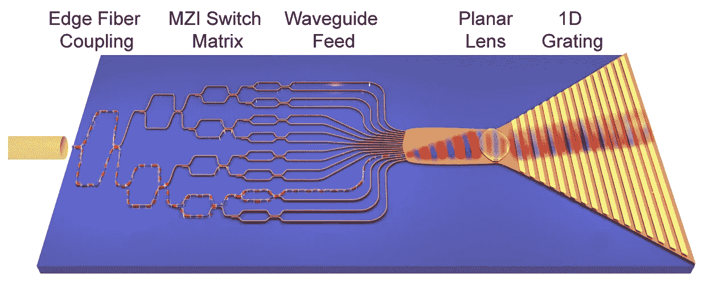*

*[麻省理工学院附属公司建造新的固态单芯片激光雷达系统(2020 年 12 月)](https://spectrum.ieee.org/tech-talk/semiconductors/design/kyber-photonics-solid-state-lidar-on-a-chip-system) |图片由麻省理工学院林肯实验室提供*

> *[埃隆马斯克认为激光雷达技术注定要失败](/'Anyone relying on lidar is doomed,' Elon Musk says)。另一方面，[谷歌的自动驾驶汽车公司正在进入激光雷达量产业务](https://thelastdriverlicenseholder.com/2019/03/08/waymo-enters-lidar-business/)。大多数业内人士将激光雷达视为自动驾驶汽车不可或缺的一部分。*

*AVs 可以使用激光雷达技术扫描环境并创建 3D 数字表示。该 3D 数据对于定位和运动跟踪都是有用的。*

*基于激光雷达的定位通常也使用粒子滤波技术。在传感器融合中，激光雷达采集的数据与 GPS/IMU 数据融合。该方法可以实现 10 cm 以内的实时定位精度。*

*激光雷达的性能很大程度上取决于设备的良好校准。这涉及到很多变量，比如参数化的选择，数据分段等。*

*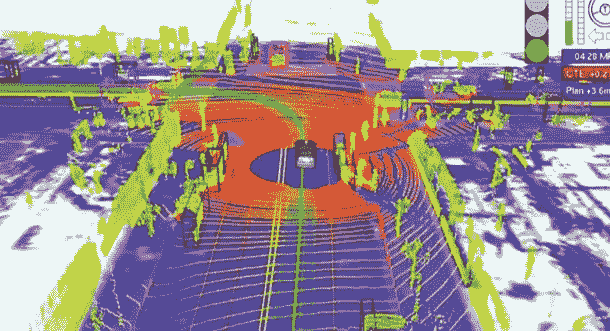*

*从威力登的 HDL-64E 激光雷达投射的十字路口车辆的点云图像| [来源](http://eijournal.com/resources/lidar-solutions-showcase/lidar-boosts-brain-power-for-self-driving-cars)*

## *照相机*

*大多数 AVs 严重依赖摄像设备。AVs 通常安装八个 1080p 摄像机，以每秒 60 帧的速度捕捉图像。有了多个摄像头，你可以看到所有的方向。你也可以将图像投射到 360 度的三维视野中。*

*有人认为相机优于雷达和激光雷达，因为它可以捕捉物体的颜色、纹理和轮廓。相机面临的挑战是，它严重依赖于天气条件。*

> *“一旦你为视觉解决了相机，自主性也就解决了；如果你不解决视觉，它就没有解决……你绝对可以成为超人，只需要相机。”—埃隆·马斯克， [TED2017](https://blog.ted.com/what-will-the-future-look-like-elon-musk-speaks-at-ted2017/)*

> *大多数研究将 AVs 限制在城市地区，在那里 AVs 会产生更大的影响。[车道保持辅助系统](https://www.vda.de/en/topics/safety-and-standards/lkas/lane-keeping-assist-systems.html)现在是这个领域的一个研究热点。[6]*

*基于图像的感知算法可以是启发式的，也可以是数据驱动的。近年来，深度学习技术已被证明在对象检测和跟踪方面优于传统的计算机视觉技术。我们可以使用深度[卷积神经网络](http://Convolutional%20neural%20network) (DCNN)对图像进行分割和分类。*

*所有当前的方法都依赖于 DCNN 架构，例如 SPP-Net、ResNet-50、VGG-16、DarkNet-53。在撰写本文时，用于实时对象检测的开源技术是 YOLOv4。当处理具有时间特征的图像(视频)时，诸如长短期记忆(LSTM)的递归神经网络(RNNs)也是强有力的工具。*

*在实践中，AV 公司在设计其管道时，会将不同的机器学习方法组合成复杂的混合形式。AVs 使用的对象识别框架一般可以分为两种类型:*

*   ***单阶段检测框架** —预测物体位置和分类物体的单一网络*
*   ***区域提议检测框架** —使用两个不同的阶段，其中感兴趣的区域在由单独的网络分类之前被预定义。*

> *当前车辆感知的研究趋势是[360°视频/图像](https://ieeexplore.ieee.org/document/8960364)处理算法。这对于更高层次的自动化是必要的[6]。*

*同时，基于摄像机的定位任务是一个广泛的主题，它在机器人、虚拟现实和增强现实中也有应用。在 AVs 中，基于视觉的定位通常使用视觉里程计技术[3]。*

*视觉(基于图像)里程计的一般流水线如下:1)通过立体图像对的三角测量获得视差图，2)匹配[显著](https://en.wikipedia.org/wiki/Saliency_map)特征，3)估计连续帧之间每个点的深度，4)比较特征以估计运动和当前车辆位置。*

*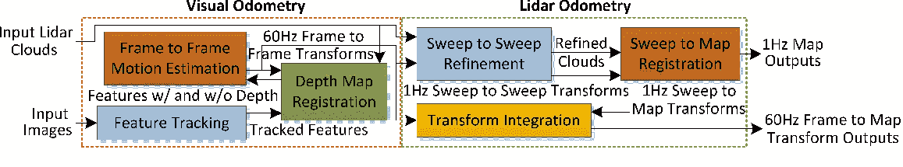*

*视觉激光雷达里程计和测绘|图像通过[研究之门](https://www.semanticscholar.org/paper/Visual-lidar-odometry-and-mapping%3A-low-drift%2C-and-Zhang-Singh/ac7215af97ed57f073dd3bb03188ac313e62e5fb)*

# *车对一切(V2X)*

*V2X 是连接车辆和物体的通信系统。V2X 是智慧城市常见的研究课题。V2X 中的物体通过[物联网](https://en.wikipedia.org/wiki/Internet_of_things)相互数字化互联。这些对象包括车辆、行人、设备、电网和基础设施(V2V、V2P、V2D、V2G 和 V2I)。有两种主要的 V2X 技术:*

*   ***基于 WiFi 的专用短程通信(DSRC)——***
*   ***基于 5G 的蜂窝 V2X(C-V2X)——***

*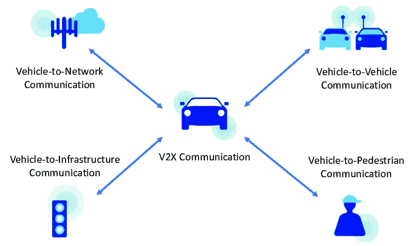*

*通过 [ResearchGate](https://www.researchgate.net/figure/Towards-seamless-ubiquitous-vehicle-to-everything-V2X-communication_fig1_331676083) 获取车辆对一切事物|图像*

*V2X 的工作频率极高，数据传输速率也高得多。目前，WiFi 是最安全的技术，但 V2X 很可能通过 [5G 网络](https://en.wikipedia.org/wiki/5G)来实现。*

*V2X 提供了 AV 工程中急需的[冗余](https://en.wikipedia.org/wiki/Redundancy_(engineering))。在实时驾驶中，V2X 传感器可以将未检测到的物体添加到地图中。V2X 还通过直接通信简化了对象跟踪过程。*

> *由于 V2X 中的完全数据共享，隐私问题可能会出现，但[区块链](https://en.wikipedia.org/wiki/Blockchain)技术可以帮助保护未来的数据共享。*

***AVs 与智能交通系统携手并进**。智能城市中的通信系统将在使 AVs 完全可靠和安全方面发挥重要作用。中国目前在这方面处于领先地位，[阿里巴巴在深圳的 AutoX 运营连接到了上海基于 5G 的 V2X 技术](https://venturebeat.com/2020/12/03/autoxs-robo-taxi-service-in-shenzhen-leaves-out-the-human-driver/)(2020 年 12 月)。*

*创建智能交通系统需要预先付出巨大的努力。例如，道路测绘和基础设施建设。除了需要与监管力量合作之外，在制造车辆本身方面也存在挑战。以下领域在工程 AVs 中至关重要:*

*   ***数据管理和数据处理***
*   ***自动驾驶系统架构***
*   ***风险和不确定性评估***

> *“在自动驾驶汽车中，我们必须考虑相机、雷达、声纳、GPS 和激光雷达——这些组件与活塞、活塞环和发动机缸体一样，是这种新驾驶方式的必要组成部分。相机将产生 20-60 MB/s 的数据，雷达将产生 10 kB/s 以上的数据，声纳将产生 10-100 kB/s 的数据，GPS 将以 50 kB/s 的速度运行，激光雷达将产生 10-70 MB/s 的数据。运行这些数据，[每个 AV 每天将产生大约 4 TBs 的数据]。”*
> 
> *—英特尔 2016 首席执行官布莱恩·科兹安尼克([英特尔新闻](https://newsroom.intel.com/editorials/krzanich-the-future-of-automated-driving/#gs.oon8ft))*

# *系统结构*

*AVs 从多个传感器收集数据。[传感器融合](http://Sensor fusion is the ability to bring together inputs from multiple radars, lidars and cameras to form a single model or image of the environment around a vehicle.)汇集来自多个信息源的输入，形成一个单一的环境假设模型。*

*通过对齐和同步数据，传感器融合减少了不确定性，提高了感知的准确性。当然，更多的数据会带来更好的性能。[数据将成为车辆的新油。](https://newsroom.intel.com/editorials/krzanich-the-future-of-automated-driving/#gs.oon8ft)*

*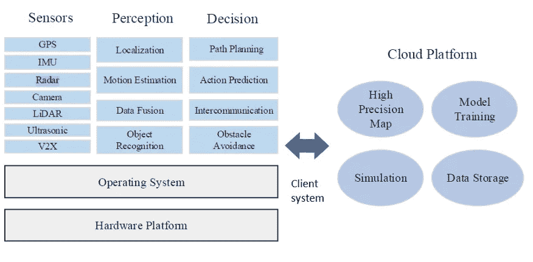*

*基于[ [4](https://ieeexplore.ieee.org/document/8093778) ，[ [7](https://ieeexplore.ieee.org/document/8943388) ]的 AV |图像的系统架构*

*AV 驾驶系统中的传感器数据融合策略可以基于:*

*   ***可辨别单位** **—** 直接融合来自每一个传感器的测量值*
*   ***互补特征—** 来自传感器的相同特征的融合*
*   ***目标属性—** 来自每个传感器数据的多个目标列表的融合*
*   ***多源决策—** 融合来自每个传感器数据的决策*

***AVs 可以利用云计算的能力在高清地图上定位自己。**他们根据多传感器融合策略做出决策。AVs 中的客户端系统集成了软硬件平台。*

> *客户端系统必须满足实时性和可靠性的要求。它协调用于解决驾驶任务的组件之间的通信。*

*在形式上，我们可以将感知任务分为两类:运动目标感知和环境感知。除了感知任务，客户端系统中的处理还包括高要求的计算。它必须计算轨迹规划、车辆控制和避障的最佳决策。*

## ***功能架构***

*作为一名司机，必须能够预测其他车辆在特定交通状况下可能的行动。决策模块负责根据感知模块开发的世界模型的主动预测采取行动。*

*决策组件控制车辆。我们可以将该架构视为功能组件的组合，其中决策模块基于内部和外部考虑采取行动。*

*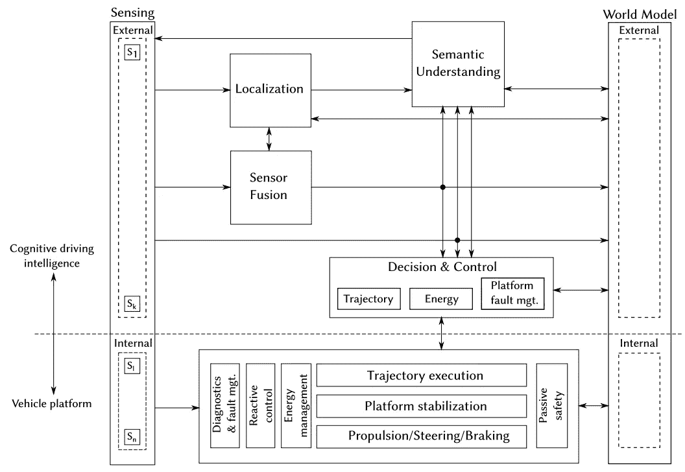*

*通过 [ResearchGate](https://ieeexplore.ieee.org/abstract/document/7447216) 的 AV [2] |图像的功能架构*

*计算硬件与分布式操作系统连接以执行驱动任务。四个现有的计算平台可用于设计 AV 架构: [GPU](https://en.wikipedia.org/wiki/Graphics_processing_unit) 、 [DSP](https://en.wikipedia.org/wiki/Digital_signal_processor) 、 [FPGA](https://en.wikipedia.org/wiki/Field-programmable_gate_array#:~:text=A%20field%2Dprogrammable%20gate%20array,term%20%22field%2Dprogrammable%22.) 和 [ASIC](https://en.wikipedia.org/wiki/Application-specific_integrated_circuit) 。*

> *大多数 AVs 依赖 GPU 加速处理。工程师必须编写节省内存的代码来实现良好的实时性能。对更快处理的需求导致了半导体行业的创新。*

*当前 AVs 的轨迹执行(推进、转向、制动)由一个由 [ECU](https://en.wikipedia.org/wiki/Electronic_control_unit) 组成的网络控制。随着电动汽车的出现，能源管理组件是电池管理和[再生制动](https://en.wikipedia.org/wiki/Regenerative_brake)的最新发展。*

*同时，诊断和故障部件观察整个系统。该模块确保系统中的每个组件都正常工作。这在驾驶过渡或驾驶员交接期间至关重要。*

*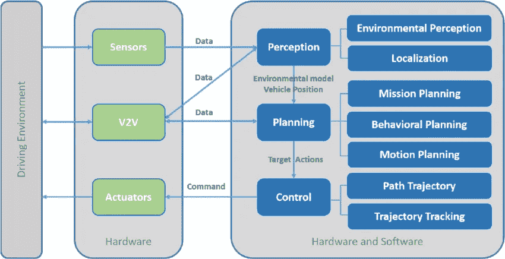*

*通过[研究之门](https://www.researchgate.net/publication/330900887_A_Systematic_Review_of_Perception_System_and_Simulators_for_Autonomous_Vehicles_Research)的 AV |图像的一般架构*

## *模拟*

*AVs 的测试可以通过模拟来完成。比如百度的 [Apollo 汽车都是在 LG 和 Unity (09/2019)](https://swsolutions.lge.com/insights/news/lgsvl-simulator) 开发的 LGSVL 模拟器中模拟的。Waymo 已经在模拟测试中驾驶了超过 100 亿英里。*

*许多其他公司为 ADAS 技术提供了模拟平台。 [Nvidia 也在 2019 年为 AVs 开发了仿真平台](https://www.nvidia.com/en-us/self-driving-cars/drive-constellation/)。这降低了原型成本，减少了开发时间。*

*在第一阶段，可以使用软件在环测试进行模拟。进一步来说，[硬件在环](https://en.wikipedia.org/wiki/Hardware-in-the-loop_simulation)技术用于测试 AV 的每个组件。最后，可以进行车辆在环仿真和真实世界试驾，以验证架构设计、收集数据和测试驾驶性能。*

*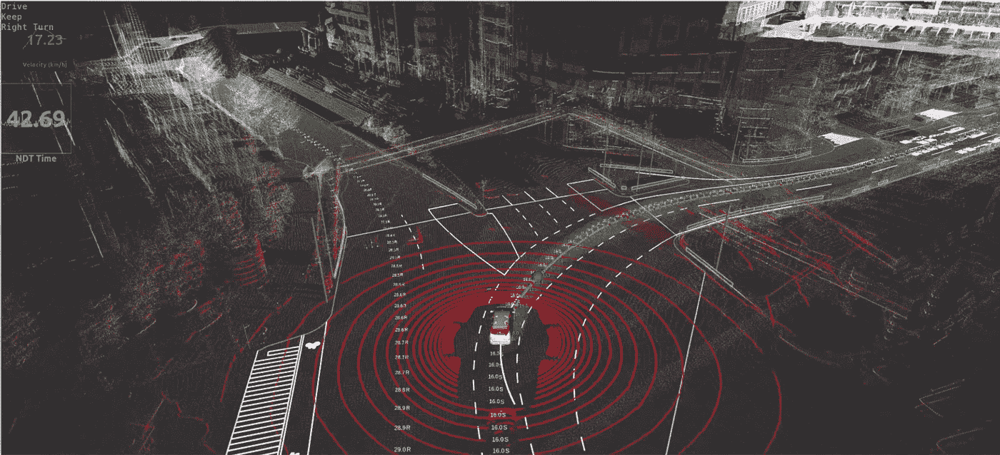*

*[“一体化”开源软件](https://github.com/Autoware-AI/autoware.ai)用于自动驾驶车辆|图片来自[Autoware Foundation](https://www.autoware.org/)*

*自动驾驶系统的确切架构设计因 AV 制造商而异。事实上，有来自多个分支的数百家公司在一起工作，为 AVs 提供和开发技术解决方案。*

# ***限制***

*对于自主系统来说，在没有任何故障的情况下执行驾驶任务是非常关键的。AVs 中的模块高度依赖于彼此，因此冗余非常重要。*

*内燃机的效率不足以为计算机系统发电。因此，AVs 至少必须是混合动力汽车。*

*AVs 及其技术的一些设计限制是:*

*   ***AV 反应时间****——**AVs 应该能在 0.1 秒内做出反应，比人类平均反应时间要快。这取决于传感器的更新速率以及客户端系统的处理和尾部延迟。*
*   ***云访问—** 访问云通常是必要的。以前的环境图应该存储在内部，以防云不可访问。这可能需要数十 TB 的存储空间。*
*   ***存储限制—** 硬件存储有限。AVs 收集了大量的数据。他们不可能存储所有东西，所以他们应该决定如何有效地保存数据。*
*   ***数据限制** —试驾后通常会有大量的原始数据。但是，必须对其进行处理，以便为感知模块创建训练数据。对于不同的驾驶场景，大多数方法仍然依赖于人工标记。这减缓了发展。*
*   ***热约束—** AV 计算系统工作时散热。它影响 AV 热分布和 HVAC，应该优化哪个以获得最佳的车辆性能。*
*   ***功耗限制—** 计算系统的功耗可能高达数千瓦。这会影响车辆的燃油效率。*
*   ***其他限制—** 环境(位置图和运行条件)、V2X、软硬件可靠性、阻尼能力、电池、车辆调节、生产成本、[人机界面](http://beyondmanaging.com/2015/09/the-limits-of-automation-and-human-machine-integration/)等。*

# *摘要*

*工程师们正在努力开发完全可靠的自动驾驶汽车。本文概述了自动驾驶汽车及其技术，以及 2020 年的最新发展。它旨在成为进一步技术、伦理或商业讨论的催化剂。*

*自动驾驶汽车的最新技术水平已经达到了高度自动化(4 级)。在撰写本文时，还没有任何技术能够实现完全自动化(第 5 级)。预计将在 2021 年看到第 3 级和第 4 级自动驾驶汽车的新版本。自动驾驶汽车将很快成为班车、拼车服务、物流和专业应用的趋势。*

*从社会、经济和环境的角度来看，这种未来的交通将造福社会。安全将是最大的卖点，因为自动驾驶汽车受到严格监管。理解这项技术背后的概念对于建立信任非常重要。*

*工程上有限制，所以自动驾驶汽车最有可能是电动汽车。行业内存在各种技术实现，但目前所有的自动驾驶汽车都使用模块化方法。自动驾驶的通用模块是传感、感知和决策。每个制造商设置他们的车辆不同。业内大多数车辆使用 GPS、雷达、激光雷达、摄像头、超声波传感器和高清地图技术。近年来，激光雷达取得了最大的技术进步。在智能城市中，自动驾驶汽车与车对物(V2X)技术配合得最好。数据管理、系统架构以及动态风险评估对于创建自动驾驶汽车至关重要。道路上的车辆应该能够应对不确定性。行业标准是在真实世界试驾之前一步一步地模拟一切。*

*自动驾驶汽车已经在世界的一些地方运行。目前的市场需求并不是很高，所以自动驾驶汽车在我们的交通系统中成为大多数还需要几十年的时间。车辆和交通法规可能是需要克服的最大障碍。与美国和中国公民相比，生活在欧洲的人可能需要等待更长时间才能看到自动驾驶汽车。欧洲人在安全和数据隐私方面更为谨慎。与此同时，发展中国家可能会获得外国投资，直接为其交通系统建设智能基础设施。过渡到电动汽车是达到更高自主水平的第一步。公司和城市之间的合作是开发安全、智能交通系统的关键。未来并不遥远。*

# *参考*

*本文中的大多数技术解释都基于以下书籍和论文:*

1.  *ResearchGate — [自动驾驶汽车:智能交通系统和智能技术](https://www.researchgate.net/publication/290363629_Autonomous_vehicles_Intelligent_transport_systems_and_smart_technologie)，2014 年。*
2.  *IEEE — [自动驾驶的功能架构](https://ieeexplore.ieee.org/abstract/document/7447216)，2015*
3.  *ArXiv — [CAAD:用于自动驾驶的计算机架构](https://arxiv.org/abs/1702.01894)，2015*
4.  *IEEE *—* [*创建自动驾驶汽车系统*](https://ieeexplore.ieee.org/document/8093778) ，2017。*
5.  *ResearchGate — [*自动驾驶的架构含义:约束和加速*](https://www.researchgate.net/publication/330494421_Autonomous_Vehicle_The_Architecture_Aspect_of_Self_Driving_Car) ，2018。*
6.  *IEEE — [自动驾驶调查:常见实践和新兴技术](https://ieeexplore.ieee.org/document/9046805)，2020 年。*
7.  *IEEE — [自动驾驶中的多传感器融合:调查](https://ieeexplore.ieee.org/document/8943388)，2020 年。*
8.  *ArXiv — [端到端驾驶调查:架构和培训方法](https://arxiv.org/abs/2003.06404)，2020 年。*

****免责声明*** *:本文所表达的观点完全是本人观点。我不代表任何机构、研究所或公司。所有内容都受版权保护。**