# 丰田 v/s 宝马 v/s 特斯拉:使用 Python 进行股票分析

> 原文：<https://pub.towardsai.net/toyota-v-s-bmw-v-s-tesla-stock-analysis-using-python-3762caa1713a?source=collection_archive---------0----------------------->

## [数据可视化](https://towardsai.net/p/category/data-visualization)

## 汽车公司股票分析的实用实现，使用 Python 获得可视化和财务洞察力。

Python 的使用是巨大的，它在几乎每个用例中都有帮助。通过这篇文章，我希望向你介绍在股票分析中使用 Python。从获得股票的数据到可视化它并获得洞察力，一切都在这里解释。财务术语以更简单的术语与实现代码一起强调，以帮助更好地理解概念。


照片由克里斯·利维拉尼( [Unsplash](https://unsplash.com/photos/dBI_My696Rk) )拍摄

为了促进学习过程，考虑了 3 家著名汽车公司的股票:丰田、宝马和特斯拉。这些股票表现不同，有助于区分和获得洞察力。所以让我们开始吧！

# →导入包

我们将从导入数据分析和可视化所需的必要包和库开始。

```
**import** numpy **as** np
**import** pandas **as** pd
**import** matplotlib.pyplot **as** plt
**%**matplotlib inline
```

接下来，我们将导入获取数据所必需的包。Pandas DataReader 将用于提取数据。

要了解更多关于熊猫 DataReader 的信息，请查看我下面的文章:

[](https://medium.com/nerd-for-tech/how-to-get-financial-data-using-python-7a508f25fc39) [## 如何用 Python 获取财务数据？

### 理解如何获取数据以使用 Python 进行金融分析的指南。

medium.com](https://medium.com/nerd-for-tech/how-to-get-financial-data-using-python-7a508f25fc39) 

```
**import** pandas_datareader
**import** datetime
**import** pandas_datareader.data **as** web
```

# →获取数据

现在我们将获得汽车公司的数据，这些数据将被分析。将提到开始日期和结束日期，在此期间将进行分析。

```
start **=** datetime.datetime(2015,1,1)
end **=** datetime.datetime(2020,1,1)
```

## **丰田**

将被考虑的汽车公司有丰田、宝马和特斯拉。因此，从网络中提取所需时间段的数据。

```
toyota **=** web.DataReader('TM','yahoo',start,end)
toyota.head()
```

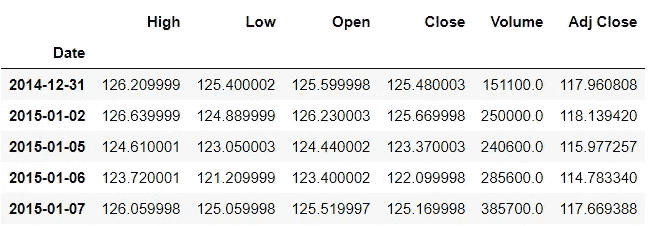

## 德国宝马汽车公司(Bavarian Motor Works)

```
bmw **=** web.DataReader('BMWYY','yahoo',start,end)
bmw.head()
```

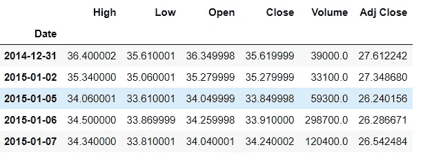

## 特斯拉

```
tesla **=** web.DataReader('TSLA','yahoo',start,end)
tesla.head()
```

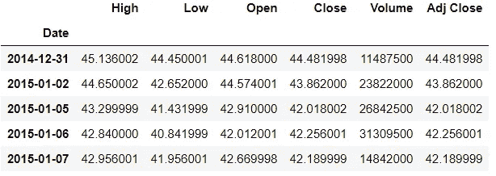

# →数据的可视化

规定时间段内的趋势将通过图形可视化，并获得洞察力。从所有 3 只股票的开盘价的线性图开始。

## 线性图

```
toyota['Open'].plot(label**=**'Toyota',title**=**'Open Prices',figsize**=**(12,8))
bmw['Open'].plot(label**=**'BMW')
tesla['Open'].plot(label**=**'Tesla')
plt.legend()
```

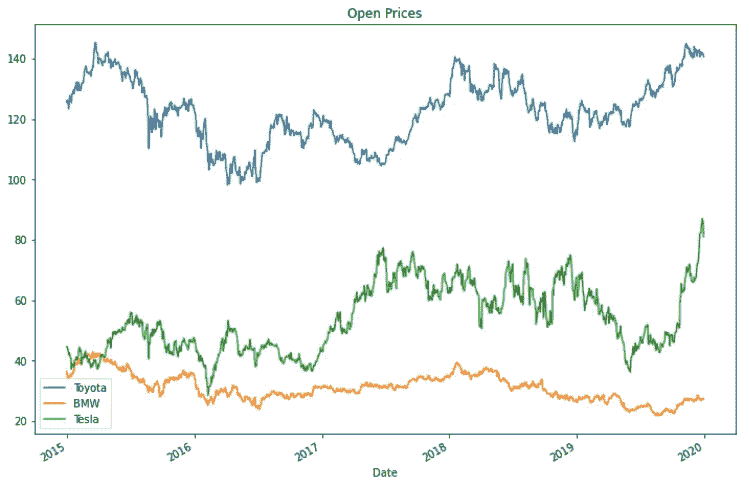

> 从上面的图中可以看出，与其他两家公司相比，丰田的开盘价较高。

## 库存数量图

接下来绘制每天的股票交易量。

```
toyota['Volume'].plot(label**=**'Toyota',title**=**'Volume Traded',figsize**=**(12,8))
bmw['Volume'].plot(label**=**'BMW')
tesla['Volume'].plot(label**=**'Tesla')
plt.legend()
```

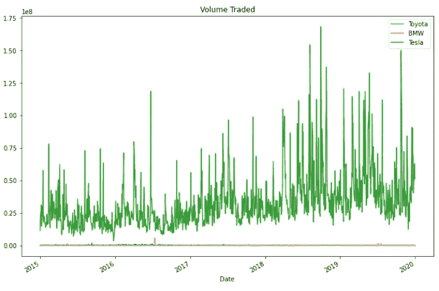

> 我们了解到，特斯拉在 2018 年底出现了大幅飙升，达到了高交易量。

所以让我们找出交易量最高的确切日期。

```
m **=** tesla['Volume'].max()
tesla.loc[tesla['Volume']**==**m]
```

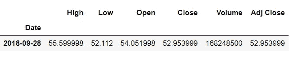

根据上面的情节，感觉特斯拉比其他两家公司处于更好的位置。但是，当不仅考虑股票，而且考虑总市值时，情况就会清楚了。一个简单的方法是通过交易量乘以开盘价来计算交易总额。因此创建了另一列“总交易量”。

## 交易总额图

```
toyota['Total trade amount'] **=** toyota['Open']*****toyota['Volume']
bmw['Total trade amount'] **=** bmw['Open']*****bmw['Volume']
tesla['Total trade amount'] **=** tesla['Open']*****tesla['Volume']
```

现在，交易总额将被绘制出来，以查看其趋势。

```
toyota['Total trade amount'].plot(label**=**'Toyota',figsize**=**(10,8))
bmw['Total trade amount'].plot(label**=**'BMW')
tesla['Total trade amount'].plot(label**=**'Tesla')
plt.legend()
```

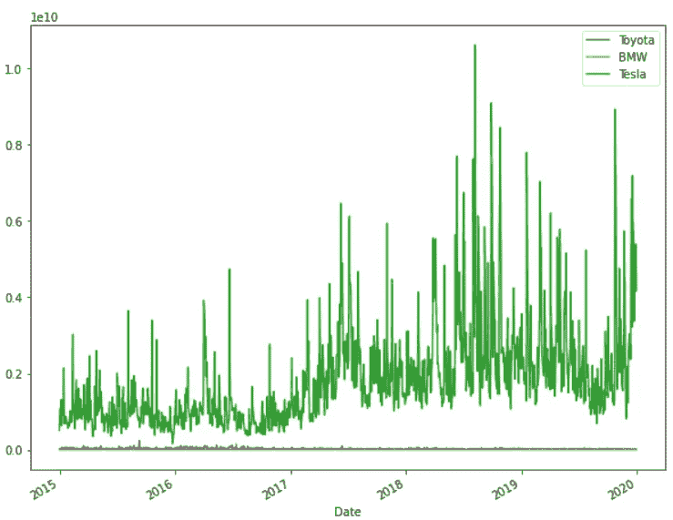

> 在这里，我们可以观察到特斯拉在 2018 年年中的某个地方出现了大幅飙升，交易了大量股票。

所以让我们获得它发生的确切日期。

```
m1 **=** tesla['Total trade amount'].max()
tesla.loc[tesla['Total trade amount']**==**m1]
```

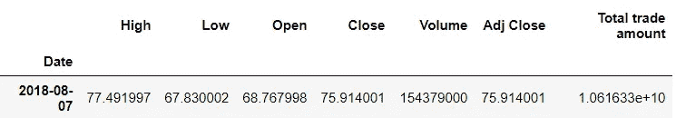

> 当你在网上搜索这个日期时，你会发现激增是因为埃隆·马斯克表示特斯拉可能会私有化。

只是看看丰田和宝马公司，因为特斯拉的规模更大。

```
toyota['Total trade amount'].plot(label**=**'Toyota',figsize**=**(10,8))
bmw['Total trade amount'].plot(label**=**'BMW')
plt.legend()
```

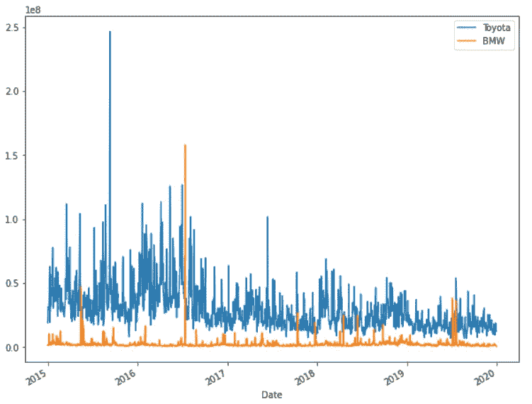

> 丰田在 2015 年年中和宝马在 2016 年年中也出现了飙升。

## 移动平均图

现在让我们继续绘制移动平均线。我们拿宝马的数据来画 50 天和 250 天的移动平均线。

```
bmw['MA50'] **=** bmw['Open'].rolling(50).mean()
bmw['MA250'] **=** bmw['Open'].rolling(250).mean()
bmw[['Open','MA50','MA250']].plot(figsize**=**(16,8))
```

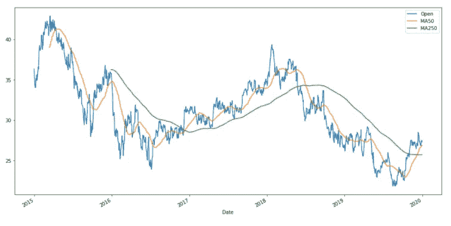

## 烛台图

在做股票分析的时候，蜡烛图是最广泛使用的。因此，让我们开始绘制汽车公司丰田的烛台图表。安装了 mplfinance 模块。它有一个绘制烛台的“类型”参数。

```
*!pip install mplfinance***import** mplfinance **as** mpf
```

我们从 2016 年中提取了 5 月的日期，并绘制了这个区间的蜡烛图。

```
toyota_month **=** toyota['2016-05-01' :'2016-06-01']
mpf.plot(toyota_month,type**=**'candle',style**=**'charles')
```

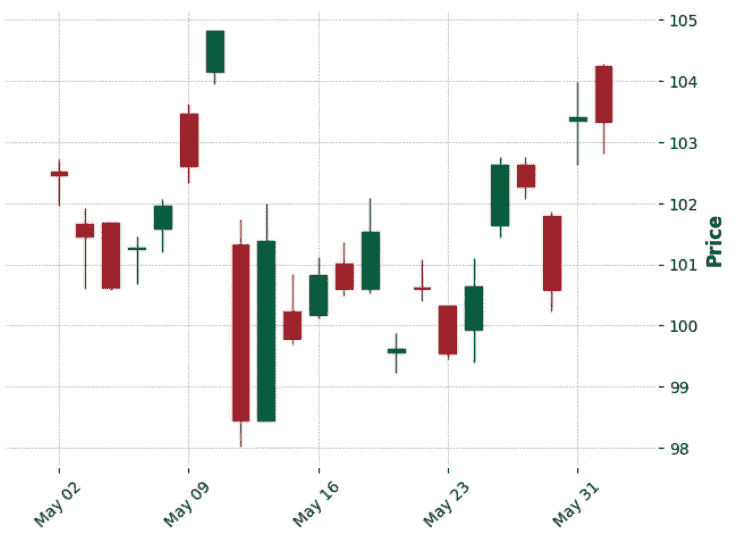

如果你想显示交易量，只需将参数 volume 设置为 true。

```
mpf.plot(toyota_month,type**=**'candle',style**=**'charles',volume**=True**,figratio**=**(10,5))
```

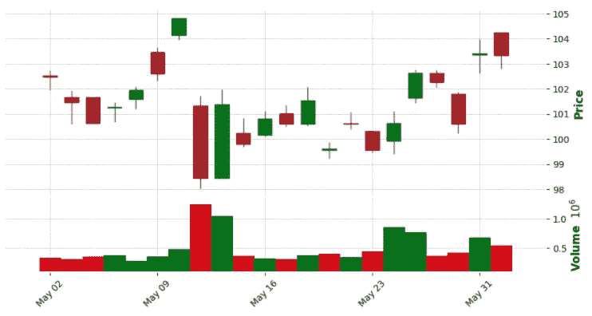

# →财务分析

现在我们将研究一些金融术语及其计算方法。

## 每日百分比回报

第一项是每日百分比变化。它的公式如下:

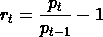

其中 r(t)是 t 时刻的收益，p(t)是 t 时刻的价格，这有助于确定收益或损失的百分比，并分析股票的波动性。波动性是衡量股票收益离差的指标。因此，如果股票在一段时间内的涨跌幅度超过 1%，那么它就被称为波动市场。因此，当我们绘制直方图时，分布很宽，那么我们可以说它更不稳定。

所以现在创建了一个“return”列，它是使用收盘价列计算的。对于时间(t-1)，使用“移位”方法向下/向前移位周期 1。

```
toyota['returns'] **=** (toyota['Close']**/**toyota['Close'].shift(1))**-**1
bmw['returns'] **=** (bmw['Close']**/**bmw['Close'].shift(1))**-**1
tesla['returns'] **=** (tesla['Close']**/**tesla['Close'].shift(1))**-**1
```

现在我们将绘制直方图。

```
tesla['returns'].hist(bins**=**100, label**=**'Tesla',figsize**=**(10,8))
bmw['returns'].hist(bins**=**100, label**=**'BMW',figsize**=**(10,8))
toyota['returns'].hist(bins**=**100, label**=**'Toyota',figsize**=**(10,8))
plt.legend()
```

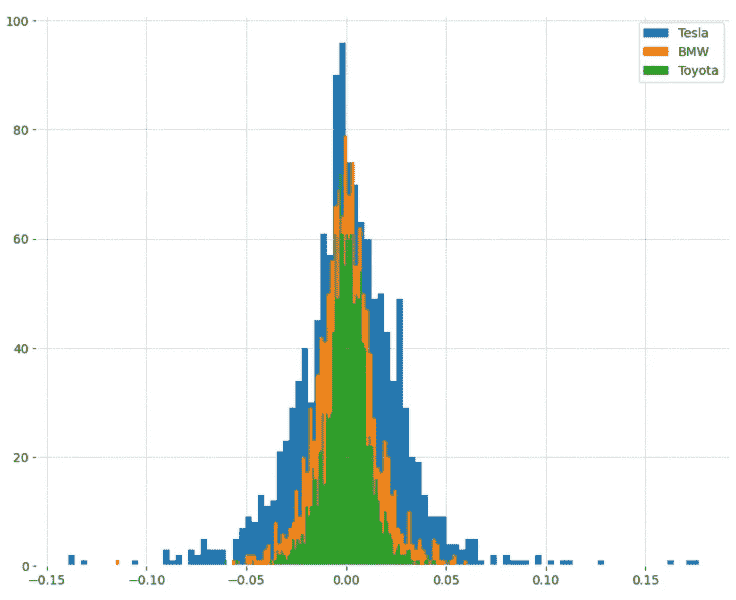

> 从上面的情节可以看出，丰田和宝马有点稳定，但特斯拉有波动性，因为它的分布很广。

我们可以从核密度估计(KDE)图中获得更好的洞察力。

```
toyota['returns'].plot(kind**=**'kde', label**=**'Toyota',figsize**=**(10,8))
bmw['returns'].plot(kind**=**'kde', label**=**'BMW',figsize**=**(10,8))
tesla['returns'].plot(kind**=**'kde', label**=**'Tesla',figsize**=**(10,8))
plt.legend()
```

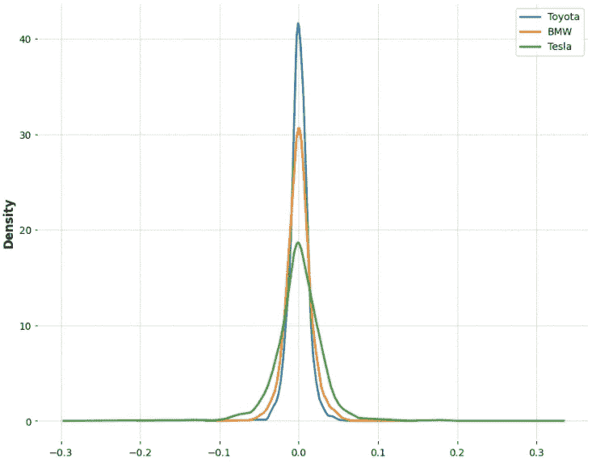

> 从图中可以看出，丰田的分布达到一个峰值，表明与其他两家公司的股票相比，它非常稳定。

现在我们可以比较股票之间的收益来分析它们之间的相关性。这可以通过创建散点图来实现。scatter_matrix 方法是从 pandas 引入的。为了能够创建这个图，我们需要创建一个数据框架，其中的列是每只股票的收益。

```
**from** pandas.plotting **import** scatter_matrixcomp_df **=** pd.concat([toyota['returns'],bmw['returns'],tesla['returns']],axis**=**1)
comp_df.columns **=** ['Toyota returns','BMW returns','Tesla returns']scatter_matrix(comp_df,figsize**=**(8,8),hist_kwds**=**{'bins':100})
```

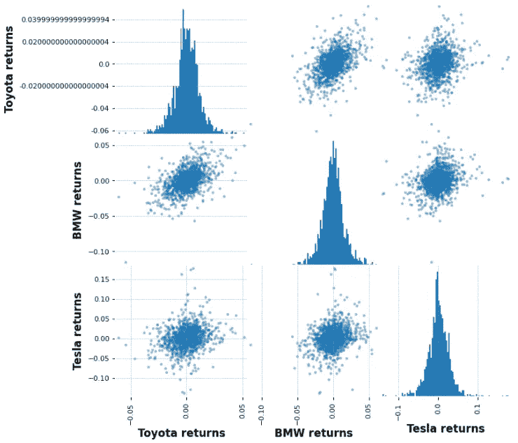

> 我们可以看出宝马和丰田之间存在关联，但特斯拉与任何公司都没有关联。

**累计收益**

现在我们将分析累积收益。累积是指一段时间内数值(此处为存量)的集合。因此，当考虑累积回报时，它是根据投资当天计算的，而不是根据前一天计算的每日回报。如果累计回报率高于 1，则产生利润，否则就是亏损。

公式是:

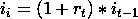

其中 i(t)是时间 t 时的投资，r(t)是时间 t 时的回报。我们将使用熊猫的“cumprod()”方法来计算它。

```
toyota['cumulative return'] **=** (1 **+** toyota['returns']).cumprod()
bmw['cumulative return'] **=** (1 **+** bmw['returns']).cumprod()
tesla['cumulative return'] **=** (1 **+** tesla['returns']).cumprod()
```

现在，我们将绘制累积回报图，看看哪些股票的回报最高。

```
toyota['cumulative return'].plot(label**=**'Toyota',figsize**=**(16,8))
bmw['cumulative return'].plot(label**=**'BMW')
tesla['cumulative return'].plot(label**=**'Tesla')
plt.legend()
```

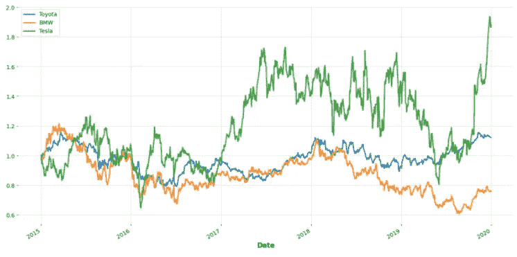

> 我们可以断言，特斯拉的累计回报率最高，而宝马的回报率最低。

我们来到文章的结尾。我希望你了解了如何处理股票数据，也了解了其中的趋势。

> *关于* [*Github*](https://github.com/jayashree8/Finance_Trading_In_Python/blob/main/Car%20stock%20analysis/Car%20stock%20analysis.ipynb) *上的完整代码参考 Jupyter 笔记本。*

> *联系我:* [*LinkedIn*](https://www.linkedin.com/in/jayashree-domala8/)
> 
> *查看我的其他作品:* [*GitHub*](https://github.com/jayashree8)