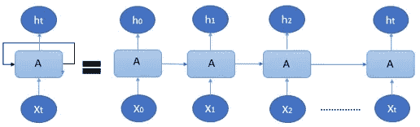
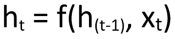
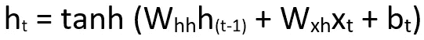

# 传统的递归神经网络——强化学习(1/3)

> 原文：<https://pub.towardsai.net/traditional-recurrent-neural-networks-reinforcement-learning-part-1-3-348aec514bdd?source=collection_archive---------2----------------------->

来源: [Unsplash](https://unsplash.com/photos/8bghKxNU1j0)

## [深度学习](https://towardsai.net/p/category/machine-learning/deep-learning)，[机器学习](https://towardsai.net/p/category/machine-learning)

这个博客将由 3 部分组成，我将解释不同的强化学习算法，

第一部分:传统递归神经网络的解释。第二部分:GRUs 的解释。第 3 部分:LSTMs 的解释。

# **传统递归神经网络(RNN):**

# 简介:

递归神经网络是一种人工神经网络(ANN ),其中前一步骤的输出作为当前步骤的输入。RNN 主要用于预测问题，比如预测天气、股票市场价格，或者根据前面的单词预测句子中的下一个单词。

# 它是如何工作的？？

在了解递归神经网络如何工作之前，让我们了解一下 RNN 中的权重是如何计算的。计算权重的公式如下:

## ***新权重=当前权重—(学习率*梯度)***

**权重**:为了便于理解，我们可以说这些数字在乘以输入后可以预测输出。
**学习率:**假设我们正在接近准确的预测，那么学习率会告诉我们在每次迭代中我们朝着正确的解决方案前进了多少步。
**渐变:**告诉我们朝着正确的解决方案前进的方向。

# **直觉理解 RNN:**

让我们看看如何将我们的思维方式与 RNN 的工作方式联系起来，比如你想为你的家买一台空气冷却器，而你正在阅读一台空气冷却器的产品评论。审查的一个例子如下:

*伟大的产品，耗电更少，让房间保持真正的凉爽。肯定会建议你买，竖起大拇指。*“—{ 1 }

因此，在任何时候，我们的大脑都能记住这样的词:
“*伟大的产品……更少的能量……酷..绝对建议..赞同..*

如果有人问你关于产品的问题，你会说:

这是一款很棒的产品，耗电少，保持室内凉爽，我绝对建议你购买。

现在让我们看看这种直觉是如何在 RNN 的哲学中用数学表达出来的。

# RNN 的数学工作；

在 RNN 中，对于{1}中的句子，首先将单词转换为机器可读的向量，然后算法逐个处理这些向量。

让我们看看 RNN 的画像。

递归神经网络的展开版本

其中，
**‘ht’**是 t 时间步的隐藏状态(这个在我们的句子例子中可以相当于我们对已有单词的记忆，给出一个产品复习)，
**‘A’**是激活(这里指的是 tanh 激活)，
**‘XT’**是在**‘t’**时间步的输入，
**‘t’**是时间步。

该算法考虑第一输入向量 X0，对其进行处理以产生第一隐藏状态 h0，这成为下一层计算下一隐藏状态 h1 的输入，依此类推。因此，隐藏状态充当神经网络存储器，它保存来自前一步骤的数据。

因此，在给定输入的情况下，计算隐藏状态的公式如下:

计算隐藏状态的方程(当前隐藏状态是前一个隐藏状态和输入的函数)。

这进一步用激活函数表示为:

用激活函数和权重计算隐藏状态的扩展形式

其中，
**Whh** 为前一隐藏状态的权重，
**Wxh** 为当前隐藏状态的权重，
**bt** 为偏差。

**tanh** 激活函数确保隐藏状态的值向量保持在-1 到+1 之间，这是因为如果没有 tanh 激活函数，隐藏状态向量中的某些值会变得极高，而其他值会随着信息传递到下一层而保持较低。

**培训流程:**

1 —给定时间步长的输入提供给网络。
2——使用先前状态计算当前输入的当前状态。
3 —当前状态 **ht** 变为下一时间步的隐藏状态**h【t-1】**。
4 —人们可以根据问题陈述计算尽可能多的时间步长，并加入来自先前状态的信息，然而，这导致了消失/爆炸梯度的问题，这将在我关于 LSTMs 的下一篇文章中解释。
5 —一旦所有时间步骤完成，最终隐藏状态用于计算当前输出。
6 —将生成的输出与原始输出进行比较，并计算误差。
7 —该误差被反向传播，以提高精度并计算新的权重。要了解更多关于反向传播的信息，你可以[点击这里](https://medium.com/swlh/artificial-neural-networks-simplified-from-perceptrons-to-backpropagation-ab8b5770ded6)。

这是 RNN 的工作原理，它对短序列非常有效，并且在计算上比长短期记忆网络(LSTM)或门控循环单元(GRU)网络更便宜。

# 递归神经网络的应用；

1 —时间序列异常检测。2 —音乐创作。
3 —单词预测。
4 —人体动作识别。
5 —预测趋势(天气预测、股价预测等)

我希望这篇帖子能给你一些知识和动力，进一步探索深度学习的其他主题。

如果这是有见识的，请用你的**掌声**鼓励。

如果你想更深入地探索递归神经网络并理解其中的数学原理，请参考下面这个知识渊博的博客:

[递归神经网络指南——RNN 深潜——Neptune . ai](https://neptune.ai/blog/recurrent-neural-network-guide)

1 —如果你对**计算机视觉感兴趣，**请查看下面的帖子，我在那里解释了如何开发一个可以执行背景减法的简单代码:

 [## OpenCV 背景减法和视频背景中的音乐

### 我们很多人喜欢旅行，然而，由于封锁，我们不能去我们想去的地方，在这篇文章中…

medium.com](https://medium.com/@shabarish033/opencv-background-subtraction-and-music-in-background-of-video-c8fe10b66bc8) 

2 —如果你有兴趣了解**人工神经网络**和**反向传播**，请查看下面的帖子，我在那里用简单的语言解释了这些概念:

 [## 简化的人工神经网络:从感知器到反向传播

### 这篇文章是我试图解释神经网络的工作原理，我想尽可能简单地通过…

medium.com](https://medium.com/swlh/artificial-neural-networks-simplified-from-perceptrons-to-backpropagation-ab8b5770ded6)