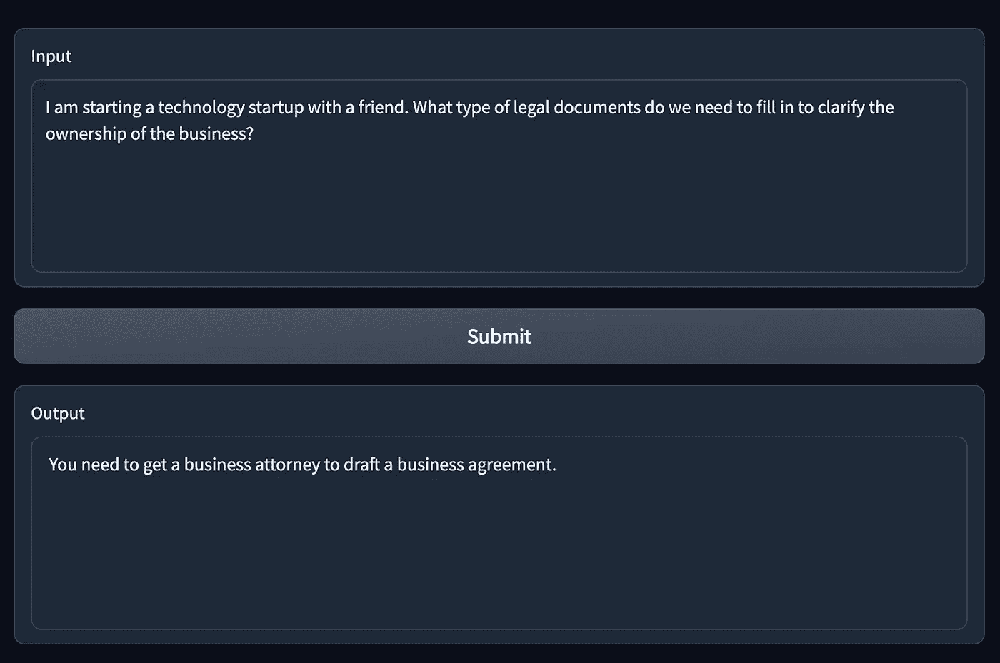
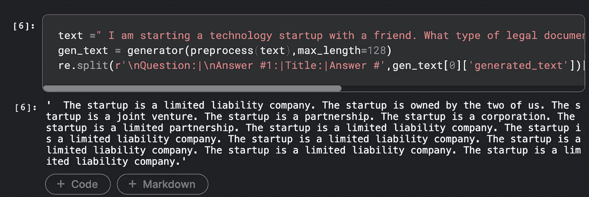
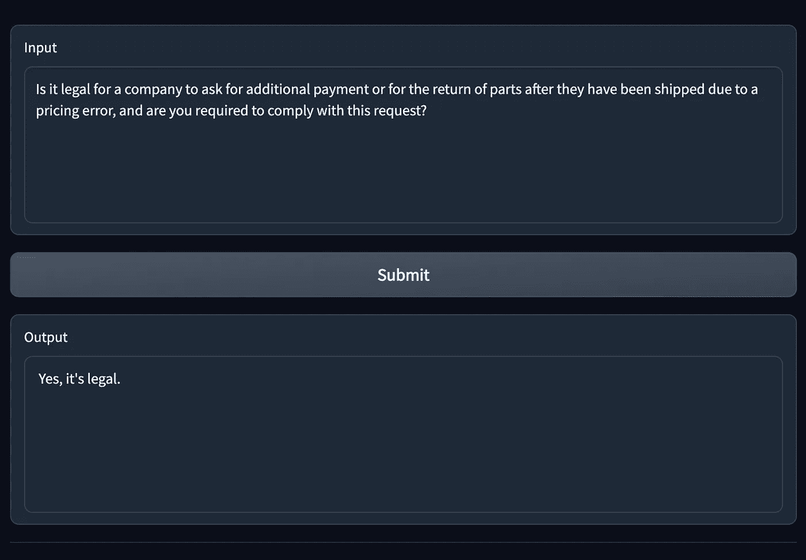
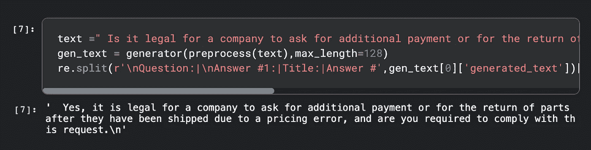
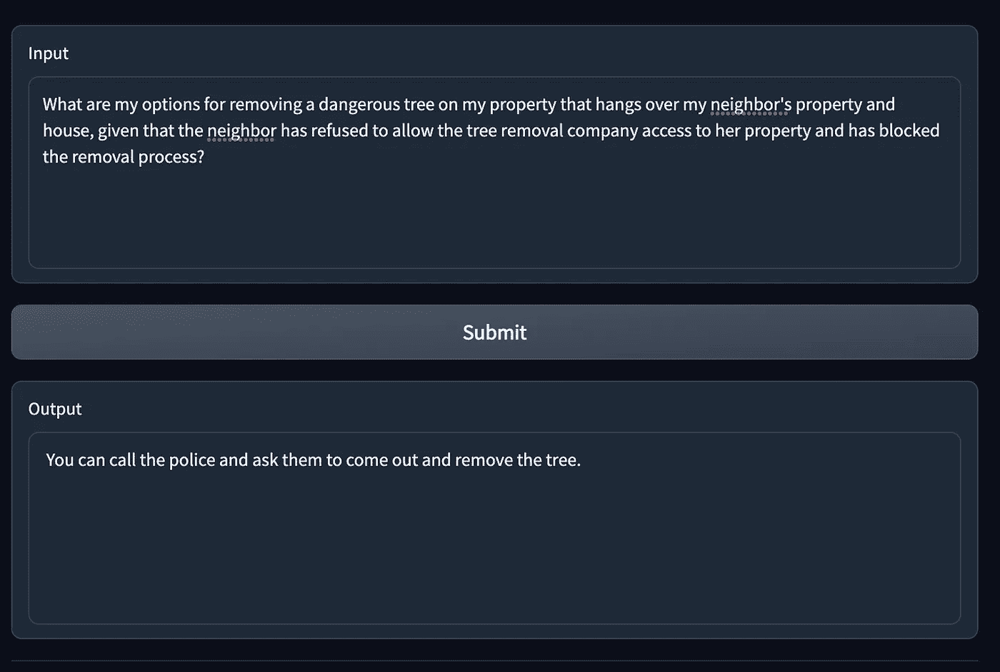
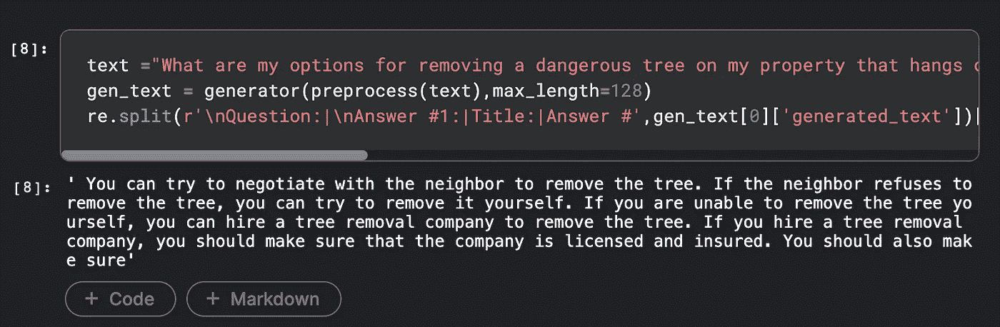
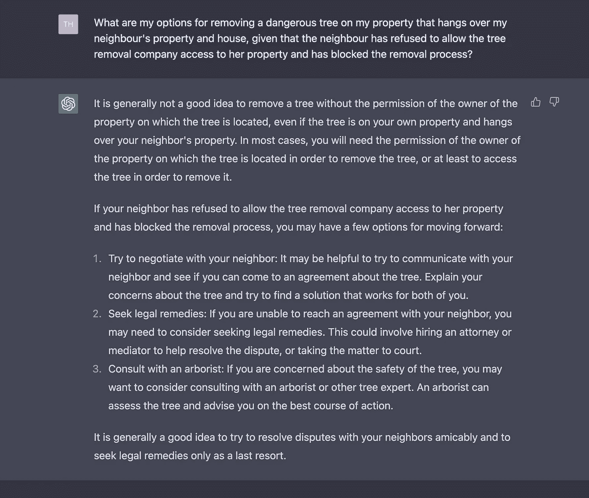

# 训练语言模型以给出(非)法律建议

> 原文：<https://pub.towardsai.net/training-a-large-language-model-to-give-non-legal-advice-b9f6d7d11016?source=collection_archive---------0----------------------->

> 在本文中，我将介绍在法律文本数据集上微调 BLOOM 等大型语言模型的基础知识。你可以在 HuggingFace Spaces 上试试！

我目前正在探索学习使用大型语言模型(LLM)的诀窍。这包括学习如何微调预训练模型，如 OPT 和 BLOOM。

为了继续这个探索，我决定尝试建立一个可以回答法律问题的模型。因此，我在此向您介绍: **BetterCallBloom，**您友好的人工智能法律助理！


[BettercallBLOOM 空间](https://huggingface.co/spaces/tomrb/bettercallbloom)界面截图

在本文中，我将介绍使用 Hugging Face Transformers 库微调大型语言模型所需的步骤，以及使用简单的前端界面部署训练好的模型所需的步骤。

# 布鲁姆模型

这个项目背后的明星是来自 [BigScience initiative 背后令人敬畏的人们的开源 BLOOM 模型。](https://huggingface.co/bigscience)为了促进由私人研究和未发布模型主导的领域中的研究包容性，BLOOM initiative 产生了 176B 参数的完全开源大型语言模型(与其私人竞争对手 OpenAI 的 GPT3 规模相同)。在[拥抱面](https://huggingface.co/bigscience)上有多个检查点。

在一个稍微技术性的层面上，BLOOM 是一个自回归语言模型，它是用一个“只有解码器”的转换器架构为文本生成任务构建的。它是在 ROOTS 语料库上进行预训练的，该语料库由超过 1.6TB 的文本数据构成，包括 46 种自然语言和 13 种编程语言。

# 法律数据集堆

我在*堆法律*数据集上对模型进行了微调，这是一个 256 GB 的法律文本语料库，范围从美国各州代码到律师考试大纲。法律堆*的一个子集*来自于 [r/legal_advice](https://www.reddit.com/r/legaladvice/) 子编辑，用户可以在那里询问简单的法律问题。这个子集对于我们的用例来说很有趣，因为它已经是问答的格式了。

让我们看一个来自 r/legal_advice 子集的原始样本:

```
{'text': 'Title: Landlord broke lease agreement, what are my rights? (Chicago, IL)\nQuestion:Our landlord has been promising us a washer/dryer unit since we moved in (July 2015). When we resigned the lease August 2016, we wrote into the lease that an in-unit washer and dryer would be installed by September 30th 2016.\n\nSince September 30th, there have been continuous delays in getting the W/D installed. Since it has now been almost a month past the date the W/D was supposed to be installed, I am wondering what types of rights as a tenant I have? \n\nThanks ahead of time for any and all advice given.\nAnswer #1: You can let your landlord know in writing that he is in default under the current lease agreement and give him a reasonable timeframe to cure his default.  \n\nIf he fails to correct the default, you can likely end your lease and move.',
 'created_timestamp': '10-25-2016',
 'downloaded_timestamp': '11-09-2021',
 'url': 'https://www.reddit.com/r/legaladvice/comments/59cv5x/landlord_broke_lease_agreement_what_are_my_rights/'}
```

更具体地看“文本”参数，我们可以看到我们有 Reddit 帖子的“标题”,问题，然后是一组 N 个顶级答案。这对我们来说太完美了！我们有一大堆用简单易懂的英语写的问答，我们可以据此微调我们的模型。

数据集托管在 Huggingface 数据集上，我们可以用一行程序下载它:

```
from datasets import load_dataset

dataset = load_dataset("pile-of-law/pile-of-law",'r_legaladvice')
```

# 微调布鲁姆-3B

因为我没有沉溺于无限计算，所以我将自己限制在 3B 参数 BLOOM 检查点，这可以使用 HuggingFace 的 *transformers* 库轻松下载:

```
from transformers import BloomTokenizerFast, BloomForCausalLM
tokenizer = BloomTokenizerFast.from_pretrained("bigscience/bloom-3b")
model = BloomForCausalLM.from_pretrained("bigscience/bloom-3b")
```

我们将在因果语言建模任务中对 BLOOM 进行微调，在该任务中，模型必须根据过去的标记来预测句子中的下一个标记。为此，我们需要准备数据集，以便创建对应于单个序列的输入文本的“块”。

我们将基于 HuggingFace 团队提供的优秀示例笔记本，对 [GitHub](https://github.com/huggingface/notebooks/blob/main/examples/language_modeling.ipynb) 上可用的语言模型进行微调。

我们首先从每个样本中移除 URL 和时间戳，并标记文本字段。我们可以使用 *dataset.map* 函数高效地将函数应用于多线程数据集:

```
def tokenize_function(examples):
    return tokenizer(examples["text"])

tokenized_dataset = dataset.map(tokenize_function, 
                                batched=True, 
                                num_proc=8, 
                                remove_columns=["text","created_timestamp","downloaded_timestamp","url"])
```

接下来，我们创建文本“块”,这些文本将代表我们独特的令牌序列。块大小可以根据 GPU 上可用的 VRAM 进行调整。

```
block_size = 128
def group_texts(examples):
    # Concatenate all texts.
    concatenated_examples = {k: sum(examples[k], []) for k in examples.keys()}
    total_length = len(concatenated_examples[list(examples.keys())[0]])
    # We drop the small remainder, we could add padding if the model supported it instead of this drop, you can
        # customize this part to your needs.
    total_length = (total_length // block_size) * block_size
    # Split by chunks of max_len.
    result = {
 k: [t[i : i + block_size] for i in range(0, total_length, block_size)]
        for k, t in concatenated_examples.items()
    }
    result["labels"] = result["input_ids"].copy()
    return result

lm_datasets = tokenized_dataset.map(
    group_texts,
    batched=True,
    batch_size=1000,
    num_proc=8,
)
```

数据集预处理到此结束！像 hugging face*transformers&datasets*这样的现代库提供了惊人的抽象程度。

你猜怎么着？

培训更加简单:

```
trainer = Trainer(
    model=model,
    args=training_args,
    train_dataset=lm_datasets["train"],
    eval_dataset=lm_datasets["validation"],
)
```

我将为您保存一些在 *training_args* 中定义的训练参数(详见 GitHub 中的代码)，但就是这么简单。训练器 API 将在 r/legal device 的训练数据集上运行 3 个时期的训练。

该模型在具有 40GB VRAM 的 A-100 上训练，这允许我对 200 个样本和 16 个批量使用 block_size。使用这些设置，在单个 A100 上进行 3 个时期的微调大约需要 26 个小时。

在[支撑面](https://huggingface.co/tomrb/bettercallbloom-3b)上可以获得训练后的重量。

# 使用 Huggingface 空间和 Gradio 部署模型

为了构建一个与模型交互的快速界面，我使用了 Gradio，并使用廉价的 CPU 升级将模型托管在 HuggingFace Spaces 上，以便模型适合 RAM 内存。

为了让模型正常运行，我们需要做一点提示，以便输入与 Reddit 数据样本的格式相同:

```
tokenizer = BloomTokenizerFast.from_pretrained("tomrb/bettercallbloom-3b")
model = BloomForCausalLM.from_pretrained("tomrb/bettercallbloom-3b",low_cpu_mem_usage=True)

generator = pipeline('text-generation', model=model, tokenizer=tokenizer,do_sample=False)

def preprocess(text):
    #We add 'Question :' and 'Answer #1:' at the start and end of the prompt
    return "\nQuestion: " + text + "\nAnswer #1:"

def generate(text):

    preprocessed_text = preprocess(text)
    result = generator(preprocessed_text, max_length=128)
    output = re.split(r'\nQuestion:|Answer #1:|Answer #|Title:',result[0]['generated_text'])[2]

    return output
```

在加载我们的模型和标记器之后，预处理函数将在输入问题的前面添加一个“\nQuestion:”并在末尾添加一个“\ n 答案#1:”。这可以防止模型试图继续提问，并提示它立即生成答案。

然后，generate 函数简单地将预处理后的输入传递给模型，然后应用 regex split 函数提取模型生成的第一个答案。

我用下面的代码片段构建了一个非常简单的 Gradio 前端:

```
with gr.Blocks() as demo:

  input_text = gr.Textbox(label="Input", lines=6)  
  buton = gr.Button("Submit ")  
  output_text = gr.Textbox(lines=6, label="Output")
  buton.click(generate, inputs=[input_text], outputs=output_text)  

demo.launch(enable_queue=True, debug=True)
```

瞧！我们现在在 PileOfLaw 的 r/legal_advice 子数据集上有了一个微调版的布鲁姆-3B，它由 HuggingFace spaces 上的公共前端托管。相当整洁！

让我们尝试几个样本，看看模型的表现如何。

# 微调模型的定性性能

我们将比较 BetterCallBloom-3b 和 Vanilla Bloom-3b(基本 Bloom-3b)的答案。

> 问题 1:
> 我和一个朋友正在创业。我们需要填写什么类型的法律文件来澄清企业的所有权？

贝特尔·布鲁姆-3B:



香草绽放-3B:



> 问题 2:
> 由于定价错误，一家公司要求额外付款或在零件发运后要求退回零件是否合法，您是否需要遵守这一要求？

贝特卡尔布鲁姆-3B



香草绽放-3b:



> 问题 3:
> 鉴于邻居拒绝让树木移除公司进入其房产并阻止移除过程，我有什么办法移除悬挂在邻居房产和房屋上的危险树木？

贝特卡尔布鲁姆-3B



香草绽放-3b:



现在我不知道这些答案在法律上是否站得住脚，但我们仍然可以提出两点有趣的看法。香草布卢姆-3B 有重复自己的趋势，而它的微调版本没有。其次，BetterCallBloom 的回答总体来说非常简短，这可能是 r/legal_advice top answers 的一个特点。

在看到 ChatGPT 等大型模型的惊人能力后，答案的整体质量很差，不是预期的那样。以下是 ChatGPT 对问题 3 的回答示例:



ChatGPT 的零炮回答质量之高令人瞠目结舌！

然而，我们需要记住，来自 OpenAI 的 GPT 家族超过 175B 个参数(比 BetterCallBloom-3B 大 50 倍)，并且指令根据人类反馈进行微调，以确保更好的对齐和更高质量的结果。

在第二篇后续文章中，我将尝试用更大的模型扩展 BetterCallBloom，并研究开源指令微调模型，如谷歌的 [Flan-T5](https://huggingface.co/google/flan-t5-base) 。为了支持和帮助我发布 cool open finetuned 模型和应用程序，请按这里的按钮给我买杯咖啡吧！

[](https://www.buymeacoffee.com/thomasrb)

与此同时，您可以在 [GitHub](https://github.com/ThomasRochefortB/bettercallbloom) 上随意查看微调和演示前端接口的代码。你也可以在[拥抱脸空间](https://huggingface.co/spaces/tomrb/bettercallbloom)或者 [Kaggle 笔记本](https://www.kaggle.com/thomasrochefort/bettercallbloom-3b)上试试。另外，你可以在推特上关注我，了解我最新的项目。

# 参考资料:

[1] Scao，Teven Le 等，“BLOOM:一个 176B 参数的开放存取多语言语言模型”arXiv 预印本 arXiv:2211.05100 (2022)。

[2] Henderson，Peter 等人，“法律堆:从法律和 256GB 开源法律数据集学习负责任的数据过滤”arXiv 预印本 arXiv:2207.00220 (2022)。