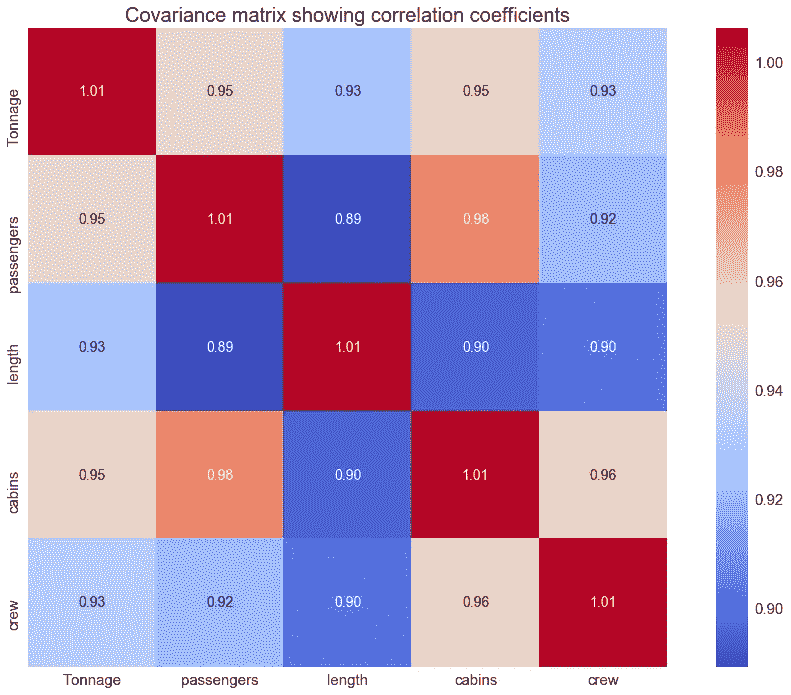
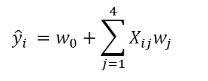
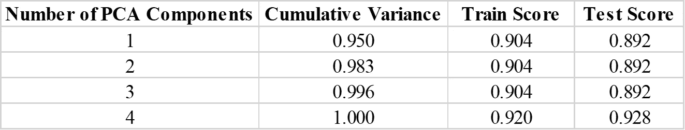

# 在具有高度相关特征的数据集上训练机器学习模型

> 原文：<https://pub.towardsai.net/training-a-machine-learning-model-on-a-dataset-with-highly-correlated-features-debddf5b2e34?source=collection_archive---------0----------------------->

## [机器学习](https://towardsai.net/p/category/machine-learning)



在上一篇文章中( [**使用协方差矩阵图进行特征选择和降维**](https://medium.com/towards-artificial-intelligence/feature-selection-and-dimensionality-reduction-using-covariance-matrix-plot-b4c7498abd07) )，我们已经展示了协方差矩阵图可以用于特征选择和降维。

使用游轮数据集[**cruise _ ship _ info . CSV**](https://github.com/bot13956/ML_Model_for_Predicting_Ships_Crew_Size)**，**我们发现，在 6 个预测特征[' **年龄**'、**吨位**'、**乘客**'、**长度**'、**舱室**、**乘客密度** ]中，如果我们假设重要特征具有相关系数 那么目标变量“**乘员**”与 4 个预测变量:“**吨位**”、“**乘客**”、“**长度**、“**车厢**”强相关。

因此，我们能够将特征空间的维数从 6 降低到 4。

现在，假设我们想在新的特征空间上建立一个模型来预测船员变量。我们的模型可以用以下形式表示:



其中 **X** 为特征矩阵， **w** 为训练时需要学习的权重。

查看特征之间的协方差矩阵图，我们发现特征(预测变量)之间有很强的相关性，见上图。

# 我们如何处理特征之间的相关性问题？

在本文中，我们将使用一种称为**主成分分析(PCA)** 的技术将我们的特征转换到特征独立或不相关的空间中。然后，我们将在 PCA 空间上训练我们的模型。你可以从这篇文章中了解到更多关于 PCA 的知识: [**机器学习:通过主成分分析进行降维**](https://medium.com/towards-artificial-intelligence/machine-learning-dimensionality-reduction-via-principal-component-analysis-1bdc77462831) **。**

# 在 PCA 空间上训练模型

## 1.导入必要的库

```
import numpy as np
import pandas as pd
import matplotlib.pyplot as plt
import seaborn as sns
```

## 2.读取数据集并显示列

```
df=pd.read_csv("cruise_ship_info.csv")
df.head()
```


## 3.选择重要变量(列)

```
cols_selected = ['Tonnage', 'passengers', 'length', 'cabins','crew']

df[cols_selected].head()
```


## 4.将数据划分为训练集和测试集

```
from sklearn.model_selection import train_test_split
X = df[cols_selected].iloc[:,0:4].values     
y = df[cols_selected]['crew']X_train, X_test, y_train, y_test = train_test_split( X, y, test_size=0.4, random_state=0)
```

## 5.在 PCA 空间上建立多元线性回归模型

```
from sklearn.preprocessing import StandardScaler
from sklearn.decomposition import PCA
from sklearn.linear_model import LinearRegression
from sklearn.pipeline import Pipeline
from sklearn.metrics import r2_scoretrain_score = []
test_score = []
cum_variance = []for i in range(1,5):
    X_train, X_test, y_train, y_test = train_test_split( X, y, test_size=0.4, random_state=0)
    y_train_std = sc_y.fit_transform(y_train[:, np.newaxis]).flatten()

    pipe_lr = Pipeline([('scl', StandardScaler()),
                        ('pca', PCA(n_components=i)),
                        ('slr',   LinearRegression())])     pipe_lr.fit(X_train, y_train_std) y_train_pred_std = pipe_lr.predict(X_train)
    y_test_pred_std = pipe_lr.predict(X_test)
    y_train_pred=sc_y.inverse_transform(y_train_pred_std)
    y_test_pred=sc_y.inverse_transform(y_test_pred_std) train_score = np.append(train_score, 
                            r2_score(y_train, y_train_pred)) test_score = np.append(test_score, 
                           r2_score(y_test, y_test_pred)) cum_variance = np.append(cum_variance, np.sum(pipe_lr.fit(X_train, y_train).named_steps['pca'].explained_variance_ratio_))
```

**以下是 PCA 空间回归模型的输出:**



**组件重要性总结。**

基于这一总结，我们看到 95%的方差仅由第一主成分贡献。这意味着在最终模型中，只有第一主成分 PC1 可以被使用，因为其他 3 个成分 PC2、PC3 和 PC4 只贡献了总方差的大约 5%。

PCA 降维对于具有 4 个特征的数据集来说似乎没什么大不了的，但是对于具有数百甚至数千个特征的复杂数据集来说，PCA 可以是一个强大的工具，可用于移除特征之间的相关性，并有助于减少模型训练、测试和评估的计算时间。

总之，我们已经展示了如何使用 python 的 sklearn 包和游轮数据集实现 PCA 算法。主成分分析是一种非常强大的建模工具，尤其是在处理具有高度相关特征的复杂数据集时。您可以在 [**Github**](https://github.com/bot13956/ML_Model_for_Predicting_Ships_Crew_Size) 上下载本文的完整数据集和代码。

# 参考

1.  拉什卡、塞巴斯蒂安和瓦希德·米尔贾利利**。** *Python 机器学习，第二版*。Packt 出版公司，2017 年。
2.  Benjamin O. Tayo，*预测船只船员规模的机器学习模型*，[https://github . com/bot 13956/ML _ Model _ for _ Predicting _ Ships _ Crew _ Size](https://github.com/bot13956/ML_Model_for_Predicting_Ships_Crew_Size)。