# 训练人工智能从文本中预测迈尔斯-布里格斯性格类型

> 原文：<https://pub.towardsai.net/training-ai-to-predict-myers-briggs-personality-types-from-texts-d4e3d7baf17?source=collection_archive---------0----------------------->

## [数据科学](https://towardsai.net/p/category/data-science)

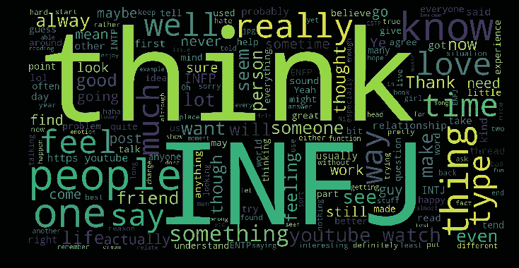

我上大学时，经常看《吉尔莫女孩》，这是一部由埃米·谢尔曼·帕拉迪诺创作、劳伦·格拉汉姆和阿丽克西斯·布莱德尔主演的美国喜剧连续剧。我看了 7 季，加上 2016 年上映的续集。

我喜欢不同性格的人物组合。我是罗里·吉尔摩和洛根·亨茨伯格的超级粉丝！


因此，我找到了一个很好的数据集来玩， ***Myers-Briggs 16 种性格类型*** ，我可以用它来训练一个模型，检测文本中不同类型的性格，甚至更好的是，在 Gilmore Girls 角色上测试它，以预测他们的性格！

# 迈尔斯-布里格斯 16 种人格类型

根据迈尔斯布里格斯基金会的数据，伊莎贝尔布里格斯和凯瑟琳库克布里格斯在卡尔荣格的基础上创造了 16 种性格类型，这四种性格类型可以用来对人进行分类:

*   内向与外向
*   感觉与直觉
*   思维与感觉
*   判断与感知

下面，我列出了关键维度和 16 种不同的人格类型:

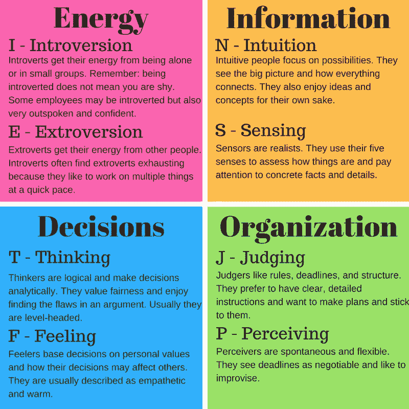

ISTJ 安静、严肃，以彻底性和可靠性赢得成功。踏实，就事论事，实事求是，负责任。理性地决定应该做什么，不管分心，坚定地朝着它努力。以让一切井然有序为乐——他们的工作，他们的家庭，他们的生活。重视传统和忠诚。

**ISFJ (** 养育者)
安静、友善、负责、尽责。坚定不移地履行自己的义务。彻底、细致、准确。忠诚，体贴，注意并记住对他们重要的人的细节，关心他人的感受。努力创造一个有序和谐的工作和家庭环境。

**INFJ (** 谋士)
在观念、关系和物质财富中寻找意义和联系。想了解是什么激励着人们，并对他人有深刻的见解。尽职尽责并致力于他们坚定的价值观。对如何最好地服务于公共利益有一个清晰的认识。有组织和果断地实现他们的愿景。

**INTJ(**)
对实现自己的想法和目标有独到的见解和巨大的动力。快速发现外部事件的模式，并开发长期的解释性视角。一旦承诺，组织一项工作并坚持到底。怀疑和独立，对自己和他人都有很高的能力和表现标准。

**【工匠】
宽容而灵活，安静地观察直到问题出现，然后迅速行动找到可行的解决方案。分析是什么让事情起作用，并通过大量的数据找出实际问题的核心。对因果感兴趣，使用逻辑原则组织事实，重视效率。**

****ISFP (** 作曲家)
安静、友好、敏感、善良。享受当下，享受身边发生的一切。喜欢有自己的空间，在自己的时间框架内工作。对他们的价值观和对他们来说重要的人忠诚。不喜欢分歧和冲突，不把自己的观点或价值观强加给别人。**

**INFP ( 理想主义者)
理想主义者，忠于自己的价值观和对自己重要的人。想要一个符合他们价值观的外部生活。好奇心强，能快速发现可能性，是实现想法的催化剂。寻求理解他人并帮助他们发挥潜力。适应性强，灵活，接受，除非价值观受到威胁。**

**INTP ( 《思想者】)
寻求对他们感兴趣的一切事物做出合乎逻辑的解释。理论和抽象，对思想比对社会交往更感兴趣。安静、包容、灵活、适应性强。具有非凡的能力，能够深入专注地解决自己感兴趣领域的问题。怀疑，有时批判，总是分析。**

****ESTP (** 实干家)
灵活而宽容，他们采取注重立竿见影效果的务实方法。理论和概念性解释让他们厌烦——他们想积极行动起来解决问题。专注于此时此地，自发的，享受每一刻，他们可以与他人积极。享受物质享受和时尚。通过实践学习效果最好。**

****ESFP (** 表演者)
外向、友好、乐于接受。对生活、人民和物质享受充满热情的爱好者。享受与他人一起工作，让事情发生。给他们的工作带来常识和现实的方法，让工作变得有趣。灵活和自发，容易适应新的人和环境。通过与他人一起尝试一项新技能来获得最佳学习效果。**

****ENFP (** 冠军)
热情洋溢，富有想象力。将生活视为充满可能性。非常迅速地在事件和信息之间建立联系，并根据他们看到的模式自信地继续下去。想要别人的很多肯定，欣然给予欣赏和支持。自发和灵活，往往依靠他们的随机应变能力和他们的语言流利。**

****ENTP** (远见卓识)
敏捷、巧妙、刺激、机警、直言不讳。善于解决新的挑战性问题。擅长产生概念上的可能性，然后战略性地分析它们。善于读懂别人。对常规感到厌倦，很少以同样的方式做同样的事情，容易转向一个又一个新的兴趣。**

****ESTJ (** 监制)
实事求是，实事求是。果断、迅速地采取行动实施决策。组织项目和人员来完成工作，集中精力以最有效的方式获得结果。注意日常细节。有一套清晰的逻辑标准，系统地遵循它们，并希望别人也这样做。坚决执行他们的计划。**

****ESFJ (** 提供者)
热心、尽责、合作。希望他们的环境和谐，努力建立和谐。喜欢与他人合作，准确并按时完成任务。忠诚，即使在小事情上也坚持到底。注意别人在日常生活中需要什么，并努力提供。希望因自己的身份和贡献而受到赏识。**

**ENFJ ( 给予者)
热情、善解人意、有求必应、有责任心。高度适应他人的情感、需求和动机。发现每个人的潜力，想帮助别人实现他们的潜力。可能成为个人和团体成长的催化剂。忠诚，对表扬和批评有反应。善于交际，在团队中为他人提供便利，并提供鼓舞人心的领导力。**

****ENTJ** (指挥官)
坦率、果断，承担领导责任毫不迟疑。快速发现不合逻辑和低效的程序和政策，开发和实施全面的系统来解决组织问题。享受长期规划和目标设定。通常见多识广，博览群书，乐于扩展自己的知识并将其传授给他人。强有力地表达他们的想法。**

# **可以训练人工智能从文本中识别这些类型的个性吗？**

**这可能不是第一次有人这样尝试。事实上，我找到了一些关于实现这种想法的论文，但是解决的方法不同。其中之一是由安娜·卡罗琳娜 E.S 利马和莱安德罗·努内斯德卡斯特罗在名为*“一种应用于社交媒体个性预测的多标签、半监督分类方法”*的论文中提出的。他们提出了一个用三种机器学习算法训练的系统:朴素贝叶斯分类器、支持向量机和多层感知器神经网络。该系统被用于预测来自三个数据集的推文的个性，并获得了 83%的准确率。**

**为了保持相同的本质，我将使用自然语言处理(NLP)技术和 **fastai** 库的文本模块创建一个模型，因为它包含了定义适合各种 NLP 任务的数据集的所有必要函数，并快速生成可以理解人类语言的模型。**

# **(MBTI) Myers-Briggs 个性类型数据集**

**和往常一样，我找到了一个有趣的数据集来做这个实验:**(MBTI)Myers-Briggs 人格类型数据集”，**其中包含了 8600 多行数据，每一行上都是一个人的:**

*   **类型(此人 4 个字母的 MBTI 代码/类型)**
*   **他们最近发布的 50 个内容的一部分(每个条目由“| | |”(3 个竖线字符)分隔)**

**让我们来看看数据:**

**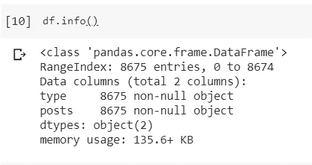**

**我们没有空值，太好了。**

****哪个班的样品多？****

**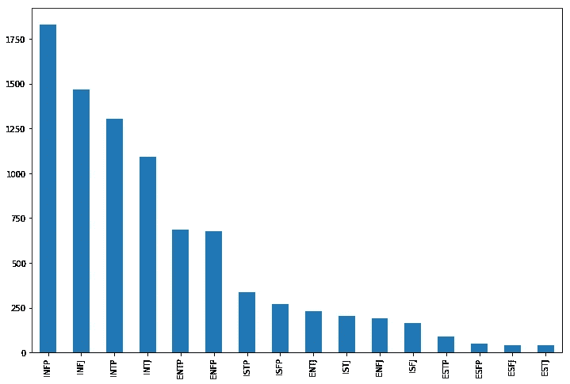**

**从图中可以看出，**‘INFP’，‘INFJ’，‘INTP’**和**‘INTJ’**是数据集中样本较多的类。**

**让我们来看看一些性格类型中最流行的词:**

**具有 **INFP** 性格类型的人会用这些词:**

**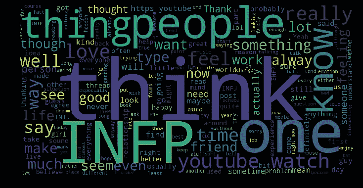**

**INFJ:**

****

**INTP:**

**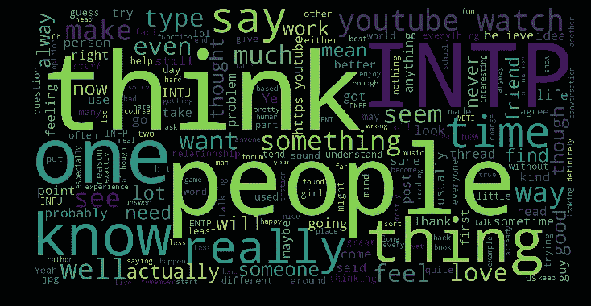**

**ENTJ:**

**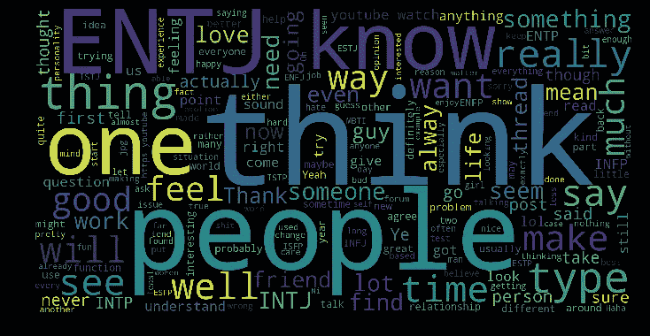**

**ENFJ:**

**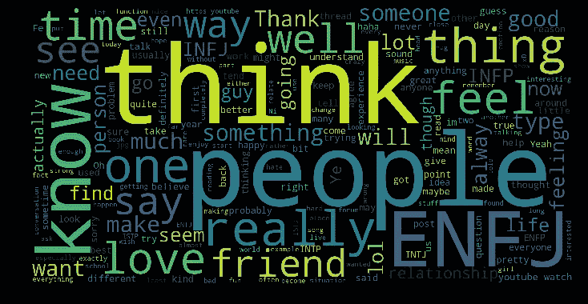**

# **用 FastAI 进行多类分类**

**我们有一个多类分类问题，也称为多项式分类器，可以区分两个以上的类。这也将是一项 NLP 任务，因此使用预先训练的最先进的深度学习模型并对其进行调整以服务于我们的目的将有很大帮助，您可能知道这被称为**迁移学习。**我们不需要从零开始训练一个模型，这可能是缓慢而密集的！**

**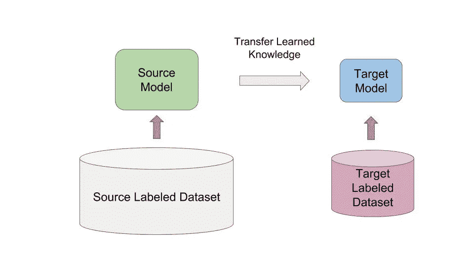**

**接下来要做的是创建模型:语言模型和分类器:**

```
**# Language model data**
data_lm = TextLMDataBunch.from_csv(path, 'personality.csv')
**# Classifier model data**
data_clas = TextClasDataBunch.from_csv(path, 'personality.csv', vocab=data_lm.train_ds.vocab, bs=32)
```

**在文本预处理之后，我们保存结果:**

```
data_lm.save('data_lm_export.pkl')
data_clas.save('data_clas_export.pkl')
```

**我们现在加载之前保存的内容:**

```
data_lm = load_data(path, 'data_lm_export.pkl')
data_clas = load_data(path, 'data_clas_export.pkl', bs=16)
```

**我们创建了一个学习者来开始培训:**

```
learn = language_model_learner(data_lm, AWD_LSTM, drop_mult=0.5)
learn.fit_one_cycle(1, 1e-2)
```

**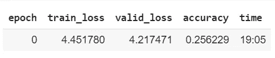**

**我们再次训练:**

```
learn.unfreeze()
learn.fit_one_cycle(1, 1e-3)
```

**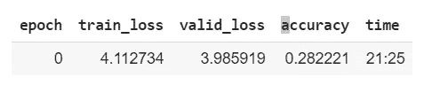**

**再一次…**

```
learn.unfreeze()
learn.fit_one_cycle(1, slice(2e-3/100, 2e-3))
```

**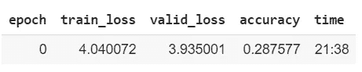**

**让我们在语言模型中做一些预测，看看我们会得到什么:**

```
learn.predict("If all these things should", n_words=10)**'If all these things should be done , it would be shocking or pointless to'**
```

**让我们为我们的分类器保存模型:**

```
learn.save_encoder('ft_enc')
```

**现在，是时候为我们的分类器模型创建一个学习者对象了:**

```
learn = text_classifier_learner(data_clas, AWD_LSTM, drop_mult=0.5)
learn.load_encoder('ft_enc')
```

**如果您对数据的外观感到好奇，让我们看看前几行:**

```
data_clas.show_batch()
```

**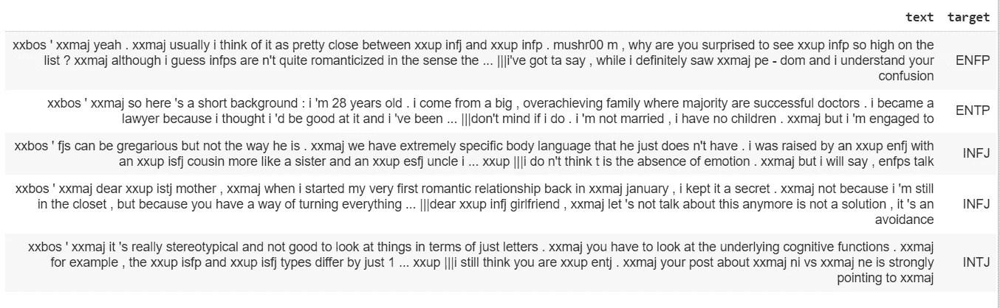**

**现在，是时候训练分类器模型了！**

```
learn.fit_one_cycle(1, 1e-2)
```

**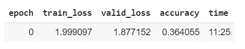**

**我们可以解冻模型并对其进行微调，以获得更好的准确性:**

```
learn.freeze_to(-2)
learn.fit_one_cycle(1, slice(5e-3/2., 5e-3))
```

**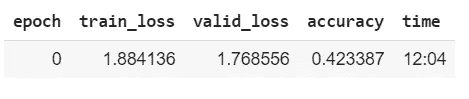**

```
learn.unfreeze()
learn.fit_one_cycle(1, slice(2e-3/100, 2e-3))
```

**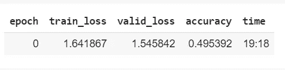**

# **预测吉尔莫女孩的性格**

**让我们从罗里·吉尔摩开始:**

*   ***“11 点之前没有什么让我兴奋”***
*   ***“我今天真的很讨厌所有人，包括我自己”***
*   **“这是艾薇儿·拉维尼的世界。我们只是生活在其中”**
*   ***“大学不仅仅是一个疯狂、狂野、缺乏睡眠的享乐主义社会”***
*   **“我的书看起来很悲伤。书能看起来悲伤吗？”**
*   ***“我会吃到那个的”***
*   **“屁股脸恶棍！”**
*   **没有。我只是到哪里都带着一本书。这只是习惯”**

**挑了这个:**

```
learn.predict("**Hey,  I’m not looking for social contacts. I have friends. I’m fine**")
```

**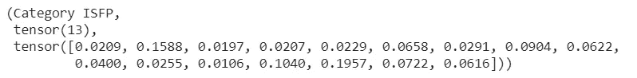**

**我们的模型预测，罗里·吉尔摩有一种性格类型:我**尝试、感知、感受、感知(ISFP)** 。你可以阅读下面的完整描述:**

***安静、友好、敏感、善良。享受当下，享受身边发生的一切。喜欢有自己的空间，在自己的时间框架内工作。对他们的价值观和对他们来说重要的人忠诚。不喜欢分歧和冲突，不把自己的观点或价值观强加给别人。***

**哇！我一直以为 Rory 很矜持很安静。我同意这种人希望有自己的空间:**

****

**我认为这是准确的，罗里总是欣赏她的朋友，并对他们忠诚。她总是回避问题，一个中立的人，所以，我同意她不喜欢分歧和冲突。**

**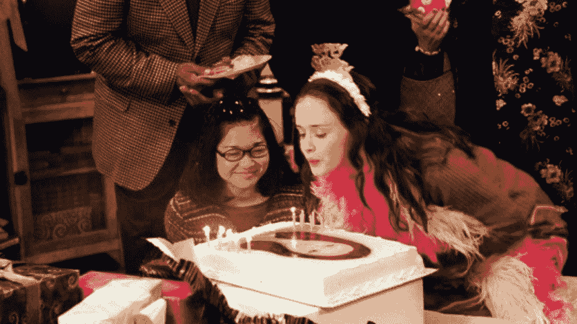**

**现在，让我们试试洛根·亨茨伯格的模型:**

****

*   ***不，那是我希望你从现在开始叫我的名字***
*   **这是你的选择王牌。人可以活一百年，却没有真正活过一分钟。你和我一起爬上来，你就少活了一分钟**
*   **会很有趣，会很刺激。一些愚蠢的事情，对你不好的事情。只是有些不同**
*   **如果我看到我这样做，我会狠狠揍我一顿**
*   ***哇！原来这就是努力的感觉。显然，我一直在回避它是有原因的***

**选择了这条线:**

```
learn.predict("***It’ll be fun, it’ll be a thrill. something stupid, something bad for you. Just something different****")* 
```

**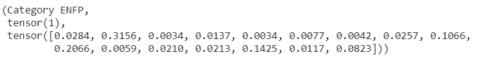**

**模型说洛根有这种人格类型:**外向、直觉、感觉、感知(INFP)。****

***热烈热情，富有想象力。将生活视为充满可能性。非常迅速地在事件和信息之间建立联系，并根据他们看到的模式自信地继续下去。想要别人的很多肯定，欣然给予欣赏和支持。自发和灵活，往往依靠他们的随机应变能力和他们的语言流利。***

**我非常同意这个结果！洛根是一个热情的角色。但他总是非常支持 Rory。作为生死旅的一员，他做了许多愚蠢又冒险的事情。所以我同意他是世界上那种自发的人。他也是演讲大师！**

****

**我不是心理学家，也不打算成为。这些是我得到的见解，我认为它们很棒！。你可以尝试使用相同的数据集，对不同的文本进行预测！**

# **参考**

**[https://www . Myers Briggs . org/my-MBTI-personality-type/MBTI-basics/the-16-MBTI-types . htm？bhcp=1](https://www.myersbriggs.org/my-mbti-personality-type/mbti-basics/the-16-mbti-types.htm?bhcp=1)**