# 使用 TensorFlow 的对象检测 API 和自定义数据集训练更快的 R-CNN

> 原文：<https://pub.towardsai.net/training-faster-r-cnn-using-tensorflow-object-detection-api-with-a-custom-dataset-88dd525666fd?source=collection_archive---------0----------------------->

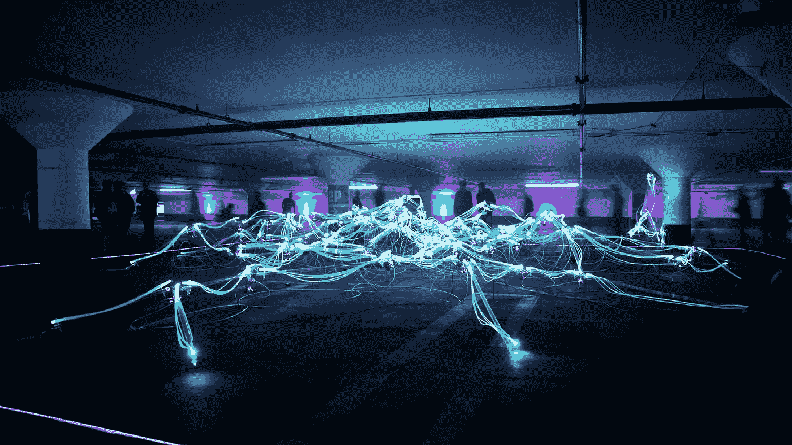

来源:马里乌斯·马萨拉尔在 [Unsplash](https://unsplash.com/photos/CyFBmFEsytU) 上拍摄的照片

## [计算机视觉](https://towardsai.net/p/category/computer-vision)，[社论](https://towardsai.net/p/category/editorial)

## 使用自定义数据集通过 TensorFlow 训练更快的 R-CNN 进行对象检测的分步教程

**作者:**布斯·任亚·泰京

[](https://members.towardsai.net/) [## 加入我们吧↓ |面向人工智能成员|数据驱动的社区

### 向着 AI 加入。通过成为会员，你不仅将支持人工智能，但你将有机会…

members.towardsai.net](https://members.towardsai.net/) 

R 最近，对象检测从其当前状态继续发展，并且由于其技术，几乎可以在每个技术平台上找到它。无论是通过图像分类、识别，还是定位，这些都是基于**物体检测**。

[**卷积神经网络**](https://news.towardsai.net/cnn)(CNN)通过融入深度学习和计算机视觉方法，可以将许多物体识别和分类技术汇集在一起。在计算机视觉中，**卷积神经网络，**顾名思义，在数据集中的每个像素图像中应用一个卷积层。

由于计算机视觉和其初级结构中的 [**深度学习**](https://news.towardsai.net/dl) 基础，CNN 通过将我们指定的过滤器移动到图像上来逐步获得不同的输出层。

> “我们可以建立一个更加光明的未来，在这个未来，人类可以利用人工智能的能力摆脱卑微的工作。”
> 
> ~吴恩达

# 什么是更快的 R-CNN？

基本上，卷积神经网络对样本图像执行基于像素的卷积过程。**更快 R-CNN** ，物体识别算法之一，是 R-CNN [**网络类型**](https://news.towardsai.net/dnn) 之一。R-CNN 是基于区域的 [**CNN**](https://news.towardsai.net/cnn) 网络类型。

随着时间的推移，已经看到，即使是 R-CNN 或者甚至是快速 R-CNN 在性能和准确性方面也是不够的。为了忽略可能负面影响性能的原因，需要并获得执行更快的神经网络。

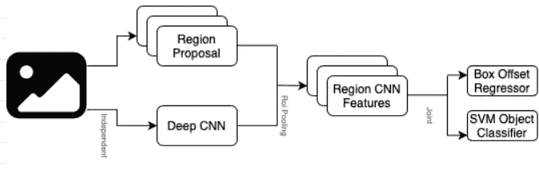

图 1:快速 R-CNN 的架构。

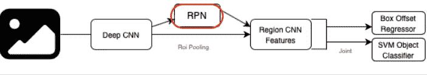

图 2:更快的 R-CNN 的架构。

卷积层没有显著变化。在快速 R-CNN 网络中，区域建议值变成了具有更快 R-CNN 的区域建议网络。

快速 RCNN 是最常用于对象识别和图像识别的 CNN 网络之一，比 RCNN 和快速 RCNN 工作得更好。

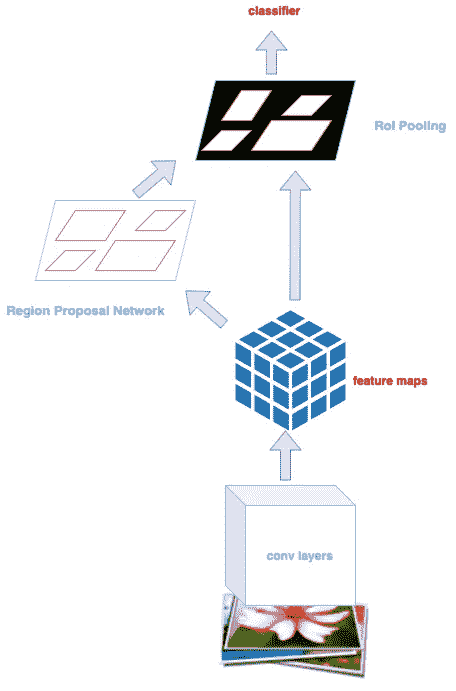

图 3:更快的 R-CNN 架构。

> 更快的 R-CNN 是一种通过提取图像特征和最小化图像分析的噪声来实现比当前对象检测算法更好的准确性的方法。在各种各样的学习模型中，学习模型曾经是更快的 RCNN Inception v3——Google 开发的一种架构。

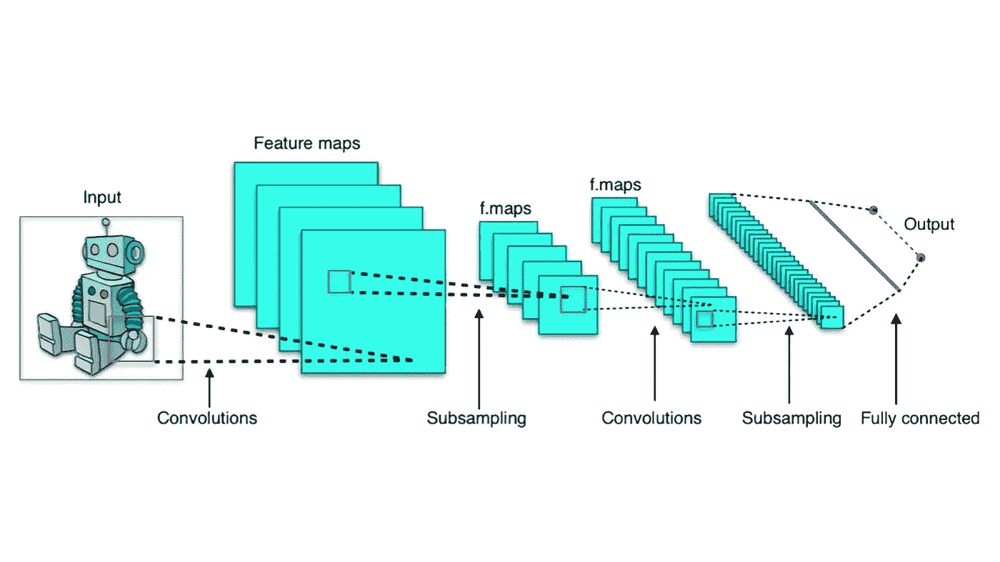

图 4:典型的卷积神经网络(CNN)架构|来源:Wikimedia Commons，图片根据[Creative Commons](https://en.wikipedia.org/wiki/en:Creative_Commons)[Attribution-Share like 4.0 International](https://creativecommons.org/licenses/by-sa/4.0/deed.en)许可进行许可。

# 什么是 TensorFlow 对象检测 API？

TensorFlow 的对象检测应用程序接口(API)用作创建深度学习神经网络的框架，该网络旨在解决对象检测问题。

由于 TensorFlow 对象检测 API，特定的数据集可以使用它在现成状态下包含的模型进行训练。此外，TensorFlow 的工具是它所使用的 COCO 数据集的权重。可以使用现有模型，而不需要通过预先训练的模型重新学习。

纵观其神经网络模型，在数据科学方面进行了很多研究，解决了 [**机器学习**](https://mld.ai/mldcmu) 中遇到的很多问题。对于计算机视觉专业的数据科学家和从事人工智能工作的人来说，这是一个宝藏。

## **我们安装所需的库📣**

*   Protobuf 3.0.0
*   Python-tk
*   枕头 1.0
*   Lxml
*   tf Slim(包含在`tensorflow/models/research/`结账中)
*   Jupyter 笔记本
*   Matplotlib
*   张量流(> = 1.12.0)
*   Cython
*   上下文库 2
*   可可 API

📌TensorFlow 提供的模型链接和用于物体检测的物体检测 API 文件可以在 [**Github**](https://github.com/tensorflow/models) 上找到。

# 用更快的 R-CNN 逐步训练

图 5:执行一个更快的 R-CNN。

## 步骤 1:创建虚拟环境并在 Anaconda 中激活

```
(base) C:\Users\PCName> conda create -n myenv python=3.6
(base) C:\Users\PCName> conda activate myenv
(myenv)C:\Users\PCName>
```

如果在没有安装新的虚拟环境的情况下进行交易，将会造成困难，因为在基地可能会有不正确的下载。

**步骤 1.1:安装 TensorFlow GPU**

```
conda install tensorflow-gpu==1.15.0
```

**步骤 1.2:在 Anaconda 提示符下安装协议缓冲编译器**

Protobuf 文件是数据传输所需的协议文件。

> 协议缓冲区是一种语言中立、平台中立的可扩展机制，用于序列化结构化数据。
> —谷歌开发者[7]

```
conda install -c anaconda protobuf
```

## 步骤 1.3:在安装了一个新的虚拟环境之后，从 requirements.txt 文件中加载它

```
#requirements.txt samplepillow 
lxml 
jupyter 
matplotlib 
pandas 
opencv-python 
cython==0.28.1 
tf_slim 
scipy
```

可以使用 pip install 命令从终端安装所需的软件包，也可以使用以下命令下载并运行该文件。

```
pip install -r requirements.txt
```

## 步骤 2:上传张量流模型文件

没有 TensorFlow 模型文件，就不可能使用对象检测 API。因此，请确保文件已经从 [**正确的位置**](https://github.com/tensorflow/models.) 下载。

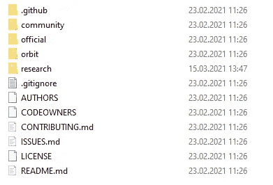

图 7: TensorFlow 模型目录。

当文件夹中的数据从索引中取出时，它应该看起来像上面这样。

## 步骤 3:将更快的 R-CNN 盗梦 V2 模型放入对象检测文件夹

在这一步中，我们将使用 **Inception v2 模型**和更快的 R-CNN 神经网络，应该从存储库中取出并放入文件夹中。因为要激活的文件夹将是 object_detection，所以它必须在此目录中。

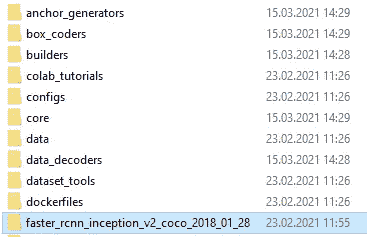

图 8:将 R-CNN inception v2 模型放置在对象检测目录中。

**注意:**与物体检测相关的文件位于 **object_detection** 文件夹中。

## 步骤 4:将 PYTHON_PATH 指定为系统环境变量

model、research 和 object_detection 目录的地址，包括下载的 Protobuf 文件，必须添加到现有的 PYTHON_PATH 中。

添加路径有两种选择。

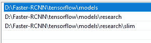

图 9:手动添加到路径

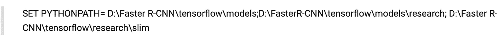

图 10:每次使用 Set 命令添加

## 步骤 5:运行研究文件夹中的协议文件

请在这里完整地键入原型文件来运行。确保终端中的代码写在研究文件夹中。

```
protoc --python_out=. .\object_detection\protos\anchor_generator.proto .\object_detection\protos\argmax_matcher.proto .\object_detection\protos\bipartite_matcher.proto .\object_detection\protos\box_coder.proto .\object_detection\protos\box_predictor.proto .\object_detection\protos\eval.proto .\object_detection\protos\faster_rcnn.proto  .\object_detection\protos\faster_rcnn_box_coder.proto .\object_detection\protos\flexible_grid_anchor_generator.proto .\object_detection\protos\calibration.proto .\object_detection\protos\hyperparams.proto .\object_detection\protos\image_resizer.proto .\object_detection\protos\input_reader.proto .\object_detection\protos\losses.proto .\object_detection\protos\matcher.proto .\object_detection\protos\mean_stddev_box_coder.proto .\object_detection\protos\model.proto .\object_detection\protos\optimizer.proto .\object_detection\protos\pipeline.proto .\object_detection\protos\post_processing.proto .\object_detection\protos\preprocessor.proto .\object_detection\protos\region_similarity_calculator.proto .\object_detection\protos\square_box_coder.proto .\object_detection\protos\ssd.proto .\object_detection\protos\ssd_anchor_generator.proto .\object_detection\protos\string_int_label_map.proto .\object_detection\protos\train.proto .\object_detection\protos\keypoint_box_coder.proto .\object_detection\protos\multiscale_anchor_generator.proto .\object_detection\protos\graph_rewriter.proto .\object_detection\protos\center_net.proto .\object_detection\protos\grid_anchor_generator.proto .\object_detection\protos\fpn.proto .\object_detection\protos\target_assigner.proto
```

## 步骤 6:运行研究文件夹中的 setup.py 文件

确保研究文件夹中的 setup.py 文件已编译并安装。

```
python setup.py buildpython setup.py install
```

## 步骤 7:将准备好的数据集的 XML 文件转换为 CSV

可与 TensorFlow 对象检测 API 一起使用的数据集属于有限类型。由于 PASCAL VOC 的使用很普遍，所以将主要使用 XML 数据。图像和图像的位置标签同时存储在 Pascal VOC 数据中。

## PASCAL VOC (PASCAL 可视对象类挑战)

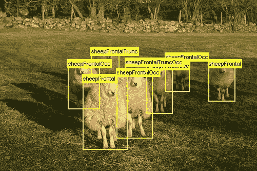

图 11:来自 PASCAL VOC 公共数据集的对象检测|来源:Dong 等人在代码为[ [8](https://paperswithcode.com/dataset/pascal-voc) 的论文中的公共数据集。

> PASCAL 视觉对象类(VOC) 2012 数据集包含 20 个对象类别，包括车辆、家庭、动物和其他:飞机、自行车、船、公共汽车、汽车、摩托车、火车、瓶子、椅子、餐桌、盆栽植物、沙发、电视/显示器、鸟、猫、牛、狗、马、羊和人。该数据集中的每个图像都有像素级分割注释、边界框注释和对象类注释。
> —帕斯卡 VOC [8]

在此步骤中，用于测试和训练文件夹的数据必须移动到`models/research/object_detection/` 图像目录。

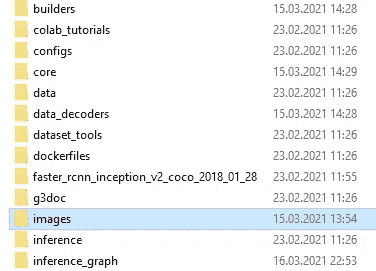

图 12: Object_detection 文件夹。

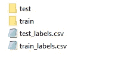

图 13:训练和测试 CSV 文件。

运行`models/research/object_detection directory`中显示的代码。在 images 文件夹中，将创建 test_labels.csv 和 train_labels.csv CSV 文件。

```
python xml_to_csv.py
```

## 步骤 8:在 generate_tfrecord.py 文件中输入类

我们要使用的类名必须在这一步中指定。

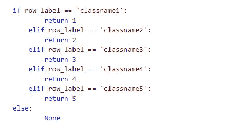

图 14:为我们的 TensorFlow 记录输入类。

## 步骤 9:为训练集和测试集运行 Generate_tf_record.py 文件

在`models/research/object_detection`目录下运行下面的代码。要创建 Tensorflow 记录，需要使用以下代码。

```
python generate_tfrecord.py --csv_input=images/train_labels.csv --image_dir=images/train --output_path=train.recordpython generate_tfrecord.py --csv_input=images/test_labels.csv --image_dir=images/test --output_path=test.record
```

## 步骤 10:在 models/research/object _ detection/training 目录下创建一个名为 labelmap.pbtxt 的文件

*   这一步首先要做的是将文件**faster _ rcnn _ inception _ v2 _ pets . config 和 graph.pbtxt** 移动到`models/research/object_detection/training`目录中。

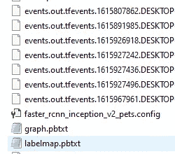

图 15:将文件移动到正确的目录中。

*   在执行 generate_tf_record 文件后，将自动创建一个标签映射。可以通过转到如下文件夹中的标签图来控制。

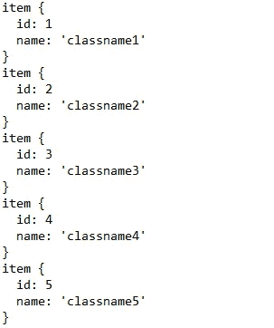

图 TensorFlow 记录文件的输出。

在`models/research/object_detection/training`目录下，更改 fast _ rcnn _ inception _ v2 _ pets . config 中的行，如下所示。

**(5 类样本变化)**

*   **第 9 行:** #写班级人数

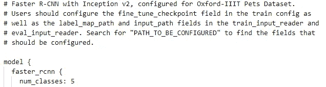

图 17:用我们更快的 R-CNN 写类计数。

*   **第 106 行:**写微调检查点

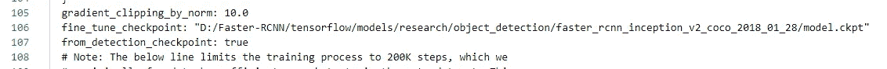

图 18:编写我们的检查点。

*   **第 123 行:**写入 train.record 路径的输入路径

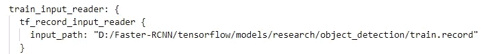

*   **第 130 行:**将测试图像的数量写入`models/research/images/test`文件夹

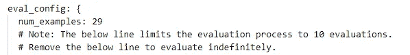

图 19:统计我们的图像。

*   **第 135 行:**写 test.record 路径的输入路径


图 20:编写测试记录的输入路径。

*   **第 137 行:**编写我们的标签映射路径

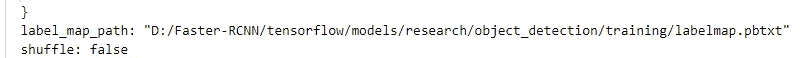

图 21:编写我们的标签映射路径。

## 第十一步。使用 train.py 文件训练模型

训练前的`models/research/object_detection/inference_graph`文件夹必须是空的。从开始训练开始，在`models/research/object_detection`目录下运行下面的命令。

```
python train.py --logtostderr --train_dir=training/ --pipeline_config_path=training/faster_rcnn_inception_v2_pets.config
```

*当培训开始时，我们将在终端看到以下内容；*

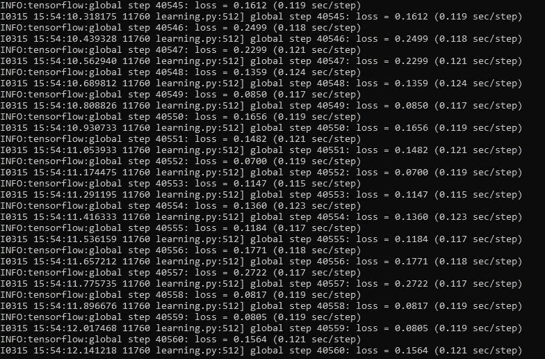

图 22:我们模型训练的开始。

## 步骤 12:使用 export_inference_graph.py 测试结果的推理图阶段

在命令的 XXXX 部分写下在推理图目录中创建的最后一个`model.ckpt`模型的编号。例如，由于训练而创建的模型的编号可以被分配为“0”，如下所示。

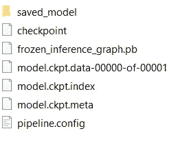

图 23:推理图阶段。

```
python export_inference_graph.py --input_type image_tensor --pipeline_config_path training/faster_rcnn_inception_v2_pets.config --trained_checkpoint_prefix training/model.ckpt-XXXX --output_directory inference_graph
```

在编写 Python 代码时，当在终端中键入 idle 时，会出现 idle 屏幕。

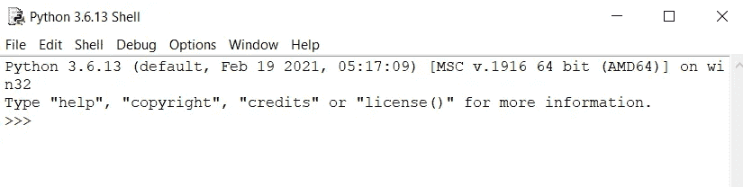

图 24:空闲屏幕。

选择文件/打开…从左上角的闲置。从打开的屏幕中选择目录`models/research/object_detection`中的 Object_detection_image.py 文件。

这里有两个选择。我们可以在 object_detection_image.py 文件中设置测试文件夹的路径，也可以把我们要测试的图像移到`models/research/object_detection`目录下。

## **提示🗝️**

这里，通过将所需图像移动到测试`models/research/object_detection`目录来执行操作。

```
IMAGE_NAME = ‘yourtestimagename.JPG’
```

写下物体探测器可以识别的类别数量。

```
NUM_CLASSES = 1
```

**按 F5 运行模块:**

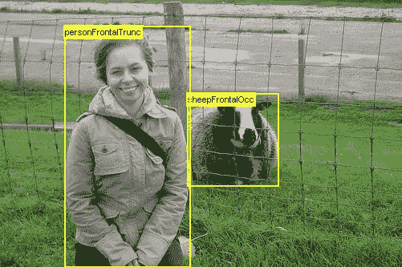

图 25:运行模块后。来源:PASCAL 视觉对象类挑战，公共数据集[ [9](http://host.robots.ox.ac.uk/pascal/VOC/voc2010/) ]

**免责声明:**本文所表达的观点均为作者个人观点，不代表与作者(直接或间接)相关的任何公司的观点。这项工作并不打算成为最终产品，而是当前思想的反映，同时也是讨论和改进的催化剂。

**除非另有说明，所有图片均来自作者。**

[经由**发表走向**艾](https://towardsai.net/)

# 进一步阅读

[](/support-vector-machine-svm-introduction-machine-learning-8c56b7da63f1) [## 支持向量机(SVM)简介—机器学习

### 介绍机器学习中的支持向量机(SVM ),以及它们在有监督的最大似然学习中的作用，并举例说明

pub.towardsai.net](/support-vector-machine-svm-introduction-machine-learning-8c56b7da63f1) [](/diving-into-data-pipelines-b2eb1b8a4923) [## 深入数据管道——数据工程的基础

### 数据管道介绍。如何，什么，什么时候，为什么？

pub.towardsai.net](/diving-into-data-pipelines-b2eb1b8a4923) [](/k-nearest-neighbors-knn-algorithm-tutorial-machine-learning-basics-ml-ec6756d3e0ac) [## k 近邻(KNN)算法教程—机器学习基础

### 潜入 K-最近邻，一个基本的经典机器学习(ML)算法

pub.towardsai.net](/k-nearest-neighbors-knn-algorithm-tutorial-machine-learning-basics-ml-ec6756d3e0ac) 

# 参考

[1]“更快的 R-CNN:下现代物体探测的兔子洞| Tryolabs 博客”。2021.Tryolabs.Com。[https://tryo labs . com/blog/2018/01/18/faster-r-CNN-down-the-rabbit-hole-of-modern-object-detection/。](https://tryolabs.com/blog/2018/01/18/faster-r-cnn-down-the-rabbit-hole-of-modern-object-detection/.)

[2]任、、、何、罗斯·吉希克和。2015.“更快的 R-CNN:用区域提议网络实现实时目标检测”。Arxiv.Org。https://arxiv.org/abs/1506.01497.

[3]《少清人/更快 _Rcnn》。2021.Github。【https://github.com/ShaoqingRen/faster_rcnn. 

[4]“在自己的数据集上训练一个 Tensorflow 更快的 R-CNN 物体检测模型”。2020.Roboflow 博客。[https://blog . robo flow . com/training-a-tensor flow-faster-r-CNN-object-detection-model-on-your-own-dataset/。](https://blog.roboflow.com/training-a-tensorflow-faster-r-cnn-object-detection-model-on-your-own-dataset/.)

[5]《张量流导论》。2021.张量流。[https://www.tensorflow.org/learn.](https://www.tensorflow.org/learn.)

[6]“tensor flow—维基百科”。2021.En.Wikipedia.Org。[https://en.wikipedia.org/wiki/TensorFlow.](https://en.wikipedia.org/wiki/TensorFlow.)

[7]“协议缓冲区|谷歌开发者”。2021.谷歌开发者。[https://developers.google.com/protocol-buffers.](https://developers.google.com/protocol-buffers.)

[8]《带代码的论文——PASCAL VOC 数据集》。2021.Paperswithcode.Com。[https://paperswithcode.com/dataset/pascal-voc.](https://paperswithcode.com/dataset/pascal-voc.)

[9]“2010 年帕斯卡视觉对象类挑战赛(VOC2010)”。2021.host . robots . ox . AC . uk[http://host.robots.ox.ac.uk/pascal/VOC/voc2010/.](http://host.robots.ox.ac.uk/pascal/VOC/voc2010/.)

[](https://ws.towardsai.net/shop) [## 店铺↓ |走向 AI

### 发布最好的技术、科学和工程|社论→https://towardsai.net/p/editorial |订阅→…

ws.towardsai.net](https://ws.towardsai.net/shop) [](https://members.towardsai.net/) [## 加入我们吧↓ |面向人工智能成员|数据驱动的社区

### 向着 AI 加入。通过成为会员，你不仅将支持人工智能，但你将有机会…

members.towardsai.net](https://members.towardsai.net/) [](https://sponsors.towardsai.net/) [## 赞助商|了解如何成为面向人工智能的赞助商

### 无论你是想以一种吸引读者的方式突出你的产品，吸引高度相关的利基受众，还是…

sponsors.towardsai.net](https://sponsors.towardsai.net/)